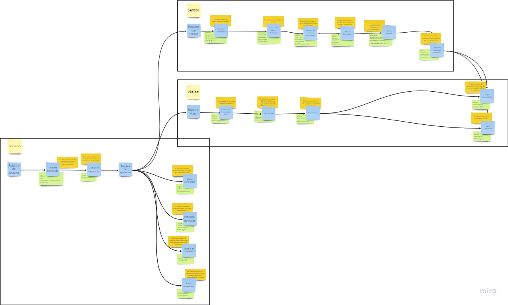

  

<h3 align="center"> Universidad Peruana de Ciencias Aplicadas</h3>
<h4 align="center"> Ingeniería de Sistemas y Computación | Ingeniería de Software  </h4>
<h4 align="center"> Desarrollo de Soluciones IOT </h4>
<h4 align="center"> Informe de Trabajo Final </h4>

### Startup: Debuggers
#### Team Members
- Arrunátegui Aguilar, Josué David 
- Botello Saldarriaga, Anthony Jean Pierre
- Chero Eme, Eduardo Andre
- Lévano Cavero, Eduardo Sebastián
- Moreno Rosales, Claudio Jesús
#### Sección: WS74
#### Profesor: Angel Augusto Velasquez Nuñez
#### Producto: FastPorte
#### Ciclo: 2024-02
<h4 align="center"> Agosto, 2024</h4>

___
# Registro de versiones del informe

| Versión | Fecha      | Autor            | Descripción de modificación                                                |
| ------- | ---------- | ---------------- | -------------------------------------------------------------------------- |
| 1.0     | 22/08/2024 | Sebastián Lévano | Creación del archivo base en Markdown para el desarrollo del Final Project |

---
# Contenido 
- [Student Outcome](#student-outcome)
- [Capítulo I: Introducción](/README.md#capítulo-i-introducción)
  - [1.1. Startup Profile](/README.md#11-startup-profile)
    - [1.1.1. Descripción de la Startup](/README.md#111-descripción-de-la-startup)
    - [1.1.2. Perfiles de integrantes del equipo](/README.md#112-perfiles-de-integrantes-del-equipo)
  - [1.2. Solution Profile](/README.md#12-solution-profile)
    - [1.2.1 Antecedentes y problemática](/README.md#121-antecedentes-y-problemática)
    - [1.2.2 Lean UX Process](/README.md#122-lean-ux-process)
      - [1.2.2.1. Lean UX Problem Statements](/README.md#1221-lean-ux-problem-statements)
      - [1.2.2.2. Lean UX Assumptions](/README.md#1222-lean-ux-assumptions)
      - [1.2.2.3. Lean UX Hypothesis Statements](/README.md#1223-lean-ux-hypothesis-statements)
      - [1.2.2.4. Lean UX Canvas](/README.md#1224-lean-ux-canvas)
  - [1.3. Segmentos objetivo](/README.md#13-segmentos-objetivo)
- [Capítulo II: Requirements Elicitation \& Analysis](/README.md#capítulo-ii-requirements-elicitation--analysis)
  - [2.1. Competidores](/README.md#21-competidores)
    - [2.1.1. Análisis competitivo](/README.md#211-análisis-competitivo)
    - [2.1.2. Estrategias y tácticas frente a competidores](/README.md#212-estrategias-y-tácticas-frente-a-competidores)
  - [2.2. Entrevistas](/README.md#22-entrevistas)
    - [2.2.1. Diseño de entrevistas](/README.md#221-diseño-de-entrevistas)
    - [2.2.2. Registro de entrevistas](/README.md#222-registro-de-entrevistas)
    - [2.2.3. Análisis de entrevistas](/README.md#223-análisis-de-entrevistas)
  - [2.3. Needfinding](/README.md#23-needfinding)
    - [2.3.1. User Personas](/README.md#231-user-personas)
    - [2.3.2. User Task Matrix](/README.md#232-user-task-matrix)
    - [2.3.3. Empathy Mapping](/README.md#233-empathy-mapping)
    - [2.3.4. As-is Scenario Mapping](/README.md#234-as-is-scenario-mapping)
  - [2.4. Ubiquitous Language](/README.md#24-ubiquitous-language)
- [Capítulo III: Requirements Specification](/README.md#capítulo-iii-requirements-specification)
  - [3.1. To-Be Scenario Mapping](/README.md#31-to-be-scenario-mapping)
  - [3.2. User Stories](/README.md#32-user-stories)
  - [3.3. Impact Mapping](/README.md#33-impact-mapping)
  - [3.4. Product Backlog](/README.md#34-product-backlog)
- [Capítulo IV: Solution Software Design](/README.md#capítulo-iv-solution-software-design)
  - [4.1. Strategic-Level Domain-Driven Design](/README.md#41-strategic-level-domain-driven-design)
    - [4.1.1. EventStorming](/README.md#411-eventstorming)
      - [4.1.1.1 Candidate Context Discovery](/README.md#4111-candidate-context-discovery)
      - [4.1.1.2.  Domain Message Flows Modeling](/README.md#4112-domain-message-flows-modeling)
      - [4.1.1.3. Bounded Context Canvases](/README.md#4113-bounded-context-canvases)
    - [4.1.2. Context Mapping](/README.md#412-context-mapping)
    - [4.1.3. Software Architecture](/README.md#413-software-architecture)
    - [4.1.3.1. Software Architecture System Landscape Diagram](/README.md#4131-software-architecture-system-landscape-diagram)
    - [4.1.3.2. Software Architecture Context Level Diagrams](/README.md#4132-software-architecture-context-level-diagrams)
    - [4.1.3.3. Software Architecture Container Level Diagrams](/README.md#4133-software-architecture-container-level-diagrams)
    - [4.1.3.4. Software Architecture Deployment Diagrams](/README.md#4134-software-architecture-deployment-diagrams)
  - [4.2. Tactical-Level Domain-Driven Design](/README.md#42-tactical-level-domain-driven-design)

---

# Capitulo IV: Solution Software Desing

## 4.1. Strategic-Level Domain-Driven Design

### 4.1.1. EventStorming

#### 4.1.1.1 Candidate Context Discovery

Step 1:

Step 2:

Step 3:

Step 4:

Step 5:

Step 6:

Step 7:

Step 8:

#### 4.1.1.2 Domain Message Flows Modeling

Leyenda:  

Escenario: Inicio de sesión

Escenario: Registro de usuario

Escenario: Registro del sensor

Escenario: Programación de viaje

Escenario: Conductor visualiza sus viajes pendientes

Escenario: Sensor detecta un problema

#### 4.1.1.3 Bounded Context Canvases

Bounded context 'Usuario'   

Bounded context 'Sensor'   

Bounded context 'Viajes'   

### 4.1.2. Context Mapping

### 4.1.3. Software Architecture

#### 4.1.3.1. Software Architecture System Landscape Diagram

#### 4.1.3.2. Software Architecture Context Level Diagrams

#### 4.1.3.2. Software Architecture Container Level Diagrams.

#### 4.1.3.3. Software Architecture Deployment Diagrams

## 4.2. Tactical-Level Domain-Driven Design
### 4.2.1. Bounded Context: Usuario
#### 4.2.1.1. Domain Layer.
#### 4.2.1.2. Interface Layer.
#### 4.2.1.3. Application Layer.
#### 4.2.1.4. Infrastructure Layer.
#### 4.2.1.6. Bounded Context Software Architecture Component Level Diagrams.
#### 4.2.1.7. Bounded Context Software Architecture Code Level Diagrams.
###### 4.2.1.7.1. Bounded Context Domain Layer Class Diagrams.
###### 4.2.1.7.2. Bounded Context Database Design Diagram.
### 4.2.2. Bounded Context: Sensor
#### 4.2.2.1. Domain Layer.
#### 4.2.2.2. Interface Layer.
#### 4.2.2.3. Application Layer.
#### 4.2.2.4. Infrastructure Layer.
#### 4.2.2.6. Bounded Context Software Architecture Component Level Diagrams.
#### 4.2.2.7. Bounded Context Software Architecture Code Level Diagrams.
##### 4.2.2.7.1. Bounded Context Domain Layer Class Diagrams.
##### 4.2.2.7.2. Bounded Context Database Design Diagram.
### 4.2.3. Bounded Context: Viajes
#### 4.2.3.1. Domain Layer.
#### 4.2.3.2. Interface Layer.
#### 4.2.3.3. Application Layer.
#### 4.2.3.4. Infrastructure Layer.
#### 4.2.3.6. Bounded Context Software Architecture Component Level Diagrams.
#### 4.2.3.7. Bounded Context Software Architecture Code Level Diagrams.
###### 4.2.3.7.1. Bounded Context Domain Layer Class Diagrams.
###### 4.2.3.7.2. Bounded Context Database Design Diagram.
