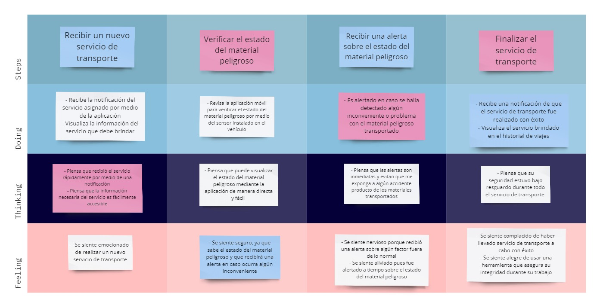

  

<h3 align="center"> Universidad Peruana de Ciencias Aplicadas</h3>
<h4 align="center"> Ingeniería de Sistemas y Computación | Ingeniería de Software  </h4>
<h4 align="center"> Desarrollo de Soluciones IOT </h4>
<h4 align="center"> Informe de Trabajo Final </h4>

### Startup: Debuggers
#### Team Members
- Arrunátegui Aguilar, Josué David 
- Botello Saldarriaga, Anthony Jean Pierre
- Chero Eme, Eduardo Andre
- Lévano Cavero, Eduardo Sebastián
- Moreno Rosales, Claudio Jesús
#### Sección: WS74
#### Profesor: Angel Augusto Velasquez Nuñez
#### Producto: FastPorte
#### Ciclo: 2024-02
<h4 align="center"> Agosto, 2024</h4>

___
# Registro de versiones del informe

| Versión | Fecha      | Autor            | Descripción de modificación                                                |
|---------|------------|------------------|----------------------------------------------------------------------------|
| 1.0     | 22/08/2024 | Sebastián Lévano | Creación del archivo base en Markdown para el desarrollo del Final Project |
| 1.1     | 26/08/2024 | Anthony Botello | Adición del capítulo 1 |

---
# Contenido 
- [Student Outcome](#student-outcome)
- [Capítulo I: Introducción](#capítulo-i-introducción)
  - [1.1. Startup Profile](#11-startup-profile)
    - [1.1.1. Descripción de la Startup](#111-descripción-de-la-startup)
    - [1.1.2. Perfiles de integrantes del equipo](#112-perfiles-de-integrantes-del-equipo)
  - [1.2. Solution Profile](#12-solution-profile)
    - [1.2.1 Antecedentes y problemática](#121-antecedentes-y-problemática)
    - [1.2.2 Lean UX Process](#122-lean-ux-process)
      - [1.2.2.1. Lean UX Problem Statements](#1221-lean-ux-problem-statements)
      - [1.2.2.2. Lean UX Assumptions](#1222-lean-ux-assumptions)
      - [1.2.2.3. Lean UX Hypothesis Statements](#1223-lean-ux-hypothesis-statements)
      - [1.2.2.4. Lean UX Canvas](#1224-lean-ux-canvas)
  - [1.3. Segmentos objetivo](#13-segmentos-objetivo)
- [Capítulo II: Requirements Elicitation \& Analysis](#capítulo-ii-requirements-elicitation--analysis)
  - [2.1. Competidores](#21-competidores)
    - [2.1.1. Análisis competitivo](#211-análisis-competitivo)
    - [2.1.2. Estrategias y tácticas frente a competidores](#212-estrategias-y-tácticas-frente-a-competidores)
  - [2.2. Entrevistas](#22-entrevistas)
    - [2.2.1. Diseño de entrevistas](#221-diseño-de-entrevistas)
    - [2.2.2. Registro de entrevistas](#222-registro-de-entrevistas)
    - [2.2.3. Análisis de entrevistas](#223-análisis-de-entrevistas)
  - [2.3. Needfinding](#23-needfinding)
    - [2.3.1. User Personas](#231-user-personas)
    - [2.3.2. User Task Matrix](#232-user-task-matrix)
    - [2.3.3. Empathy Mapping](#233-empathy-mapping)
    - [2.3.4. As-is Scenario Mapping](#234-as-is-scenario-mapping)
  - [2.4. Ubiquitous Language](#24-ubiquitous-language)
- [Capítulo III: Requirements Specification](#capítulo-iii-requirements-specification)
  - [3.1. To-Be Scenario Mapping](#31-to-be-scenario-mapping)
  - [3.2. User Stories](#32-user-stories)
  - [3.3. Impact Mapping](#33-impact-mapping)
  - [3.4. Product Backlog](#34-product-backlog)
- [Capítulo IV: Solution Software Design](#capítulo-iv-solution-software-design)
  - [4.1. Strategic-Level Domain-Driven Design](#41-strategic-level-domain-driven-design)
    - [4.1.1. EventStorming](#411-eventstorming)
      - [4.1.1.1 Candidate Context Discovery](#4111-candidate-context-discovery)
      - [4.1.1.2.  Domain Message Flows Modeling](#4112-domain-message-flows-modeling)
      - [4.1.1.3. Bounded Context Canvases](#4113-bounded-context-canvases)
    - [4.1.2. Context Mapping](#412-context-mapping)
    - [4.1.3. Software Architecture](#413-software-architecture)
    - [4.1.3.1. Software Architecture System Landscape Diagram](#4131-software-architecture-system-landscape-diagram)
    - [4.1.3.2. Software Architecture Context Level Diagrams](#4132-software-architecture-context-level-diagrams)
    - [4.1.3.3. Software Architecture Container Level Diagrams](#4133-software-architecture-container-level-diagrams)
    - [4.1.3.4. Software Architecture Deployment Diagrams](#4134-software-architecture-deployment-diagrams)
  - [4.2. Tactical-Level Domain-Driven Design](#42-tactical-level-domain-driven-design)

---

# Student Outcome

| Criterio Específico                                                                             | Acciones Realizadas                                                                                                                                                                                                                                                                                                                                                                                                                                                                                                                                                                                                                                                             | Conclusiones |
| ----------------------------------------------------------------------------------------------- | ------------------------------------------------------------------------------------------------------------------------------------------------------------------------------------------------------------------------------------------------------------------------------------------------------------------------------------------------------------------------------------------------------------------------------------------------------------------------------------------------------------------------------------------------------------------------------------------------------------------------------------------------------------------------------- | ------------ |
| Trabaja en equipo para proporcionar liderazgo en forma conjunta.                                | *Eduardo Sebastián Lévano Cavero* **TB1:** A través de la realización de los To Be Scenario Mapping y User Stories, se definieron escenarios futuros y necesidades del usuario, respectivamente, lo que permitió al equipo visualizar y priorizar funcionalidades clave. Mediante el Impact Mapping, se establecieron relaciones claras entre los objetivos estratégicos y las características del producto, garantizando un enfoque alineado con las metas organizacionales. Finalmente, en el Product Backlog, se gestionaron las tareas de manera colaborativa, facilitando una planificación y ejecución eficientes que reflejan las prioridades acordadas en equipo. |              |
| Crea un entorno colaborativo e inclusivo, establece metas, planifica tareas y cumple objetivos. | *Eduardo Sebastián Lévano Cavero* **TB1:** Por medio de los To Be Scenario Mapping y las User Stories, se identificaron y documentaron las necesidades y expectativas de los usuarios, asegurando que todas las voces fueran escuchadas y consideradas. Mediante el Impact Mapping, se alinearon las metas estratégicas con las funcionalidades del producto, permitiendo una planificación clara y enfocada. En el Product Backlog, se priorizaron y planificaron las tareas de forma conjunta, lo que facilitó el cumplimiento de los objetivos establecidos dentro de un marco de trabajo inclusivo y bien organizado.                                                 |              |

---
# Capítulo I: Introducción
## 1.1. Startup Profile
### 1.1.1. Descripción de la Startup

Somos un grupo de estudiantes de la Universidad Peruana de Ciencias Aplicadas que, motivados por la creciente necesidad de seguridad en el transporte de materiales peligrosos, identificamos una oportunidad de negocio única. Durante nuestras investigaciones, notamos que el transporte de gases combustibles y otros productos peligrosos presenta riesgos significativos, tanto para los conductores como para el público en general. Estos riesgos, muchas veces subestimados o mal gestionados, pueden tener consecuencias catastróficas si no se abordan con soluciones tecnológicas adecuadas.

En respuesta a esta problemática, decidimos fundar TechCompany, una startup enfocada en ofrecer soluciones de vanguardia que integran la tecnología IoT para la supervisión en tiempo real de las condiciones de seguridad en el transporte de materiales peligrosos. Nuestro producto, FastPorte, no solo se centra en la implementación de sensores avanzados que monitorean parámetros críticos como fugas de gas, temperatura y presión, sino también en proporcionar una plataforma integral que facilita la gestión de estos datos para prevenir accidentes.

En TechCompany, entendemos que la seguridad no es solo una necesidad, sino una responsabilidad compartida entre todas las partes involucradas en la cadena de transporte. Por ello, nos hemos comprometido a desarrollar productos y servicios que no solo cumplan con las normativas internacionales más estrictas, sino que también superen las expectativas de nuestros clientes, brindándoles herramientas que aseguren la integridad de sus operaciones y protejan vidas.

**Misión:** 
Proporcionar soluciones tecnológicas innovadoras que garanticen la seguridad y eficiencia en el transporte de materiales peligrosos, contribuyendo así a la protección de vidas humanas y al cumplimiento de normativas internacionales de seguridad.

**Visión:**
Ser reconocidos como líderes en el mercado de soluciones IoT aplicadas al transporte de materiales peligrosos, impulsando un futuro más seguro y confiable para la industria del transporte a nivel nacional e internacional.

**Valores:**
- Seguridad
- Innovación
- Responsabilidad
- Compromiso con el cliente
- Sostenibilidad

### 1.1.2. Perfiles de integrantes del equipo

| Integrante        | Arrunátegui Aguilar, Josué David                        |
|-------------------|---------------------------------------------------------|
| **Código:** U202111033   **Carrera:** Ingeniería de Software   **Acerca de mí:** Me gusta dibujar, tocar guitarra y jugar videojuegos. Tengo conocimiento en el desarrollo frontend con lenguajes como angular y vue.js, así como desarrollo móvil con flutter. Planeo especializarme en desarrollo web o como Analista de Datos. |  |

| Integrante                                                                                                                                                                                                                                                                                                                                                                                                       | Botello Saldarriaga, Anthony Jean Pierre                    |
|------------------------------------------------------------------------------------------------------------------------------------------------------------------------------------------------------------------------------------------------------------------------------------------------------------------------------------------------------------------------------------------------------------------|-------------------------------------------------------------|
| **Código:** U20201B846    **Carrera:** Ingeniería de Software   **Acerca de mí:** Tengo 23 años y soy estudiante de Ingeniería de Software con conocimientos y habilidades en distintos lenguajes de programación. Actualmente curso el noveno ciclo de la carrera y mi meta es ser un profesional destacado el cual rija sus decisiones por sus valores y el bien de la empresa donde labore. Me interesa el desarrollo de la tecnología y los avances que existen en la inteligencia artificial. |  |

| Integrante        | Chero Eme, Eduardo Andre                                    |
|-------------------|-------------------------------------------------------------|
| **Código:** U20201F282   **Carrera:** Ingeniería de software   **Acerca de mí:** Me gustan los videojuegos y las series, quiero especializarme en ciberseguridad para tener una ganancia estable mientras creo videojuegos aparte por pasión. |  |

| Integrante                                                                                                                                                                                                                                                                                                                                                                                                                                                                                                         | Lévano Cavero, Eduardo Sebastián                                |
|--------------------------------------------------------------------------------------------------------------------------------------------------------------------------------------------------------------------------------------------------------------------------------------------------------------------------------------------------------------------------------------------------------------------------------------------------------------------------------------------------------------------|-----------------------------------------------------------------|
| **Código:** U20201C172   **Carrera:** Ingeniería de Software   **Acerca de mí:** Mi nombre es Sebastián, tengo 21 años y soy estudiante de Ingeniería de Software en la Universidad Peruana de Ciencias Aplicadas. Elegí esta carrera porque me fascina crear y diseñar procesos que faciliten procesos complejos. Por ello, cuando tengo un poco de tiempo libre lo uso para relajarme y para aprender más de lo que me apasiona, la programación, se puede decir que es uno de mis hobbies. Además, de la programación también disfruto de jugar vóley, fútbol o algún videojuego con mis amigos. |  |

| Integrante        | Moreno Rosales, Claudio Jesús                               |
|-------------------|-------------------------------------------------------------|
| **Código:** U20191E800   **Carrera:** Ingeniería de Software   **Acerca de mí:** La tecnología en general me gusta mucho, por ello, sigo constantemente explorando nuevas herramientas y tendencias del mundo tech. Estoy siempre dispuesto a aprender y enfrentar desafíos. Un campo que me interesa mucho es el de la Seguridad Informática, para lograr que el desarrollo de software sea de la más alta calidad posible y mantener seguros a los clientes. |  |

## 1.2. Solution Profile

En esta sección, exploraremos en detalle la solución que nuestra startup, TechCompany, propone para abordar los desafíos identificados en el transporte de materiales peligrosos. 

### 1.2.1 Antecedentes y problemática

#### Antecedentes

El transporte de materiales peligrosos, como gases combustibles y productos químicos, ha sido históricamente una actividad de alto riesgo. A lo largo de los años, numerosos incidentes han demostrado las graves consecuencias que pueden surgir cuando no se implementan medidas de seguridad adecuadas. Desde explosiones devastadoras hasta fugas tóxicas que ponen en peligro la vida de conductores y comunidades enteras, la necesidad de soluciones efectivas en este campo es evidente.

Para mitigar este problema, soluciones similares a nuestra propuesta han surgido en el mercado como: 
- **Geotab:** Es una plataforma de gestión de flotas que ofrece soluciones avanzadas de telemetría para vehículos de transporte, incluyendo aquellos que manejan materiales peligrosos. La solución permite el monitoreo en tiempo real de diversos parámetros del vehículo, tales como la ubicación, la velocidad, y las condiciones de los activos transportados. 
- **TankScan:** Se especializa en la monitorización inalámbrica de tanques que contienen líquidos y gases peligrosos. Utilizando tecnología avanzada, permite a las empresas verificar remotamente los niveles de fluidos y planificar rutas de manera más eficiente, mejorando la seguridad y reduciendo costos operativos.
- **Samsara:** Plataforma integral de gestión de flotas que ofrece telemetría en tiempo real, rastreo GPS, monitoreo de condiciones ambientales como temperatura y presión, y herramientas de seguridad avanzada. Su tecnología ayuda a las empresas a mejorar la eficiencia operativa, cumplir con normativas de seguridad y reducir riesgos en el transporte de materiales peligrosos.

#### Problemática

Para abordar la problemática del transporte de materiales peligrosos, es fundamental comprender el contexto en el que se desarrolla y los actores involucrados. A continuación, presentamos un análisis de la problemática utilizando el marco de las 5 'W's y 2 'H's:

**Who? (¿Quién?)**
El problema afecta a una amplia gama de actores, desde los conductores que transportan materiales peligrosos hasta las empresas que se encargan de la logística y el transporte. También involucra a las comunidades cercanas a las rutas de transporte y a las autoridades responsables de la seguridad pública.

**What? (¿Qué?)**
La principal problemática radica en la falta de monitoreo en tiempo real y la ausencia de sistemas que puedan detectar y alertar sobre condiciones peligrosas, como fugas de gas o cambios bruscos en la temperatura o presión, antes de que se conviertan en incidentes graves.

**Where? (¿Dónde?)**
Este problema es global, pero en el contexto de TechCompany, nos centramos en el transporte de materiales peligrosos dentro del Perú, un país con una geografía compleja que presenta desafíos adicionales para el transporte seguro.

**When? (¿Cuándo?)**
La problemática es constante, pero se vuelve especialmente crítica durante el transporte de largas distancias, en zonas remotas o en áreas urbanas densamente pobladas donde el riesgo de accidentes y sus consecuencias es mayor.

**Why? (¿Por qué?)**
Las causas de este problema son múltiples. La falta de tecnología avanzada en los vehículos de transporte, la escasa inversión en sistemas de seguridad, y la subestimación de los riesgos asociados son factores que han contribuido a que los incidentes continúen ocurriendo.

**How? (¿Cómo?)**
La solución a este problema pasa por la implementación de tecnologías de monitoreo en tiempo real que puedan alertar de inmediato a los conductores y operadores sobre cualquier condición peligrosa. FastPorte se posiciona para llenar este vacío mediante el uso de sensores IoT que supervisan constantemente las condiciones de seguridad y envían alertas en tiempo real.

**How much? (¿Cuánto?)**
El impacto potencial de no abordar esta problemática es significativo, tanto en términos de vidas humanas como de pérdidas económicas para las empresas y el costo social de los accidentes. La inversión en una solución como FastPorte es, por tanto, no solo justificada, sino esencial para mitigar estos riesgos.

### 1.2.2 Lean UX Process.

En esta sección, exploraremos cómo el Lean UX Process se aplica en el desarrollo de nuestro producto, FastPorte. Este enfoque nos permite centrarnos en la creación de valor para nuestros usuarios. Mediante la implementación de Lean UX, alineamos nuestra visión de negocio con las necesidades de nuestros clientes, asegurando que el producto no solo resuelva problemas relevantes, sino que también se adapte a un entorno que cambia.

#### 1.2.2.1. Lean UX Problem Statements.

Para comprender mejor los desafíos que nuestro proyecto abarca, hemos definido Problem Statements. Estos enunciados nos permiten enmarcar de manera clara los problemas que nuestro producto busca resolver, facilitando así el enfoque en soluciones que verdaderamente impacten en la vida de nuestros usuarios. 

##### Problem Statement 1:
Nuestro contexto demanda una supervisión efectiva de las condiciones de seguridad durante el transporte de materiales peligrosos. A través de esta supervisión, las empresas de transporte podrán monitorear en tiempo real los niveles de gas, temperatura y presión, asegurando la integridad del transporte y el cumplimiento de las normativas. Hemos observado un factor crítico que afecta a las empresas de transporte, el cual se manifiesta en la dificultad para detectar y responder rápidamente a incidentes durante el transporte, poniendo en riesgo la seguridad de los materiales y la reputación de la empresa. ¿Cómo garantizar la supervisión efectiva en tiempo real durante el transporte de materiales peligrosos para evitar riesgos y asegurar el cumplimiento normativo?
 
##### Problem Statement 2:
Nuestro contexto demanda soluciones que aseguren la seguridad de los conductores durante el transporte de materiales peligrosos. A través de la tecnología IoT, los conductores podrán recibir alertas tempranas sobre cualquier condición peligrosa, como fugas de gas o variaciones en la presión. Hemos observado un factor crítico que afecta a los conductores, el cual se manifiesta en la falta de información en tiempo real sobre los riesgos durante el transporte, lo que incrementa el peligro para su seguridad y la de otros en la carretera. ¿Cómo proporcionar alertas tempranas y efectivas a los conductores para minimizar los riesgos y garantizar su seguridad durante el transporte de materiales peligrosos?

#### 1.2.2.2. Lean UX Assumptions

En esta sección, definimos las suposiciones clave que guiarán el desarrollo de FastPorte. Estas suposiciones se basan en una comprensión profunda de nuestros usuarios y del mercado, y nos permiten validar las decisiones de diseño y desarrollo a lo largo del proceso.

##### CARACTERÍSTICAS

- Registro de usuarios en dos perfiles: Empresa y Conductor, con identificación y verificación adecuadas.
- Visualización de los perfiles de los conductores, incluyendo información relevante para el transporte de materiales peligrosos, como certificaciones y datos del vehículo.
- Las empresas podrán crear y gestionar viajes, asignando conductores y supervisando el estado de los mismos en tiempo real.
- Los conductores recibirán notificaciones sobre los viajes asignados y alertas de seguridad durante el transporte.
- Monitoreo en tiempo real de las condiciones del material transportado (fugas de gas, temperatura, presión) con alertas automáticas a las empresas y conductores.
- Historial de viajes y reportes de incidentes para ambos perfiles.
- Integración con sistemas de pago seguros para la facturación de servicios.
- Soporte para visualizar rutas y ubicación en tiempo real utilizando tecnología GPS.

##### BUSINESS OUTCOMES

- Asegurar el cumplimiento de normativas de seguridad en el transporte de materiales peligrosos.
- Incrementar la confianza de las empresas en la seguridad del transporte de sus materiales.
- Mejorar la eficiencia operativa mediante la supervisión en tiempo real y la gestión centralizada de los viajes.
- Reducir el riesgo de incidentes y accidentes durante el transporte de materiales peligrosos.

##### BENEFICIOS DEL USUARIO

- Para las empresas: Mejorar la gestión de sus operaciones de transporte, asegurando la seguridad de sus materiales y cumpliendo con las normativas.
- Para los conductores: Aumentar la seguridad durante el transporte gracias a las alertas en tiempo real y la supervisión continua.
- Para ambos: Acceso a un sistema confiable que permite la monitorización de las condiciones de transporte y la gestión eficiente de los viajes.

##### BUSINESS ASSUMPTIONS

- Creemos que las empresas de transporte de materiales peligrosos buscan soluciones que les ofrezcan seguridad y eficiencia en la gestión de sus operaciones.
- Los conductores necesitan una herramienta que les ofrezca seguridad adicional y la capacidad de gestionar su trabajo de manera más eficiente.
- Nuestros usuarios esperan que la información proporcionada por los sensores sea precisa y que las alertas sean confiables.
- Estas necesidades pueden ser satisfechas mediante una plataforma que integre la tecnología IoT para monitorear en tiempo real las condiciones de transporte y alertar sobre posibles riesgos.
- Los usuarios iniciales son empresas que transportan materiales peligrosos y conductores que buscan mejorar la seguridad en su trabajo diario.
- El valor principal que nuestros usuarios buscan en FastPorte es la seguridad y la confianza en la supervisión continua de sus operaciones.
- Obtendremos clientes a través de campañas dirigidas a empresas de transporte y conductores mediante anuncios en internet y asociaciones estratégicas.
- Los ingresos se generarán a través de suscripciones a la plataforma, tarifas de servicio, y posibles acuerdos con aseguradoras que ofrezcan descuentos a empresas que utilicen FastPorte.
- Nuestra principal competencia son otras soluciones de monitoreo y gestión de flotas, pero nos destacaremos por nuestro enfoque especializado en materiales peligrosos.
- El mayor riesgo es que las alertas no se detecten a tiempo o que la información proporcionada sea incorrecta, lo que podría llevar a incidentes durante el transporte. - Resolveremos esto mediante pruebas rigurosas de los sensores y un sistema de validación continua.

##### USER ASSUMPTIONS

- **¿Quién es el usuario?**
Las empresas de transporte de materiales peligrosos y los conductores encargados de transportar dichos materiales.

- **¿Dónde encaja nuestro producto en su trabajo o vida?**
Para las empresas, encaja en la gestión y supervisión de sus operaciones diarias. Para los conductores, en la mejora de la seguridad durante su trabajo.

- **¿Qué problemas tiene nuestro producto y cómo se pueden resolver?**
El producto podría enfrentar desafíos relacionados con la precisión de los sensores y la confiabilidad de las alertas. Estos se pueden resolver mediante pruebas continuas y actualizaciones basadas en el feedback de los usuarios.

- **¿Cuándo y cómo es usado nuestro producto?**
El producto será utilizado durante el transporte de materiales peligrosos para monitorear en tiempo real las condiciones de seguridad y gestionar los viajes.

- **¿Qué características son importantes?**
Monitoreo en tiempo real, alertas fiables, fácil gestión de viajes, y una interfaz intuitiva y segura.

- **¿Cómo debe verse nuestro producto y cómo debe comportarse?**
Debe tener una interfaz moderna, fácil de usar, con colores que transmitan confianza y seguridad. El comportamiento debe ser ágil, con notificaciones claras y precisas, y una respuesta rápida a cualquier incidencia.

#### 1.2.2.3. Lean UX Hypothesis Statements

En esta sección, formularemos hipótesis basadas en nuestras suposiciones de Lean UX. Estas hipótesis nos permitirán validar si las soluciones que implementamos en FastPorte están efectivamente resolviendo los problemas identificados y generando los resultados deseados tanto para los usuarios como para el negocio.

##### HIPÓTESIS 1:

**_Creemos que_** proporcionar una plataforma donde las empresas puedan monitorear en tiempo real las condiciones de seguridad durante el transporte de materiales peligrosos mejorará la eficiencia operativa y la seguridad del transporte.
**_Sabremos que_** hemos tenido éxito
**_Cuando_** las empresas reporten una reducción del 25% en incidentes relacionados con la seguridad y un incremento del 15% en la eficiencia de sus operaciones de transporte dentro de los primeros seis meses de uso de FastPorte.

#####  HIPÓTESIS 2: 

**_Creemos que_** implementar alertas en tiempo real para los conductores mejorará su capacidad para prevenir accidentes durante el transporte de materiales peligrosos.
**_Sabremos que_** hemos tenido éxito
**_Cuando_** los conductores reporten una disminución del 30% en incidentes de riesgo y un aumento del 20% en su percepción de seguridad mientras utilizan FastPorte.

##### HIPÓTESIS 3: 

**_Creemos que_** ofrecer un historial detallado de viajes y reportes de incidentes ayudará a las empresas a tomar decisiones más informadas sobre la gestión de sus flotas.
**_Sabremos que_** hemos tenido éxito
**_Cuando_** observemos que el 70% de las empresas usuarias de FastPorte consultan regularmente los reportes de incidentes y utilizan la información para optimizar sus operaciones dentro de los primeros tres meses.

##### HIPÓTESIS 4: 

**_Creemos que_** la integración de un sistema de pago seguro para la facturación de servicios de transporte generará confianza en nuestros usuarios.
**_Sabremos que_** hemos tenido éxito
**_Cuando_** las empresas reporten un incremento del 20% en la puntualidad de los pagos y una reducción del 15% en disputas relacionadas con la facturación en el primer semestre de uso.

##### HIPÓTESIS 5: 

**_Creemos que_** proporcionar visualización en tiempo real de rutas y ubicación del transporte utilizando tecnología GPS aumentará la satisfacción de las empresas y conductores con la plataforma.
**_Sabremos que_** hemos tenido éxito
**_Cuando_** el 80% de nuestros usuarios reporten una mejora en la transparencia y control sobre sus operaciones de transporte, reflejada en encuestas de satisfacción realizadas después del primer trimestre de uso.

#### 1.2.2.4. Lean UX Canvas

<table>
    <tr>
        <th colspan="3" valign="top">LEAN UX CANVAS</th>
        <th colspan="1" valign="top">
            Fecha: 26/08/24
             
            Iteración: 1
        </th>
    </tr>
    <tr>
        <td valign="top">
            
<b>1. Business problem</b>

            

            
Hemos
                identificado una necesidad en el mercado de transporte, donde
                las empresas y sus conductores requieren una solución que
                ofrezca seguridad y eficiencia en el transporte de materiales
                peligrosos. Estas entidades buscan una plataforma confiable que
                centralice y facilite la supervisión en tiempo real de sus
                operaciones para minimizar riesgos y cumplir con normativas
                estrictas.

        </td>
        <td rowspan="2" valign="top">
            
<b>5.Solutions</b>

            

            <ul>
                <li> Plataforma de supervisión en tiempo real que integra
                    tecnología IoT para monitorear condiciones de seguridad
                    como fugas de gas, temperatura, y presión.</li>
                

                

                    <li>Proceso riguroso de registro y validación para
                        conductores y empresas, asegurando la confiabilidad de
                        los servicios ofrecidos.</li>
                

                

                    <li>Sistema de alertas automáticas que notifica a empresas y
                        conductores sobre posibles riesgos
                        durante el transporte.
                    </li>
            </ul>
            

        </td>
        <td colspan="2" valign="top">
            
<b>2.Business Outcomes</b>

            

            <ul>
                <li> Asegurar el
                    cumplimiento de normativas de seguridad en el transporte
                    de
                    materiales peligrosos.</li>
                

                

                    <li>Incrementar la
                        confianza de las
                        empresas en la seguridad del transporte de sus
                        materiales.</li>
                

                

                    <li>Mejorar la eficiencia
                        operativa mediante la
                        supervisión en tiempo real y la gestión centralizada de
                        los
                        viajes.</li>
                

                

                    <li>Reducir el riesgo de incidentes
                        y accidentes
                        durante el transporte de materiales
                        peligrosos.</li>
            </ul>
            

        </td>
    </tr>
    <tr>
        <td rowspan="2" valign="top">
            
<b>3. User</b>

            

            

                Nuestro producto se dirige a dos tipos de usuarios
                principales:

            

            <ul>
                <li>
                    <b>Empresas de transporte de materiales peligrosos</b>
                    que
                    buscan mejorar la seguridad y el cumplimiento
                    normativo.
                </li>
                

                

                    <li><b>Conductores de transporte de materiales
                            peligrosos</b> que
                        necesitan herramientas para aumentar la seguridad
                        durante sus
                        operaciones diarias.</li>
            </ul>
            

            

        </td>
        <td colspan="2" rowspan="2" valign="top">
            
<b>4. User outcomes & benefits</b>

            

            <ul>
                <li>Para las <b>empresas</b>, FastPorte mejora la gestión de
                    sus operaciones,incrementa la seguridad y asegura el
                    cumplimiento
                    normativo.
                </li>
                

                

                    <li>Para los <b>conductores</b>, FastPorte ofrece
                        una mayor seguridad mediante alertas en tiempo real y
                        supervisión constante, reduciendo el riesgo de
                        accidentes.
                    </li>
                

                

                    <li> Para ambos, acceso a un sistema confiable
                        que permite la monitorización de las condiciones de
                        transporte y
                        la gestión eficiente de los viajes.
                    </li>
            </ul>
            

        </td>
    </tr>
    <tr>
        <td rowspan="2" valign="top">
            
<b>7. ¿Qué es lo más importante que
                    necesitamos aprender primero?</b>

            

            
Validar la
                precisión y efectividad del sistema de alertas en tiempo real
                para que los usuarios confíen en ellas y tomen acciones
                preventivas.

        </td>
    </tr>
    <tr>
        <td valign="top">
            
<b>6. Hypotheses</b>

            

            

            <ul>
                <li>
                    <b>Creemos que</b> proporcionar una plataforma donde las
                    empresas
                    puedan monitorear en tiempo real las condiciones de
                    seguridad
                    durante el transporte de materiales peligrosos mejorará
                    la
                    eficiencia operativa y la seguridad del transporte.
                     
                    <b>Sabremos que</b> hemos tenido éxito
                     
                    <b>Cuando</b> las empresas reporten una reducción del
                    25% en incidentes relacionados con la seguridad y un
                    incremento del 15% en la eficiencia de sus operaciones
                    de transporte dentro de los
                    primeros seis meses de uso de FastPorte.

                    

                </li>
                <li>
                    <b>Creemos que</b> implementar alertas en tiempo real
                    para los
                    conductores mejorará su capacidad para prevenir
                    accidentes
                    durante el transporte de materiales
                    peligrosos.

                    
<b>Sabremos que</b> hemos tenido
                        éxito

                    

                        <b>Cuando</b> los conductores reporten una disminución
                        del 30% en incidentes de riesgo y un aumento del 20% en
                        su percepción de seguridad mientras utilizan FastPorte.
                </li>
            </ul>
            

            

        </td>
        <td colspan="2" valign="top">
            
<b>8.
                    ¿Cuál es la menor cantidad de trabajo que debemos hacer para
                    aprender la siguiente cosa más
                    importante?</b>

            
Desarrollar un prototipo funcional del
                sistema de alertas y realizar pruebas piloto con un grupo
                representativo de usuarios para evaluar su precisión y utilidad
                en situaciones reales.

        </td>
    </tr>
</table>

## 1.3. Segmentos objetivo

En el desarrollo de FastPorte, hemos identificado dos segmentos de usuarios principales en el territorio peruano, cada uno con características y necesidades específicas que guían el diseño y funcionalidad de nuestra plataforma.

##### PRIMER SEGMENTO

El primer segmento está compuesto por las empresas de transporte de materiales peligrosos. Estas empresas, que varían en tamaño desde pequeñas a grandes, están ubicadas predominantemente en zonas industriales y áreas cercanas a puertos y fronteras. Muchas de ellas manejan un volumen significativo de operaciones que dependen de la seguridad y cumplimiento normativo en el transporte de materiales peligrosos. Para estas empresas, FastPorte ofrece una solución integral que permite monitorear y gestionar sus operaciones de manera más eficiente, reduciendo el riesgo de incidentes y garantizando el cumplimiento de la ley.

##### SEGUNDO SEGMENTO

El segundo segmento objetivo son los conductores de transporte de materiales peligrosos. Estos profesionales, con edades comprendidas entre 25 y 55 años, operan principalmente en rutas nacionales e internacionales, y han recibido formación técnica o certificaciones específicas para el manejo de materiales peligrosos. FastPorte está diseñado para proporcionar a estos conductores herramientas cruciales que aumenten su seguridad, como alertas en tiempo real y supervisión constante de las condiciones de transporte.
# Capítulo III: Requirements Specification
## 3.1. To-Be Scenario Mapping:
**To-Be Scenario Mapping - Usuario Empresa:**

**To-Be Scenario Mapping - Usuario Conductor:**

Enlace para mejor visualización en Miro: [To Be Scenario Mapping FastPorte](https://miro.com/app/board/uXjVKlAIMgY=/?share_link_id=669866924097)
## 3.2. User Stories

| Epic ID | Título                                          | Descripción                                                                                                                                                                                                                                                 |
|---------|-------------------------------------------------|-------------------------------------------------------------------------------------------------------------------------------------------------------------------------------------------------------------------------------------------------------------|
| EP-01   | Desarrollo del Landing Page                     | Se centra en el desarrollo del sitio web que sirve de presentación para la empresa y el producto que ofrece. Se implementan diversas secciones que permiten al usuario conocer más acerca de FastPorte y como el producto puede satisfacer sus necesidades. |
| EP-02   | Desarrollo del Backend                          | Se enfoca en el desarrollo backend de la aplicación y las funcionalidades que debe poseer. Asimismo, como serán denominados los *endpoints* para su futura implementación en las aplicaciones web y móvil.                                                  |
| EP-03   | Conexión con el sensor                          | La integración del sensor instalado en el vehículo con el backend para almacenar la información que reporta y como se visualizará en el frontend.                                                                                                           |
| EP-04   | Autenticación y Registro                        | Abarca los aspectos iniciales del uso de la aplicación web y móvil. Los pasos de Registro e Inicio Sesión de los usuarios en la aplicación.                                                                                                                 |
| EP-05   | Servicios de viajes                             | Engloba las funcionalidades que brindan tanto la aplicación móvil como web respecto a los viajes programados para los conductores de material peligroso.                                                                                                    |
| EP-06   | Notificaciones y Alertas                        | La gestión de las notificaciones y alertas recibidas por los servicios de transporte brindados o en caso de advertencia por la detección de un inconveniente por parte del sensor.                                                                          |
| EP-07   | Monitorización y Gestión del material peligroso | Las funcionalidades del sensor para captar y enviar la información detectada acerca de los materiales peligrosos.                                                                                                                                           |

| User Story ID | Título                                                                            | Descripción                                                                                                                                                                                                              | Criterios de Aceptación                                                                                                                                                                                                                                                                                                                                                                                                                                                                                                                                                                                                                                                                                                                                                                                                                                                                                                                                                                                                                                                                                                        | Epic ID |
| ------------- | --------------------------------------------------------------------------------- | ------------------------------------------------------------------------------------------------------------------------------------------------------------------------------------------------------------------------ | ------------------------------------------------------------------------------------------------------------------------------------------------------------------------------------------------------------------------------------------------------------------------------------------------------------------------------------------------------------------------------------------------------------------------------------------------------------------------------------------------------------------------------------------------------------------------------------------------------------------------------------------------------------------------------------------------------------------------------------------------------------------------------------------------------------------------------------------------------------------------------------------------------------------------------------------------------------------------------------------------------------------------------------------------------------------------------------------------------------------------------ | ------- |
| US-001        | Registro de empresa                                                               | **Como** empresa **Quiero** registrarme en la aplicación **Para** supervisar a los conductores a mi cargo                                                                                                          | **Escenario Nº1:**  **Dado que** el supervisor de la empresa no está registrado **Y** se encuentra en la vista inicial de la aplicación **Cuando** hace click en el botón "Registrarse" **Y** ingresa el código del sensor de su vehículo **Y** elige registrarse como "Empresa" **Y** completa los datos solicitados correctamente **Y** hace click en el botón "Continuar" **Entonces** el sistema registra el usuario como *Empresa* **Y** el usuario puede iniciar sesión con las credenciales creadas                                                                                                                                                                                                                                                                                                                                                                                                                                                                                                                                                                                       | EP-04   |
| US-002        | Registro de conductor                                                             | **Como** conductor **Quiero** registrarme en la aplicación **Para** recibir información de los viajes que debo realizar                                                                                            | **Escenario Nº1:**  **Dado que** el conductor no está registrado **Y** se encuentra en la vista inicial de la aplicación **Cuando** hace click en el botón "Registrarse" **Y** ingresa el código del sensor de su vehículo **Y** elige registrarse como "Conductor" **Y** completa los datos solicitados correctamente **Y** hace click en el botón "Continuar" **Entonces** el sistema registra el usuario como *Conductor* **Y** el usuario puede iniciar sesión con las credenciales creadas                                                                                                                                                                                                                                                                                                                                                                                                                                                                                                                                                                                                  | EP-04   |
| US-003        | Inicio de sesión                                                                  | **Como** usuario de la aplicación **Quiero** iniciar sesión en la aplicación **Para** acceder a las funcionalidades de la aplicación                                                                               | **Escenario Nº1:**  **Dado que** el usuario de la aplicación desea iniciar sesión **Y** se encuentra en la vista inicial de la aplicación **Cuando** hace click en el botón "Iniciar sesión" **Y** ingresa sus credenciales **Y** hace click en el botón "Continuar" **Entonces** accede a las funcionalidades de la aplicación                                                                                                                                                                                                                                                                                                                                                                                                                                                                                                                                                                                                                                                                                                                                                                           | EP-04   |
| US-004        | Registrar un viaje                                                                | **Como** empresa **Quiero** registrar un viaje **Para** notificar al conductor los servicios que debe realizar                                                                                                     | **Escenario Nº1:**  **Dado que** el supervisor de la empresa desea registrar un viaje **Y** ha iniciado sesión en la aplicación **Cuando** hace click en el botón "Conductores" **Y** elige al conductor que realizará la entrega **Y** completa la información del viaje **Y** hace click en el botón "Enviar" **Entonces** el sistema crea el viaje **Y** notifica al conductor sobre el viaje que debe realizar                                                                                                                                                                                                                                                                                                                                                                                                                                                                                                                                                                                                                                                                                  | EP-05   |
| US-005        | Viajes pendientes                                                                 | **Como** usuario de la aplicación **Quiero** visualizar los viajes pendientes **Para** gestionar los viajes que se deben realizar                                                                                  | **Escenario Nº1:**  **Dado que** el usuario de la aplicación desea visualizar los viajes pendientes **Y** ha iniciado sesión en la aplicación **Cuando** hace click en el botón "Viajes" **Entonces** el sistema muestra los viajes pendientes                                                                                                                                                                                                                                                                                                                                                                                                                                                                                                                                                                                                                                                                                                                                                                                                                                                                  | EP-05   |
| US-006        | Historial de Viajes                                                               | **Como** usuario de la aplicación **Quiero** visualizar el historial de viajes **Para** llevar un registro de los viajes completados                                                                               | **Escenario Nº1:**  **Dado que** el usuario de la aplicación desea visualizar el historial de viajes **Y** ha iniciado sesión en la aplicación **Y** ha hecho click en el botón "Viajes" **Cuando** hace click en la subsección "Historial" **Entonces** el sistema muestra los viajes realizados del historial                                                                                                                                                                                                                                                                                                                                                                                                                                                                                                                                                                                                                                                                                                                                                                                              | EP-05   |
| US-007        | Concluir viaje                                                                    | **Como** empresa **Quiero** concluir los viajes que ya se han realizado **Para** dar por terminado la tarea del conductor                                                                                          | **Escenario Nº1:**  **Dado que** el supervisor de la empresa desea  concluir un viaje **Y** ha iniciado sesión en la aplicación **Y** ha hecho click en el botón "Viajes" **Y** ha identificado el viaje en la lista de viajes pendientes **Cuando** hace click en el botón "Hecho" del viaje correspondiente **Entonces** el sistema concluye el viaje **Y** notifica al conductor                                                                                                                                                                                                                                                                                                                                                                                                                                                                                                                                                                                                                                                                                                                    | EP-05   |
| US-008        | Cancelar viaje                                                                    | **Como** empresa **Quiero** cancelar un viaje **Para** descartar un viaje creado erróneamente                                                                                                                      | **Escenario Nº1:**  **Dado que** el supervisor de la empresa desea cancelar un viaje **Y** ha iniciado sesión en la aplicación **Y** ha hecho click en el botón "Viajes" **Y** ha identificado el viaje en la lista de viajes pendientes **Cuando** hace click en el botón "Cancelar" del viaje correspondiente **Entonces** el sistema elimina el viaje **Y** notifica al conductor                                                                                                                                                                                                                                                                                                                                                                                                                                                                                                                                                                                                                                                                                                                   | EP-05   |
| US-009        | Buscar un conductor                                                               | **Como** empresa **Quiero** buscar un conductor **Para** asignarle un viaje                                                                                                                                        | **Escenario Nº1:**  **Dado que** el supervisor de la empresa desea buscar un conductor **Y** ha iniciado sesión en la aplicación **Y** ha dado click en el botón "Conductores" **Y** ha dado click en la barra de búsqueda **Y** ha ingresado el nombre del conductor o el código del sensor de su vehículo **Cuando** hace click en el ícono de Buscar o presiona la tecla "Enter" **Entonces** el sistema busca y muestra al conductor correspondiente                                                                                                                                                                                                                                                                                                                                                                                                                                                                                                                                                                                                                                               | EP-05   |
| US-010        | Visualizar la información del viaje                                               | **Como** usuario de la aplicación **Quiero** visualizar la información de un viaje **Para** revisar algún dato en concreto                                                                                         | **Escenario Nº1: Visualizar información de un viaje pendiente**  **Dado que** el usuario de la aplicación desea visualizar la información de un viaje **Y** ha iniciado sesión en la aplicación **Y** ha dado click en el botón "Viajes" **Y** ha identificado el viaje en la lista de viajes pendientes **Cuando** hace click en el viaje correspondiente **Entonces** se muestra la información del viaje  **Escenario Nº2: Visualizar información de un viaje realizado**  **Dado que** el usuario de la aplicación desea visualizar la información de un viaje **Y** ha iniciado sesión en la aplicación **Y** ha dado click en el botón "Viajes" **Y** ha dado click en la subsección "Historial" **Cuando** hace click en el viaje correspondiente **Entonces** se muestra información del viaje                                                                                                                                                                                                                                                                         | EP-05   |
| US-011        | Notificar al conductor del nuevo viaje                                            | **Como** conductor **Quiero** recibir una notificación **Para** saber si se me ha asignado un viaje                                                                                                                | **Escenario Nº1: Notificación de un nuevo viaje en la sección Principal**  **Dado que** el conductor desea ser notificado de un nuevo viaje **Y** ha iniciado sesión en la aplicación **Cuando** ingresa a la aplicación **Entonces** le llega una notificación del nuevo viaje asignado  **Escenario Nº2: Notificación de un nuevo viaje en la sección Notificaciones**  **Dado que** el conductor desea ser notificado de un nuevo viaje **Y** ha iniciado sesión en la aplicación **Cuando** hace click en el ícono de Notificaciones **Entonces** el sistema lista las notificaciones **Y** se muestra la notificación de un nuevo viaje asignado                                                                                                                                                                                                                                                                                                                                                                                                                                   | EP-06   |
| US-012        | Notificar al conductor del viaje concluido                                        | **Como** conductor **Quiero** recibir una notificación **Para** saber si mi supervisor concluyó el viaje                                                                                                           | **Escenario Nº1: Notificación de un viaje concluido en la sección Principal**  **Dado que** el conductor desea ser notificado de un viaje concluido **Y** ha iniciado sesión en la aplicación **Cuando** ingresa a la aplicación **Entonces** le llega una notificación del viaje concluido  **Escenario Nº2: Notificación de un viaje concluido la sección Notificaciones**  **Dado que** el conductor desea ser notificado de un viaje concluido **Y** ha iniciado sesión en la aplicación **Cuando** hace click en el ícono de Notificaciones **Entonces** el sistema lista las notificaciones **Y** se muestra la notificación del viaje concluido                                                                                                                                                                                                                                                                                                                                                                                                                                  | EP-06   |
| US-013        | Notificar al conductor del viaje cancelado                                        | **Como** conductor **Quiero** recibir una notificación **Para** saber si un viaje ha sido cancelado                                                                                                                | **Escenario Nº1: Notificación de un viaje cancelado en la sección Principal**  **Dado que** el conductor desea ser notificado de un viaje cancelado **Y** ha iniciado sesión en la aplicación **Cuando** ingresa a la aplicación **Entonces** le llega una notificación del viaje cancelado  **Escenario Nº2: Notificación de un viaje cancelado en la sección Notificaciones**  **Dado que** el conductor desea ser notificado de un viaje cancelado **Y** ha iniciado sesión en la aplicación **Cuando** hace click en el ícono de Notificaciones **Entonces** el sistema lista las notificaciones **Y** se muestra la notificación del viaje cancelado                                                                                                                                                                                                                                                                                                                                                                                                                               | EP-06   |
| US-014        | Visualizar el estado del viaje por el sensor                                      | **Como** usuario de la aplicación **Quiero** visualizar el estado del viaje por el sensor **Para** saber si ha sucedido algún accidente con el material peligroso transportado                                     | **Escenario Nº1:**  **Dado que** el usuario de la aplicación desea visualizar el estado del viaje por el sensor **Y** ha iniciado sesión en la aplicación **Cuando** ingresa a la aplicación **Entonces** se muestra el estado del viaje por el sensor en la sección Principal                                                                                                                                                                                                                                                                                                                                                                                                                                                                                                                                                                                                                                                                                                                                                                                                                                  | EP-05   |
| US-015        | Enviar alerta de peligro al conductor                                             | **Como** empresa **Quiero** enviar una alerta de peligro al conductor **Para** alertarlo de algún inconveniente con el material peligroso transportado                                                             | **Escenario Nº1:**  **Dado que** el supervisor de la empresa desea enviar una alerta de peligro al conductor **Y** ha iniciado sesión en la  aplicación **Y** el sensor ha detectado algún inconveniente con el material peligroso transportado **Cuando** el supervisor de la empresa hace click en el  botón "Alerta" **Entonces** el sistema envía una alerta al conductor para advertirle de los inconvenientes                                                                                                                                                                                                                                                                                                                                                                                                                                                                                                                                                                                                                                                                                       | EP-06   |
| US-016        | Editar perfil de Usuario                                                          | **Como** usuario de la aplicación **Quiero** modificar mi información **Para** corregir errores o mantenerla actualizada                                                                                           | **Escenario Nº1:**  **Dado que** el usuario de la aplicación ha iniciado sesión **Y** ha dado click en el ícono de Perfil **Cuando** hace click en el botón "Editar" **Y** modifica los campos disponibles **Y** hace click en el botón "Guardar" **Entonces** el sistema realiza los cambios  **Y** muestra los cambios en la vista "Perfil"                                                                                                                                                                                                                                                                                                                                                                                                                                                                                                                                                                                                                                                                                                                                                          | EP-05   |
| US-017        | Añadir una empresa a través de un RESTful API                                     | **Como** desarrollador  **Quiero** agregar un nuevo usuario de tipo *Empresa* al sistema mediante una solicitud `POST` al API **Para** permitir el acceso de nuevos usuarios de tipo *Empresa* a la aplicación     | **Escenario Nº1: Ingreso de correo único**  **Dado que** el endpoint `api/v1/company` está disponible **Cuando** una solicitud `POST` se realiza con los valores para nombre, correo electrónico y contraseña **Entonces** se recibe una Respuesta con estado `201` **Y** se devuelve  un recurso de usuario de tipo *Empresa* en el cuerpo de la Respuesta con valores de nombre, correo electrónico y contraseña  **Escenario Nº2: Ingreso de correo existente**  **Dado que** el endpoint `api/v1/company` está disponible **Cuando** una solicitud `POST` se realiza con los valores para nombre, correo electrónico y contraseña **Y** el correo electrónico ya existe en el sistema **Entonces** se recibe una Respuesta con estado `400` **Y** se devuelve un mensaje en el cuerpo de la Respuesta: *El correo electrónico ya se encuentra registrado en otro usuario*                                                                                                                                                                                                           | EP-02   |
| US-018        | Añadir un conductor a través de un RESTful API                                    | **Como** desarrollador  **Quiero** agregar un nuevo usuario de tipo *Conductor* al sistema mediante una solicitud `POST` al API **Para** permitir el acceso de nuevos usuarios de tipo *Conductor* a la aplicación | **Escenario Nº1: Ingreso de correo único**  **Dado que** el endpoint `api/v1/driver` está disponible **Cuando** una solicitud `POST` se realiza con los valores para nombre, correo electrónico, número de celular y contraseña **Entonces** se recibe una Respuesta con estado `201` **Y** se devuelve un recurso de usuario de tipo *Conductor* en el cuerpo de la Respuesta con valores de nombre, correo electrónico, número de celular y contraseña  **Escenario Nº2: Ingreso de correo existente**  **Dado que** el endpoint `api/v1/driver` está disponible **Cuando** una solicitud `POST` se realiza con los valores para nombre, correo electrónico, número de celular y contraseña **Y** el correo electrónico ya existe en el sistema **Entonces** se recibe una Respuesta con estado `400` **Y** se devuelve un mensaje en el cuerpo de la Respuesta: *El correo electrónico ya se encuentra registrado en otro usuario*                                                                                                                                                   | EP-02   |
| US-019        | Obtener a una empresa a través de un RESTful API                                  | **Como** desarrollador  **Quiero** obtener una empresa mediante una solicitud `GET` al API **Para** permitir iniciar sesión al usuario                                                                             | **Escenario Nº1: Ingreso de datos existentes**  **Dado que** el usuario endpoint `api/v1/company/:mail/:password` está disponible **Cuando** una solicitud `GET` se realiza con los parámetros correo electrónico y contraseña **Entonces** se recibe una Respuesta con estado `200` **Y** se devuelve un recurso de usuario de tipo *Empresa* en el cuerpo de la Respuesta con valores de nombre, correo electrónico y contraseña  **Escenario Nº2: Ingreso de datos inexistentes**  **Dado que** el endpoint `api/v1/company/:mail/:password` está disponible **Cuando** una solicitud `POST` se realiza con los parámetros correo electrónico y contraseña **Y** el correo electrónico no existe en el sistema **Entonces** se recibe una Respuesta con estado `404` **Y** se devuelve un mensaje en el cuerpo de la Respuesta: *Uno o más valores son incorrectos*                                                                                                                                                                                                                  | EP-02   |
| US-020        | Obtener a un conductor a través de un RESTful API                                 | **Como** desarrollador  **Quiero** obtener un conductor mediante una solicitud `GET` al API **Para** permitir iniciar sesión al usuario                                                                            | **Escenario Nº1: Ingreso de datos existentes**  **Dado que** el usuario endpoint `api/v1/driver/:mail/:password` está disponible **Cuando** una solicitud `GET` se realiza con los parámetros correo electrónico y contraseña **Entonces** se recibe una Respuesta con estado `200` **Y** se devuelve un recurso de usuario de tipo *Conductor* en el cuerpo de la Respuesta con valores de nombre, correo electrónico, número de celular y contraseña  **Escenario Nº2: Ingreso de datos inexistentes**  **Dado que** el endpoint `api/v1/driver/:mail/:password` está disponible **Cuando** una solicitud `POST` se realiza con los parámetros correo electrónico y contraseña **Y** el correo electrónico no existe en el sistema **Entonces** se recibe una Respuesta con estado `404` **Y** se devuelve un mensaje en el cuerpo de la Respuesta: *Uno o más valores son incorrectos*                                                                                                                                                                                               | EP-02   |
| US-021        | Añadir un viaje a través de un RESTful API                                        | **Como** desarrollador  **Quiero** agregar un nuevo viaje al sistema mediante una solicitud `POST` al API **Para** registrar nuevos viajes para los conductores a cargo de la empresa                              | **Escenario Nº1: Ingreso correcto de datos**  **Dado que** el endpoint `api/v1/trip` está disponible **Cuando** una solicitud `POST` se realiza con los valores para ubicación inicial, ubicación final, hora de salida, fecha, descripción, conductor asignado. **Entonces** se recibe una Respuesta con estado `201` **Y** se devuelve un recurso de usuario de tipo *Viaje* en el cuerpo de la Respuesta con valores de ubicación inicial, ubicación final, hora de salida, fecha, descripción, conductor asignado, empresa.                                                                                                                                                                                                                                                                                                                                                                                                                                                                                                                                                                                 | EP-02   |
| US-022        | Obtener los viajes pendientes a través de un RESTful API                          | **Como** desarrollador  **Quiero** listar los viajes pendientes  mediante una solicitud `GET` al API **Para** mostrar los viajes pendientes a los usuarios                                                         | **Escenario Nº1: Obtener los viajes pendientes de una empresa**  **Dado que** el endpoint `api/v1/trip/:companyId/pendingTrips` está disponible **Cuando** una solicitud `GET` se realiza con el parámetro del identificador de la empresa que ha iniciado sesión **Entonces** se recibe una Respuesta con estado `200` **Y** se devuelve un recurso de usuario de tipo lista de *Viajes* en el cuerpo de la Respuesta con valores de ubicación inicial, ubicación final, hora de salida, fecha, descripción, conductor asignado, empresa  **Escenario Nº2: Obtener los viajes pendientes de un conductor**  **Dado que** el endpoint `api/v1/trip/:driverId/pendingTrips` está disponible **Cuando** una solicitud `GET` se realiza con el parámetro del identificador del conductor que ha iniciado sesión. **Entonces** se recibe una Respuesta con estado `200` **Y** se devuelve un recurso de usuario de tipo lista de *Viajes* en el cuerpo de la Respuesta con valores de ubicación inicial, ubicación final, hora de salida, fecha, descripción, conductor asignado, empresa      | EP-02   |
| US-023        | Obtener el historial de viajes a través de un RESTful API                         | **Como** desarrollador  **Quiero** listar el historial de viajes  mediante una solicitud `GET` al API **Para** mostrar los viajes realizados del usuario                                                           | **Escenario Nº1: Obtener los viajes realizados asignados por una empresa**  **Dado que** el endpoint `api/v1/trip/:companyId/doneTrips` está disponible **Cuando** una solicitud `GET` se realiza con el parámetro del identificador de la empresa que ha iniciado sesión **Entonces** se recibe una Respuesta con estado `200` **Y** se devuelve un recurso de usuario de tipo lista de *Viajes* en el cuerpo de la Respuesta con valores de ubicación inicial, ubicación final, hora de salida, fecha, descripción, conductor asignado, empresa  **Escenario Nº2: Obtener los viajes realizados de un conductor**  **Dado que** el endpoint `api/v1/trip/:driverId/doneTrips` está disponible **Cuando** una solicitud `GET` se realiza con el parámetro del identificador del conductor que ha iniciado sesión. **Entonces** se recibe una Respuesta con estado `200` **Y** se devuelve un recurso de usuario de tipo lista de *Viajes* en el cuerpo de la Respuesta con valores de ubicación inicial, ubicación final, hora de salida, fecha, descripción, conductor asignado, empresa | EP-02   |
| US-024        | Terminar un viaje a través de un RESTful API                                      | **Como** desarrollador  **Quiero** dar por terminado un viaje  mediante una solicitud `PATCH` al API **Para** finalizar la tarea del conductor                                                                     | **Escenario Nº1: Finalizar un viaje**  **Dado que** el endpoint `api/v1/trip/:tripId/done` está disponible **Cuando** una solicitud `PATCH` se realiza con el parámetro del identificador del viaje que se va a modificar **Entonces** se recibe una Respuesta con estado `204`                                                                                                                                                                                                                                                                                                                                                                                                                                                                                                                                                                                                                                                                                                                                                                                                                                    | EP-02   |
| US-025        | Cancelar un viaje a través de un RESTful API                                      | **Como** desarrollador  **Quiero** cancelar un viaje  mediante una solicitud `DELETE` al API **Para** que el conductor no realice ese viaje                                                                        | **Escenario Nº1: Cancelar un viaje**  **Dado que** el endpoint `api/v1/trip/:tripId` está disponible **Cuando** una solicitud `DELETE` se realiza con el parámetro del identificador del viaje que se va a eliminar **Entonces** se recibe una Respuesta con estado `204`                                                                                                                                                                                                                                                                                                                                                                                                                                                                                                                                                                                                                                                                                                                                                                                                                                          | EP-02   |
| US-026        | Buscar un conductor por su nombre a través de un API                              | **Como** desarrollador  **Quiero** listar los conductores por su nombre mediante una solicitud `GET` al API **Para** mostrar los conductores al usuario                                                            | **Escenario Nº1: Nombre existente**  **Dado que** el endpoint `api/v1/driver/search?name=:name` está disponible **Cuando** una solicitud `GET` se realiza con el parámetro nombre del conductor **Entonces** se recibe una Respuesta con estado `200` **Y** se devuelve un recurso de usuario de tipo lista de *Conductor* en el cuerpo de la Respuesta con valores de nombre, correo electrónico, número de celular y contraseña  **Escenario Nº2: Nombre inexistente**  **Dado que** el endpoint `api/v1/driver/search?name=:name` está disponible **Cuando** una solicitud `GET` se realiza con el parámetro nombre del conductor **Y** no existe el nombre buscado **Entonces** se recibe una Respuesta con estado `404` **Y** se devuelve un mensaje en el cuerpo de la Respuesta: *No se encontró el conductor con el nombre :nombre*                                                                                                                                                                                                                                             | EP-02   |
| US-027        | Buscar un conductor por el código del sensor de su vehículo a través de un API    | **Como** desarrollador  **Quiero** listar los conductores por el código del sensor de su vehículo mediante una solicitud `GET` al API **Para** mostrar los conductores al usuario                                  | **Escenario Nº1: Código del sensor existente**  **Dado que** el endpoint `api/v1/driver/search?sensorCode=:sensorCode` está disponible **Cuando** una solicitud `GET` se realiza con el parámetro código del sensor **Entonces** se recibe una Respuesta con estado `200` **Y** se devuelve un recurso de usuario de tipo lista de *Conductor* en el cuerpo de la Respuesta con valores de nombre, correo electrónico, número de celular y contraseña  **Escenario Nº2: Código del sensor inexistente**  **Dado que** el endpoint `api/v1/driver/search?sensorCode=:sensorCode` está disponible **Cuando** una solicitud `GET` se realiza con el parámetro nombre del código del sensor **Y** no existe el código del sensor buscado **Entonces** se recibe una Respuesta con estado `404` **Y** se devuelve un mensaje en el cuerpo de la Respuesta: *No se encontró el conductor con el código de sensor :sensorCode*                                                                                                                                                                 | EP-02   |
| US-028        | Obtener un viaje a través de un RESTful API                                       | **Como** desarrollador  **Quiero** obtener un viaje  mediante una solicitud `GET` al API **Para** mostrar la información al usuario                                                                                | **Escenario Nº1: Obtener un viaje**  **Dado que** el endpoint `api/v1/trip/:tripId` está disponible **Cuando** una solicitud `GET` se realiza con el parámetro del identificador del viaje el cual se desea ver la información **Entonces** se recibe una Respuesta con estado `200` **Y** se devuelve un recurso de usuario de tipo *Viaje* en el cuerpo de la Respuesta con valores de ubicación inicial, ubicación final, hora de salida, fecha, descripción, conductor asignado, empresa.                                                                                                                                                                                                                                                                                                                                                                                                                                                                                                                                                                                                                   | EP-02   |
| US-029        | Modificar la información de un conductor a través de un RESTful API               | **Como** desarrollador  **Quiero** modificar un conductor  mediante una solicitud `PUT` al API **Para** editar la información solicitada                                                                           | **Escenario Nº1: Editar datos correctamente**  **Dado que** el endpoint `api/v1/driver/:driverId` está disponible **Cuando** una solicitud `PUT` se realiza con los valores para nombre, correo electrónico, número de celular o contraseña **Entonces** se recibe una Respuesta con estado `200` **Y** se devuelve un recurso de usuario de tipo *Conductor* en el cuerpo de la Respuesta con valores de nombre, correo electrónico, número de celular y contraseña  **Escenario Nº2: Correo ingresado existente**  **Dado que** el endpoint `api/v1/driver/:driverId` está disponible **Cuando** una solicitud `PUT` se realiza con los valores para nombre, correo electrónico, número de celular o contraseña **Y** el nuevo correo electrónico ya ha sido registrado **Entonces** se recibe una Respuesta con estado `400` **Y** se devuelve un mensaje en el cuerpo de la Respuesta: *El correo electrónico ya se encuentra registrado en otro usuario*                                                                                                                           | EP-02   |
| US-030        | Modificar la información de una empresa a través de un RESTful API                | **Como** desarrollador  **Quiero** modificar una empresa  mediante una solicitud `PUT` al API **Para** editar la información solicitada                                                                            | **Escenario Nº1: Editar datos correctamente**  **Dado que** el endpoint `api/v1/company/:companyId` está disponible **Cuando** una solicitud `PUT` se realiza con los valores para nombre, correo electrónico o contraseña **Entonces** se recibe una Respuesta con estado `200` **Y** se devuelve un recurso de usuario de tipo *Empresa* en el cuerpo de la Respuesta con valores de nombre, correo electrónico y contraseña  **Escenario Nº2: Correo ingresado existente**  **Dado que** el endpoint `api/v1/company/:companyId` está disponible **Cuando** una solicitud `PUT` se realiza con los valores para nombre, correo electrónico o contraseña **Y** el nuevo correo electrónico ya ha sido registrado **Entonces** se recibe una Respuesta con estado `400` **Y** se devuelve un mensaje en el cuerpo de la Respuesta: *El correo electrónico ya se encuentra registrado en otro usuario*                                                                                                                                                                                  | EP-02   |
| US-031        | Captura de datos de Fuga de Gas                                                   | **Como** usuario de la aplicación **Quiero** que el sensor capture y envíe los datos de fuga de gas a la aplicación web o móvil **Para** monitorear el estado de los materiales peligrosos transportados           | **Escenario Nº1: Captura y envío de datos de Fuga de Gas**       **Dado que** el sensor se encuentra instalado en el vehículo **Cuando** el sensor detecta la Fuga de Gas **Entonces** envía los datos en tiempo real al sistema de monitoreo **Y** el supervisor de la empresa puede revisar los datos para enviar una alerta al conductor       **Escenario Nº2: Error en la captura de datos**  **Dado que** el sensor se encuentra instalado en el vehículo **Y** tiene un problema técnico **Cuando** el sensor intenta capturar los datos de Fuga de Gas **Entonces** el sistema muestra que ha ocurrido un error **Y** el usuario de la aplicación puede notificarlo para su revisión                                                                                                                                                                                                                                                                                                                                                                                            | EP-07   |
| US-032        | Captura de datos de Temperatura                                                   | **Como** usuario de la aplicación **Quiero** que el sensor capture y envíe los datos de temperatura a la aplicación web o móvil **Para** monitorear el estado de los materiales peligrosos transportados           | **Escenario Nº1: Captura y envío de datos de Temperatura**       **Dado que** el sensor se encuentra instalado en el vehículo **Cuando** el sensor detecta la Temperatura **Entonces** envía los datos en tiempo real al sistema de monitoreo **Y** el supervisor de la empresa puede revisar los datos para enviar una alerta al conductor       **Escenario Nº2: Error en la captura de datos**  **Dado que** el sensor se encuentra instalado en el vehículo **Y** tiene un problema técnico **Cuando** el sensor intenta capturar los datos de Temperatura **Entonces** el sistema muestra que ha ocurrido un error **Y** el usuario de la aplicación puede notificarlo para su revisión                                                                                                                                                                                                                                                                                                                                                                                            | EP-07   |
| US-033        | Captura de datos de Presión                                                       | **Como** usuario de la aplicación **Quiero** que el sensor capture y envíe los datos de presión a la aplicación web o móvil **Para** monitorear el estado de los materiales peligrosos transportados               | **Escenario Nº1: Captura y envío de datos de Presión**       **Dado que** el sensor se encuentra instalado en el vehículo **Cuando** el sensor detecta la Presión **Entonces** envía los datos en tiempo real al sistema de monitoreo **Y** el supervisor de la empresa puede revisar los datos para enviar una alerta al conductor       **Escenario Nº2: Error en la captura de datos**  **Dado que** el sensor se encuentra instalado en el vehículo **Y** tiene un problema técnico **Cuando** el sensor intenta capturar los datos de Presión **Entonces** el sistema muestra que ha ocurrido un error **Y** el usuario de la aplicación puede notificarlo para su revisión                                                                                                                                                                                                                                                                                                                                                                                                        | EP-07   |
| US-034        | Envío de datos de Fuga de Gas a través de un Edge Gateway                         | **Como** desarrollador **Quiero** enviar la información de Fuga de Gas al Edge Gateway **Para** que la información pueda estar en el backend                                                                       | **Escenario Nº1: Captura y envío de datos**  **Dado que** el sensor se encuentra encendido **Cuando** el sensor detecta la Fuga de Gas **Entonces** el Edge Gateway obtiene la información **Y** se almacena en el backend                                                                                                                                                                                                                                                                                                                                                                                                                                                                                                                                                                                                                                                                                                                                                                                                                                                                                      | EP-07   |
| US-035        | Envío de datos de Temperatura a través de un Edge Gateway                         | **Como** desarrollador **Quiero** enviar la información de Temperatura al Edge Gateway **Para** que la información pueda estar en el backend                                                                       | **Escenario Nº1: Captura y envío de datos**  **Dado que** el sensor se encuentra encendido **Cuando** el sensor detecta la Temperatura **Entonces** el Edge Gateway obtiene la información **Y** se almacena en el backend                                                                                                                                                                                                                                                                                                                                                                                                                                                                                                                                                                                                                                                                                                                                                                                                                                                                                      | EP-07   |
| US-036        | Envío de datos de Presión a través de un Edge Gateway                             | **Como** desarrollador **Quiero** enviar la información de Presión al Edge Gateway **Para** que la información pueda estar en el backend                                                                           | **Escenario Nº1: Captura y envío de datos**  **Dado que** el sensor se encuentra encendido **Cuando** el sensor detecta la Presión **Entonces** el Edge Gateway obtiene la información **Y** se almacena en el backend                                                                                                                                                                                                                                                                                                                                                                                                                                                                                                                                                                                                                                                                                                                                                                                                                                                                                          | EP-07   |
| US-037        | Enviar la información del sensor desde el Edge Gateway a través de un RESTful API | **Como** desarrollador **Quiero** enviar la información del sensor mediante una solicitud `POST` al API **Para** almacenar la información en el backend                                                            | **Escenario Nº1: Enviar datos del sensor**  **Dado que** el endpoint `api/v1/sensor/:sensorCode` está disponible **Cuando** una solicitud `POST` se realiza con el parámetro del código del sensor para los valores fuga de gas, temperatura y presión. **Entonces** se recibe una Respuesta con estado `204`                                                                                                                                                                                                                                                                                                                                                                                                                                                                                                                                                                                                                                                                                                                                                                                                      | EP-03   |
| US-038        | Recibir la información del sensor a través de un RESTful API                      | **Como** desarrollador **Quiero** obtener la información del sensor mediante una solicitud `GET` al API **Para** mostrar la información en la aplicación web o móvil                                               | **Escenario Nº1: Recibir datos del sensor**  **Dado que** el endpoint `api/v1/sensor/:sensorCode` está disponible **Cuando** una solicitud `GET` se realiza con el parámetro del código del sensor **Entonces** se recibe una Respuesta con estado `200` **Y** se devuelve un recurso de tipo *Sensor* en el cuerpo de la Respuesta con valores para fuga de gas, temperatura y presión.                                                                                                                                                                                                                                                                                                                                                                                                                                                                                                                                                                                                                                                                                                                        | EP-03   |
| US-039        | Sección Principal                                                                 | **Como** visitante de la página de destino **Quiero** saber que me ofrece el producto de inmediato **Para** confirmar si es lo que estoy buscando                                                                  | **Escenario Nº1: Información general**  **Dado que** el visitante de la página se encuentra en la página de destino **Cuando** se encuentre en la sección Principal **Entonces** ve que es lo que ofrece la aplicación y como contactar con FastPorte  **Escenario Nº1: Información del Producto**  **Dado que** el visitante de la página se encuentra en la página de destino **Y** visualiza que ofrece FastPorte **Cuando** deslice hacia abajo **Entonces** ve más detalles del producto y cómo funciona                                                                                                                                                                                                                                                                                                                                                                                                                                                                                                                                                                                 | EP-01   |
| US-040        | Sección Características                                                           | **Como** visitante de la página de destino **Quiero** saber cuáles son las características y beneficios **Para** evaluar la contratación de este                                                                   | **Escenario Nº1: Características del Producto**  **Dado que** el visitante de la página se encuentra en la página de destino **Cuando** se encuentre en la sección Características **Entonces** verá información adicional sobre las características principales de FastPorte  **Escenario Nº1: Beneficios para cada segmento objetivo**  **Dado que** el visitante de la página se encuentra en la página de destino **Y** visualiza las características de FastPorte **Cuando** deslice hacia abajo **Entonces** ve cuáles son los beneficios que se ofrece para cada segmento objetivo                                                                                                                                                                                                                                                                                                                                                                                                                                                                                                     | EP-01   |
| US-041        | Sección Sobre Nosotros                                                            | **Como** visitante de la página de destino **Quiero** saber quiénes están involucrados en FastPorte **Para** conocer más sobre esta empresa                                                                        | **Escenario Nº1: Miembros de FastPorte**  **Dado que** el visitante de la página se encuentra en la página de destino **Cuando** está en la sección Sobre Nosotros **Entonces** ve quiénes son los responsables de hacer FastPorte posible  **Escenario Nº1: Testimonios de los usuarios**  **Dado que** el visitante de la página se encuentra en la página de destino **Y** visualiza quienes son los miembros de FastPorte **Cuando** deslice hacia abajo **Entonces** ve testimonios sobre otros usuarios acerca de FastPorte                                                                                                                                                                                                                                                                                                                                                                                                                                                                                                                                                             | EP-01   |
| US-042        | Sección Descarga                                                                  | **Como** visitante de la página de destino **Quiero** descargar la aplicación móvil **Para** visualizar la interfaz de esta                                                                                        | **Escenario Nº1: Call to Action**  **Dado que** el visitante de la página se encuentra en la página de destino **Cuando** esté en la sección Descarga **Entonces** puede descargar la aplicación móvil dando click al botón "Descargar"                                                                                                                                                                                                                                                                                                                                                                                                                                                                                                                                                                                                                                                                                                                                                                                                                                                                            | EP-01   |
| US-043        | Sección Contáctanos                                                               | **Como** visitante de la página de destino **Quiero** contactarme con FastPorte **Para** obtener más información del producto                                                                                      | **Escenario Nº1: Call to Action**  **Dado que** el visitante de la página se encuentra en la página de destino **Cuando** este en la sección Contáctanos **Y** ingrese la información solicitada **Entonces** hace click en el botón "Enviar mensaje" para contactar con FastPorte                                                                                                                                                                                                                                                                                                                                                                                                                                                                                                                                                                                                                                                                                                                                                                                                                              | EP-01   |
## 3.3. Impact Mapping
Se realizó el Impact Mapping para los dos User Persona desarrollados:

Enlace para una mejor visualización en Figma: [Impact Mapping - Figma](https://www.figma.com/design/kRuNT3xHNIfd0SQ6vAFi9K/Artifacts-FastPorte?node-id=0-1)
## 3.4. Product Backlog
Para la calificación de Story Points empleada en el Product Backlog se siguió la sucesión de Fibonacci. En este caso siendo 1 la mínima prioridad en el desarrollo y 8 siendo la máxima.

| User Story ID | Título | Descripción                                                                       | Story Points (1/2/3/5/8)                                                                                                                                                                                                 |     |
| ------------- | ------ | --------------------------------------------------------------------------------- | ------------------------------------------------------------------------------------------------------------------------------------------------------------------------------------------------------------------------ | --- |
| 1             | US-039 | Sección Principal                                                                 | **Como** visitante de la página de destino **Quiero** saber que me ofrece el producto de inmediato **Para** confirmar si es lo que estoy buscando                                                                  | 3   |
| 2             | US-040 | Sección Características                                                           | **Como** visitante de la página de destino **Quiero** saber cuáles son las características y beneficios **Para** evaluar la contratación de este                                                                   | 3   |
| 3             | US-041 | Sección Sobre Nosotros                                                            | **Como** visitante de la página de destino **Quiero** saber quiénes están involucrados en FastPorte **Para** conocer más sobre esta empresa                                                                        | 3   |
| 4             | US-042 | Sección Descarga                                                                  | **Como** visitante de la página de destino **Quiero** descargar la aplicación móvil **Para** visualizar la interfaz de esta                                                                                        | 3   |
| 5             | US-043 | Sección Contáctanos                                                               | **Como** visitante de la página de destino **Quiero** contactarme con FastPorte **Para** obtener más información del producto                                                                                      | 3   |
| 6             | US-001 | Registro de empresa                                                               | **Como** empresa **Quiero** registrarme en la aplicación **Para** supervisar a los conductores a mi cargo                                                                                                          | 5   |
| 7             | US-002 | Registro de conductor                                                             | **Como** conductor **Quiero** registrarme en la aplicación **Para** recibir información de los viajes que debo realizar                                                                                            | 5   |
| 8             | US-003 | Inicio de sesión                                                                  | **Como** usuario de la aplicación **Quiero** iniciar sesión en la aplicación **Para** acceder a las funcionalidades de la aplicación                                                                               | 5   |
| 9             | US-004 | Registrar un viaje                                                                | **Como** empresa **Quiero** registrar un viaje **Para** notificar al conductor los servicios que debe realizar                                                                                                     | 8   |
| 10            | US-005 | Viajes pendientes                                                                 | **Como** usuario de la aplicación **Quiero** visualizar los viajes pendientes **Para** gestionar los viajes que se deben realizar                                                                                  | 5   |
| 11            | US-006 | Historial de Viajes                                                               | **Como** usuario de la aplicación **Quiero** visualizar el historial de viajes **Para** llevar un registro de los viajes completados                                                                               | 5   |
| 12            | US-007 | Concluir viaje                                                                    | **Como** empresa **Quiero** concluir los viajes que ya se han realizado **Para** dar por terminado la tarea del conductor                                                                                          | 8   |
| 13            | US-008 | Cancelar viaje                                                                    | **Como** empresa **Quiero** cancelar un viaje **Para** descartar un viaje creado erróneamente                                                                                                                      | 5   |
| 14            | US-009 | Buscar un conductor                                                               | **Como** empresa **Quiero** buscar un conductor **Para** asignarle un viaje                                                                                                                                        | 3   |
| 15            | US-010 | Visualizar la información del viaje                                               | **Como** usuario de la aplicación **Quiero** visualizar la información de un viaje **Para** revisar algún dato en concreto                                                                                         | 5   |
| 16            | US-011 | Notificar al conductor del nuevo viaje                                            | **Como** conductor **Quiero** recibir una notificación **Para** saber si se me ha asignado un viaje                                                                                                                | 5   |
| 17            | US-012 | Notificar al conductor del viaje concluido                                        | **Como** conductor **Quiero** recibir una notificación **Para** saber si mi supervisor conluyó el viaje                                                                                                            | 5   |
| 18            | US-013 | Notificar al conductor del viaje cancelado                                        | **Como** conductor **Quiero** recibir una notificación **Para** saber si un viaje ha sido cancelado                                                                                                                | 5   |
| 19            | US-014 | Visualizar el estado del viaje por el sensor                                      | **Como** usuario de la aplicación **Quiero** visualizar el estado del viaje por el sensor **Para** saber si ha sucedido algún accidente con el material peligroso transportado                                     | 8   |
| 20            | US-015 | Enviar alerta de peligro al conductor                                             | **Como** empresa **Quiero** enviar una alerta de peligro al conductor **Para** alertarlo de algún inconveniente con el material peligroso transportado                                                             | 8   |
| 21            | US-016 | Editar perfil de Usuario                                                          | **Como** usuario de la aplicación **Quiero** modificar mi información **Para** corregir errores o mantenerla actualizada                                                                                           | 2   |
| 22            | US-017 | Añadir una empresa a través de un RESTful API                                     | **Como** desarrollador  **Quiero** agregar un nuevo usuario de tipo *Empresa* al sistema mediante una solicitud `POST` al API **Para** permitir el acceso de nuevos usuarios de tipo *Empresa* a la aplicación     | 5   |
| 23            | US-018 | Añadir un conductor a través de un RESTful API                                    | **Como** desarrollador  **Quiero** agregar un nuevo usuario de tipo *Conductor* al sistema mediante una solicitud `POST` al API **Para** permitir el acceso de nuevos usuarios de tipo *Conductor* a la aplicación | 5   |
| 24            | US-019 | Obtener a una empresa a través de un RESTful API                                  | **Como** desarrollador  **Quiero** obtener una empresa mediante una solicitud `GET` al API **Para** permitir iniciar sesión al usuario                                                                             | 5   |
| 25            | US-020 | Obtener a un conductor a través de un RESTful API                                 | **Como** desarrollador  **Quiero** obtener un conductor mediante una solicitud `GET` al API **Para** permitir iniciar sesión al usuario                                                                            | 5   |
| 26            | US-021 | Añadir un viaje a través de un RESTful API                                        | **Como** desarrollador  **Quiero** agregar un nuevo viaje al sistema mediante una solicitud `POST` al API **Para** registrar nuevos viajes para los conductores a cargo de la empresa                              | 5   |
| 27            | US-022 | Obtener los viajes pendientes a través de un RESTful API                          | **Como** desarrollador  **Quiero** listar los viajes pendientes  mediante una solicitud `GET` al API **Para** mostrar los viajes pendientes a los usuarios                                                         | 5   |
| 28            | US-023 | Obtener el historial de viajes a través de un RESTful API                         | **Como** desarrollador  **Quiero** listar el historial de viajes  mediante una solicitud `GET` al API **Para** mostrar los viajes realizados del usuario                                                           | 5   |
| 29            | US-024 | Terminar un viaje a través de un RESTful API                                      | **Como** desarrollador  **Quiero** dar por terminado un viaje  mediante una solicitud `PATCH` al API **Para** finalizar la tarea del conductor                                                                     | 8   |
| 30            | US-025 | Cancelar viaje a través de un RESTful API                                         | **Como** desarrollador  **Quiero** cancelar un viaje  mediante una solicitud `DELETE` al API **Para** que el conductor no realice ese viaje                                                                        | 5   |
| 31            | US-026 | Buscar un conductor por su nombre a través de un API                              | **Como** desarrollador  **Quiero** listar los conductores por su nombre mediante una solicitud `GET` al API **Para** mostrar los conductores al usuario                                                            | 5   |
| 32            | US-027 | Buscar un conductor por el código del sensor de su vehículo a través de un API    | **Como** desarrollador  **Quiero** listar los conductores por el código del sensor de su vehículo mediante una solicitud `GET` al API **Para** mostrar los conductores al usuario                                  | 5   |
| 33            | US-028 | Obtener un viaje a través de un RESTful API                                       | **Como** desarrollador  **Quiero** obtener un viaje  mediante una solicitud `GET` al API **Para** mostrar la información al usuario                                                                                | 5   |
| 34            | US-029 | Modificar la información de un conductor a través de un RESTful API               | **Como** desarrollador  **Quiero** modificar un conductor  mediante una solicitud `PUT` al API **Para** editar la información solicitada                                                                           | 3   |
| 35            | US-030 | Modificar la información de una empresa a través de un RESTful API                | **Como** desarrollador  **Quiero** modificar una empresa  mediante una solicitud `PUT` al API **Para** editar la información solicitada                                                                            | 5   |
| 36            | US-031 | Captura de datos de Fuga de Gas                                                   | **Como** usuario de la aplicación **Quiero** que el sensor capture y envíe los datos de fuga de gas a la aplicación web o móvil **Para** monitorear el estado de los materiales peligrosos transportados           | 8   |
| 37            | US-032 | Captura de datos de Temperatura                                                   | **Como** usuario de la aplicación **Quiero** que el sensor capture y envíe los datos de temperatura a la aplicación web o móvil **Para** monitorear el estado de los materiales peligrosos transportados           | 8   |
| 38            | US-033 | Captura de datos de Presión                                                       | **Como** usuario de la aplicación **Quiero** que el sensor capture y envíe los datos de presión a la aplicación web o móvil **Para** monitorear el estado de los materiales peligrosos transportados               | 8   |
| 39            | US-034 | Envío de datos de Fuga de Gas a través de un Edge Gateway                         | **Como** desarrollador **Quiero** enviar la información de Fuga de Gas al Edge Gateway **Para** que la información pueda estar en el backend                                                                       | 8   |
| 40            | US-035 | Envío de datos de Temperatura a través de un Edge Gateway                         | **Como** desarrollador **Quiero** enviar la información de Temperatura al Edge Gateway **Para** que la información pueda estar en el backend                                                                       | 8   |
| 41            | US-036 | Envío de datos de Presión a través de un Edge Gateway                             | **Como** desarrollador **Quiero** enviar la información de Presión al Edge Gateway **Para** que la información pueda estar en el backend                                                                           | 8   |
| 42            | US-037 | Enviar la información del sensor desde el Edge Gateway a través de un RESTful API | **Como** desarrollador **Quiero** enviar la información del sensor mediante una solicitud `POST` al API **Para** almacenar la información en el backend                                                            | 8   |
| 43            | US-038 | Recibir la información del sensor a través de un RESTful API                      | **Como** desarrollador **Quiero** obtener la información del sensor mediante una solicitud `GET` al API **Para** mostrar la información en la aplicación web o móvil                                               | 8   |

