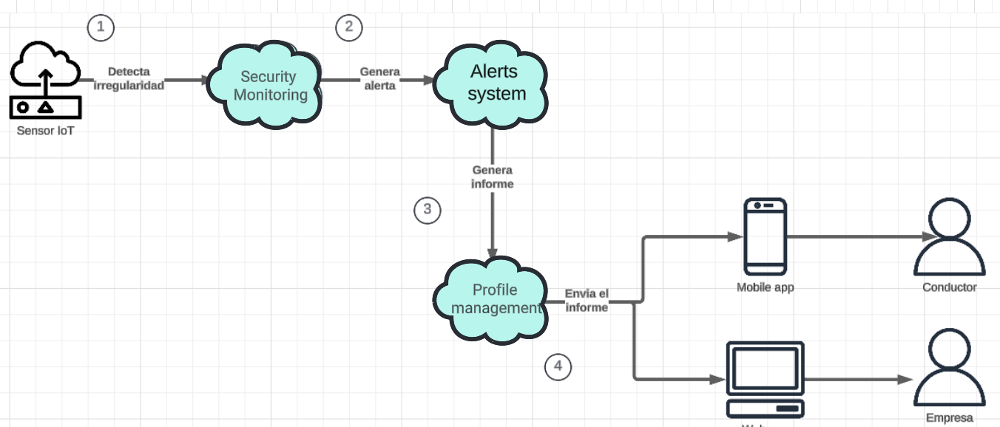

  

<h3 align="center"> Universidad Peruana de Ciencias Aplicadas</h3>
<h4 align="center"> Ingeniería de Sistemas y Computación | Ingeniería de Software  </h4>
<h4 align="center"> Desarrollo de Soluciones IOT </h4>
<h4 align="center"> Informe de Trabajo Final </h4>

### Startup: Debuggers
#### Team Members
- Arrunátegui Aguilar, Josué David 
- Botello Saldarriaga, Anthony Jean Pierre
- Chero Eme, Eduardo Andre
- Lévano Cavero, Eduardo Sebastián
- Moreno Rosales, Claudio Jesús
#### Sección: SW74
#### Profesor: Angel Augusto Velasquez Nuñez
#### Producto: FastPorte
#### Ciclo: 2024-02
<h4 align="center"> Agosto, 2024</h4>

___
# Registro de Versiones del Informe

| Versión | Fecha      | Autor                             | Descripción de modificación                                                |
| ------- | ---------- | --------------------------------- | -------------------------------------------------------------------------- |
| 1.0     | 22/08/2024 | Sebastián Lévano                  | Creación del archivo base en Markdown para el desarrollo del Final Project |
| 1.1     | 01/08/2024 | Sebastián Lévano                  | Desarrollo del Capítulo 3                                                  |
| 1.2     | 26/08/2024 | Anthony Botello                   | Desarrollo del Capítulo 1                                                  |
| 1.3     | 01/09/2024 | Claudio Moreno                    | Desarrollo del Capítulo 2                                                  |
| 1.4     | 05/09/2024 | Eduardo Chero & Josue Arrunátegui | Desarrollo del Capítulo 4                                                  |
| 1.5     | 16/09/2024 | Sebastián Lévano                  | Actualización de índice, títulos y subtítulos para el Trabajo Parcial      |
| 1.6     | 19/09/2024 | Sebastián Lévano                  | Correcciones del Capítulo II y Outcomes                                    |
| 1.7     | 20/09/2024 | Anthony Botello                   | Correcciones del Capítulo I y Outcomes                                     |

---

# Project Report Collaboration Insights

- Link del repositorio Github: [Github](https://github.com/orgs/Debuggers-SW74) / [https://github.com/Debuggers-SW74/final-report](https://github.com/Debuggers-SW74/final-report)

**Desarrollo de las actividades del informe:**

- TB1: Se desarrollaron los capítulos I, II, III y IV, donde cada miembro se encargo en el avance de uno de estos capítulos en el repositorio de GitHub, empleando Gitflow. A continuación, la evidencia de los commits realizados:

Durante la realización de la entrega TB1 se abordaron los cuatro primeros capítulos. Se brindo la introducción del proyecto, explicando a detalle la Startup y cuál será la problemática que se abordará apoyándose del Lean UX Process en el capítulo I. Asimismo, cuál es la solución propuesta y cómo está resulta adecuada. La validación de la propuesta de solución se realizó mediante el análisis de los requisitos en el capítulo II. Durante este capítulo se llevaron a cabo artefactos importantes como el análisis competitivo y las entrevistas a los segmentos objetivos contemplados para corroborar las suposiciones e hipótesis planteadas en el capítulo anterior. Posteriormente, por medio del capítulo III se definió las características de la aplicación su priorización el desarrollo ejecutando el Product Backlog y sus Historias de Usuario relacionadas. Finalmente en el capítulo IV se diseñaron los diagramas de arquitecturas necesarios para la aplicación basados en el desarrollo previo de los Bounded Context.

---
# Contenido 
- [Student Outcome](#student-outcome)
- [Capítulo I: Introducción](#capítulo-i-introducción)
  - [1.1. Startup Profile](#11-startup-profile)
    - [1.1.1. Descripción de la Startup](#111-descripción-de-la-startup)
    - [1.1.2. Perfiles de integrantes del equipo](#112-perfiles-de-integrantes-del-equipo)
  - [1.2. Solution Profile](#12-solution-profile)
    - [1.2.1 Antecedentes y problemática](#121-antecedentes-y-problemática)
    - [1.2.2 Lean UX Process](#122-lean-ux-process)
      - [1.2.2.1. Lean UX Problem Statements](#1221-lean-ux-problem-statements)
      - [1.2.2.2. Lean UX Assumptions](#1222-lean-ux-assumptions)
      - [1.2.2.3. Lean UX Hypothesis Statements](#1223-lean-ux-hypothesis-statements)
      - [1.2.2.4. Lean UX Canvas](#1224-lean-ux-canvas)
  - [1.3. Segmentos objetivo](#13-segmentos-objetivo)
- [Capítulo II: Requirements Elicitation \& Analysis](#capítulo-ii-requirements-elicitation--analysis)
  - [2.1. Competidores](#21-competidores)
    - [2.1.1. Análisis competitivo](#211-análisis-competitivo)
    - [2.1.2. Estrategias y tácticas frente a competidores](#212-estrategias-y-tácticas-frente-a-competidores)
  - [2.2. Entrevistas](#22-entrevistas)
    - [2.2.1. Diseño de entrevistas](#221-diseño-de-entrevistas)
    - [2.2.2. Registro de entrevistas](#222-registro-de-entrevistas)
    - [2.2.3. Análisis de entrevistas](#223-análisis-de-entrevistas)
  - [2.3. Needfinding](#23-needfinding)
    - [2.3.1. User Personas](#231-user-personas)
    - [2.3.2. User Task Matrix](#232-user-task-matrix)
    - [2.3.3. Empathy Mapping](#233-empathy-mapping)
    - [2.3.4. As-is Scenario Mapping](#234-as-is-scenario-mapping)
  - [2.4. Ubiquitous Language](#24-ubiquitous-language)
- [Capítulo III: Requirements Specification](#capítulo-iii-requirements-specification)
  - [3.1. To-Be Scenario Mapping](#31-to-be-scenario-mapping)
  - [3.2. User Stories](#32-user-stories)
  - [3.3. Impact Mapping](#33-impact-mapping)
  - [3.4. Product Backlog](#34-product-backlog)
- [Capítulo IV: Solution Software Design](#capítulo-iv-solution-software-design)
  - [4.1. Strategic-Level Domain-Driven Design](#41-strategic-level-domain-driven-design)
    - [4.1.1. EventStorming](#411-eventstorming)
      - [4.1.1.1 Candidate Context Discovery](#4111-candidate-context-discovery)
      - [4.1.1.2.  Domain Message Flows Modeling](#4112-domain-message-flows-modeling)
      - [4.1.1.3. Bounded Context Canvases](#4113-bounded-context-canvases)
    - [4.1.2. Context Mapping](#412-context-mapping)
    - [4.1.3. Software Architecture](#413-software-architecture)
      - [4.1.3.1. Software Architecture System Landscape Diagram](#4131-software-architecture-system-landscape-diagram)
      - [4.1.3.2. Software Architecture Context Level Diagrams](#4132-software-architecture-context-level-diagrams)
      - [4.1.3.3. Software Architecture Container Level Diagrams](#4133-software-architecture-container-level-diagrams)
      - [4.1.3.4. Software Architecture Deployment Diagrams](#4134-software-architecture-deployment-diagrams)
  - [4.2. Tactical-Level Domain-Driven Design](#42-tactical-level-domain-driven-design)
- [Capítulo V: Solution UI/UX Design](#capítulo-v-solution-ux-ui)
  - [5.1. Style Guidelines](#51-style-guidelines)
    - [5.1.1. General Style Guidelines](#511-general-style-guidelines)
    - [5.1.2. Web, Mobile and IoT Style Guidelines](#512-web-mobile-and-iot-style-guiledines)
  - [5.2. Information Architecture](#52-information-architecture)
    - [5.2.1. Organization Systems](#521-organization-systems)
    - [5.2.2. Labeling Systems](#522-labeling-systems)
    - [5.2.3. SEO Tags and Meta Tags](#523-seo-tags-and-meta-tags)
    - [5.2.4. Searching Systems](#524-searching-systems)
    - [5.2.5. Navigation Systems](#525-navigation-systems)
  - [5.3. Landing Page UI Design](#53-landing-page-ui-design)
    - [5.3.1. Landing Page Wireframe](#531-landing-page-wireframe)
    - [5.3.2. Labeling Page Mock-up](#532-landing-page-mock-up)
  - [5.4. Application UX/UI Design](#54-application-ux-ui-design)
    - [5.4.1. Applications Wireframes](#541-applications-wireframes)
    - [5.4.2. Applications Wireflow Diagrams](#542-applications-wireflow-diagrams)
    - [5.4.3. Applications Mock-ups](#543-applications-mock-ups)
    - [5.4.4. Applications User Flow Diagrams](#544-applications-user-flow-diagrams)
  - [5.5. Applications Prototyping](#55-applications-prototyping)
- [Capítulo VI: Product Implementation, Validation & Deployment](#capítulo-vi-product-implementation-validation-deployment)
  - [6.1. Software Configuration Management](#61-software-configuration-management)
    - [6.1.1. Software Development Environment Configuration](#611-software-development-environment-configuration)
    - [6.1.2. Source Code Management](#612-source-code-management)
    - [6.1.3. Source Code Style Guide & Conventions](#613-source-code-style-guide-conventions)
    - [6.1.4. Software Deployment Configuration](#614-software-deployment-configuration)
  - [6.2. Landing Page, Services & Applications Implementation](#62-landing-page-services-applications-implementation)
    - [6.2.1. Sprint 1](#621-sprint-1)
      - [6.2.1.1. Sprint Planning 1](#6211-sprint-planning-1)
      - [6.2.1.2. Sprint Backlog 1](#6212-sprint-backlog-1)
      - [6.2.1.3. Development Evidence for Sprint Review](#6213-development-evidence-for-sprint-review)
      - [6.2.1.4. Testing Suite Evidence for Sprint Review](#6214-testing-suite-evidence-for-sprint-review)
      - [6.2.1.5. Execution Evidence for Sprint Review](#6215-execution-evidence-for-sprint-review)
      - [6.2.1.6. Services Documentation Evidence for Sprint Review](#6216-services-documentation-evidence-for-sprint-review)
      - [6.2.1.7. Software Deployment Evidence for Sprint Review](#6217-software-deployment-evidence-for-sprint-review)
      - [6.2.1.8. Team Collaboration Insights during Sprint](#6218-team-collaboration-insights-during-sprint)

---

# Student Outcome

| Criterio Específico                                                                             | Acciones Realizadas                                                                                                                                                                                                                                                                                                                                                                                                                                                                                                                                                                                                                                                                                                                                                                                                                                                                                                                                                                                                                                                                                                                                                                                                                                                                                                                                                                                                                                                                                                                                                                                                                                                                                                                                                                                                                                                                                                                                                                                                                                                                                                                                                                                                                                                                                                                                                                                                                                                                                   | Conclusiones                                                                                                                                                                                                                                                                                                                                                                     |
| ----------------------------------------------------------------------------------------------- | ----------------------------------------------------------------------------------------------------------------------------------------------------------------------------------------------------------------------------------------------------------------------------------------------------------------------------------------------------------------------------------------------------------------------------------------------------------------------------------------------------------------------------------------------------------------------------------------------------------------------------------------------------------------------------------------------------------------------------------------------------------------------------------------------------------------------------------------------------------------------------------------------------------------------------------------------------------------------------------------------------------------------------------------------------------------------------------------------------------------------------------------------------------------------------------------------------------------------------------------------------------------------------------------------------------------------------------------------------------------------------------------------------------------------------------------------------------------------------------------------------------------------------------------------------------------------------------------------------------------------------------------------------------------------------------------------------------------------------------------------------------------------------------------------------------------------------------------------------------------------------------------------------------------------------------------------------------------------------------------------------------------------------------------------------------------------------------------------------------------------------------------------------------------------------------------------------------------------------------------------------------------------------------------------------------------------------------------------------------------------------------------------------------------------------------------------------------------------------------------------------- | -------------------------------------------------------------------------------------------------------------------------------------------------------------------------------------------------------------------------------------------------------------------------------------------------------------------------------------------------------------------------------- |
| Trabaja en equipo para proporcionar liderazgo en forma conjunta.                                | *Eduardo Sebastián Lévano Cavero* **TB1:** A través de la realización de los To Be Scenario Mapping y User Stories, lideré la definición de escenarios futuros y necesidades del usuario, respectivamente, lo que permitió al equipo visualizar y priorizar funcionalidades clave. Mediante el Impact Mapping, pudimos establecer en conjunto relaciones claras entre los objetivos estratégicos y las características del producto, garantizando un enfoque alineado con las metas organizacionales. Finalmente, en el Product Backlog, se gestionaron las tareas de manera colaborativa, facilitando una planificación y ejecución eficientes que reflejan las prioridades acordadas en equipo.   *Anthony Botello Saldarriaga*  **TB1:** En el presente proyecto, colaboré activamente en el liderazgo conjunto del equipo. Contribuí en la definición del startup y solution profile, y participé en la creación de los Lean UX Problem Statements y su análisis. Además, apoyé en la elaboración del Lean UX Canvas, tomando decisiones clave en conjunto con el equipo para asegurar un desarrollo efectivo y alineado con los objetivos del proyecto.  *Eduardo André Chero Emé* **TB1:** El desarrollo del event Storming nos ayudó para tener una visualizacion más definida de nuestros bounded context para una mejor implementación en el código. Clasificar los escenarios mediante el modelado de Message flows y generar los Bounded Context Canvas nos brindan un mejor entendimiento de las variables, conexiones y propisitos de los bounded context que impementamos. Por ultimo el desarrollo del diseño de la arquitectura de software en C4 para una mejor ejemplificacion de como va a realizarce nuestras conexiones de los respectivos servicios.  *Claudio Jesús Moreno Rosales* **TB1:** Para realizar y encontrar los requisitos de los segmentos objetivos se tuvo que realizar cada parte con los miembros del equipo para establecer cuales son los requisitos encontrados, como se debería ver los User Persona, User Journey Map, entre otros para entender y empatizar a profundidad con los usuarios.  *Josue David Arrunategui Aguilar* **TB1:** En el desarrollo del proyecto, asumí un papel clave en el diseño y la implementación de los bounded contexts de Usuario, Viaje y Sensor. Mi enfoque incluyó la definición precisa de cada contexto para garantizar una integración efectiva en el sistema. | *TB1* La presente entrega sirvió para validar que la solución propuesta es adecuada para los segmentos objetivo abordados, esto en base al trabajo colaborativo realizado durante las entrevistas y el análisis de estas. Asimismo, por el desarrollo de los apartados involucrados desde la Introducción hasta la estructuración de la arquitectura durante el empleo de C4. |
| Crea un entorno colaborativo e inclusivo, establece metas, planifica tareas y cumple objetivos. | *Eduardo Sebastián Lévano Cavero* **TB1:** Por medio de los To Be Scenario Mapping y las User Stories, identificamos y documentamos las necesidades y expectativas de los usuarios, asegurando que todas las voces fueran escuchadas y consideradas. Mediante el Impact Mapping, en grupo alineamos las metas estratégicas con las funcionalidades del producto, permitiendo una planificación clara y enfocada. En el Product Backlog, priorizamos y planificamos las tareas de forma conjunta, lo que facilitó el cumplimiento de los objetivos establecidos dentro de un marco de trabajo inclusivo y bien organizado.  *Anthony Botello Saldarriaga*  **TB1:** En el desarrollo, fomenté un entorno colaborativo e inclusivo asegurando que todas las ideas fueran escuchadas y valoradas. Participé en la definición de metas claras para el proyecto, colaborando en la planificación de tareas específicas como el desarrollo de los diferentes puntos del informe. Además, me aseguré de que los plazos y objetivos se cumplieran de manera eficiente, distribuyendo responsabilidades entre los miembros del equipo.  *Eduardo André Chero Emé* **TB1:** A través de EventStorming, se identificaron los contextos potenciales y se modelaron los flujos de mensajes del dominio; esto permitió utilizar los Bounded Context Canvases para encontrar contextos delimitados. Posteriormente, se trabajó en el mapeo de contextos y el diseño de la arquitectura de software, creando diagramas a nivel de sistema, contexto, contenedor y despliegue, lo que proporcionó una visión clara de las conexiones y dependencias entre los servicios.  *Claudio Jesús Moreno Rosales* **TB1:**  En la elaboración de las técnicas de Design Thinking como los User Persona, User Journey Map, entre otros, se pudo apreciar que los miembros del equipo colaboraron realizando sus entrevistas, analisando cuantiativamente las entrevistas y al final sacando los resultados finales para empatizar con nuestros segmentos objetivo.  *Josue David Arrunategui Aguilar* **TB1:** En el desarrollo del proyecto, asumí un papel clave en el diseño y la implementación de los bounded contexts de Usuario, Viaje y Sensor. Mi enfoque incluyó la definición precisa de cada contexto para garantizar una integración efectiva en el sistema.                                                                                                  | *TB1* Se lograron los objetivos diseñados en grupo al completar la base del proyecto tanto a nivel de diseño como de arquitectura. Asimismo, al planear los elementos a desarrollar durante los siguientes Sprints.                                                                                                                                                           |

---
# Capítulo I: Introducción
## 1.1. Startup Profile
### 1.1.1. Descripción de la Startup

Somos un grupo de estudiantes de la Universidad Peruana de Ciencias Aplicadas que, motivados por la creciente necesidad de seguridad en el transporte de materiales peligrosos, identificamos una oportunidad de negocio única. Durante nuestras investigaciones, notamos que el transporte de gases combustibles y otros productos peligrosos presenta riesgos significativos, tanto para los conductores como para el público en general. Estos riesgos, muchas veces subestimados o mal gestionados, pueden tener consecuencias catastróficas si no se abordan con soluciones tecnológicas adecuadas.

En respuesta a esta problemática, decidimos fundar TechCompany, una startup enfocada en ofrecer soluciones de vanguardia que integran la tecnología IoT para la supervisión en tiempo real de las condiciones de seguridad en el transporte de materiales peligrosos. Nuestro producto, FastPorte, no solo se centra en la implementación de sensores avanzados que monitorean parámetros críticos como fugas de gas, temperatura y presión, sino también en proporcionar una plataforma integral que facilita la gestión de estos datos para prevenir accidentes.

En TechCompany, entendemos que la seguridad no es solo una necesidad, sino una responsabilidad compartida entre todas las partes involucradas en la cadena de transporte. Por ello, nos hemos comprometido a desarrollar productos y servicios que no solo cumplan con las normativas internacionales más estrictas, sino que también superen las expectativas de nuestros clientes, brindándoles herramientas que aseguren la integridad de sus operaciones y protejan vidas.

**Misión:** 
Proporcionar soluciones tecnológicas innovadoras que garanticen la seguridad y eficiencia en el transporte de materiales peligrosos, contribuyendo así a la protección de vidas humanas y al cumplimiento de normativas internacionales de seguridad.

**Visión:**
Ser reconocidos como líderes en el mercado de soluciones IoT aplicadas al transporte de materiales peligrosos, impulsando un futuro más seguro y confiable para la industria del transporte a nivel nacional e internacional.

**Valores:**
- Seguridad
- Innovación
- Responsabilidad
- Compromiso con el cliente
- Sostenibilidad

### 1.1.2. Perfiles de integrantes del equipo

| Integrante        | Arrunátegui Aguilar, Josué David                        |
|-------------------|---------------------------------------------------------|
| **Código:** U202111033   **Carrera:** Ingeniería de Software   **Acerca de mí:** Me gusta dibujar, tocar guitarra y jugar videojuegos. Tengo conocimiento en el desarrollo frontend con lenguajes como angular y vue.js, así como desarrollo móvil con flutter. Planeo especializarme en desarrollo web o como Analista de Datos. |  |

| Integrante                                                                                                                                                                                                                                                                                                                                                                                                       | Botello Saldarriaga, Anthony Jean Pierre                    |
|------------------------------------------------------------------------------------------------------------------------------------------------------------------------------------------------------------------------------------------------------------------------------------------------------------------------------------------------------------------------------------------------------------------|-------------------------------------------------------------|
| **Código:** U20201B846    **Carrera:** Ingeniería de Software   **Acerca de mí:** Tengo 23 años y soy estudiante de Ingeniería de Software con conocimientos y habilidades en distintos lenguajes de programación. Actualmente curso el noveno ciclo de la carrera y mi meta es ser un profesional destacado el cual rija sus decisiones por sus valores y el bien de la empresa donde labore. Me interesa el desarrollo de la tecnología y los avances que existen en la inteligencia artificial. |  |

| Integrante                                                                                                                                                                                                                                          | Chero Eme, Eduardo Andre                                    |
| --------------------------------------------------------------------------------------------------------------------------------------------------------------------------------------------------------------------------------------------------- | ----------------------------------------------------------- |
| **Código:** U20201F282   **Carrera:** Ingeniería de software   **Acerca de mí:** Me gustan los videojuegos y las series, quiero especializarme en ciberseguridad para tener una ganancia estable mientras creo videojuegos aparte por pasión. |  |

| Integrante                                                                                                                                                                                                                                                                                                                                                                                                                                                                                                         | Lévano Cavero, Eduardo Sebastián                                |
|--------------------------------------------------------------------------------------------------------------------------------------------------------------------------------------------------------------------------------------------------------------------------------------------------------------------------------------------------------------------------------------------------------------------------------------------------------------------------------------------------------------------|-----------------------------------------------------------------|
| **Código:** U20201C172   **Carrera:** Ingeniería de Software   **Acerca de mí:** Mi nombre es Sebastián, tengo 21 años y soy estudiante de Ingeniería de Software en la Universidad Peruana de Ciencias Aplicadas. Elegí esta carrera porque me fascina crear y diseñar procesos que faciliten procesos complejos. Por ello, cuando tengo un poco de tiempo libre lo uso para relajarme y para aprender más de lo que me apasiona, la programación, se puede decir que es uno de mis hobbies. Además, de la programación también disfruto de jugar vóley, fútbol o algún videojuego con mis amigos. |  |

| Integrante        | Moreno Rosales, Claudio Jesús                               |
|-------------------|-------------------------------------------------------------|
| **Código:** U20191E800   **Carrera:** Ingeniería de Software   **Acerca de mí:** La tecnología en general me gusta mucho, por ello, sigo constantemente explorando nuevas herramientas y tendencias del mundo tech. Estoy siempre dispuesto a aprender y enfrentar desafíos. Un campo que me interesa mucho es el de la Seguridad Informática, para lograr que el desarrollo de software sea de la más alta calidad posible y mantener seguros a los clientes. |  |

## 1.2. Solution Profile

En esta sección, exploraremos en detalle la solución que nuestra startup, TechCompany, propone para abordar los desafíos identificados en el transporte de materiales peligrosos. 

### 1.2.1 Antecedentes y problemática

#### Antecedentes

El transporte de materiales peligrosos, como gases combustibles y productos químicos, ha sido históricamente una actividad de alto riesgo. A lo largo de los años, numerosos incidentes han demostrado las graves consecuencias que pueden surgir cuando no se implementan medidas de seguridad adecuadas. Desde explosiones devastadoras hasta fugas tóxicas que ponen en peligro la vida de conductores y comunidades enteras, la necesidad de soluciones efectivas en este campo es evidente.

Para mitigar este problema, soluciones similares a nuestra propuesta han surgido en el mercado como: 
- **Geotab:** Es una plataforma de gestión de flotas que ofrece soluciones avanzadas de telemetría para vehículos de transporte, incluyendo aquellos que manejan materiales peligrosos. La solución permite el monitoreo en tiempo real de diversos parámetros del vehículo, tales como la ubicación, la velocidad, y las condiciones de los activos transportados. 
- **TankScan:** Se especializa en la monitorización inalámbrica de tanques que contienen líquidos y gases peligrosos. Utilizando tecnología avanzada, permite a las empresas verificar remotamente los niveles de fluidos y planificar rutas de manera más eficiente, mejorando la seguridad y reduciendo costos operativos.
- **Samsara:** Plataforma integral de gestión de flotas que ofrece telemetría en tiempo real, rastreo GPS, monitoreo de condiciones ambientales como temperatura y presión, y herramientas de seguridad avanzada. Su tecnología ayuda a las empresas a mejorar la eficiencia operativa, cumplir con normativas de seguridad y reducir riesgos en el transporte de materiales peligrosos.

#### Problemática

Para abordar la problemática del transporte de materiales peligrosos, es fundamental comprender el contexto en el que se desarrolla y los actores involucrados. A continuación, presentamos un análisis de la problemática utilizando el marco de las 5 'W's y 2 'H's:

**Who? (¿Quién?)**
El problema afecta a una amplia gama de actores, desde los conductores que transportan materiales peligrosos hasta las empresas que se encargan de la logística y el transporte. También involucra a las comunidades cercanas a las rutas de transporte y a las autoridades responsables de la seguridad pública.

**What? (¿Qué?)**
La principal problemática radica en la falta de monitoreo en tiempo real y la ausencia de sistemas que puedan detectar y alertar sobre condiciones peligrosas, como fugas de gas o cambios bruscos en la temperatura o presión, antes de que se conviertan en incidentes graves.

**Where? (¿Dónde?)**
Este problema es global, pero en el contexto de TechCompany, nos centramos en el transporte de materiales peligrosos dentro del Perú, un país con una geografía compleja que presenta desafíos adicionales para el transporte seguro.

**When? (¿Cuándo?)**
La problemática es constante, pero se vuelve especialmente crítica durante el transporte de largas distancias, en zonas remotas o en áreas urbanas densamente pobladas donde el riesgo de accidentes y sus consecuencias es mayor.

**Why? (¿Por qué?)**
Las causas de este problema son múltiples. La falta de tecnología avanzada en los vehículos de transporte, la escasa inversión en sistemas de seguridad, y la subestimación de los riesgos asociados son factores que han contribuido a que los incidentes continúen ocurriendo.

**How? (¿Cómo?)**
La solución a este problema pasa por la implementación de tecnologías de monitoreo en tiempo real que puedan alertar de inmediato a los conductores y operadores sobre cualquier condición peligrosa. FastPorte se posiciona para llenar este vacío mediante el uso de sensores IoT que supervisan constantemente las condiciones de seguridad y envían alertas en tiempo real.

**How much? (¿Cuánto?)**
El impacto potencial de no abordar esta problemática es significativo, tanto en términos de vidas humanas como de pérdidas económicas para las empresas y el costo social de los accidentes. La inversión en una solución como FastPorte es, por tanto, no solo justificada, sino esencial para mitigar estos riesgos.

### 1.2.2 Lean UX Process.

En esta sección, exploraremos cómo el Lean UX Process se aplica en el desarrollo de nuestro producto, FastPorte. Este enfoque nos permite centrarnos en la creación de valor para nuestros usuarios. Mediante la implementación de Lean UX, alineamos nuestra visión de negocio con las necesidades de nuestros clientes, asegurando que el producto no solo resuelva problemas relevantes, sino que también se adapte a un entorno que cambia.

#### 1.2.2.1. Lean UX Problem Statements.

Para comprender mejor los desafíos que nuestro proyecto abarca, hemos definido un Problem Statement. Este enunciado nos permite enmarcar de manera clara el problema que nuestro producto busca resolver, facilitando así el enfoque en soluciones que verdaderamente impacten en la vida de nuestros usuarios. 
##### Problem Statement:
El transporte de materiales peligrosos demanda una supervisión constante y efectiva de las condiciones de seguridad, tanto para los supervisores de transporte que deben monitorear el estado del transporte en tiempo real, como para los conductores que necesitan recibir alertas inmediatas sobre riesgos potenciales. Actualmente, hemos observado que existe una dificultad crítica en la detección y respuesta rápida ante incidentes durante el transporte, lo que pone en riesgo tanto la seguridad de los materiales como la integridad física de los conductores y otros actores en la vía. Esto también impacta en el cumplimiento normativo y en la reputación de las empresas involucradas.

¿Cómo podríamos mejorar la detección y respuesta temprana ante riesgos durante el transporte de materiales peligrosos para reducir incidentes y asegurar el cumplimiento normativo, medido por una reducción en incidentes de transporte y una mejora en los tiempos de respuesta ante alertas?

#### 1.2.2.2. Lean UX Assumptions

En esta sección, definimos las suposiciones clave que guiarán el desarrollo de FastPorte. Estas suposiciones se basan en una comprensión profunda de nuestros usuarios y del mercado, y nos permiten validar las decisiones de diseño y desarrollo a lo largo del proceso. 

##### FEATURES

- Registro de usuarios en dos perfiles: Supervisor y Conductor, con identificación y verificación adecuadas.
- Visualización de los perfiles de los conductores, incluyendo información relevante para el transporte de materiales peligrosos, como certificaciones y datos del vehículo.
- Los supervisores podrán crear y gestionar viajes, asignando conductores y supervisando el estado de los mismos en tiempo real.
- Los conductores recibirán notificaciones sobre los viajes asignados y alertas de seguridad durante el transporte.
- Monitoreo en tiempo real de las condiciones del material transportado (fugas de gas, temperatura, presión) con alertas automáticas a los supervisores y conductores.
- Historial de viajes y reportes de incidentes accesibles para ambos perfiles.
- Integración con sistemas de pago seguros para la facturación de servicios.
- Soporte para visualizar rutas y ubicación en tiempo real utilizando tecnología GPS.

##### BUSINESS OUTCOMES

- Asegurar el cumplimiento de las normativas de seguridad en el transporte de materiales peligrosos al adoptar un sistema de monitoreo en tiempo real que reduce las violaciones de seguridad y permite una respuesta rápida ante incidentes.
- Los supervisores de transporte de materiales peligrosos aumentarán su uso del sistema gracias a la mayor confianza en la seguridad proporcionada por las alertas en tiempo real y la capacidad de prevenir incidentes antes de que ocurran.
- Los supervisores optimizarán la gestión de sus operaciones al reducir el tiempo invertido en tareas de supervisión manual y mejorar la coordinación entre los conductores y los supervisores a través de la gestión centralizada de los viajes y condiciones de transporte.
- Los usuarios reducirán significativamente el número de incidentes y accidentes durante el transporte de materiales peligrosos al responder de manera más eficiente a las alertas en tiempo real, disminuyendo el riesgo operativo y las pérdidas asociadas.

##### USER OUTCOMES AND BENEFITS

- Para los supervisores: 
	- Mejorar la gestión de sus operaciones de transporte, asegurando la seguridad de sus materiales y cumpliendo con las normativas.
	- Sentir confianza y seguridad en sus procesos, con la tranquilidad de que pueden mitigar incidentes antes de que se conviertan en problemas mayores, lo que además protege la reputación de la empresa.
	- Los supervisores percibirán la reducción de los incidentes durante el transporte, cumpliendo de forma más eficiente con las normativas y mejorando los tiempos de respuesta ante riesgos.
- Para los conductores: 
	- Aumentar la seguridad durante el transporte gracias a las alertas en tiempo real y la supervisión continua.
	- Los conductores sentirán que están mejor protegidos y que su seguridad está siendo priorizada, lo que disminuye la ansiedad durante los trayectos peligrosos.
	- Los conductores reaccionarán más rápido ante alertas de riesgo, reduciendo incidentes y aumentando la confianza en el sistema.
- Para ambos: 
	- Acceso a un sistema confiable que permite la monitorización de las condiciones de transporte y la gestión eficiente de los viajes.
	- Tanto supervisores como conductores sentirán que cuentan con una herramienta sólida y confiable, lo que genera una sensación de control y reduce el estrés ante posibles emergencias.
	- Ambos grupos utilizarán el sistema de manera más frecuente y eficiente, integrándolo en sus operaciones diarias y aumentando la confianza en su capacidad para prevenir incidentes.

##### BUSINESS ASSUMPTIONS

- Creemos que los supervisores de transporte de materiales peligrosos buscan soluciones que les ofrezcan seguridad y eficiencia en la gestión de sus operaciones.
- Los conductores necesitan una herramienta que les ofrezca seguridad adicional y la capacidad de gestionar su trabajo de manera más eficiente.
- Nuestros usuarios esperan que la información proporcionada por los sensores sea precisa y que las alertas sean confiables.
- Estas necesidades pueden ser satisfechas mediante una plataforma que integre la tecnología IoT para monitorear en tiempo real las condiciones de transporte y alertar sobre posibles riesgos.
- Los usuarios iniciales son supervisores de transporte de materiales peligrosos y conductores que buscan mejorar la seguridad en su trabajo diario.
- El valor principal que nuestros usuarios buscan en FastPorte es la seguridad y la confianza en la supervisión continua de sus operaciones.
- Obtendremos clientes a través de campañas dirigidas a supervisores y conductores mediante anuncios en internet y asociaciones estratégicas.
- Los ingresos se generarán a través de suscripciones a la plataforma, tarifas de servicio, y posibles acuerdos con aseguradoras que ofrezcan descuentos a empresas cuyos supervisores utilicen FastPorte.
- Nuestra principal competencia son otras soluciones de monitoreo y gestión de flotas, pero nos destacaremos por nuestro enfoque especializado en materiales peligrosos.
- El mayor riesgo es que las alertas no se detecten a tiempo o que la información proporcionada sea incorrecta, lo que podría llevar a incidentes durante el transporte. - Resolveremos esto mediante pruebas rigurosas de los sensores y un sistema de validación continua.

##### USER ASSUMPTIONS

- Los usuarios clave son los supervisores de transporte de materiales peligrosos y los conductores encargados de realizar dichos transportes.
- Los supervisores necesitan monitorear en tiempo real las condiciones de seguridad durante los trayectos para garantizar el cumplimiento normativo y evitar riesgos que puedan afectar su reputación y la seguridad del material transportado.
- Los conductores requieren una solución que les provea alertas inmediatas y confiables sobre condiciones peligrosas, lo que les permitirá actuar rápidamente para minimizar riesgos a su integridad física y a la seguridad en la carretera.
- La interfaz del producto debe ser sencilla e intuitiva para que tanto supervisores como conductores puedan interactuar con facilidad y enfocarse en sus tareas sin distracciones técnicas.
- Los conductores priorizarán la precisión de las alertas y la rapidez en la notificación de riesgos, ya que esto afecta directamente su seguridad personal durante los trayectos.
- Los supervisores de transporte están motivadas por el deseo de reducir costos operativos relacionados con incidentes, optimizar el cumplimiento de las regulaciones y mejorar la reputación de su servicio al demostrar proactividad en la gestión de riesgos.
- Los conductores están motivados por mejorar su seguridad personal y minimizar las interrupciones durante los trayectos, permitiéndoles cumplir con sus tareas de manera eficiente y sin incidentes.
- Las empresas de transporte pueden no estar dispuestas a invertir en hardware costoso o en sistemas complejos que requieran una implementación prolongada, por lo que valorarán una solución que sea rápida de implementar y de fácil integración con su infraestructura existente.
- Supervisores y conductores podrían resistirse al cambio si el sistema requiere modificar demasiado sus procesos actuales. Se asume que cuanto más fácil de usar y eficiente sea la solución, mayor será la adopción.

#### 1.2.2.3. Lean UX Hypothesis Statements

En esta sección, formularemos hipótesis basadas en nuestras suposiciones de Lean UX. Estas hipótesis nos permitirán validar si las soluciones que implementamos en FastPorte están efectivamente resolviendo los problemas identificados y generando los resultados deseados tanto para los usuarios como para el negocio.

##### HIPÓTESIS 1:
**Creemos que lograremos** una reducción en los incidentes y accidentes **si** los conductores de transporte de materiales peligrosos **pueden** mejorar su capacidad de respuesta a situaciones peligrosas en tiempo real **con** un sistema de alertas automatizadas basado en sensores de presión, temperatura y fugas.

##### HIPÓTESIS 2:
**Creemos que lograremos** una mejora en la eficiencia operativa **si** los supervisores de transporte **pueden** planificar y gestionar sus viajes de manera eficiente, asignando conductores y supervisando el estado de los mismos en tiempo real **con** un sistema de gestión centralizada de viajes.

##### HIPÓTESIS 3:
**Creemos que lograremos** una mejora en la trazabilidad y seguridad del transporte **si** los supervisores y conductores **pueden** consultar el historial de viajes y reportes de incidentes pasados **con** un sistema que documente estos eventos de manera clara y accesible.

##### HIPÓTESIS 4:
**Creemos que lograremos** una mejora en la seguridad del transporte **si** los conductores **pueden** recibir notificaciones sobre los viajes asignados y alertas de seguridad en tiempo real durante el transporte **con** un sistema de notificaciones y alertas confiable.

##### HIPÓTESIS 5:
**Creemos que lograremos** una adopción efectiva del sistema **si** los supervisores y conductores **pueden** registrarse y verificar su identidad de manera segura en dos perfiles (Supervisor y Conductor) con un **sistema** de registro e identificación adecuado.

##### HIPÓTESIS 6:
**Creemos que lograremos** el cumplimiento de las normativas de seguridad **si** los supervisores de transporte **pueden** visualizar los perfiles de los conductores, incluyendo certificaciones y datos del vehículo relevantes para el transporte de materiales peligrosos, **con** un sistema de gestión de perfiles.

#### 1.2.2.4. Lean UX Canvas

<table><tr><th colspan="2" valign="top"><b>LEAN UX CANVAS</b></th><th valign="top">
Fecha: 20/09/24

Iteración: 1
</th></tr>
<tr><td valign="top">
<b>1. Business problem</b>

El transporte de materiales peligrosos demanda una supervisión constante y efectiva de las condiciones de seguridad, tanto para los encargados de supervisar que deben monitorear el estado del transporte en tiempo real, como para los conductores que necesitan recibir alertas inmediatas sobre riesgos potenciales. Actualmente, hemos observado que existe una dificultad crítica en la detección y respuesta rápida ante incidentes durante el transporte, lo que pone en riesgo tanto la seguridad de los materiales como la integridad física de los conductores y otros actores en la vía. Esto también impacta en el cumplimiento normativo y en la reputación de las empresas involucradas.

¿Cómo podríamos mejorar la detección y respuesta temprana ante riesgos durante el transporte de materiales peligrosos para reducir incidentes y asegurar el cumplimiento normativo, medido por una reducción en incidentes de transporte y una mejora en los tiempos de respuesta ante alertas?
</td><td rowspan="2" valign="top">
<b>5.Solutions</b>

- Registro de usuarios en dos perfiles: Supervisor y Conductor, con identificación y verificación adecuadas para garantizar la seguridad en el acceso.

- Visualización de perfiles de los conductores, con certificaciones y datos relevantes para asegurar el cumplimiento normativo.

- Creación y gestión de viajes en tiempo real, asignando conductores y supervisando el estado de estos para mejorar la eficiencia operativa.

- Notificaciones y alertas de seguridad en tiempo real para los conductores, permitiendo una respuesta rápida ante riesgos durante el transporte.

- Monitoreo en tiempo real de las condiciones del material transportado (fugas de gas, temperatura, presión) con alertas automáticas a empresas y conductores.

- Historial de viajes y reportes de incidentes accesibles para ambos perfiles, mejorando la trazabilidad y aprendizaje a partir de incidentes.

- Integración con sistemas de pago seguros para facilitar la facturación de servicios.
</td><td valign="top">
<b>2.Business Outcomes</b>

- Asegurar el cumplimiento de normativas de seguridad en el transporte de materiales peligrosos.

- Incrementar la confianza de las empresas en la seguridad del transporte de sus materiales.

- Mejorar la eficiencia operativa mediante la supervisión en tiempo real y la gestión centralizada de los viajes.

- Reducir el riesgo de incidentes y accidentes durante el transporte de materiales peligrosos.
</td></tr>
<tr><td valign="top">
<b>3. User</b>

Nuestro producto se dirige a dos tipos de usuarios principales:

- <b>Supervisores de transporte de materiales peligrosos</b> que buscan mejorar la seguridad y el cumplimiento normativo.

- <b>Conductores de transporte de materiales peligrosos</b> que necesitan herramientas para aumentar la seguridad durante sus operaciones diarias.

</td><td valign="top">
<b>4. User outcomes & benefits</b>

- Para los <b>supervisores</b>, FastPorte mejora la gestión de sus operaciones, incrementa la seguridad y asegura el cumplimiento normativo.

- Para los <b>conductores</b>, FastPorte ofrece una mayor seguridad mediante alertas en tiempo real y supervisión constante, reduciendo el riesgo de accidentes.

Para ambos, acceso a un sistema confiable que permite la monitorización de las condiciones de transporte y la gestión eficiente de los viajes.
</td></tr>
<tr><td valign="top">
<b>6. Hypotheses</b>

- <b>Creemos que lograremos</b> una reducción en los incidentes y accidentes <b>si</b> los conductores de transporte de materiales peligrosos <b>pueden</b> mejorar su capacidad de respuesta a situaciones peligrosas en tiempo real <b>con</b> un sistema de alertas automatizadas basado en sensores de presión, temperatura y fugas.

- <b>Creemos que lograremos</b> una mejora en la eficiencia operativa <b>si</b> las empresas de transporte <b>pueden</b> planificar y gestionar sus viajes de manera eficiente, asignando conductores y supervisando el estado de los mismos en tiempo real <b>con</b> un sistema de gestión centralizada de viajes.

- <b>Creemos que lograremos</b> una mejora en la trazabilidad y seguridad del transporte <b>si</b> las <b>con</b> empresas y conductores <b>pueden</b> consultar el historial de viajes y reportes de incidentes pasados <b>con</b> un sistema que documente estos eventos de manera clara y accesible.
</td><td valign="top">
<b>7. ¿Qué es lo más importante que necesitamos aprender primero?</b>

Validar la precisión y efectividad del sistema de alertas en tiempo real para que los usuarios confíen en ellas y tomen acciones preventivas.
</td><td valign="top">
<b>8. ¿Cuál es la menor cantidad de trabajo que debemos hacer para aprender la siguiente cosa más importante?</b>

Desarrollar un prototipo funcional del sistema de alertas y realizar pruebas piloto con un grupo representativo de usuarios para evaluar su precisión y utilidad en situaciones reales.
</td></tr>
</table>
## 1.3. Segmentos objetivo

En el desarrollo de FastPorte, hemos identificado dos segmentos de usuarios principales en el territorio peruano, cada uno con características y necesidades específicas que guían el diseño y funcionalidad de nuestra plataforma.

##### PRIMER SEGMENTO
El primer segmento está compuesto por los supervisores de transporte de materiales peligrosos. Estos supervisores, que operan en empresas de diferentes tamaños, suelen estar ubicados predominantemente en zonas industriales y áreas cercanas a puertos y fronteras. Muchos de ellos manejan varias operaciones que dependen de la seguridad y el cumplimiento normativo en el transporte de materiales peligrosos. Para estos supervisores, FastPorte ofrece una solución integral que les permite monitorear y gestionar las operaciones de transporte de manera más eficiente y que reduce el riesgo de incidente.

##### SEGUNDO SEGMENTO
El segundo segmento objetivo está compuesto por los conductores de transporte de materiales peligrosos. Estos profesionales, con edades comprendidas entre 25 y 55 años, operan principalmente en rutas nacionales y cuentan con formación técnica o certificaciones específicas para el manejo seguro de materiales peligrosos. Para estos conductores, FastPorte ofrece herramientas esenciales que mejoran su seguridad y eficiencia, como alertas en tiempo real sobre riesgos durante el transporte, así como la supervisión continua de las condiciones del material transportado. Estas funcionalidades permiten a los conductores reaccionar rápidamente ante situaciones peligrosas, reduciendo el riesgo de incidentes y garantizando un mayor control durante sus trayectos.

# Capítulo II: Requirements Elicitation & Analysis

## 2.1. Competidores
### 2.1.1. Análisis competitivo

|Competidores directos  | Resumen |
|--|--|
| <a href ="#">  https://www.geotab.com/es/   </a> |GEOTAB es una empresa líder mundial en soluciones de gestión de flotas que ofrece una plataforma integral para digitalizar procesos, reducir costos y aumentar la sostenibilidad en la operación de vehículos. Su sistema incluye el dispositivo Geotab GO, que se instala fácilmente en los vehículos para recopilar datos sobre ubicación, velocidad, comportamiento del conductor y estado del vehículo. La plataforma proporciona herramientas para mejorar la seguridad de la flota, como informes detallados, alertas personalizadas y asesoramiento al conductor en tiempo real.   |
| <a href ="#">  https://www.samsara.com/mx/ </a> |Samsara es una plataforma integral de gestión de operaciones que conecta flotas, equipos, sitios y personal en una sola interfaz. Ofrece visibilidad en tiempo real, información basada en datos y flujos de trabajo optimizados para mejorar la eficiencia operativa. La plataforma ha ayudado a diversas empresas a reducir accidentes, mejorar la gestión de mantenimiento y tomar decisiones más rápidas, según testimonios de clientes. Además, Samsara ofrece un amplio ecosistema de integraciones listas para usar, permitiendo a las empresas ampliar sus soluciones y aprovechar al máximo sus sistemas existentes.   |
| <a href ="#"> https://tankscan.com </a> |TankScan ofrece una solución de monitoreo inalámbrico de tanques que permite a las empresas verificar en tiempo real los niveles de líquido en múltiples tanques y ubicaciones desde una computadora o teléfono inteligente. Esta tecnología mejora la eficiencia de la flota, optimiza la gestión de inventario y aumenta la seguridad al eliminar la necesidad de lecturas manuales. El sistema utiliza hardware de vanguardia y la Plataforma de Inteligencia ATEK (AIP) basada en la nube, proporcionando alertas automáticas, un panel de control personalizable, mapeo de activos para optimizar rutas y capacidades de generación de informes.  |
  

|Competitive Analysis Landscape|
|--|

|¿Por qué llevar a cabo este análisis? |El objetivo del siguiente análisis competitivo es identificar las fortalezas y debilidades de FastPorte que es el producto final de TechCompany en relación con los posibles competidores para desarrollar estrategias efectivas para tener ventaja competitiva en el mercado.|
|--|--|
---
| Competidores                                      |                                                       |  | 

 |  |
| ------------------------------------------------- | -------------------------------------------------------------------------------------------------------------------------------------------------------------------------------------------------------- | ------------------------------------------------------------------------------------------------------------------------------------------- | ----------------------------------------------------------------------------------------------------------------------------------------------------------------------------------- | ----------------------------------------------------------------------------------------------------------------------------------------------- |
| **Perfil**                                        |                                                                                                                                                                                                          |                                                                                                                                             |                                                                                                                                                                                     |                                                                                                                                                 |
| Overview                                          | Plataforma web, aplicación móvil y sensores IoT                                                                                                                                                          | Plataforma web, aplicación móvil y dispositivo sensores IoT                                                                                 | Plataforma web y dispositivo GO IoT                                                                                                                                                 | Plataforma web, aplicación móvil y dispositivo sensores IoT                                                                                     |
| Ventaja competitiva ¿Qué valor ofrece al cliente? | Proporciona seguridad avanzada en el transporte de gases combustibles mediante sensores que detectan fugas y alertan a los conductores en tiempo real, evitando explosiones y garantizando la seguridad. | Amplia gama de datos para la seguridad y eficiencia de flotas mediante tecnología de monitoreo avanzada.                                    | Conectividad integral de operaciones mediante una plataforma unificada que ofrece visibilidad y análisis en tiempo real.                                                            | Monitoreo inalámbrico en tiempo real de niveles de tanques con alta precisión y alertas automatizadas.                                          |
| **Perfil de Marketing**                           |                                                                                                                                                                                                          |                                                                                                                                             |                                                                                                                                                                                     |                                                                                                                                                 |
| Mercado objetivo                                  | Transportistas que manejan vehículos de carga peligrosa y empresas que trabajan con materiales peligrosos y necesitan asegurar el transporte seguro de sus productos.                                    | Transporte, logística, servicios públicos, industria de gas, petróleo, minería, distribución de alimentos y reciclaje.                      | Empresas con operaciones complejas que requieren gestión integrada de flotas, equipos, sitios y personas.                                                                           | Empresas con necesidad de monitoreo de tanques en campo, almacenamiento a granel y subterráneos.                                                |
| Estrategias de marketing                          | Publicidad en redes sociales.    Colaboraciones con personas influyentes para promocionar el producto.                                                                                             | Publicidad mediante su página web.                                                                                                          | Publicidad mediante su página web.                                                                                                                                                  | Publicidad mediante su página web.                                                                                                              |
| **Perfil del Producto**                           |                                                                                                                                                                                                          |                                                                                                                                             |                                                                                                                                                                                     |                                                                                                                                                 |
| Productos & Servicios                             | Sensores para supervisar condiciones de materiales peligrosos y aplicaciones móvil y web para la gestión de perfiles de empresas y conductores.                                                          | Dispositivo Geotab GO, plataforma MyGeotab para monitoreo de flotas.                                                                        | Plataforma de Samsara, sensores, cámaras, integraciones con otros sistemas.                                                                                                         | Plataforma ATEK Intelligence y monitores de tanque inalámbricos.                                                                                |
| Precios & Costos                                  | Dependiente de los requisitos de la empresa que lo solicite.                                                                                                                                             | Dependiente de los requisitos de la empresa que lo solicite.                                                                                | Dependiente de los requisitos de la empresa que lo solicite.                                                                                                                        | Dependiente de los requisitos de la empresa que lo solicite.                                                                                    |
| Canales de distribución (Web y/o Móvil)           | Web/Móvil                                                                                                                                                                                                | Web/Móvil                                                                                                                                   | Web                                                                                                                                                                                 | Web/Móvil                                                                                                                                       |
| Tecnologías usadas                                | Plataforma Web (Angular y Spring Boot), App Móvil (Flutter) y Sensores IoT con análisis de datos en tiempo real.                                                                                         | Monitoreo en tiempo real, análisis de datos avanzados, conectividad IoT.                                                                    | IoT, AI, conectividad de sensores, análisis de datos en tiempo real.                                                                                                                | Monitoreo inalámbrico, sensores, conectividad celular o Ethernet.                                                                               |
| **Análisis SWOT**                                 |                                                                                                                                                                                                          |                                                                                                                                             |                                                                                                                                                                                     |                                                                                                                                                 |
| Fortalezas                                        | Seguridad en tiempo real para el transporte de materiales peligrosos y cumplimiento de regulaciones y estándares aplicables.                                                                             | Soluciones integradas de seguridad y eficiencia, experiencia en múltiples sectores.                                                         | Amplia escalabilidad y flexibilidad, integración con múltiples sistemas.                                                                                                            | Precisión en la lectura de niveles, facilidad de instalación y escalabilidad.                                                                   |
| Debilidades                                       | Necesidad de capacitación para conductores y empresas en el uso del sistema.                                                                                                                             | Dependencia de la instalación física del dispositivo.                                                                                       | Requiere inversión inicial significativa en tecnología.                                                                                                                             | Dependencia en la conectividad para la transmisión de datos.                                                                                    |
| Oportunidades                                     | Integración con sistemas de gestión logística para mejorar la eficiencia operativa.                                                                                                                      | Innovación en el monitoreo y análisis predictivo para nuevos sectores.                                                                      | Creciente demanda de soluciones integradas en operaciones complejas.                                                                                                                | Expansión en mercados con necesidades críticas de monitoreo remoto.                                                                             |
| Amenazas                                          | Competencia con tecnologías emergentes de detección de gases y monitoreo de seguridad.                                                                                                                   | Aparición de nuevas tecnologías de monitoreo con costos más bajos.                                                                          | Competencia de plataformas con enfoques más específicos o especializados.                                                                                                           | Competidores con tecnologías emergentes en monitoreo de líquidos.                                                                               |
 

 <h4>Tabla: Matriz de análisis de competencia </h4>  
Fuente: Elaboración propia.
 

 <h4>Tabla: Matriz de perfil competitivo de los competidores directos </h4>  
Fuente: Elaboración propia.
 

### 2.1.2. Estrategias y tácticas frente a competidores

1. **Diferenciación mediante Innovación Tecnológica:** Para destacar en el mercado de soluciones para el transporte de materiales peligrosos, es crucial ofrecer una propuesta de valor basada en tecnología avanzada. La estrategia de diferenciación se centra en implementar sensores IoT de última generación para monitorear condiciones críticas, como fugas de gas, temperatura y presión. Esta innovación no solo mejora la seguridad de los conductores y la integridad de la carga, sino que también optimiza la eficiencia operativa. 

2. **Enfoque en la Experiencia del Cliente:** La satisfacción del cliente es un factor clave para competir efectivamente. Implementar una estrategia de atención al cliente superior es esencial para retener clientes y atraer nuevos negocios. Esto incluye ofrecer una plataforma intuitiva para la gestión de sensores y alertas, soporte técnico receptivo y una interfaz de usuario optimizada para empresas y conductores. 

3. **Estrategias de Precio y Valor Agregado:** La competitividad en el mercado también puede lograrse mediante una estrategia de precios bien definida y valor agregado. Esto implica ofrecer precios competitivos para los sensores y servicios de monitoreo, así como paquetes flexibles que se adapten a las necesidades específicas de diferentes clientes, desde pequeñas empresas hasta grandes operadores. Además, proporcionar valor agregado, como informes detallados, análisis de datos y recomendaciones basadas en inteligencia artificial, puede diferenciar la oferta y justificar una inversión superior. 

 <h4>Tabla: Matriz CAME. para el desarrollo de estrategias en base al análisis FODA. </h4>  
Fuente: Elaboración propia.
 

## 2.2. Entrevistas
### 2.2.1. Diseño de entrevistas
**Segmento objetivo: Conductores**

**- Preguntas demográficas:**
- ¿Cuál es tu nombre?
- ¿Qué edad tienes?
- ¿Actualmente a que rol desempeñas en la empresa?

**- Preguntas principales:**
- ¿Qué desafíos enfrentas actualmente en términos de seguridad durante el transporte de materiales peligrosos?
- ¿Puedes describir alguna situación en la que te hayas sentido preocupado por la seguridad debido a la carga que transportas?
- ¿Cómo afectan las condiciones del entorno en el que trabajas (por ejemplo, temperatura, presión) la seguridad durante el transporte?
- ¿Qué problemas encuentras al monitorear las condiciones del vehículo mientras estás en movimiento?
- ¿Cuáles son los problemas más comunes que enfrentas  o fallos en el sistema de transporte?
- ¿Cómo sueles darte cuenta de un problema con la carga o el vehículo durante el transporte?
- ¿Cuál es tu proceso actual para manejar un problema relacionado con la carga mientras estás en ruta?

**Segmento objetivo: Empresas**

**- Preguntas demográficas:**

- ¿Cuál es tu nombre?
- ¿Qué edad tienes?
-  ¿Actualmente a que rol desempeñas en la empresa?

**- Preguntas principales:** 
- ¿Qué medidas actuales tomas para asegurar la integridad de los materiales peligrosos durante el transporte?
- ¿Cuáles son los principales riesgos asociados con el transporte de materiales peligrosos que enfrentas en tu operación diaria?
- ¿Cómo supervisas y gestionas las condiciones de los vehículos que transportan materiales peligrosos?
- ¿Qué dificultades encuentras en el monitoreo de las condiciones del transporte y el estado de la carga?
- ¿Qué desafíos enfrentas para cumplir con las regulaciones y estándares de seguridad en el transporte de materiales peligrosos?
- ¿Cuál es el proceso actual para responder a incidentes de seguridad o problemas con la carga durante el transporte?
- ¿Qué tipo de soporte adicional consideras necesario para mejorar la respuesta a emergencias relacionadas con el transporte de materiales peligrosos?

### 2.2.2. Registro de entrevistas

Entrevista 1: Segmento objetivo empresa

URL: https://youtu.be/Q5w1AZyZ7cU

Timing: 0:05

Duración: 8:04 minutos 

**Resúmen de la entrevista:**
Entrevistado: Jorge tiene 52 años y es Supervisor de Transportes en Convoy de materiales peligrosos (transporte de hidrocarburos a empresas mineras).

Características clave mencionadas por el entrevistado:
- **Medidas de seguridad:** Utilización de unidades adecuadas para el tipo de transporte, personal capacitado, documentación correcta, y un checklist exhaustivo de la unidad antes de cada transporte. El conductor debe descansar al menos 7 horas antes del turno, se realizan controles de alcoholemia y se prohíbe el uso de celulares durante el transporte.

- **Riesgos principales:** Carreteras en mal estado, condiciones climáticas adversas (neblina, lluvia, tormentas de arena), y el riesgo de robo en zonas peligrosas.

- **Supervisión:** Monitoreo constante con GPS, aunque existen problemas en áreas sin señal, como desiertos o montañas.

- **Cumplimiento de regulaciones:** Conocimiento y cumplimiento de procedimientos y políticas de seguridad tanto de la empresa de transporte como de las empresas mineras. Capacitación constante del personal, con charlas diarias sobre seguridad.

- **Respuesta a emergencias:** Planes de contingencia claros para derrames o emergencias personales, con necesidad de entrenamientos y simulacros regulares para mejorar la respuesta.

Entrevista 2: Segmento objetivo empresa

URL: https://youtu.be/5VN1W9JiBUE

Timing: 0:03

Duración: 25:11 minutos 

**Resúmen de la entrevista:**
Entrevistado: Arquímedes Ordoño Gutiérrez tiene 55 años y es Jefe de Supervisores en Transcor SRL.

Características clave mencionadas por el entrevistado:

- **Medidas de seguridad:** Enfoque en la capacitación y descanso de los conductores. Uso de tecnologías avanzadas como pulseras para monitorear el sueño, cámaras de fatiga, y sistemas de alerta.

- **Riesgos principales:** Tráfico y la actitud de otros conductores en la carretera. Capacitación constante en seguridad vial y manejo defensivo, especialmente en zonas geográficas difíciles como la sierra.

- **Supervisión:** Uso de geocercas, control de velocidad, pruebas de alcoholemia, y teléfonos satelitales en zonas sin cobertura celular.

- **Cumplimiento de regulaciones:** Burocracia en la obtención de permisos de transporte, a pesar de tener una flota moderna y certificada. Se requiere mayor agilidad en los trámites para homologar unidades.

- **Respuesta a emergencias:** Simulacros regulares y un kit antiderrame avanzado para controlar fugas. Implementación de tecnología alemana para sellar fisuras en cisternas.

Entrevista 3: Segmento objetivo empresa

URL: https://youtu.be/Q5w1AZyZ7cU

Timing: 0:05

Duración: 8:04 minutos 

**Resúmen de la entrevista:**
Entrevistado: Estuardo Chero tiene 46 años y es Supervisor Escolta de Materiales Peligrosos.

Características clave mencionadas por el entrevistado:
- **Medidas de seguridad:** Verificación del estado de las unidades y la condición de los conductores antes de iniciar el viaje. Cumplimiento estricto de las normas de seguridad.

- **Riesgos principales:** Accidentes de tránsito, especialmente debido a la falta de cumplimiento de estándares de seguridad por parte de otros conductores.

- **Supervisión:** Control continuo durante el trayecto, con charlas de seguridad previas y evaluación constante del estado del convoy.

- **Cumplimiento de regulaciones:** Cumplimiento total de los estándares de seguridad, basado en la convicción del personal. Los procedimientos están documentados en un plan de contingencia que incluye pasos detallados para emergencias.

- **Respuesta a emergencias:** Supervisión continua del convoy y rápida implementación del plan de contingencia en caso de accidentes. Uso de comunicaciones radiales y soporte de agentes viales en zonas peligrosas.

  

Entrevista 4: Segmento objetivo conductores

URL: https://www.youtube.com/watch?v=KEh32dSaK2w

Timing: 0:01

Duración: 6:25 minutos 

**Resúmen de la entrevista:**
Entrevistado: José Gonzales tiene 27 años y es Conductor de Sisternas.

- **Seguridad:** La seguridad del transporte depende de asegurar que la carga esté bien sujeta y que el vehículo esté en óptimas condiciones. El transporte nocturno es particularmente peligroso debido a la visibilidad limitada y condiciones como la neblina.

- **Situación de riesgo:** Durante las noches con neblina y carreteras mojadas, José se siente preocupado por los riesgos adicionales, especialmente en zonas mal diseñadas.

- **Condiciones ambientales:** El calor extremo en verano puede aumentar la presión en los tanques y generar riesgos de explosión. En invierno, las lluvias intensas y la neblina representan riesgos al conducir en carreteras mojadas.

- **Monitoreo en movimiento:** Aunque su vehículo tiene sistemas de alerta, estos a veces fallan o se activan con retraso, lo que genera incertidumbre.

- **Problemas comunes:** Las fallas más frecuentes incluyen problemas con válvulas y frenos. Es esencial revisar estos componentes antes de cada viaje.

- **Proceso para manejar problemas:** Ante un problema en ruta, José se detiene en un lugar seguro y contacta a la base o al centro de emergencias para recibir instrucciones. Sugiere contar con técnicos especializados para acompañar los viajes y ayudar en casos graves.

Entrevista 5: Segmento objetivo conductores

URL: https://www.youtube.com/watch?v=dP9vHbNym4c

Timing: 0:04

Duración: 10:26 minutos 

**Resúmen de la entrevista:**
Entrevistado: Juan Cueto Dominguez tiene 28 años y es Conductor de Materiales Peligrosos.

- **Seguridad:** El principal reto es garantizar que el vehículo y la carga cumplan con todas las normativas de seguridad. Esto implica un monitoreo constante de la estabilidad de la carga, el mantenimiento del vehículo, y el respeto a regulaciones locales. Las condiciones ambientales, como el calor y la fricción, también representan riesgos.

- **Situación de riesgo:** Durante el transporte de gases inflamables, Juan vió el aumento de la temperatura exterior que elevó la presión en los contenedores. Tuvo que estacionar en un lugar seguro y activar el plan de contingencia para evitar un accidente mayor.

- **Monitoreo en movimiento:** Es difícil verificar la carga mientras se conduce, y el ruido o la vibración del vehículo pueden ocultar señales de posibles problemas. Los sistemas de alerta no siempre detectan fallas como inestabilidad de la carga o fugas.

- **Problemas comunes:** Los fallos más frecuentes incluyen problemas con los sistemas de sujeción de la carga, desgaste de etiquetas de seguridad y sistemas de enfriamiento ineficientes.

- **Proceso para manejar problemas:** Ante cualquier indicio de riesgo, Juan se estaciona en una zona segura y notifica a los números de emergencia para activar el protocolo de seguridad. Luego, el sigue las instrucciones de los expertos y revisa las hojas de seguridad del material transportado.

### 2.2.3. Análisis de entrevistas

- Las medidas de seguridad son una preocupación central para todos los entrevistados. Además, los riesgos relacionados con las condiciones externas son una preocupación común y el cumplimiento de normas es una obligación crítica en todas las empresas entrevistadas.

- Todos los entrevistados consideran los accidentes de tránsito como el principal riesgo. La pérdida de señal GPS en zonas remotas es un desafío significativo mencionado en 2 de las 3 entrevistas. Además, la mayoría de las empresas exige un mínimo de 7 horas de descanso para los conductores y la capacitación de los conductores se realiza dos veces al año como mínimo.

- Las empresas implementan múltiples tecnologías para garantizar la seguridad en el transporte. Todas las empresas utilizan teléfonos satelitales en zonas donde la cobertura de señal es deficiente. Además, los entrevistados perciben que el proceso burocrático es un desafío considerable. También, las empresas realizan simulacros de emergencia al menos 3 veces al año y se sugiere incrementar las unidades de respuesta para reducir tiempos de llegada en emergencias.

## 2.3. Needfinding
### 2.3.1. User Personas

- **Segmento objetivo empresas: Arquetipo de las empresas**

- **Segmento objetivo conductores: Arquetipo del conductor**

### 2.3.2. User Task Matrix

- **Segmento objetivo empresas: Matriz de tareas**

- **Segmento objetivo conductores: Matriz de tareas**

### 2.3.3. User Journey Mapping

- **Segmento objetivo empresas: Mapa del viaje del usuario**

- **Segmento objetivo conductores: Mapa del viaje del usuario**

### 2.3.4. Empathy Mapping

- **Segmento objetivo empresas: Mapa de empatía**

- **Segmento objetivo conductores: Mapa de empatía**

### 2.3.5. As-is Scenario Mapping

- **Mapa As-Is: Segmento objetivo antes de conocer la solución de software:**

## 2.4. Ubiquitous Language

- **Hazardous Materials (Materiales Peligrosos):** Materiales que, debido a su naturaleza química, física o biológica, pueden causar daños a las personas, bienes o el medio ambiente durante el transporte o almacenamiento.

- **Gas Leak (Fuga de Gas):** Escape no controlado de gas de un contenedor, lo que puede representar un riesgo de explosión o intoxicación.

- **Real-Time Monitoring (Monitoreo en Tiempo Real):** Supervisión continua de las condiciones de seguridad durante el transporte, como la detección de fugas, cambios de temperatura o presión.

- **Sensor:** Dispositivo que detecta y mide condiciones específicas como temperatura, presión o fugas de gas, enviando información en tiempo real a los sistemas de monitoreo.

- **Company Profile (Perfil de Empresa):** Perfil dentro de la aplicación que permite a las empresas de transporte gestionar y monitorear los viajes de los conductores y las condiciones del material peligroso transportado.

- **Driver Profile (Perfil de Conductor):** Perfil en la aplicación utilizado por los conductores para visualizar los detalles de sus viajes, recibir alertas de seguridad y acceder a la información relacionada con la empresa y el transporte de materiales peligrosos.

- **Explosive Materials (Materiales Explosivos):** Tipos de materiales peligrosos que, al sufrir una alteración física o química (como una fuga), pueden detonar o incendiarse.

- **Transportation Incident (Incidente de Transporte):** Evento inesperado que ocurre durante el transporte, como accidentes, fugas o cambios en las condiciones ambientales, que puede afectar la seguridad del conductor o los materiales.

- **Safety Alerts (Alertas de Seguridad):** Notificaciones enviadas automáticamente por la aplicación cuando se detectan condiciones peligrosas, como fugas de gas o cambios extremos de temperatura.

- **Fleet Management (Gestión de Flotas):** Proceso de supervisión y coordinación de una flota de vehículos, con el objetivo de mejorar la seguridad, eficiencia y cumplimiento de normativas en el transporte de materiales peligrosos.

- **Compliance (Cumplimiento Normativo):** Adherencia a las leyes, regulaciones y estándares establecidos para garantizar la seguridad y legalidad en el transporte de materiales peligrosos.

- **Gas Combustible Natural (GNV):** Combustible basado en gas natural utilizado para vehículos, el cual puede representar un riesgo de explosión si no se maneja adecuadamente.

- **Safety Procedures (Procedimientos de Seguridad):** Conjunto de acciones o medidas establecidas para minimizar los riesgos durante el transporte de materiales peligrosos, incluyendo el uso adecuado de sensores y notificaciones en tiempo real.

- **Operational Efficiency (Eficiencia Operativa):** Medida de la efectividad con la que las empresas gestionan sus operaciones de transporte, optimizando recursos y minimizando riesgos mediante el uso de herramientas tecnológicas.

- **Transportation Request (Solicitud de Transporte):** Petición formal de una empresa para transportar materiales peligrosos, detallando las rutas, condiciones, y asignación de conductores y vehículos.

- **Pressure Sensor (Sensor de Presión):** Dispositivo que mide la presión dentro de un contenedor o tanque, alertando a los usuarios sobre cambios peligrosos que podrían comprometer la seguridad del transporte.

- **Temperature Sensor (Sensor de Temperatura):** Dispositivo que mide la temperatura de los materiales peligrosos transportados, enviando alertas si la temperatura se eleva o desciende a niveles peligrosos.

- **Incident Report (Reporte de Incidente):** Documento generado por la aplicación que detalla un incidente ocurrido durante el transporte de materiales peligrosos, incluyendo detalles como el tipo de incidente, la respuesta y las acciones tomadas.

- **Supervision (Supervisión):** Actividad de control y monitoreo continuo de los vehículos, conductores y condiciones del transporte para asegurar la integridad de los materiales peligrosos.
# Capítulo III: Requirements Specification
## 3.1. To-Be Scenario Mapping:

A continuación, se mostrará los To-Be Scenario Mapping realizados para los segmentos objetivos considerados, Conductor y Supervisor. En los diagramas es ofrece una representación detallada del estado futuro que se desea para cada proceso que realizan segmentos. Además, se evidencian las mejoras al emplear la aplicación **FastPorte** en comparación con el estado actual presentado en los As-Is Scenario Mapping.

**To-Be Scenario Mapping - Usuario Conductor:**

**To-Be Scenario Mapping - Usuario Supervisor:**

Enlace para mejor visualización en Miro: [To Be Scenario Mapping FastPorte](https://miro.com/app/board/uXjVKlAIMgY=/?share_link_id=669866924097)
## 3.2. User Stories

Se han descrito las funcionalidades y características de la propuesta de solución desde la perspectiva de los usuarios finales considerados, Conductor y Supervisor. Previamente a la elaboración de las Historias de Usuario se han designado las categorías en las que formarán parte, siendo estas las siguientes Épicas:

| Epic ID | Título                                                           | Descripción                                                                                                                                                                                                                                                 |
| ------- | ---------------------------------------------------------------- | ----------------------------------------------------------------------------------------------------------------------------------------------------------------------------------------------------------------------------------------------------------- |
| EP-01   | Creación de una página de aterrizaje para captar nuevos usuarios | Se centra en el desarrollo del sitio web que sirve de presentación para la empresa y el producto que ofrece. Se implementan diversas secciones que permiten al usuario conocer más acerca de FastPorte y como el producto puede satisfacer sus necesidades. |
| EP-02   | Sistema para el manejo de información y funcionalidad            | Se enfoca en el desarrollo backend de la aplicación y las funcionalidades que debe poseer. Asimismo, como serán denominados los *endpoints* para su futura implementación en las aplicaciones web y móvil.                                                  |
| EP-03   | Conexión con el sensor integrado                                 | La integración del sensor instalado en el vehículo con el backend para almacenar la información que reporta y como se visualizará en el frontend.                                                                                                           |
| EP-04   | Autenticación y Registro de usuarios                             | Abarca los aspectos iniciales del uso de la aplicación web y móvil. Los pasos de Registro e Inicio Sesión de los usuarios en la aplicación.                                                                                                                 |
| EP-05   | Servicios de viajes y gestión de itinerario                      | Engloba las funcionalidades que brindan tanto la aplicación móvil como web respecto a los viajes programados para los conductores de material peligroso.                                                                                                    |
| EP-06   | Sistema de notificaciones y alertas                              | La gestión de las notificaciones y alertas recibidas por los servicios de transporte brindados o en caso de advertencia por la detección de un inconveniente por parte del sensor.                                                                          |
| EP-07   | Monitorización y Gestión del material peligroso                  | Las funcionalidades del sensor para captar y enviar la información detectada acerca de los materiales peligrosos.                                                                                                                                           |

A continuación, las Historias de Usuario relacionadas para definir los requisitos del sistema incluyendo los criterios de aceptación:

| User Story ID | Título                                                                            | Descripción                                                                                                                                                                                                              | Criterios de Aceptación                                                                                                                                                                                                                                                                                                                                                                                                                                                                                                                                                                                                                                                                                                                                                                                                                                                                                                                                                                                                                                                                                                             | Epic ID |
| ------------- | --------------------------------------------------------------------------------- | ------------------------------------------------------------------------------------------------------------------------------------------------------------------------------------------------------------------------ | ----------------------------------------------------------------------------------------------------------------------------------------------------------------------------------------------------------------------------------------------------------------------------------------------------------------------------------------------------------------------------------------------------------------------------------------------------------------------------------------------------------------------------------------------------------------------------------------------------------------------------------------------------------------------------------------------------------------------------------------------------------------------------------------------------------------------------------------------------------------------------------------------------------------------------------------------------------------------------------------------------------------------------------------------------------------------------------------------------------------------------------- | ------- |
| US-001        | Registro de supervisor de la empresa                                              | **Como** supervisor de la empresa **Quiero** registrarme en la aplicación **Para** supervisar a los conductores a mi cargo                                                                                         | **Escenario Nº1: Código correcto**  **Dado que** el supervisor de la empresa no está registrado **Y** está en la vista inicial de la aplicación **Cuando** ingresa el código del sensor de un vehículo **Y** selecciona la opción de registrarse como "Supervisor" **Y** completa los datos requeridos correctamente **Entonces** el sistema registra el usuario como *Supervisor* **Y** permite al usuario iniciar sesión con las credenciales creadas  **Escenario Nº2: Código usado anteriormente**  **Dado que** el supervisor de la empresa no está registrado **Y** está en la vista inicial de la aplicación **Y** se ha usado el código del sensor anteriormente para registrar un *Supervisor* **Cuando** ingresa el código del sensor de un vehículo **Y** selecciona la opción de registrarse como "Supervisor" **Y** completa los datos requeridos correctamente **Entonces** el sistema le indica que ya se ha registrado un *Supervisor* para el código ingresado                                                                                               | EP-04   |
| US-002        | Registro de conductor                                                             | **Como** conductor **Quiero** registrarme en la aplicación **Para** recibir información de los viajes que debo realizar                                                                                            | **Escenario Nº1: Código correcto**  **Dado que** el conductor no está registrado **Y** se encuentra en la vista inicial de la aplicación **Cuando** ingresa el código del sensor de su vehículo **Y** selecciona la opción de registrarse como "Conductor" **Y** completa los datos requeridos correctamente **Entonces** el sistema registra el usuario como *Conductor* **Y** permite al usuario iniciar sesión con las credenciales creadas  **Escenario Nº2: Código usado anteriormente**  **Dado que** el conductor no está registrado **Y** está en la vista inicial de la aplicación **Y** se ha usado el código del sensor anteriormente para registrar un *Conductor* **Cuando** ingresa el código del sensor de un vehículo **Y** selecciona la opción de registrarse como "Conductor" **Y** completa los datos requeridos correctamente **Entonces** el sistema le indica que ya se ha registrado un *Conductor* para el código ingresado                                                                                                                          | EP-04   |
| US-003        | Inicio de sesión                                                                  | **Como** usuario de la aplicación **Quiero** iniciar sesión en la aplicación **Para** acceder a las funcionalidades de la aplicación                                                                               | **Escenario Nº1: Credenciales correctas**  **Dado que** el usuario de la aplicación desea iniciar sesión **Y** está en la vista inicial de la aplicación **Cuando** ingresa sus credenciales **Entonces** el sistema permite al usuario acceder a las funcionalidades de la aplicación  **Escenario Nº2: Credenciales inccorrectas**  **Dado que** el usuario de la aplicación desea iniciar sesión **Y** está en la vista inicial de la aplicación **Cuando** ingresa sus credenciales **Y** se ha equivocado en su correo o contraseña **Entonces** el sistema le indica que una de sus credenciales es incorrecta                                                                                                                                                                                                                                                                                                                                                                                                                                                                         | EP-04   |
| US-004        | Registrar un viaje                                                                | **Como** supervisor de la empresa **Quiero** registrar un viaje **Para** notificar al conductor los servicios que debe realizar                                                                                    | **Escenario Nº1: Viaje creado**  **Dado que** el supervisor de la empresa ha iniciado sesión en la aplicación **Y** desea registrar un viaje en el itinerario **Cuando** selecciona al conductor que realizará la entrega **Y** completa la información del viaje correctamente **Entonces** el sistema crea el viaje **Y** notifica al conductor sobre el viaje que debe realizar  **Escenario Nº2: Conflicto de horario**  **Dado que** el supervisor de la empresa ha iniciado sesión en la aplicación **Y** desea registrar un viaje en el itinerario **Cuando** selecciona al conductor que realizará la entrega **Y** completa la información del viaje correctamente **Y** el horario elegido ya ha sido reservado para otro viaje **Entonces** el sistema indica que se debe de elegir otro horario para el servicio de transporte                                                                                                                                                                                                                                          | EP-05   |
| US-005        | Viajes pendientes                                                                 | **Como** usuario de la aplicación **Quiero** visualizar los viajes pendientes **Para** gestionar los viajes que se deben realizar                                                                                  | **Escenario Nº1: Viajes pendientes existentes**  **Dado que** el usuario ha iniciado sesión en la aplicación  **Y** desea visualizar los viajes pendientes **Cuando** selecciona la opción para ver el itinerario **Entonces** el sistema muestra los viajes pendientes  **Escenario Nº2: Sin viajes pendientes**  **Dado que** el usuario ha iniciado sesión en la aplicación  **Y** desea visualizar los viajes pendientes **Cuando** selecciona la opción para ver el itinerario **Y** no posee ningún viaje agendado **Entonces** el sistema muestra un mensaje indicando que no hay viajes pendientes                                                                                                                                                                                                                                                                                                                                                                                                                                                                                   | EP-05   |
| US-006        | Historial de Viajes                                                               | **Como** usuario de la aplicación **Quiero** visualizar el historial de viajes **Para** llevar un registro de los viajes completados                                                                               | **Escenario Nº1: Viajes completados existentes**  **Dado que** el usuario ha iniciado sesión en la aplicación **Y** desea visualizar el historial de viajes **Cuando** selecciona la opción para ver el historial de viajes **Entonces** el sistema muestra los viajes completados en el historial  **Escenario Nº2: Sin viajes completados**  **Dado que** el usuario ha iniciado sesión en la aplicación  **Y** desea visualizar los viajes pendientes **Cuando** selecciona la opción para ver el historial de viajes **Y** no posee ningún viaje completado **Entonces** el sistema muestra un mensaje indicando que no hay viajes en el historial                                                                                                                                                                                                                                                                                                                                                                                                                                       | EP-05   |
| US-007        | Concluir viaje                                                                    | **Como** supervisor de la empresa **Quiero** concluir los viajes que ya se han realizado **Para** dar por terminado la tarea del conductor                                                                         | **Escenario Nº1: Viaje finalizado**  **Dado que** el supervisor de la empresa ha iniciado sesión en la aplicación **Y** desea concluir un viaje **Y** ha identificado el viaje en la lista de viajes pendientes **Cuando** marca el viaje como concluido **Entonces** el sistema registra el viaje como completado **Y** notifica al conductor sobre la finalización del viaje  **Escenario Nº2: Irregularidades detectadas**  **Dado que** el supervisor de la empresa ha iniciado sesión en la aplicación **Y** desea concluir un viaje **Y** ha identificado el viaje en la lista de viajes pendientes **Cuando** marca el viaje como concluido **Y** el sensor todavía está detectando irregularidades **Entonces** el sistema muestra un mensaje indicando que el viaje no puede ser finalizado                                                                                                                                                                                                                                                                                | EP-05   |
| US-008        | Cancelar viaje                                                                    | **Como** supervisor de la empresa **Quiero** cancelar un viaje **Para** descartar un viaje creado erróneamente                                                                                                     | **Escenario Nº1: Viaje cancelado**  **Dado que** el supervisor de la empresa ha iniciado sesión en la aplicación **Y** desea cancelar un viaje **Y** ha identificado el viaje en la lista de viajes pendientes **Cuando** cancela el viaje **Entonces** el sistema elimina el registro del viaje **Y** notifica al conductor sobre el viaje cancelado  **Escenario Nº2: Viaje en curso**  **Dado que** el supervisor de la empresa ha iniciado sesión en la aplicación **Y** desea cancelar un viaje **Y** ha identificado el viaje en la lista de viajes pendientes **Cuando** cancela el viaje **Y** el viaje ya se encuentra en curso **Entonces** el sistema muestra un mensaje indicando que el viaje ya se encuentra en curso **Y** muestra la opción para contactar con el conductor **Y** con el área de soporte                                                                                                                                                                                                                                                      | EP-05   |
| US-009        | Buscar un conductor                                                               | **Como** supervisor de la empresa **Quiero** buscar un conductor **Para** asignarle un viaje                                                                                                                       | **Escenario Nº1: Búsqueda de conductor existente**  **Dado que** el supervisor de la empresa ha iniciado sesión en la aplicación **Y** desea buscar un conductor **Cuando** ingresa el nombre del conductor o el código del sensor de su vehículo **Y** confirma la búsqueda **Entonces** el sistema busca y muestra al conductor correspondiente  **Escenario Nº2: Búsqueda de conductor inexistente**  **Dado que** el supervisor de la empresa ha iniciado sesión en la aplicación **Y** desea buscar un conductor **Cuando** ingresa el nombre del conductor o el código del sensor de su vehículo **Y** ingresa un carácter incorrectamente **Y** confirma la búsqueda **Entonces** el sistema muestra un mensaje indicando que no se ha encontrado ningún conductor que coincida con los datos ingresados                                                                                                                                                                                                                                                                        | EP-05   |
| US-010        | Visualizar la información del viaje                                               | **Como** usuario de la aplicación **Quiero** visualizar la información de un viaje **Para** revisar algún dato en concreto                                                                                         | **Escenario Nº1: Visualizar información de un viaje pendiente**  **Dado que** el usuario ha iniciado sesión en la aplicación **Y** desea visualizar la información de un viaje **Y** ha identificado el viaje en la lista de viajes pendientes **Cuando** selecciona el viaje correspondiente **Entonces** el sistema muestra la información del viaje  **Escenario Nº2: Visualizar información de un viaje realizado**  **Dado que** el usuario ha iniciado sesión en la aplicación **Y** desea visualizar la información de un viaje **Cuando** selecciona la opción de ver el historial de viajes **Y** elige el viaje correspondiente en la lista de viajes completados **Entonces** el sistema muestra la información del viaje realizado                                                                                                                                                                                                                                                                                                                                            | EP-05   |
| US-011        | Notificar al conductor del nuevo viaje                                            | **Como** conductor **Quiero** recibir una notificación **Para** saber si se me ha asignado un viaje                                                                                                                | **Escenario Nº1: Notificación de un nuevo viaje en la sección Principal**  **Dado que** el conductor ha iniciado sesión en la aplicación **Y** desea recibir una notificación de un nuevo viaje **Cuando** ingresa a la aplicación **Entonces** el sistema muestra una notificación del nuevo viaje asignado  **Escenario Nº2: Notificación de un nuevo viaje en la sección Notificaciones**  **Dado que** el conductor ha iniciado sesión en la aplicación **Y** desea recibir una notificación de un nuevo viaje **Cuando** selecciona la opción de ver las notificaciones **Entonces** el sistema lista las notificaciones **Y** muestra la notificación del nuevo viaje asignado  **Escenario Nº3: Sin notificaciones de viajes**  **Dado que** el conductor ha iniciado sesión en la aplicación **Y** desea recibir una notificación de un nuevo viaje **Cuando** selecciona la opción de ver las notificaciones **Entonces** el sistema muestra un mensaje indicando que no posee notificaciones                                                                  | EP-06   |
| US-012        | Notificar al conductor del viaje concluido                                        | **Como** conductor **Quiero** recibir una notificación **Para** saber si mi supervisor concluyó el viaje                                                                                                           | **Escenario Nº1: Notificación de un viaje concluido en la sección Principal**  **Dado que** el conductor ha iniciado sesión en la aplicación **Y** desea recibir la notificación de un viaje concluido **Cuando** ingresa a la aplicación **Entonces** el sistema muestra una notificación del viaje concluido  **Escenario Nº2: Notificación de un viaje concluido en la sección Notificaciones**  **Dado que** el conductor ha iniciado sesión en la aplicación **Y** desea recibir la notificación de un viaje concluido **Cuando** selecciona la opción de ver las notificaciones **Entonces** el sistema lista las notificaciones **Y** muestra la notificación del viaje concluido  **Escenario Nº3: Sin notificaciones de viajes**  **Dado que** el conductor ha iniciado sesión en la aplicación **Y** desea recibir la notificación de un viaje concluido **Cuando** selecciona la opción de ver las notificaciones **Entonces** el sistema muestra un mensaje indicando que no posee notificaciones                                                           | EP-06   |
| US-013        | Notificar al conductor del viaje cancelado                                        | **Como** conductor **Quiero** recibir una notificación **Para** saber si un viaje ha sido cancelado                                                                                                                | **Escenario Nº1: Notificación de un viaje cancelado en la sección Principal**  **Dado que** el conductor ha iniciado sesión en la aplicación **Y** desea recibir la notificación de un viaje cancelado **Cuando** ingresa a la aplicación **Entonces** el sistema muestra una notificación del viaje cancelado  **Escenario Nº2: Notificación de un viaje cancelado en la sección Notificaciones**  **Dado que** el conductor ha iniciado sesión en la aplicación **Y** desea recibir la notificación de un viaje cancelado **Cuando** selecciona la opción de ver las notificaciones **Entonces** el sistema lista las notificaciones **Y** muestra la notificación del viaje cancelado  **Escenario Nº3: Sin notificaciones de viajes**  **Dado que** el conductor ha iniciado sesión en la aplicación **Y** desea recibir la notificación de un viaje cancelado **Cuando** selecciona la opción de ver las notificaciones **Entonces** el sistema muestra un mensaje indicando que no posee notificaciones                                                           | EP-06   |
| US-014        | Visualizar el estado del viaje por el sensor                                      | **Como** usuario de la aplicación **Quiero** visualizar el estado del viaje por el sensor **Para** saber si ha sucedido algún accidente con el material peligroso transportado                                     | **Escenario Nº1: Información del sensor recibida**  **Dado que** el usuario ha iniciado sesión en la aplicación **Y** desea visualizar el estado del viaje por el sensor **Cuando** ingresa a la aplicación **Entonces** el sistema muestra el estado del viaje monitoreado por el sensor en la sección correspondiente Principal  **Escenario Nº2: Error con el sensor**  **Dado que** el usuario ha iniciado sesión en la aplicación **Y** desea visualizar el estado del viaje por el sensor **Cuando** ingresa a la aplicación **Entonces** el sistema muestra un mensaje de error indicando que no puede recibir información del sensor **Y** muestra una opción para comunicarse con el área de soporte                                                                                                                                                                                                                                                                                                                                                                                | EP-05   |
| US-015        | Enviar alerta de peligro al conductor                                             | **Como** supervisor de la empresa **Quiero** enviar una alerta de peligro al conductor **Para** alertarlo de algún inconveniente con el material peligroso transportado                                            | **Escenario Nº1: Alerta enviada**  **Dado que** el supervisor de la empresa ha iniciado sesión en la aplicación **Y** desea enviar una alerta de peligro al conductor **Y** el sensor ha detectado algún inconveniente con el material peligroso transportado **Cuando** el supervisor confirma el envío de una alerta de peligro **Entonces** el sistema envía una alerta al conductor para advertirle de los inconvenientes  **Escenario Nº2: Error con el sistema**  **Dado que** el supervisor de la empresa ha iniciado sesión en la aplicación **Y** desea enviar una alerta de peligro al conductor **Y** el sensor ha detectado algún inconveniente con el material peligroso transportado **Cuando** el supervisor confirma el envío de una alerta de peligro **Y** hay problemas con la red o el sistema **Entonces** el sistema muestra un mensaje indicando que ocurrió un error **Y** muestra una opción para comunicarse con el área de soporte                                                                                                                       | EP-06   |
| US-016        | Editar perfil de Usuario                                                          | **Como** usuario de la aplicación **Quiero** modificar mi información **Para** corregir errores o mantenerla actualizada                                                                                           | **Escenario Nº1: Edición de perfil**  **Dado que** el usuario ha iniciado sesión en la aplicación  **Y** desea modificar su información de perfil **Cuando** actualiza los campos disponibles con la nueva información **Y** confirma los cambios **Entonces** el sistema guarda los cambios **Y** muestra la información actualizada en la vista de perfil  **Escenario Nº2: Carácteres inválidos**  **Dado que** el usuario ha iniciado sesión en la aplicación  **Y** desea modificar su información de perfil **Cuando** actualiza los campos disponibles con la nueva información **Y** confirma los cambios **Y** ha ingresado carácteres inválidos en algún campo **Entonces** el sistema muestra un mensaje indicando que el formato ingresado es inválido                                                                                                                                                                                                                                                                                                                  | EP-05   |
| US-017        | Añadir un supervisor de la empresa a través de un RESTful API                     | **Como** desarrollador  **Quiero** agregar un nuevo usuario de tipo *Empresa* al sistema mediante una solicitud `POST` al API **Para** permitir el acceso de nuevos usuarios de tipo *Supervisor* a la aplicación  | **Escenario Nº1: Ingreso de correo único**  **Dado que** el endpoint `api/v1/supervisor` está disponible **Cuando** una solicitud `POST` se realiza con los valores para nombre, correo electrónico y contraseña **Entonces** se recibe una Respuesta con estado `201` **Y** se devuelve  un recurso de usuario de tipo *Supervisor* en el cuerpo de la Respuesta con valores de nombre, correo electrónico y contraseña  **Escenario Nº2: Ingreso de correo existente**  **Dado que** el endpoint `api/v1/supervisor` está disponible **Cuando** una solicitud `POST` se realiza con los valores para nombre, correo electrónico y contraseña **Y** el correo electrónico ya existe en el sistema **Entonces** se recibe una Respuesta con estado `400` **Y** se devuelve un mensaje en el cuerpo de la Respuesta: *El correo electrónico ya se encuentra registrado en otro usuario*                                                                                                                                                                                                       | EP-02   |
| US-018        | Añadir un conductor a través de un RESTful API                                    | **Como** desarrollador  **Quiero** agregar un nuevo usuario de tipo *Conductor* al sistema mediante una solicitud `POST` al API **Para** permitir el acceso de nuevos usuarios de tipo *Conductor* a la aplicación | **Escenario Nº1: Ingreso de correo único**  **Dado que** el endpoint `api/v1/driver` está disponible **Cuando** una solicitud `POST` se realiza con los valores para nombre, correo electrónico, número de celular y contraseña **Entonces** se recibe una Respuesta con estado `201` **Y** se devuelve un recurso de usuario de tipo *Conductor* en el cuerpo de la Respuesta con valores de nombre, correo electrónico, número de celular y contraseña  **Escenario Nº2: Ingreso de correo existente**  **Dado que** el endpoint `api/v1/driver` está disponible **Cuando** una solicitud `POST` se realiza con los valores para nombre, correo electrónico, número de celular y contraseña **Y** el correo electrónico ya existe en el sistema **Entonces** se recibe una Respuesta con estado `400` **Y** se devuelve un mensaje en el cuerpo de la Respuesta: *El correo electrónico ya se encuentra registrado en otro usuario*                                                                                                                                                        | EP-02   |
| US-019        | Obtener a un supervisor de la empresa a través de un RESTful API                  | **Como** desarrollador  **Quiero** obtener un supervisor mediante una solicitud `GET` al API **Para** permitir iniciar sesión al usuario                                                                           | **Escenario Nº1: Ingreso de datos existentes**  **Dado que** el usuario endpoint `api/v1/supervisor/:mail/:password` está disponible **Cuando** una solicitud `GET` se realiza con los parámetros correo electrónico y contraseña **Entonces** se recibe una Respuesta con estado `200` **Y** se devuelve un recurso de usuario de tipo *Supervisor* en el cuerpo de la Respuesta con valores de nombre, correo electrónico y contraseña  **Escenario Nº2: Ingreso de datos inexistentes**  **Dado que** el endpoint `api/v1/supervisor/:mail/:password` está disponible **Cuando** una solicitud `POST` se realiza con los parámetros correo electrónico y contraseña **Y** el correo electrónico no existe en el sistema **Entonces** se recibe una Respuesta con estado `404` **Y** se devuelve un mensaje en el cuerpo de la Respuesta: *Uno o más valores son incorrectos*                                                                                                                                                                                                              | EP-02   |
| US-020        | Obtener a un conductor a través de un RESTful API                                 | **Como** desarrollador  **Quiero** obtener un conductor mediante una solicitud `GET` al API **Para** permitir iniciar sesión al usuario                                                                            | **Escenario Nº1: Ingreso de datos existentes**  **Dado que** el usuario endpoint `api/v1/driver/:mail/:password` está disponible **Cuando** una solicitud `GET` se realiza con los parámetros correo electrónico y contraseña **Entonces** se recibe una Respuesta con estado `200` **Y** se devuelve un recurso de usuario de tipo *Conductor* en el cuerpo de la Respuesta con valores de nombre, correo electrónico, número de celular y contraseña  **Escenario Nº2: Ingreso de datos inexistentes**  **Dado que** el endpoint `api/v1/driver/:mail/:password` está disponible **Cuando** una solicitud `POST` se realiza con los parámetros correo electrónico y contraseña **Y** el correo electrónico no existe en el sistema **Entonces** se recibe una Respuesta con estado `404` **Y** se devuelve un mensaje en el cuerpo de la Respuesta: *Uno o más valores son incorrectos*                                                                                                                                                                                                    | EP-02   |
| US-021        | Añadir un viaje a través de un RESTful API                                        | **Como** desarrollador  **Quiero** agregar un nuevo viaje al sistema mediante una solicitud `POST` al API **Para** registrar nuevos viajes para los conductores a cargo de la empresa                              | **Escenario Nº1: Ingreso correcto de datos**  **Dado que** el endpoint `api/v1/trip` está disponible **Cuando** una solicitud `POST` se realiza con los valores para ubicación inicial, ubicación final, hora de salida, fecha, descripción, conductor asignado. **Entonces** se recibe una Respuesta con estado `201` **Y** se devuelve un recurso de usuario de tipo *Viaje* en el cuerpo de la Respuesta con valores de ubicación inicial, ubicación final, hora de salida, fecha, descripción, conductor asignado, empresa.                                                                                                                                                                                                                                                                                                                                                                                                                                                                                                                                                                                      | EP-02   |
| US-022        | Obtener los viajes pendientes a través de un RESTful API                          | **Como** desarrollador  **Quiero** listar los viajes pendientes  mediante una solicitud `GET` al API **Para** mostrar los viajes pendientes a los usuarios                                                         | **Escenario Nº1: Obtener los viajes pendientes de un supervisor**  **Dado que** el endpoint `api/v1/trip/:supervisorId/pendingTrips` está disponible **Cuando** una solicitud `GET` se realiza con el parámetro del identificador de la empresa que ha iniciado sesión **Entonces** se recibe una Respuesta con estado `200` **Y** se devuelve un recurso de usuario de tipo lista de *Viajes* en el cuerpo de la Respuesta con valores de ubicación inicial, ubicación final, hora de salida, fecha, descripción, conductor asignado, empresa  **Escenario Nº2: Obtener los viajes pendientes de un conductor**  **Dado que** el endpoint `api/v1/trip/:driverId/pendingTrips` está disponible **Cuando** una solicitud `GET` se realiza con el parámetro del identificador del conductor que ha iniciado sesión. **Entonces** se recibe una Respuesta con estado `200` **Y** se devuelve un recurso de usuario de tipo lista de *Viajes* en el cuerpo de la Respuesta con valores de ubicación inicial, ubicación final, hora de salida, fecha, descripción, conductor asignado, empresa      | EP-02   |
| US-023        | Obtener el historial de viajes a través de un RESTful API                         | **Como** desarrollador  **Quiero** listar el historial de viajes  mediante una solicitud `GET` al API **Para** mostrar los viajes realizados del usuario                                                           | **Escenario Nº1: Obtener los viajes realizados asignados por un supervisor**  **Dado que** el endpoint `api/v1/trip/:supervisorId/doneTrips` está disponible **Cuando** una solicitud `GET` se realiza con el parámetro del identificador de la empresa que ha iniciado sesión **Entonces** se recibe una Respuesta con estado `200` **Y** se devuelve un recurso de usuario de tipo lista de *Viajes* en el cuerpo de la Respuesta con valores de ubicación inicial, ubicación final, hora de salida, fecha, descripción, conductor asignado, empresa  **Escenario Nº2: Obtener los viajes realizados de un conductor**  **Dado que** el endpoint `api/v1/trip/:driverId/doneTrips` está disponible **Cuando** una solicitud `GET` se realiza con el parámetro del identificador del conductor que ha iniciado sesión. **Entonces** se recibe una Respuesta con estado `200` **Y** se devuelve un recurso de usuario de tipo lista de *Viajes* en el cuerpo de la Respuesta con valores de ubicación inicial, ubicación final, hora de salida, fecha, descripción, conductor asignado, empresa | EP-02   |
| US-024        | Terminar un viaje a través de un RESTful API                                      | **Como** desarrollador  **Quiero** dar por terminado un viaje  mediante una solicitud `PATCH` al API **Para** finalizar la tarea del conductor                                                                     | **Escenario Nº1: Finalizar un viaje**  **Dado que** el endpoint `api/v1/trip/:tripId/done` está disponible **Cuando** una solicitud `PATCH` se realiza con el parámetro del identificador del viaje que se va a modificar **Entonces** se recibe una Respuesta con estado `204`                                                                                                                                                                                                                                                                                                                                                                                                                                                                                                                                                                                                                                                                                                                                                                                                                                         | EP-02   |
| US-025        | Cancelar un viaje a través de un RESTful API                                      | **Como** desarrollador  **Quiero** cancelar un viaje  mediante una solicitud `DELETE` al API **Para** que el conductor no realice ese viaje                                                                        | **Escenario Nº1: Cancelar un viaje**  **Dado que** el endpoint `api/v1/trip/:tripId` está disponible **Cuando** una solicitud `DELETE` se realiza con el parámetro del identificador del viaje que se va a eliminar **Entonces** se recibe una Respuesta con estado `204`                                                                                                                                                                                                                                                                                                                                                                                                                                                                                                                                                                                                                                                                                                                                                                                                                                               | EP-02   |
| US-026        | Buscar un conductor por su nombre a través de un API                              | **Como** desarrollador  **Quiero** listar los conductores por su nombre mediante una solicitud `GET` al API **Para** mostrar los conductores al usuario                                                            | **Escenario Nº1: Nombre existente**  **Dado que** el endpoint `api/v1/driver/search?name=:name` está disponible **Cuando** una solicitud `GET` se realiza con el parámetro nombre del conductor **Entonces** se recibe una Respuesta con estado `200` **Y** se devuelve un recurso de usuario de tipo lista de *Conductor* en el cuerpo de la Respuesta con valores de nombre, correo electrónico, número de celular y contraseña  **Escenario Nº2: Nombre inexistente**  **Dado que** el endpoint `api/v1/driver/search?name=:name` está disponible **Cuando** una solicitud `GET` se realiza con el parámetro nombre del conductor **Y** no existe el nombre buscado **Entonces** se recibe una Respuesta con estado `404` **Y** se devuelve un mensaje en el cuerpo de la Respuesta: *No se encontró el conductor con el nombre :nombre*                                                                                                                                                                                                                                                  | EP-02   |
| US-027        | Buscar un conductor por el código del sensor de su vehículo a través de un API    | **Como** desarrollador  **Quiero** listar los conductores por el código del sensor de su vehículo mediante una solicitud `GET` al API **Para** mostrar los conductores al usuario                                  | **Escenario Nº1: Código del sensor existente**  **Dado que** el endpoint `api/v1/driver/search?sensorCode=:sensorCode` está disponible **Cuando** una solicitud `GET` se realiza con el parámetro código del sensor **Entonces** se recibe una Respuesta con estado `200` **Y** se devuelve un recurso de usuario de tipo lista de *Conductor* en el cuerpo de la Respuesta con valores de nombre, correo electrónico, número de celular y contraseña  **Escenario Nº2: Código del sensor inexistente**  **Dado que** el endpoint `api/v1/driver/search?sensorCode=:sensorCode` está disponible **Cuando** una solicitud `GET` se realiza con el parámetro nombre del código del sensor **Y** no existe el código del sensor buscado **Entonces** se recibe una Respuesta con estado `404` **Y** se devuelve un mensaje en el cuerpo de la Respuesta: *No se encontró el conductor con el código de sensor :sensorCode*                                                                                                                                                                      | EP-02   |
| US-028        | Obtener un viaje a través de un RESTful API                                       | **Como** desarrollador  **Quiero** obtener un viaje  mediante una solicitud `GET` al API **Para** mostrar la información al usuario                                                                                | **Escenario Nº1: Obtener un viaje**  **Dado que** el endpoint `api/v1/trip/:tripId` está disponible **Cuando** una solicitud `GET` se realiza con el parámetro del identificador del viaje el cual se desea ver la información **Entonces** se recibe una Respuesta con estado `200` **Y** se devuelve un recurso de usuario de tipo *Viaje* en el cuerpo de la Respuesta con valores de ubicación inicial, ubicación final, hora de salida, fecha, descripción, conductor asignado, empresa.                                                                                                                                                                                                                                                                                                                                                                                                                                                                                                                                                                                                                        | EP-02   |
| US-029        | Modificar la información de un conductor a través de un RESTful API               | **Como** desarrollador  **Quiero** modificar un conductor  mediante una solicitud `PUT` al API **Para** editar la información solicitada                                                                           | **Escenario Nº1: Editar datos correctamente**  **Dado que** el endpoint `api/v1/driver/:driverId` está disponible **Cuando** una solicitud `PUT` se realiza con los valores para nombre, correo electrónico, número de celular o contraseña **Entonces** se recibe una Respuesta con estado `200` **Y** se devuelve un recurso de usuario de tipo *Conductor* en el cuerpo de la Respuesta con valores de nombre, correo electrónico, número de celular y contraseña  **Escenario Nº2: Correo ingresado existente**  **Dado que** el endpoint `api/v1/driver/:driverId` está disponible **Cuando** una solicitud `PUT` se realiza con los valores para nombre, correo electrónico, número de celular o contraseña **Y** el nuevo correo electrónico ya ha sido registrado **Entonces** se recibe una Respuesta con estado `400` **Y** se devuelve un mensaje en el cuerpo de la Respuesta: *El correo electrónico ya se encuentra registrado en otro usuario*                                                                                                                                | EP-02   |
| US-030        | Modificar la información de un supervisor a través de un RESTful API              | **Como** desarrollador  **Quiero** modificar un supervisor  mediante una solicitud `PUT` al API **Para** editar la información solicitada                                                                          | **Escenario Nº1: Editar datos correctamente**  **Dado que** el endpoint `api/v1/supervisor/:supervisorId` está disponible **Cuando** una solicitud `PUT` se realiza con los valores para nombre, correo electrónico o contraseña **Entonces** se recibe una Respuesta con estado `200` **Y** se devuelve un recurso de usuario de tipo *Supervisor* en el cuerpo de la Respuesta con valores de nombre, correo electrónico y contraseña  **Escenario Nº2: Correo ingresado existente**  **Dado que** el endpoint `api/v1/supervisor/:supervisorId` está disponible **Cuando** una solicitud `PUT` se realiza con los valores para nombre, correo electrónico o contraseña **Y** el nuevo correo electrónico ya ha sido registrado **Entonces** se recibe una Respuesta con estado `400` **Y** se devuelve un mensaje en el cuerpo de la Respuesta: *El correo electrónico ya se encuentra registrado en otro usuario*                                                                                                                                                                        | EP-02   |
| US-031        | Captura de datos de Fuga de Gas                                                   | **Como** usuario de la aplicación **Quiero** que el sensor capture y envíe los datos de fuga de gas a la aplicación web o móvil **Para** monitorear el estado de los materiales peligrosos transportados           | **Escenario Nº1: Captura y envío de datos de Fuga de Gas**       **Dado que** el sensor se encuentra instalado en el vehículo **Cuando** el sensor detecta la Fuga de Gas **Entonces** envía los datos en tiempo real al sistema de monitoreo **Y** el supervisor de la empresa puede revisar los datos para enviar una alerta al conductor       **Escenario Nº2: Error en la captura de datos**  **Dado que** el sensor se encuentra instalado en el vehículo **Y** tiene un problema técnico **Cuando** el sensor intenta capturar los datos de Fuga de Gas **Entonces** el sistema muestra que ha ocurrido un error **Y** el usuario de la aplicación puede notificarlo para su revisión                                                                                                                                                                                                                                                                                                                                                                                                 | EP-07   |
| US-032        | Captura de datos de Temperatura                                                   | **Como** usuario de la aplicación **Quiero** que el sensor capture y envíe los datos de temperatura a la aplicación web o móvil **Para** monitorear el estado de los materiales peligrosos transportados           | **Escenario Nº1: Captura y envío de datos de Temperatura**       **Dado que** el sensor se encuentra instalado en el vehículo **Cuando** el sensor detecta la Temperatura **Entonces** envía los datos en tiempo real al sistema de monitoreo **Y** el supervisor de la empresa puede revisar los datos para enviar una alerta al conductor       **Escenario Nº2: Error en la captura de datos**  **Dado que** el sensor se encuentra instalado en el vehículo **Y** tiene un problema técnico **Cuando** el sensor intenta capturar los datos de Temperatura **Entonces** el sistema muestra que ha ocurrido un error **Y** el usuario de la aplicación puede notificarlo para su revisión                                                                                                                                                                                                                                                                                                                                                                                                 | EP-07   |
| US-033        | Captura de datos de Presión                                                       | **Como** usuario de la aplicación **Quiero** que el sensor capture y envíe los datos de presión a la aplicación web o móvil **Para** monitorear el estado de los materiales peligrosos transportados               | **Escenario Nº1: Captura y envío de datos de Presión**       **Dado que** el sensor se encuentra instalado en el vehículo **Cuando** el sensor detecta la Presión **Entonces** envía los datos en tiempo real al sistema de monitoreo **Y** el supervisor de la empresa puede revisar los datos para enviar una alerta al conductor       **Escenario Nº2: Error en la captura de datos**  **Dado que** el sensor se encuentra instalado en el vehículo **Y** tiene un problema técnico **Cuando** el sensor intenta capturar los datos de Presión **Entonces** el sistema muestra que ha ocurrido un error **Y** el usuario de la aplicación puede notificarlo para su revisión                                                                                                                                                                                                                                                                                                                                                                                                             | EP-07   |
| US-034        | Envío de datos de Fuga de Gas a través de un Edge Gateway                         | **Como** desarrollador **Quiero** enviar la información de Fuga de Gas al Edge Gateway **Para** que la información pueda estar en el backend                                                                       | **Escenario Nº1: Captura y envío de datos**  **Dado que** el sensor se encuentra encendido **Cuando** el sensor detecta la Fuga de Gas **Entonces** el Edge Gateway obtiene la información **Y** se almacena en el backend                                                                                                                                                                                                                                                                                                                                                                                                                                                                                                                                                                                                                                                                                                                                                                                                                                                                                           | EP-07   |
| US-035        | Envío de datos de Temperatura a través de un Edge Gateway                         | **Como** desarrollador **Quiero** enviar la información de Temperatura al Edge Gateway **Para** que la información pueda estar en el backend                                                                       | **Escenario Nº1: Captura y envío de datos**  **Dado que** el sensor se encuentra encendido **Cuando** el sensor detecta la Temperatura **Entonces** el Edge Gateway obtiene la información **Y** se almacena en el backend                                                                                                                                                                                                                                                                                                                                                                                                                                                                                                                                                                                                                                                                                                                                                                                                                                                                                           | EP-07   |
| US-036        | Envío de datos de Presión a través de un Edge Gateway                             | **Como** desarrollador **Quiero** enviar la información de Presión al Edge Gateway **Para** que la información pueda estar en el backend                                                                           | **Escenario Nº1: Captura y envío de datos**  **Dado que** el sensor se encuentra encendido **Cuando** el sensor detecta la Presión **Entonces** el Edge Gateway obtiene la información **Y** se almacena en el backend                                                                                                                                                                                                                                                                                                                                                                                                                                                                                                                                                                                                                                                                                                                                                                                                                                                                                               | EP-07   |
| US-037        | Enviar la información del sensor desde el Edge Gateway a través de un RESTful API | **Como** desarrollador **Quiero** enviar la información del sensor mediante una solicitud `POST` al API **Para** almacenar la información en el backend                                                            | **Escenario Nº1: Enviar datos del sensor**  **Dado que** el endpoint `api/v1/sensor/:sensorCode` está disponible **Cuando** una solicitud `POST` se realiza con el parámetro del código del sensor para los valores fuga de gas, temperatura y presión. **Entonces** se recibe una Respuesta con estado `204`                                                                                                                                                                                                                                                                                                                                                                                                                                                                                                                                                                                                                                                                                                                                                                                                           | EP-03   |
| US-038        | Recibir la información del sensor a través de un RESTful API                      | **Como** desarrollador **Quiero** obtener la información del sensor mediante una solicitud `GET` al API **Para** mostrar la información en la aplicación web o móvil                                               | **Escenario Nº1: Recibir datos del sensor**  **Dado que** el endpoint `api/v1/sensor/:sensorCode` está disponible **Cuando** una solicitud `GET` se realiza con el parámetro del código del sensor **Entonces** se recibe una Respuesta con estado `200` **Y** se devuelve un recurso de tipo *Sensor* en el cuerpo de la Respuesta con valores para fuga de gas, temperatura y presión.                                                                                                                                                                                                                                                                                                                                                                                                                                                                                                                                                                                                                                                                                                                             | EP-03   |
| US-039        | Sección Principal                                                                 | **Como** visitante de la página de destino **Quiero** saber que me ofrece el producto de inmediato **Para** confirmar si es lo que estoy buscando                                                                  | **Escenario Nº1: Información general**  **Dado que** el visitante de la página se encuentra en la página de destino **Cuando** se encuentre en la sección Principal **Entonces** ve que es lo que ofrece la aplicación y como contactar con FastPorte  **Escenario Nº1: Información del Producto**  **Dado que** el visitante de la página se encuentra en la página de destino **Y** visualiza que ofrece FastPorte **Cuando** deslice hacia abajo **Entonces** ve más detalles del producto y cómo funciona                                                                                                                                                                                                                                                                                                                                                                                                                                                                                                                                                                                      | EP-01   |
| US-040        | Sección Características                                                           | **Como** visitante de la página de destino **Quiero** saber cuáles son las características y beneficios **Para** evaluar la contratación de este                                                                   | **Escenario Nº1: Características del Producto**  **Dado que** el visitante de la página se encuentra en la página de destino **Cuando** se encuentre en la sección Características **Entonces** verá información adicional sobre las características principales de FastPorte  **Escenario Nº1: Beneficios para cada segmento objetivo**  **Dado que** el visitante de la página se encuentra en la página de destino **Y** visualiza las características de FastPorte **Cuando** deslice hacia abajo **Entonces** ve cuáles son los beneficios que se ofrece para cada segmento objetivo                                                                                                                                                                                                                                                                                                                                                                                                                                                                                                          | EP-01   |
| US-041        | Sección Sobre Nosotros                                                            | **Como** visitante de la página de destino **Quiero** saber quiénes están involucrados en FastPorte **Para** conocer más sobre esta empresa                                                                        | **Escenario Nº1: Miembros de FastPorte**  **Dado que** el visitante de la página se encuentra en la página de destino **Cuando** está en la sección Sobre Nosotros **Entonces** ve quiénes son los responsables de hacer FastPorte posible  **Escenario Nº1: Testimonios de los usuarios**  **Dado que** el visitante de la página se encuentra en la página de destino **Y** visualiza quienes son los miembros de FastPorte **Cuando** deslice hacia abajo **Entonces** ve testimonios sobre otros usuarios acerca de FastPorte                                                                                                                                                                                                                                                                                                                                                                                                                                                                                                                                                                  | EP-01   |
| US-042        | Sección Descarga                                                                  | **Como** visitante de la página de destino **Quiero** descargar la aplicación móvil **Para** visualizar la interfaz de esta                                                                                        | **Escenario Nº1: Call to Action**  **Dado que** el visitante de la página se encuentra en la página de destino **Cuando** esté en la sección Descarga **Entonces** puede descargar la aplicación móvil dando click al botón "Descargar"                                                                                                                                                                                                                                                                                                                                                                                                                                                                                                                                                                                                                                                                                                                                                                                                                                                                                 | EP-01   |
| US-043        | Sección Contáctanos                                                               | **Como** visitante de la página de destino **Quiero** contactarme con FastPorte **Para** obtener más información del producto                                                                                      | **Escenario Nº1: Contáctanos**  **Dado que** el visitante de la página se encuentra en la página de destino **Cuando** este en la sección Contáctanos **Y** ingrese la información solicitada **Entonces** hace click en el botón "Enviar mensaje" para contactar con FastPorte                                                                                                                                                                                                                                                                                                                                                                                                                                                                                                                                                                                                                                                                                                                                                                                                                                      | EP-01   |
## 3.3. Impact Mapping

Se realizó el Impact Mapping para los dos User Persona desarrollados, el cuál es una técnica que permite asociar las Historias de Usuario desarrolladas a un objetivo de negocio establecido. Además, de identificar los resultados esperados y los actores involucrados.

Enlace para una mejor visualización en Figma: [Impact Mapping - Figma](https://www.figma.com/design/kRuNT3xHNIfd0SQ6vAFi9K/Artifacts-FastPorte?node-id=0-1)
## 3.4. Product Backlog

Para la calificación de Story Points empleada en el Product Backlog se siguió la sucesión de Fibonacci. En este caso siendo 1 la mínima prioridad en el desarrollo y 8 siendo la máxima. Además, se considero en el orden la realización de los Sprints.

| User Story ID | Título | Descripción                                                                        | Story Points (1/2/3/5/8)                                                                                                                                                                                                 |     |
| ------------- | ------ | ---------------------------------------------------------------------------------- | ------------------------------------------------------------------------------------------------------------------------------------------------------------------------------------------------------------------------ | --- |
| 1             | US-039 | Sección Principal                                                                  | **Como** visitante de la página de destino **Quiero** saber que me ofrece el producto de inmediato **Para** confirmar si es lo que estoy buscando                                                                  | 3   |
| 2             | US-040 | Sección Características                                                            | **Como** visitante de la página de destino **Quiero** saber cuáles son las características y beneficios **Para** evaluar la contratación de este                                                                   | 3   |
| 3             | US-041 | Sección Sobre Nosotros                                                             | **Como** visitante de la página de destino **Quiero** saber quiénes están involucrados en FastPorte **Para** conocer más sobre esta empresa                                                                        | 3   |
| 4             | US-042 | Sección Descarga                                                                   | **Como** visitante de la página de destino **Quiero** descargar la aplicación móvil **Para** visualizar la interfaz de esta                                                                                        | 3   |
| 5             | US-043 | Sección Contáctanos                                                                | **Como** visitante de la página de destino **Quiero** contactarme con FastPorte **Para** obtener más información del producto                                                                                      | 3   |
| 6             | US-001 | Registro de supervisor de la empresa                                               | **Como** supervisor de la empresa **Quiero** registrarme en la aplicación **Para** supervisar a los conductores a mi cargo                                                                                         | 5   |
| 7             | US-004 | Registrar un viaje                                                                 | **Como** supervisor de la empresa **Quiero** registrar un viaje **Para** notificar al conductor los servicios que debe realizar                                                                                    | 8   |
| 8             | US-015 | Enviar alerta de peligro al conductor                                              | **Como** supervisor de la empresa **Quiero** enviar una alerta de peligro al conductor **Para** alertarlo de algún inconveniente con el material peligroso transportado                                            | 8   |
| 9             | US-014 | Visualizar el estado del viaje por el sensor                                       | **Como** usuario de la aplicación **Quiero** visualizar el estado del viaje por el sensor **Para** saber si ha sucedido algún accidente con el material peligroso transportado                                     | 8   |
| 10            | US-007 | Concluir viaje                                                                     | **Como** supervisor de la empresa **Quiero** concluir los viajes que ya se han realizado **Para** dar por terminado la tarea del conductor                                                                         | 8   |
| 11            | US-009 | Buscar un conductor                                                                | **Como** supervisor de la empresa **Quiero** buscar un conductor **Para** asignarle un viaje                                                                                                                       | 5   |
| 12            | US-010 | Visualizar la información del viaje                                                | **Como** usuario de la aplicación **Quiero** visualizar la información de un viaje **Para** revisar algún dato en concreto                                                                                         | 5   |
| 13            | US-011 | Notificar al conductor del nuevo viaje                                             | **Como** conductor **Quiero** recibir una notificación **Para** saber si se me ha asignado un viaje                                                                                                                | 5   |
| 14            | US-002 | Registro de conductor                                                              | **Como** conductor **Quiero** registrarme en la aplicación **Para** recibir información de los viajes que debo realizar                                                                                            | 5   |
| 15            | US-003 | Inicio de sesión                                                                   | **Como** usuario de la aplicación **Quiero** iniciar sesión en la aplicación **Para** acceder a las funcionalidades de la aplicación                                                                               | 5   |
| 16            | US-005 | Viajes pendientes                                                                  | **Como** usuario de la aplicación **Quiero** visualizar los viajes pendientes **Para** gestionar los viajes que se deben realizar                                                                                  | 5   |
| 17            | US-006 | Historial de Viajes                                                                | **Como** usuario de la aplicación **Quiero** visualizar el historial de viajes **Para** llevar un registro de los viajes completados                                                                               | 5   |
| 18            | US-008 | Cancelar viaje                                                                     | **Como** supervisor de la empresa **Quiero** cancelar un viaje **Para** descartar un viaje creado erróneamente                                                                                                     | 5   |
| 19            | US-012 | Notificar al conductor del viaje concluido                                         | **Como** conductor **Quiero** recibir una notificación **Para** saber si mi supervisor conluyó el viaje                                                                                                            | 5   |
| 20            | US-013 | Notificar al conductor del viaje cancelado                                         | **Como** conductor **Quiero** recibir una notificación **Para** saber si un viaje ha sido cancelado                                                                                                                | 5   |
| 21            | US-016 | Editar perfil de Usuario                                                           | **Como** usuario de la aplicación **Quiero** modificar mi información **Para** corregir errores o mantenerla actualizada                                                                                           | 2   |
| 22            | US-017 | Añadir un supervisor de la empresa a través de un RESTful API                      | **Como** desarrollador  **Quiero** agregar un nuevo usuario de tipo *Empresa* al sistema mediante una solicitud `POST` al API **Para** permitir el acceso de nuevos usuarios de tipo *Empresa* a la aplicación     | 5   |
| 23            | US-018 | Añadir un conductor a través de un RESTful API                                     | **Como** desarrollador  **Quiero** agregar un nuevo usuario de tipo *Conductor* al sistema mediante una solicitud `POST` al API **Para** permitir el acceso de nuevos usuarios de tipo *Conductor* a la aplicación | 5   |
| 24            | US-019 | Obtener a un supervisor de la empresa a través de un RESTful API                   | **Como** desarrollador  **Quiero** obtener una empresa mediante una solicitud `GET` al API **Para** permitir iniciar sesión al usuario                                                                             | 5   |
| 25            | US-020 | Obtener a un conductor a través de un RESTful API                                  | **Como** desarrollador  **Quiero** obtener un conductor mediante una solicitud `GET` al API **Para** permitir iniciar sesión al usuario                                                                            | 5   |
| 26            | US-021 | Añadir un viaje a través de un RESTful API                                         | **Como** desarrollador  **Quiero** agregar un nuevo viaje al sistema mediante una solicitud `POST` al API **Para** registrar nuevos viajes para los conductores a cargo de la empresa                              | 5   |
| 27            | US-022 | Obtener los viajes pendientes a través de un RESTful API                           | **Como** desarrollador  **Quiero** listar los viajes pendientes  mediante una solicitud `GET` al API **Para** mostrar los viajes pendientes a los usuarios                                                         | 5   |
| 28            | US-023 | Obtener el historial de viajes a través de un RESTful API                          | **Como** desarrollador  **Quiero** listar el historial de viajes  mediante una solicitud `GET` al API **Para** mostrar los viajes realizados del usuario                                                           | 5   |
| 29            | US-024 | Terminar un viaje a través de un RESTful API                                       | **Como** desarrollador  **Quiero** dar por terminado un viaje  mediante una solicitud `PATCH` al API **Para** finalizar la tarea del conductor                                                                     | 8   |
| 30            | US-025 | Cancelar viaje a través de un RESTful API                                          | **Como** desarrollador  **Quiero** cancelar un viaje  mediante una solicitud `DELETE` al API **Para** que el conductor no realice ese viaje                                                                        | 5   |
| 31            | US-026 | Buscar un conductor por su nombre a través de un API                               | **Como** desarrollador  **Quiero** listar los conductores por su nombre mediante una solicitud `GET` al API **Para** mostrar los conductores al usuario                                                            | 5   |
| 32            | US-027 | Buscar un conductor por el código del sensor de su vehículo a través de un API     | **Como** desarrollador  **Quiero** listar los conductores por el código del sensor de su vehículo mediante una solicitud `GET` al API **Para** mostrar los conductores al usuario                                  | 5   |
| 33            | US-028 | Obtener un viaje a través de un RESTful API                                        | **Como** desarrollador  **Quiero** obtener un viaje  mediante una solicitud `GET` al API **Para** mostrar la información al usuario                                                                                | 5   |
| 34            | US-029 | Modificar la información de un conductor a través de un RESTful API                | **Como** desarrollador  **Quiero** modificar un conductor  mediante una solicitud `PUT` al API **Para** editar la información solicitada                                                                           | 3   |
| 35            | US-030 | Modificar la información de un supervisor de la empresa a través de un RESTful API | **Como** desarrollador  **Quiero** modificar una empresa  mediante una solicitud `PUT` al API **Para** editar la información solicitada                                                                            | 5   |
| 36            | US-031 | Captura de datos de Fuga de Gas                                                    | **Como** usuario de la aplicación **Quiero** que el sensor capture y envíe los datos de fuga de gas a la aplicación web o móvil **Para** monitorear el estado de los materiales peligrosos transportados           | 8   |
| 37            | US-032 | Captura de datos de Temperatura                                                    | **Como** usuario de la aplicación **Quiero** que el sensor capture y envíe los datos de temperatura a la aplicación web o móvil **Para** monitorear el estado de los materiales peligrosos transportados           | 8   |
| 38            | US-033 | Captura de datos de Presión                                                        | **Como** usuario de la aplicación **Quiero** que el sensor capture y envíe los datos de presión a la aplicación web o móvil **Para** monitorear el estado de los materiales peligrosos transportados               | 8   |
| 39            | US-034 | Envío de datos de Fuga de Gas a través de un Edge Gateway                          | **Como** desarrollador **Quiero** enviar la información de Fuga de Gas al Edge Gateway **Para** que la información pueda estar en el backend                                                                       | 8   |
| 40            | US-035 | Envío de datos de Temperatura a través de un Edge Gateway                          | **Como** desarrollador **Quiero** enviar la información de Temperatura al Edge Gateway **Para** que la información pueda estar en el backend                                                                       | 8   |
| 41            | US-036 | Envío de datos de Presión a través de un Edge Gateway                              | **Como** desarrollador **Quiero** enviar la información de Presión al Edge Gateway **Para** que la información pueda estar en el backend                                                                           | 8   |
| 42            | US-037 | Enviar la información del sensor desde el Edge Gateway a través de un RESTful API  | **Como** desarrollador **Quiero** enviar la información del sensor mediante una solicitud `POST` al API **Para** almacenar la información en el backend                                                            | 8   |
| 43            | US-038 | Recibir la información del sensor a través de un RESTful API                       | **Como** desarrollador **Quiero** obtener la información del sensor mediante una solicitud `GET` al API **Para** mostrar la información en la aplicación web o móvil                                               | 8   |
# Capitulo IV: Solution Software Design

## 4.1. Strategic-Level Domain-Driven Design

### 4.1.1. EventStorming

#### 4.1.1.1 Candidate Context Discovery

Step 1:

Step 2:

Step 3:

Step 4:

Step 5:

Step 6:

Step 7:

Step 8:

#### 4.1.1.2 Domain Message Flows Modeling

Leyenda:  

Escenario: Inicio de sesión

Escenario: Registro de usuario

Escenario: Registro del sensor

Escenario: Programación de viaje

Escenario: Conductor visualiza sus viajes pendientes

Escenario: Sensor detecta un problema

#### 4.1.1.3 Bounded Context Canvases

Bounded context 'Usuario'   

Bounded context 'Sensor'   

Bounded context 'Viajes'   

### 4.1.2. Context Mapping

### 4.1.3. Software Architecture

#### 4.1.3.1. Software Architecture System Landscape Diagram

#### 4.1.3.2. Software Architecture Context Level Diagrams

#### 4.1.3.2. Software Architecture Container Level Diagrams.

#### 4.1.3.3. Software Architecture Deployment Diagrams

## 4.2. Tactical-Level Domain-Driven Design
### 4.2.1. Bounded Context: Usuario
Este bounded context está relacionado con la gestión de cuentas de usuario, autenticación y la gestión de perfiles dentro de un sistema.

<table class="tg">
  <thead>
    <tr>
      <th class="tg-fymr" colspan="2">Nombre</th>
      <th class="tg-0pky" colspan="3">Descripción</th>
    </tr>
  </thead>
  <tbody>
    <tr>
      <td class="tg-fymr" colspan="2" style="text-align:center">Usuario</td>
      <td class="tg-0pky" colspan="3">Representa a un usuario en el sistema, con credenciales y estado de autenticación</td>
    </tr>
    <tr>
    <td class="tg-fymr" colspan="2">Atributos</td>
    <td class="tg-fymr" colspan="2">Relaciones</td>
    <td class="tg-fymr" rowspan="2">Metodos</td>
    </tr>
    <tr>
      <td class="tg-1wig">Nombre</td>
      <td class="tg-1wig">Tipo de dato</td>
      <td class="tg-1wig">Tipo</td>
      <td class="tg-1wig">Clases/Enums</td>
    </tr>
    <tr>
      <td class="tg-0lax">userID</td>
      <td class="tg-0lax">Int</td>
      <td class="tg-0lax">Composicón</td>
      <td class="tg-0lax">UserProfile</td>
      <td class="tg-0lax">authenticateUser()</td>
    </tr>
    <tr>
      <td class="tg-0lax">email</td>
      <td class="tg-0lax">String</td>
      <td class="tg-0lax">Agregación</td>
      <td class="tg-0lax">Token</td>
      <td class="tg-0lax">validateToken()</td>
    </tr>
    <tr>
      <td class="tg-0lax">password</td>
      <td class="tg-0lax">String</td>
      <td class="tg-0lax"></td>
      <td class="tg-0lax"></td>
      <td class="tg-0lax">invalidateToken()</td>
    </tr>
    <tr>
      <td class="tg-0lax">isActive</td>
      <td class="tg-0lax">String</td>
      <td class="tg-0lax"></td>
      <td class="tg-0lax"></td>
      <td class="tg-0lax"></td>
    </tr>
  </tbody>
</table>

<table class="tg">
  <thead>
    <tr>
      <th class="tg-fymr" colspan="2">Nombre</th>
      <th class="tg-0pky" colspan="3">Descripción</th>
    </tr>
  </thead>
  <tbody>
    <tr>
      <td class="tg-fymr" colspan="2" style="text-align:center">UserProfile</td>
      <td class="tg-0pky" colspan="3">Contiene la información personal y preferencias del usuario</td>
    </tr>
    <tr>
    <td class="tg-fymr" colspan="2">Atributos</td>
    <td class="tg-fymr" colspan="2">Relaciones</td>
    <td class="tg-fymr" rowspan="2">Metodos</td>
    </tr>
    <tr>
      <td class="tg-1wig">Nombre</td>
      <td class="tg-1wig">Tipo de dato</td>
      <td class="tg-1wig">Tipo</td>
      <td class="tg-1wig">Clases/Enums</td>
    </tr>
    <tr>
      <td class="tg-0lax">name</td>
      <td class="tg-0lax">String</td>
      <td class="tg-0lax">Asociación</td>
      <td class="tg-0lax">Usuario</td>
      <td class="tg-0lax">updateUserProfile()</td>
    </tr>
    <tr>
      <td class="tg-0lax">address</td>
      <td class="tg-0lax">String</td>
      <td class="tg-0lax"></td>
      <td class="tg-0lax"></td>
      <td class="tg-0lax">retrieveUserProfile()</td>
    </tr>
    <tr>
      <td class="tg-0lax">phone</td>
      <td class="tg-0lax">String</td>
      <td class="tg-0lax"></td>
      <td class="tg-0lax"></td>
      <td class="tg-0lax"></td>
    </tr>
    <tr>
      <td class="tg-0lax">profileImg</td>
      <td class="tg-0lax">String</td>
      <td class="tg-0lax"></td>
      <td class="tg-0lax"></td>
      <td class="tg-0lax"></td>
    </tr>
  </tbody>
</table>

<table class="tg">
  <thead>
    <tr>
      <th class="tg-fymr" colspan="2">Nombre</th>
      <th class="tg-0pky" colspan="3">Descripción</th>
    </tr>
  </thead>
  <tbody>
    <tr>
      <td class="tg-fymr" colspan="2" style="text-align:center">Token</td>
      <td class="tg-0pky" colspan="3">Token utilizado para validar sesiones activas del usuario</td>
    </tr>
    <tr>
    <td class="tg-fymr" colspan="2">Atributos</td>
    <td class="tg-fymr" colspan="2">Relaciones</td>
    <td class="tg-fymr" rowspan="2">Metodos</td>
    </tr>
    <tr>
      <td class="tg-1wig">Nombre</td>
      <td class="tg-1wig">Tipo de dato</td>
      <td class="tg-1wig">Tipo</td>
      <td class="tg-1wig">Clases/Enums</td>
    </tr>
    <tr>
      <td class="tg-0lax">tokenId</td>
      <td class="tg-0lax">Int</td>
      <td class="tg-0lax">Asociación</td>
      <td class="tg-0lax">Usuario</td>
      <td class="tg-0lax">generateToken()</td>
    </tr>
    <tr>
      <td class="tg-0lax">creationDate</td>
      <td class="tg-0lax">Date</td>
      <td class="tg-0lax"></td>
      <td class="tg-0lax"></td>
      <td class="tg-0lax">validateToken()</td>
    </tr>
    <tr>
      <td class="tg-0lax">expirationDate</td>
      <td class="tg-0lax">Date</td>
      <td class="tg-0lax"></td>
      <td class="tg-0lax"></td>
      <td class="tg-0lax">invalidateToken()</td>
    </tr>
  </tbody>
</table>

<table class="tg">
  <thead>
    <tr>
      <th class="tg-fymr" colspan="2">Nombre</th>
      <th class="tg-0pky" colspan="3">Descripción</th>
    </tr>
  </thead>
  <tbody>
    <tr>
      <td class="tg-fymr" colspan="2" style="text-align:center">Notification</td>
      <td class="tg-0pky" colspan="3">Gestiona las notificaciones enviadas al usuario</td>
    </tr>
    <tr>
    <td class="tg-fymr" colspan="2">Atributos</td>
    <td class="tg-fymr" colspan="2">Relaciones</td>
    <td class="tg-fymr" rowspan="2">Metodos</td>
    </tr>
    <tr>
      <td class="tg-1wig">Nombre</td>
      <td class="tg-1wig">Tipo de dato</td>
      <td class="tg-1wig">Tipo</td>
      <td class="tg-1wig">Clases/Enums</td>
    </tr>
    <tr>
      <td class="tg-0lax">notificationId</td>
      <td class="tg-0lax">Int</td>
      <td class="tg-0lax">Asociación</td>
      <td class="tg-0lax">Usuario</td>
      <td class="tg-0lax">sendUserNotification()</td>
    </tr>
    <tr>
      <td class="tg-0lax">message</td>
      <td class="tg-0lax">String</td>
      <td class="tg-0lax"></td>
      <td class="tg-0lax"></td>
      <td class="tg-0lax">sendAccountActivityAlert()</td>
    </tr>
    <tr>
      <td class="tg-0lax">sentDate</td>
      <td class="tg-0lax">Date</td>
      <td class="tg-0lax"></td>
      <td class="tg-0lax"></td>
      <td class="tg-0lax"></td>
    </tr>
  </tbody>
</table>

#### 4.2.1.1. Domain Layer.

* **Usuario:** Define las propiedades y el comportamiento de un usuario en el sistema.
* **Perfil de Usuario:** Gestiona la información del perfil del usuario (nombre, dirección, teléfono, etc.).
* **Token de Autenticación:** Representa los tokens utilizados para manejar las sesiones de usuario.
* **Notificación:** Representa las notificaciones enviadas a los usuarios sobre actividades importantes o alertas.
#### 4.2.1.2. Interface Layer.
En esta capa presentamos los endpoints de la API que interactúan con las entidades del dominio:

* **Autenticación de Usuario:** Servicios como authenticateUser(), validateToken() y invalidateToken() para la validación y gestión de autenticación.
* **Gestión de Perfiles:** Servicios como updateUserProfile() y retrieveUserProfile() para la actualización y recuperación del perfil del usuario.
* **Notificaciones:** Servicios como sendUserNotification() para el envío de alertas al usuario.
#### 4.2.1.3. Application Layer.

* **Inicio de sesión:** Se gestiona la autenticación y validación de tokens.
* **Gestión de perfiles:** Actualización y consulta de información de perfiles de usuario.
* **Envío de notificaciones:** Envía notificaciones o alertas al usuario, tales como actividades sospechosas o cambios en la cuenta.
#### 4.2.1.4. Infrastructure Layer.

* **Persistencia de Usuario:** Manejo de la persistencia de los datos del usuario y su perfil en una base de datos.
* **Autenticación:** Comunicación con servicios de autenticación y generación de tokens.
* **Notificaciones:** Envío de notificaciones a través de servicios de mensajería (por ejemplo, email, SMS, notificaciones push).
#### 4.2.1.6. Bounded Context Software Architecture Component Level Diagrams.

#### 4.2.1.7. Bounded Context Software Architecture Code Level Diagrams.
###### 4.2.1.7.1. Bounded Context Domain Layer Class Diagrams.

###### 4.2.1.7.2. Bounded Context Database Design Diagram.

### 4.2.2. Bounded Context: Sensor
Este bounded context es responsable de la gestión de los sensores y la captura de sus datos de telemetría, así como de la generación de alertas cuando se detectan valores fuera de los rangos establecidos.

<table class="tg">
  <thead>
    <tr>
      <th class="tg-fymr" colspan="2">Nombre</th>
      <th class="tg-0pky" colspan="3">Descripción</th>
    </tr>
  </thead>
  <tbody>
    <tr>
      <td class="tg-fymr" colspan="2" style="text-align:center">Sensor</td>
        <td class="tg-0pky" colspan="3">Captura datos de telemetría y genera alertas si los valores detectados están fuera de los parámetros establecidos</td>
    </tr>
    <tr>
    <td class="tg-fymr" colspan="2">Atributos</td>
    <td class="tg-fymr" colspan="2">Relaciones</td>
    <td class="tg-fymr" rowspan="2">Metodos</td>
    </tr>
    <tr>
      <td class="tg-1wig">Nombre</td>
      <td class="tg-1wig">Tipo de dato</td>
      <td class="tg-1wig">Tipo</td>
      <td class="tg-1wig">Clases/Enums</td>
    </tr>
    <tr>
      <td class="tg-0lax">sensorId</td>
      <td class="tg-0lax">Int</td>
      <td class="tg-0lax">Agregación</td>
      <td class="tg-0lax">Telemetry</td>
      <td class="tg-0lax">registrarSensor()</td>
    </tr>
    <tr>
      <td class="tg-0lax">nombre</td>
      <td class="tg-0lax">String</td>
      <td class="tg-0lax">Agregación</td>
      <td class="tg-0lax">Alert</td>
      <td class="tg-0lax">actualizarEstado()</td>
    </tr>
    <tr>
      <td class="tg-0lax">tipo</td>
      <td class="tg-0lax">String</td>
      <td class="tg-0lax"></td>
      <td class="tg-0lax"></td>
      <td class="tg-0lax"></td>
    </tr>
    <tr>
      <td class="tg-0lax">ubicación</td>
      <td class="tg-0lax">String</td>
      <td class="tg-0lax"></td>
      <td class="tg-0lax"></td>
      <td class="tg-0lax"></td>
    </tr>
    <tr>
      <td class="tg-0lax">estado</td>
      <td class="tg-0lax">String</td>
      <td class="tg-0lax"></td>
      <td class="tg-0lax"></td>
      <td class="tg-0lax"></td>
    </tr>
    <tr>
      <td class="tg-0lax">fecha de registro</td>
      <td class="tg-0lax">Date</td>
      <td class="tg-0lax"></td>
      <td class="tg-0lax"></td>
      <td class="tg-0lax"></td>
    </tr>
  </tbody>
</table>

<table class="tg">
  <thead>
    <tr>
      <th class="tg-fymr" colspan="2">Nombre</th>
      <th class="tg-0pky" colspan="3">Descripción</th>
    </tr>
  </thead>
  <tbody>
    <tr>
      <td class="tg-fymr" colspan="2" style="text-align:center">Telemetry</td>
        <td class="tg-0pky" colspan="3">Contiene los datos capturados por los sensores en un momento dado, como temperatura, presión, o cualquier otra métrica</td>
    </tr>
    <tr>
    <td class="tg-fymr" colspan="2">Atributos</td>
    <td class="tg-fymr" colspan="2">Relaciones</td>
    <td class="tg-fymr" rowspan="2">Metodos</td>
    </tr>
    <tr>
      <td class="tg-1wig">Nombre</td>
      <td class="tg-1wig">Tipo de dato</td>
      <td class="tg-1wig">Tipo</td>
      <td class="tg-1wig">Clases/Enums</td>
    </tr>
    <tr>
      <td class="tg-0lax">telemetryId</td>
      <td class="tg-0lax">Int</td>
      <td class="tg-0lax">Composición</td>
      <td class="tg-0lax">Sensor</td>
      <td class="tg-0lax">actualizarDatos()</td>
    </tr>
    <tr>
      <td class="tg-0lax">sensorId</td>
      <td class="tg-0lax">Int (FK)</td>
      <td class="tg-0lax"></td>
      <td class="tg-0lax"></td>
      <td class="tg-0lax"></td>
    </tr>
    <tr>
      <td class="tg-0lax">fecha captura</td>
      <td class="tg-0lax">Date</td>
      <td class="tg-0lax"></td>
      <td class="tg-0lax"></td>
      <td class="tg-0lax"></td>
    </tr>
    <tr>
      <td class="tg-0lax">valor</td>
      <td class="tg-0lax">Float</td>
      <td class="tg-0lax"></td>
      <td class="tg-0lax"></td>
      <td class="tg-0lax"></td>
    </tr>
    <tr>
      <td class="tg-0lax">unidad</td>
      <td class="tg-0lax">String</td>
      <td class="tg-0lax"></td>
      <td class="tg-0lax"></td>
      <td class="tg-0lax"></td>
    </tr>
  </tbody>
</table>

<table class="tg">
  <thead>
    <tr>
      <th class="tg-fymr" colspan="2">Nombre</th>
      <th class="tg-0pky" colspan="3">Descripción</th>
    </tr>
  </thead>
  <tbody>
    <tr>
      <td class="tg-fymr" colspan="2" style="text-align:center">Alert</td>
        <td class="tg-0pky" colspan="3">Representa una notificación que se genera cuando un sensor detecta valores fuera de los parámetros normales, como una temperatura excesiva o una fuga de gas</td>
    </tr>
    <tr>
    <td class="tg-fymr" colspan="2">Atributos</td>
    <td class="tg-fymr" colspan="2">Relaciones</td>
    <td class="tg-fymr" rowspan="2">Metodos</td>
    </tr>
    <tr>
      <td class="tg-1wig">Nombre</td>
      <td class="tg-1wig">Tipo de dato</td>
      <td class="tg-1wig">Tipo</td>
      <td class="tg-1wig">Clases/Enums</td>
    </tr>
    <tr>
      <td class="tg-0lax">alertaId</td>
      <td class="tg-0lax">Int</td>
      <td class="tg-0lax">Composición</td>
      <td class="tg-0lax">Sensor</td>
      <td class="tg-0lax">generarAlerta()</td>
    </tr>
    <tr>
      <td class="tg-0lax">sensorId</td>
      <td class="tg-0lax">Int (FK)</td>
      <td class="tg-0lax"></td>
      <td class="tg-0lax"></td>
      <td class="tg-0lax">cerrarAlerta()</td>
    </tr>
    <tr>
      <td class="tg-0lax">tipo alerta</td>
      <td class="tg-0lax">String</td>
      <td class="tg-0lax"></td>
      <td class="tg-0lax"></td>
      <td class="tg-0lax"></td>
    </tr>
    <tr>
      <td class="tg-0lax">fecha generacion</td>
      <td class="tg-0lax">Date</td>
      <td class="tg-0lax"></td>
      <td class="tg-0lax"></td>
      <td class="tg-0lax"></td>
    </tr>
    <tr>
      <td class="tg-0lax">estado</td>
      <td class="tg-0lax">String</td>
      <td class="tg-0lax"></td>
      <td class="tg-0lax"></td>
      <td class="tg-0lax"></td>
    </tr>
  </tbody>
</table>

#### 4.2.2.1. Domain Layer.
Este Domain Layer contiene las entidades y lógica de negocio relacionadas con los sensores y la telemetría. Incluye las siguientes clases principales:

* **Sensor:** Representa un sensor que captura datos de telemetría.
* **Telemetry:** Registra los datos capturados por los sensores.
* **Alert:** Representa las alertas que se generan cuando se detectan condiciones anormales en los datos de los sensores.

Este dominio modela la lógica para registrar, actualizar y monitorear el estado de los sensores.
#### 4.2.2.2. Interface Layer.

Este Interface Layer define las interfaces de comunicación del sistema. Incluye APIs REST y eventos que permiten interactuar con el sistema. Los puntos de comunicación son:

* **API REST de Sensores:** Permite registrar, actualizar y consultar el estado de los sensores.
* **Mensajes/Eventos de Telemetría:** Comunicación para enviar y recibir datos de los sensores en tiempo real.
* **Notificaciones de Alertas:** Eventos que disparan alertas cuando se detectan condiciones fuera de rango.
#### 4.2.2.3. Application Layer.

En este caso, el Application Layer maneja:

* **Registro de Sensores:** Maneja la creación y registro de nuevos sensores en el sistema.
* **Recepción de Telemetría:** Procesa los datos recibidos por los sensores y genera alertas si es necesario.
* **Notificaciones de Alertas:** Coordina la emisión de notificaciones a los administradores en caso de alertas críticas.
#### 4.2.2.4. Infrastructure Layer.

Este apartado se encarga de la persistencia y comunicación externa. Aquí se incluyen:

* **Base de Datos de Sensores:** Donde se almacenan los registros de los sensores, la telemetría y las alertas.
* **Sistemas de Notificación:** Mecanismos para enviar notificaciones de alerta por diferentes medios (email, SMS).
* **Integración con sistemas de monitoreo:** Comunicación con plataformas externas que reciben los datos de los sensores.

#### 4.2.2.6. Bounded Context Software Architecture Component Level Diagrams.

#### 4.2.2.7. Bounded Context Software Architecture Code Level Diagrams.
##### 4.2.2.7.1. Bounded Context Domain Layer Class Diagrams.

##### 4.2.2.7.2. Bounded Context Database Design Diagram.

### 4.2.3. Bounded Context: Viajes

<table class="tg">
  <thead>
    <tr>
      <th class="tg-fymr" colspan="2">Nombre</th>
      <th class="tg-0pky" colspan="3">Descripción</th>
    </tr>
  </thead>
  <tbody>
    <tr>
      <td class="tg-fymr" colspan="2" style="text-align:center">Viaje</td>
        <td class="tg-0pky" colspan="3">Representa un viaje realizado por un usuario en el sistema</td>
    </tr>
    <tr>
    <td class="tg-fymr" colspan="2">Atributos</td>
    <td class="tg-fymr" colspan="2">Relaciones</td>
    <td class="tg-fymr" rowspan="2">Metodos</td>
    </tr>
    <tr>
      <td class="tg-1wig">Nombre</td>
      <td class="tg-1wig">Tipo de dato</td>
      <td class="tg-1wig">Tipo</td>
      <td class="tg-1wig">Clases/Enums</td>
    </tr>
    <tr>
      <td class="tg-0lax">viajeId</td>
      <td class="tg-0lax">Int</td>
      <td class="tg-0lax">Agregación</td>
      <td class="tg-0lax">Conductor</td>
      <td class="tg-0lax">iniciarViaje()</td>
    </tr>
    <tr>
      <td class="tg-0lax">origen</td>
      <td class="tg-0lax">String</td>
      <td class="tg-0lax">Agregación</td>
      <td class="tg-0lax">EstadoViaje</td>
      <td class="tg-0lax">finalizarViaje()</td>
    </tr>
    <tr>
      <td class="tg-0lax">destino</td>
      <td class="tg-0lax">String</td>
      <td class="tg-0lax">Agregación</td>
      <td class="tg-0lax">HistorialViaje</td>
      <td class="tg-0lax">actualizarEstado()</td>
    </tr>
    <tr>
      <td class="tg-0lax">fecha inicio</td>
      <td class="tg-0lax">Date</td>
      <td class="tg-0lax"></td>
      <td class="tg-0lax"></td>
      <td class="tg-0lax"></td>
    </tr>
    <tr>
      <td class="tg-0lax">fecha fin</td>
      <td class="tg-0lax">Date</td>
      <td class="tg-0lax"></td>
      <td class="tg-0lax"></td>
      <td class="tg-0lax"></td>
    </tr>
    <tr>
      <td class="tg-0lax">estado</td>
      <td class="tg-0lax">EstadoViaje</td>
      <td class="tg-0lax"></td>
      <td class="tg-0lax"></td>
      <td class="tg-0lax"></td>
    </tr>
    <tr>
      <td class="tg-0lax">conductor</td>
      <td class="tg-0lax">Conductor</td>
      <td class="tg-0lax"></td>
      <td class="tg-0lax"></td>
      <td class="tg-0lax"></td>
    </tr>
  </tbody>
</table>

<table class="tg">
  <thead>
    <tr>
      <th class="tg-fymr" colspan="2">Nombre</th>
      <th class="tg-0pky" colspan="3">Descripción</th>
    </tr>
  </thead>
  <tbody>
    <tr>
      <td class="tg-fymr" colspan="2" style="text-align:center">Conductor</td>
        <td class="tg-0pky" colspan="3">Representa a un conductor que puede ser asignado a uno o más viajes en el sistema</td>
    </tr>
    <tr>
    <td class="tg-fymr" colspan="2">Atributos</td>
    <td class="tg-fymr" colspan="2">Relaciones</td>
    <td class="tg-fymr" rowspan="2">Metodos</td>
    </tr>
    <tr>
      <td class="tg-1wig">Nombre</td>
      <td class="tg-1wig">Tipo de dato</td>
      <td class="tg-1wig">Tipo</td>
      <td class="tg-1wig">Clases/Enums</td>
    </tr>
    <tr>
      <td class="tg-0lax">conductorId</td>
      <td class="tg-0lax">Int</td>
      <td class="tg-0lax">Agregación</td>
      <td class="tg-0lax">Viaje</td>
      <td class="tg-0lax">asignarViaje()</td>
    </tr>
    <tr>
      <td class="tg-0lax">nombre</td>
      <td class="tg-0lax">String</td>
      <td class="tg-0lax"></td>
      <td class="tg-0lax"></td>
      <td class="tg-0lax"></td>
    </tr>
    <tr>
      <td class="tg-0lax">licencia</td>
      <td class="tg-0lax">String</td>
      <td class="tg-0lax"></td>
      <td class="tg-0lax"></td>
      <td class="tg-0lax"></td>
    </tr>
    <tr>
      <td class="tg-0lax">telefono</td>
      <td class="tg-0lax">String</td>
      <td class="tg-0lax"></td>
      <td class="tg-0lax"></td>
      <td class="tg-0lax"></td>
    </tr>
  </tbody>
</table>

<table class="tg">
  <thead>
    <tr>
      <th class="tg-fymr" colspan="2">Nombre</th>
      <th class="tg-0pky" colspan="3">Descripción</th>
    </tr>
  </thead>
  <tbody>
    <tr>
      <td class="tg-fymr" colspan="2" style="text-align:center">EstadoViaje</td>
        <td class="tg-0pky" colspan="3">Representa el estado de un viaje en un momento dado, incluyendo una descripción y un timestamp</td>
    </tr>
    <tr>
    <td class="tg-fymr" colspan="2">Atributos</td>
    <td class="tg-fymr" colspan="2">Relaciones</td>
    <td class="tg-fymr" rowspan="2">Metodos</td>
    </tr>
    <tr>
      <td class="tg-1wig">Nombre</td>
      <td class="tg-1wig">Tipo de dato</td>
      <td class="tg-1wig">Tipo</td>
      <td class="tg-1wig">Clases/Enums</td>
    </tr>
    <tr>
      <td class="tg-0lax">estadoViajeId</td>
      <td class="tg-0lax">Int</td>
      <td class="tg-0lax">Agregación</td>
      <td class="tg-0lax">Viaje</td>
      <td class="tg-0lax"></td>
    </tr>
    <tr>
      <td class="tg-0lax">nombre</td>
      <td class="tg-0lax">String</td>
      <td class="tg-0lax"></td>
      <td class="tg-0lax"></td>
      <td class="tg-0lax"></td>
    </tr>
    <tr>
      <td class="tg-0lax">descripcion</td>
      <td class="tg-0lax">String</td>
      <td class="tg-0lax"></td>
      <td class="tg-0lax"></td>
      <td class="tg-0lax"></td>
    </tr>
    <tr>
      <td class="tg-0lax">timestamp</td>
      <td class="tg-0lax">Date</td>
      <td class="tg-0lax"></td>
      <td class="tg-0lax"></td>
      <td class="tg-0lax"></td>
    </tr>
  </tbody>
</table>

<table class="tg">
  <thead>
    <tr>
      <th class="tg-fymr" colspan="2">Nombre</th>
      <th class="tg-0pky" colspan="3">Descripción</th>
    </tr>
  </thead>
  <tbody>
    <tr>
      <td class="tg-fymr" colspan="2" style="text-align:center">HistorialViaje</td>
        <td class="tg-0pky" colspan="3">Representa el historial de cambios en el estado de un viaje, registrando cada cambio con su fecha y hora</td>
    </tr>
    <tr>
    <td class="tg-fymr" colspan="2">Atributos</td>
    <td class="tg-fymr" colspan="2">Relaciones</td>
    <td class="tg-fymr" rowspan="2">Metodos</td>
    </tr>
    <tr>
      <td class="tg-1wig">Nombre</td>
      <td class="tg-1wig">Tipo de dato</td>
      <td class="tg-1wig">Tipo</td>
      <td class="tg-1wig">Clases/Enums</td>
    </tr>
    <tr>
      <td class="tg-0lax">historialViajeId</td>
      <td class="tg-0lax">Int</td>
      <td class="tg-0lax">Agregación</td>
      <td class="tg-0lax">Viaje</td>
      <td class="tg-0lax">registrarCambio()</td>
    </tr>
    <tr>
      <td class="tg-0lax">viajeId</td>
      <td class="tg-0lax">Int</td>
      <td class="tg-0lax">Agregación</td>
      <td class="tg-0lax">EstadoViaje</td>
      <td class="tg-0lax"></td>
    </tr>
    <tr>
      <td class="tg-0lax">fechaCambio</td>
      <td class="tg-0lax">Date</td>
      <td class="tg-0lax"></td>
      <td class="tg-0lax"></td>
      <td class="tg-0lax"></td>
    </tr>
    <tr>
      <td class="tg-0lax">timestamp</td>
      <td class="tg-0lax">Date</td>
      <td class="tg-0lax"></td>
      <td class="tg-0lax"></td>
      <td class="tg-0lax"></td>
    </tr>
    <tr>
      <td class="tg-0lax">estadoAnterior</td>
      <td class="tg-0lax">EstadoViaje</td>
      <td class="tg-0lax"></td>
      <td class="tg-0lax"></td>
      <td class="tg-0lax"></td>
    </tr>
    <tr>
      <td class="tg-0lax">estadoNuevo</td>
      <td class="tg-0lax">EstadoViaje</td>
      <td class="tg-0lax"></td>
      <td class="tg-0lax"></td>
      <td class="tg-0lax"></td>
    </tr>
  </tbody>
</table>

#### 4.2.3.1. Domain Layer.
Para este bounded context se definen las entidades principales, los agregados y las políticas que rigen el comportamiento de los viajes.

**Entidades principales:**

* **Viaje:** Representa un viaje de un conductor desde un origen hasta un destino
* **Conductor:** Persona responsable de realizar el viaje
* **EstadoViaje:** Representa los distintos estados que un viaje puede tener (e.g., "En curso", "Finalizado", "Cancelado")

**Agregados:**

El Viaje es el agregado raíz que contiene la lógica para gestionar su ciclo de vida completo, incluyendo su asociación con un Conductor y la actualización de su Estado.
#### 4.2.3.2. Interface Layer.

* **API REST:** Se expone a través de servicios web que permiten a la empresa registrar nuevos viajes, actualizar estados, y a los conductores consultar sus viajes asignados.
* **UI Móvil:** La aplicacione móvile permite la interacción con la funcionalidad del sistema, proporcionando interfaces amigables para visualizar los viajes, gestionarlos y realizar cambios de estado.
#### 4.2.3.3. Application Layer.

* **Servicio de Gestión de Viajes:** Orquesta la creación y actualización de viajes.
* **Servicio de Actualización de Estado:** Permite a los conductores actualizar el estado de un viaje.
* **Servicio de Consultas de Historial de Viajes:** Permite consultar el historial completo de los viajes de un conductor.
#### 4.2.3.4. Infrastructure Layer.

* **Base de datos relacional:** Almacena la información de los viajes, conductores y sus estados.
* **Servicios de monitoreo:** Notifica eventos críticos relacionados con el estado de los viajes.
#### 4.2.3.6. Bounded Context Software Architecture Component Level Diagrams.

#### 4.2.3.7. Bounded Context Software Architecture Code Level Diagrams.
###### 4.2.3.7.1. Bounded Context Domain Layer Class Diagrams.

###### 4.2.3.7.2. Bounded Context Database Design Diagram.

# Capítulo V: Solution UI/UX Design
## 5.1. Style Guidelines
### 5.1.1. General Style Guidelines
### 5.1.2. Web, Mobile and IoT Style Guidelines
## 5.2. Information Architecture
### 5.2.1. Organization Systems
### 5.2.2. Labeling Systems
### 5.2.3. SEO Tags and Meta Tags
### 5.2.4. Searching Systems
### 5.2.5. Navigation Systems
## 5.3. Landing Page UI Design
### 5.3.1. Landing Page Wireframe
### 5.3.2. Landing Page Mock-up
## 5.4. Applications UX/UI Design
### 5.4.1. Applications Wireframes
### 5.4.2. Applications Wireflow Diagrams
### 5.4.4. Applications Mock-ups
### 5.4.4. Applications User Flow Diagrams
## 5.5. Applications Prototyping
# Capítulo VI: Product Implementation, Validation & Deployment
## 6.1. Software Configuration Management
### 6.1.1. Software Development Environment Configuration
### 6.1.2. Source Code Management
### 6.1.3. Source Code Style Guide & Conventions
### 6.1.4. Software Deployment Configuration
## 6.2. Landing Page, Services & Applications Implementation
### 6.2.1. Sprint 1
#### 6.2.1.1. Sprint Planning 1
#### 6.2.1.2. Sprint Backlog 1
#### 6.2.1.3. Development Evidence for Sprint Review
#### 6.2.1.4. Testing Suite Evidence for Sprint Review
#### 6.2.1.5. Execution Evidence for Sprint Review
#### 6.2.1.6. Services Documentation Evidence for Sprint Review
#### 6.2.1.7. Software Deployment Evidence for Sprint Review
#### 6.2.1.8. Team Collaboration Insights during Sprint

---
# Conclusiones

- El desarrollo del Lean UX Process ayudó a comprender mejor y aplicar efectivamente las herramientas en nuestra propuesta enfocada al servicio de transportistas hacia clientes. De la misma forma, contribuyó a definir de manera más clara nuestro público objetivo o llámese segmento hacia el cual va enfocada nuestra aplicación.
- Después de culminar la primera parte de nuestro proyecto e identificar los principales problemas que tienen nuestros segmentos, concluimos que sería de mucha ayuda el desarrollo de FastPorte con el fin de mejorar la experiencia y seguridad de los transportistas durante el transporte de material peligroso.
- El desarrollo de entrevistas nos ayudó a esclarecer la visión del proyecto, en cuanto a la perspectiva del usuario y por lo tanto fue importante para mejorar los aspectos de las funcionalidades de la aplicación.

---
# Bibliografía

---
# Anexos
## Anexo A
Enlace al video de exposición TB1:
[https://upcedupe-my.sharepoint.com/:v:/g/personal/u20201c172_upc_edu_pe/EaZHtsPladZLlSwgQU-S2gwBGxTUoaFbMr6ZAOYLOMK3lg?e=OcEN0D&nav=eyJyZWZlcnJhbEluZm8iOnsicmVmZXJyYWxBcHAiOiJTdHJlYW1XZWJBcHAiLCJyZWZlcnJhbFZpZXciOiJTaGFyZURpYWxvZy1MaW5rIiwicmVmZXJyYWxBcHBQbGF0Zm9ybSI6IldlYiIsInJlZmVycmFsTW9kZSI6InZpZXcifX0%3D](https://upcedupe-my.sharepoint.com/:v:/g/personal/u20201c172_upc_edu_pe/EaZHtsPladZLlSwgQU-S2gwBUV-dOtrbJ9E5PX3dYOZXAA?nav=eyJyZWZlcnJhbEluZm8iOnsicmVmZXJyYWxBcHAiOiJTdHJlYW1XZWJBcHAiLCJyZWZlcnJhbFZpZXciOiJTaGFyZURpYWxvZy1MaW5rIiwicmVmZXJyYWxBcHBQbGF0Zm9ybSI6IldlYiIsInJlZmVycmFsTW9kZSI6InZpZXcifX0%3D&e=wiIAWs)
## Anexo B
Enlace al video de entrevistas de Needfinding: [https://upcedupe-my.sharepoint.com/:v:/g/personal/u20201c172_upc_edu_pe/Ef5R7TRsWwNIs8GeLyIg4NEB7bnBukyP6rBCoV3SOG7QRw?nav=eyJyZWZlcnJhbEluZm8iOnsicmVmZXJyYWxBcHAiOiJTdHJlYW1XZWJBcHAiLCJyZWZlcnJhbFZpZXciOiJTaGFyZURpYWxvZy1MaW5rIiwicmVmZXJyYWxBcHBQbGF0Zm9ybSI6IldlYiIsInJlZmVycmFsTW9kZSI6InZpZXcifX0%3D&e=6H8zRb](https://upcedupe-my.sharepoint.com/:v:/g/personal/u20201c172_upc_edu_pe/Ef5R7TRsWwNIs8GeLyIg4NEB7bnBukyP6rBCoV3SOG7QRw?nav=eyJyZWZlcnJhbEluZm8iOnsicmVmZXJyYWxBcHAiOiJTdHJlYW1XZWJBcHAiLCJyZWZlcnJhbFZpZXciOiJTaGFyZURpYWxvZy1MaW5rIiwicmVmZXJyYWxBcHBQbGF0Zm9ybSI6IldlYiIsInJlZmVycmFsTW9kZSI6InZpZXcifX0%3D&e=6H8zRb)