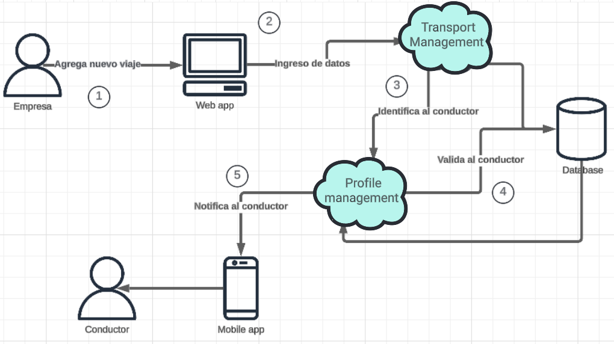
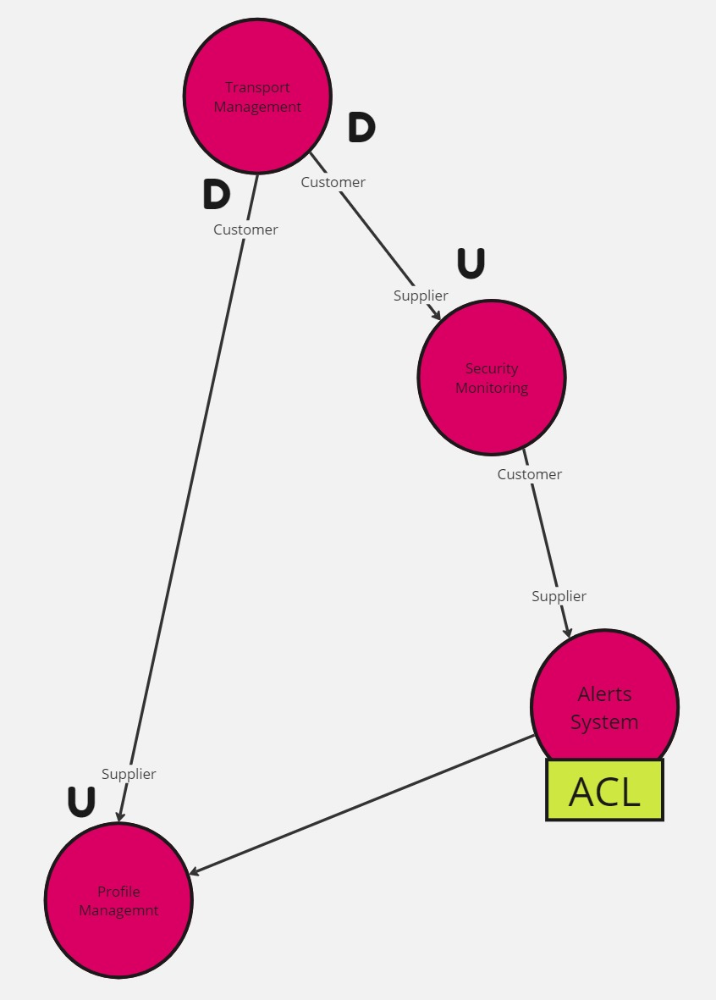
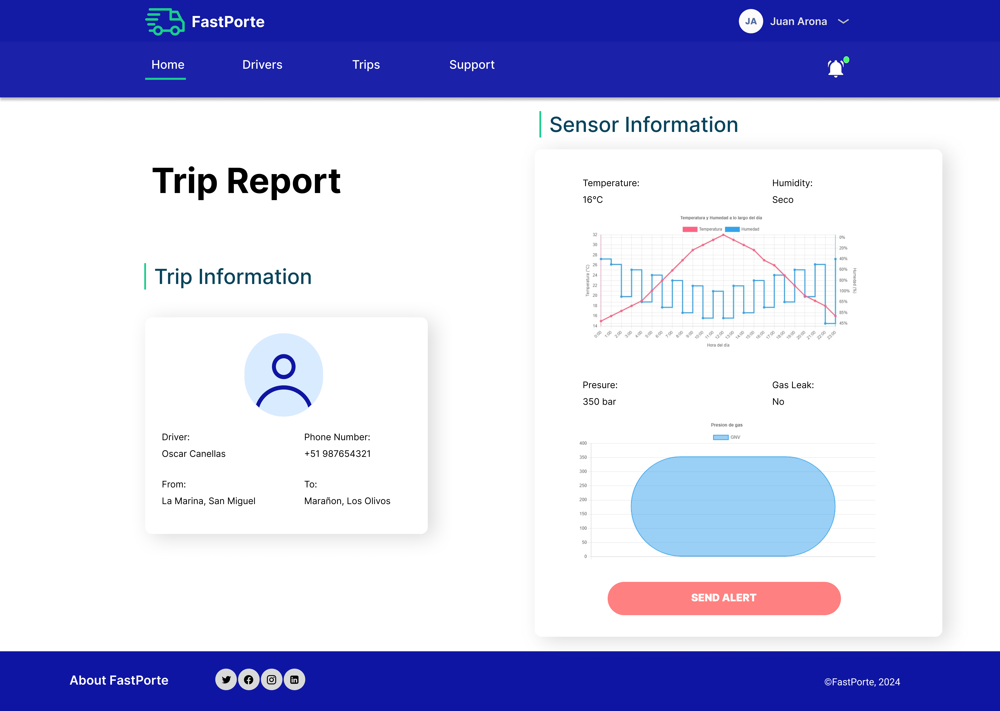
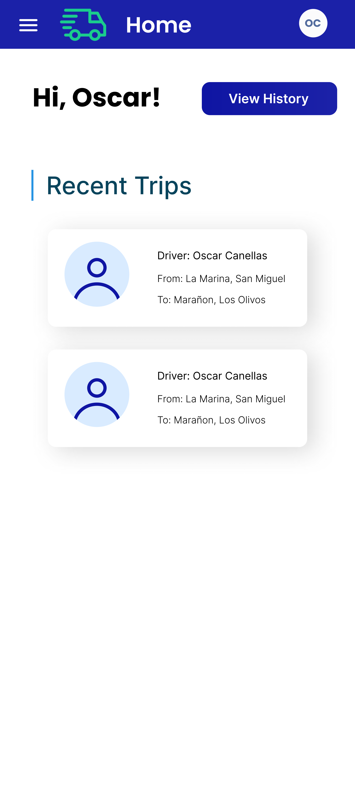
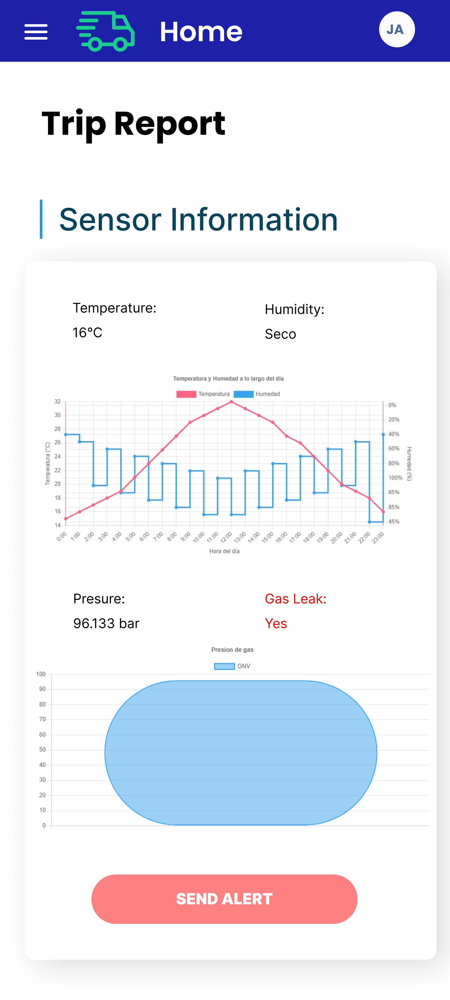
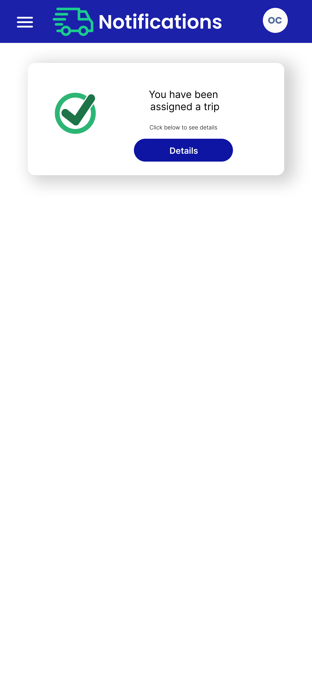
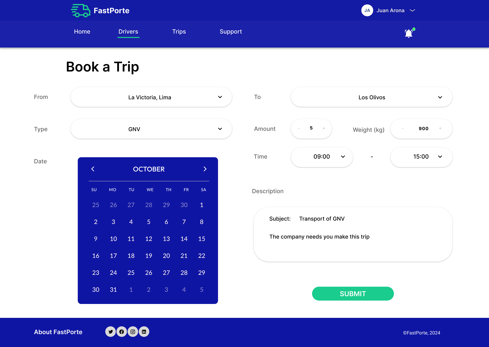
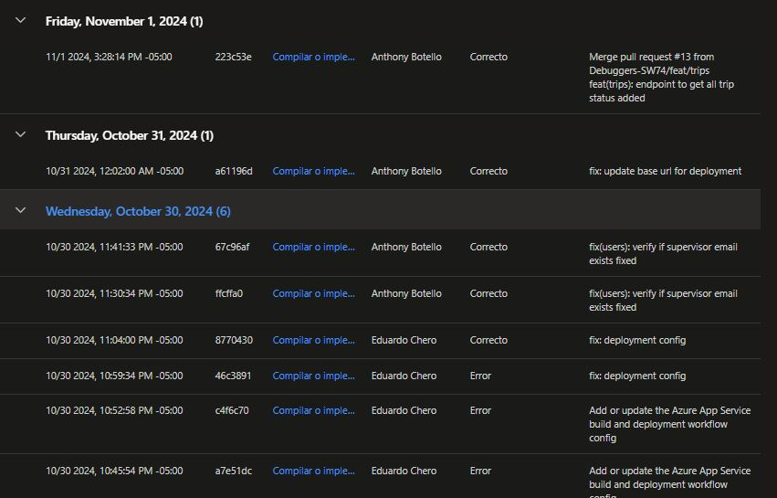
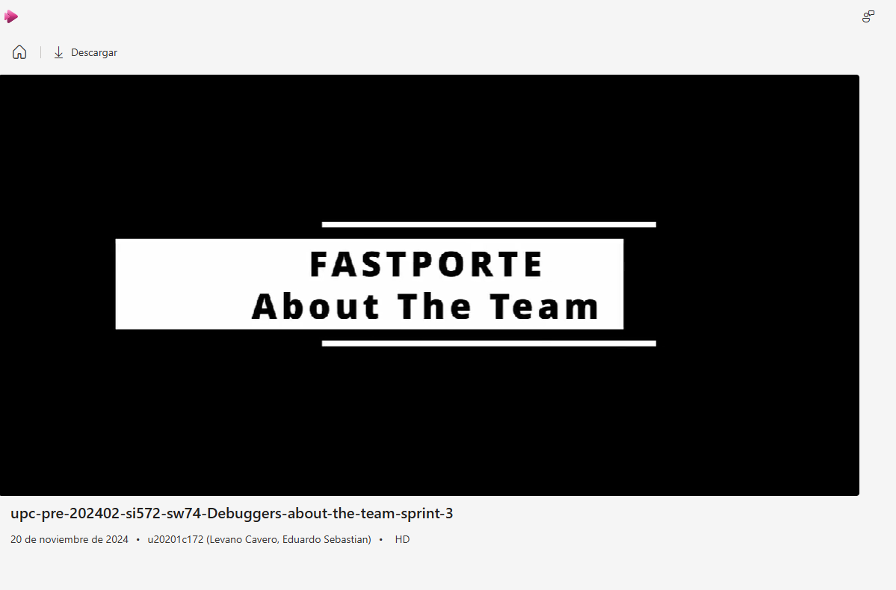

<h3 align="center"> Universidad Peruana de Ciencias Aplicadas</h3>
<h4 align="center"> Ingeniería de Sistemas y Computación | Ingeniería de Software  </h4>
<h4 align="center"> Desarrollo de Soluciones IOT </h4>
<h4 align="center"> Informe de Trabajo Final </h4>

### Startup: Debuggers
#### Team Members
- Arrunátegui Aguilar, Josué David 
- Botello Saldarriaga, Anthony Jean Pierre
- Lévano Cavero, Eduardo Sebastián
- Moreno Rosales, Claudio Jesús
#### Sección: SW74
#### Profesor: Angel Augusto Velasquez Nuñez
#### Producto: FastPorte
#### Ciclo: 2024-02
<h4 align="center"> Noviembre, 2024</h4>

___
# Registro de Versiones del Informe

| Versión | Fecha      | Autor                             | Descripción de modificación                                                  |
| ------- | ---------- | --------------------------------- | ---------------------------------------------------------------------------- |
| 1.0     | 22/08/2024 | Sebastián Lévano                  | Creación del archivo base en Markdown para el desarrollo del Final Project   |
| 1.1     | 01/08/2024 | Sebastián Lévano                  | Desarrollo del Capítulo 3                                                    |
| 1.2     | 26/08/2024 | Anthony Botello                   | Desarrollo del Capítulo 1                                                    |
| 1.3     | 01/09/2024 | Claudio Moreno                    | Desarrollo del Capítulo 2                                                    |
| 1.4     | 05/09/2024 | Eduardo Chero & Josue Arrunátegui | Desarrollo del Capítulo 4                                                    |
| 1.5     | 16/09/2024 | Sebastián Lévano                  | Actualización de índice, títulos y subtítulos para el Trabajo Parcial        |
| 1.6     | 19/09/2024 | Sebastián Lévano                  | Correcciones del Capítulo I y Outcomes                                       |
| 1.7     | 21/09/2024 | Anthony Botello                   | Correcciones del Capítulo I y Putcomes                                       |
| 1.8     | 21/09/2024 | Sebastián Lévano                  | Desarrollo del Capítulo 5: Landing Page UI Design                            |
| 1.9     | 22/09/2024 | Anthony Botello                   | Desarrollo del Capítulo 5: Applications UX/UI Design                         |
| 2.0     | 26/09/2024 | Claudio Moreno                    | Desarrollo del Capítulo 5: Information Architecture                          |
| 2.1     | 26/09/2024 | Josue Arrunategui                 | Desarrollo del Capítulo 6: Software Configuration Management                 |
| 2.2     | 26/09/2024 | Eduardo Chero                     | Desarrollo del Capítulo 6: Sprint 1                                          |
| 2.3     | 26/09/2024 | Sebastián Lévano                  | Outcomes, Conclussions & Insights                                            |
| 2.4     | 21/10/2024 | Sebastián Lévano                  | Actualización de índices, títulos y subtítulos para el TB2                   |
| 2.5     | 31/10/2024 | Sebastián Lévano                  | Outcomes, Conclussions, Insights y Execution Evidence for Sprint Review      |
| 3.0     | 14/10/2024 | Claudio Moreno                    | Desarrollo del Capítulo 6: Sprint Planning 2                                 |
| 3.1     | 31/10/2024 | Claudio Moreno                    | Desarrollo del Capítulo 6: Testing Suite Evidence for Sprint Review.         |
| 3.2     | 28/10/2024 | Eduardo Chero                     | Desarrollo del Capítulo 6: Sprint Backlog 2                                  |
| 3.3     | 28/10/2024 | Eduardo Chero                     | Desarrollo del Capítulo 6: Development Evidence for Sprint Review            |
| 3.4     | 28/10/2024 | Anthony Botello                   | Desarrollo del Capítulo 6: Services Documentation Evidence for Sprint Review |
| 3.5     | 28/10/2024 | Anthony Botello                   | Desarrollo del Capítulo 6: Software Deployment Evidence for Sprint Review    |
| 3.6     | 29/10/2024 | Josue Arrunategui                 | Desarrollo del Capítulo 6: Team Collaboration Insights during Sprint         |
| 3.6     | 29/10/2024 | Josue Arrunategui                 | Desarrollo del Capítulo 6: Diseño de Entrevistas                             |
| 3.6     | 29/10/2024 | Josue Arrunategui                 | Desarrollo del Capítulo 6: Registro de Entrevistas                           |
| 3.7     | 29/10/2024 | Sebastián Lévano                  | Desarrollo del Capítulo 6: Execution Evidence for Sprint Review              |
| 3.8     | 29/10/2024 | Sebastián Lévano                  | Actualización de índices, títulos y subtítulos para el TB2                   |
| 3.9     | 30/10/2024 | Sebastián Lévano                  | Outcomes, Conclussions, Insights y Execution Evidence for Sprint Review      |
| 4.0     | 01/11/2024 | Anthony Botello                   | Desarrollo del Capítulo 6: Services Documentation Evidence for Sprint Review |
| 4.1     | 01/11/2024 | Anthony Botello                   | Desarrollo del Capítulo 6: Software  Deployment Evidence for Sprint Review   |
| 4.2     | 13/11/2024 | Sebastián Lévano                  | Actualización de índices, títulos y subtítulos para el TF                    |
| 5.0     | 14/11/2024 | Claudio Moreno                    | Desarrollo del Capítulo 6: Sprint Planning 3                                 |
| 5.1     | 14/11/2024 | Claudio Moreno                    | Desarrollo del Capítulo 6: Testing Suite Evidence for Sprint Review.         |
| 5.2     | 14/11/2024 | Claudio Moreno                    | Desarrollo del Capítulo 6: Sprint Backlog 3                                  |
| 5.3     | 16/11/2024 | Anthony Botello                   | Desarrollo del Capítulo 6: Development Evidence for Sprint Review            |
| 5.4     | 17/11/2024 | Anthony Botello                   | Desarrollo del Capítulo 6: Services Documentation Evidence for Sprint Review |
| 5.5     | 18/11/2024 | Anthony Botello                   | Desarrollo del Capítulo 6: Software Deployment Evidence for Sprint Review    |
| 5.6     | 18/11/2024 | Sebastián Lévano                  | Desarrollo del Capítulo 6: Team Collaboration Insights during Sprint         |
| 5.7     | 19/11/2024 | Sebastián Lévano                  | Desarrollo del Capítulo 6: Execution Evidence for Sprint Review              |
| 5.8     | 19/11/2024 | Sebastián Lévano                  | Actualización de índices, títulos y subtítulos para el EB                    |
| 5.9     | 19/11/2024 | Sebastián Lévano                  | Outcomes, Conclussions, Insights y Execution Evidence for Sprint Review      |
---

# Project Report Collaboration Insights

- Link del repositorio Github: [Github](https://github.com/orgs/Debuggers-SW74) / [https://github.com/Debuggers-SW74/final-report](https://github.com/Debuggers-SW74/final-report)


**Desarrollo de las actividades del informe:**

- TB1: Se desarrollaron los capítulos I, II, III y IV, donde cada miembro se encargo en el avance de uno de estos capítulos en el repositorio de GitHub, empleando Gitflow. A continuación, la evidencia de los commits realizados:


Durante la realización de la entrega TB1 se abordaron los cuatro primeros capítulos. Se brindo la introducción del proyecto, explicando a detalle la Startup y cuál será la problemática que se abordará apoyándose del Lean UX Process en el capítulo I. Asimismo, cuál es la solución propuesta y cómo está resulta adecuada. La validación de la propuesta de solución se realizó mediante el análisis de los requisitos en el capítulo II. Durante este capítulo se llevaron a cabo artefactos importantes como el análisis competitivo y las entrevistas a los segmentos objetivos contemplados para corroborar las suposiciones e hipótesis planteadas en el capítulo anterior. Posteriormente, por medio del capítulo III se definió las características de la aplicación su priorización el desarrollo ejecutando el Product Backlog y sus Historias de Usuario relacionadas. Finalmente en el capítulo IV se diseñaron los diagramas de arquitecturas necesarios para la aplicación basados en el desarrollo previo de los Bounded Context.

- TP: Se desarrollaron los capítulos V y VI, en el cual para el capítulo VI se llevo a cabo la ejecución de los aspectos necesarios para cumplir con el Sprint 1. Este Sprint involucra el desarrollo de la página de aterrizaje, *Landing Page* y la primera versión del *Web Application*.


La presenta entrega cubrió el cumplimiento de los capítulos V y VI del informe. A lo largo del quinto capítulo se definieron las guías de estilo que se aplicarán en la realización de las soluciones de software propuestas por la Startup. Asimismo,  se diseño la estructura y organización del contenido de la aplicación web FastPorte para facilitar su acceso y comprensión por parte de los usuarios. También se diseño el Landing Page, el contenido que presentará y el aspecto que tendrá por medio de los wireframes y mock-ups. De igual manera para la aplicación web, aunque detallando el flujo que seguirá cada una de sus funcionalidades y características. Por otro lado, se empezó con el desarrollo de software siguiendo los elementos contemplados para el primer Sprint, designado para completar el Landing Page y presentar una primera versión de la aplicación web.

- TB2: Se continuo con el desarrollo del capítulo VI, en el cual se abordo el desarrollo del Sprint 2 y la realización de las entrevistas de validación sobre los productos de software implementados. Este Sprint involucra la actualización de la página de aterrizaje, *Landing Page*, la segunda versión del *Web Application*, la primera versión del *Mobile Application* y el despliegue del *Backend*.

La entrega sirvió para continuar con el desarrollo de los productos de software que se presentarán, tales como el Mobile Application, Web Application y la actualización de la Landing Page. Se cubrió el segundo Sprint encargado de realizar la segunda versión del Web Application, la primera versión del Mobile Application y el avance del Embedded Application. Además, se desarrollaron las entrevistas de validación para conocer la opinión de nuestros usuarios sobre los productos de software desarrollados y si estos se pueden mejorar o que complicaciones presentan actualmente. Posteriormente, se realizaron las heurísticas sobre dichos comentarios para subsanar las observaciones obtenidas e nuestros segmentos objetivo.

- TF: Se continuo con el desarrollo del capítulo VI, en el cual se abordo el desarrollo del Sprint 3 finalizando los productos de software. Este Sprint involucra la actualización final de la página de aterrizaje, *Landing Page*, la versión final del *Web Application*, la versión final del *Mobile Application* y pequeñas correcciones en el *Backend*.


---
# Contenido 
- [Student Outcome](#student-outcome)
- [Capítulo I: Introducción](#capítulo-i-introducción)
  - [1.1. Startup Profile](#11-startup-profile)
    - [1.1.1. Descripción de la Startup](#111-descripción-de-la-startup)
    - [1.1.2. Perfiles de integrantes del equipo](#112-perfiles-de-integrantes-del-equipo)
  - [1.2. Solution Profile](#12-solution-profile)
    - [1.2.1 Antecedentes y problemática](#121-antecedentes-y-problemática)
    - [1.2.2 Lean UX Process](#122-lean-ux-process)
      - [1.2.2.1. Lean UX Problem Statements](#1221-lean-ux-problem-statements)
      - [1.2.2.2. Lean UX Assumptions](#1222-lean-ux-assumptions)
      - [1.2.2.3. Lean UX Hypothesis Statements](#1223-lean-ux-hypothesis-statements)
      - [1.2.2.4. Lean UX Canvas](#1224-lean-ux-canvas)
  - [1.3. Segmentos objetivo](#13-segmentos-objetivo)
- [Capítulo II: Requirements Elicitation \& Analysis](#capítulo-ii-requirements-elicitation--analysis)
  - [2.1. Competidores](#21-competidores)
    - [2.1.1. Análisis competitivo](#211-análisis-competitivo)
    - [2.1.2. Estrategias y tácticas frente a competidores](#212-estrategias-y-tácticas-frente-a-competidores)
  - [2.2. Entrevistas](#22-entrevistas)
    - [2.2.1. Diseño de entrevistas](#221-diseño-de-entrevistas)
    - [2.2.2. Registro de entrevistas](#222-registro-de-entrevistas)
    - [2.2.3. Análisis de entrevistas](#223-análisis-de-entrevistas)
  - [2.3. Needfinding](#23-needfinding)
    - [2.3.1. User Personas](#231-user-personas)
    - [2.3.2. User Task Matrix](#232-user-task-matrix)
    - [2.3.3. Empathy Mapping](#233-empathy-mapping)
    - [2.3.4. As-is Scenario Mapping](#234-as-is-scenario-mapping)
  - [2.4. Ubiquitous Language](#24-ubiquitous-language)
- [Capítulo III: Requirements Specification](#capítulo-iii-requirements-specification)
  - [3.1. To-Be Scenario Mapping](#31-to-be-scenario-mapping)
  - [3.2. User Stories](#32-user-stories)
  - [3.3. Impact Mapping](#33-impact-mapping)
  - [3.4. Product Backlog](#34-product-backlog)
- [Capítulo IV: Solution Software Design](#capítulo-iv-solution-software-design)
  - [4.1. Strategic-Level Domain-Driven Design](#41-strategic-level-domain-driven-design)
    - [4.1.1. EventStorming](#411-eventstorming)
      - [4.1.1.1 Candidate Context Discovery](#4111-candidate-context-discovery)
      - [4.1.1.2.  Domain Message Flows Modeling](#4112-domain-message-flows-modeling)
      - [4.1.1.3. Bounded Context Canvases](#4113-bounded-context-canvases)
    - [4.1.2. Context Mapping](#412-context-mapping)
    - [4.1.3. Software Architecture](#413-software-architecture)
      - [4.1.3.1. Software Architecture System Landscape Diagram](#4131-software-architecture-system-landscape-diagram)
      - [4.1.3.2. Software Architecture Context Level Diagrams](#4132-software-architecture-context-level-diagrams)
      - [4.1.3.3. Software Architecture Container Level Diagrams](#4133-software-architecture-container-level-diagrams)
      - [4.1.3.4. Software Architecture Deployment Diagrams](#4134-software-architecture-deployment-diagrams)
  - [4.2. Tactical-Level Domain-Driven Design](#42-tactical-level-domain-driven-design)
- [Capítulo V: Solution UI/UX Design](#capítulo-v-solution-ux-ui)
  - [5.1. Style Guidelines](#51-style-guidelines)
    - [5.1.1. General Style Guidelines](#511-general-style-guidelines)
    - [5.1.2. Web, Mobile and IoT Style Guidelines](#512-web-mobile-and-iot-style-guiledines)
  - [5.2. Information Architecture](#52-information-architecture)
    - [5.2.1. Organization Systems](#521-organization-systems)
    - [5.2.2. Labeling Systems](#522-labeling-systems)
    - [5.2.3. SEO Tags and Meta Tags](#523-seo-tags-and-meta-tags)
    - [5.2.4. Searching Systems](#524-searching-systems)
    - [5.2.5. Navigation Systems](#525-navigation-systems)
  - [5.3. Landing Page UI Design](#53-landing-page-ui-design)
    - [5.3.1. Landing Page Wireframe](#531-landing-page-wireframe)
    - [5.3.2. Labeling Page Mock-up](#532-landing-page-mock-up)
  - [5.4. Application UX/UI Design](#54-application-ux-ui-design)
    - [5.4.1. Applications Wireframes](#541-applications-wireframes)
    - [5.4.2. Applications Wireflow Diagrams](#542-applications-wireflow-diagrams)
    - [5.4.3. Applications Mock-ups](#543-applications-mock-ups)
    - [5.4.4. Applications User Flow Diagrams](#544-applications-user-flow-diagrams)
  - [5.5. Applications Prototyping](#55-applications-prototyping)
- [Capítulo VI: Product Implementation, Validation & Deployment](#capítulo-vi-product-implementation-validation-deployment)
  - [6.1. Software Configuration Management](#61-software-configuration-management)
    - [6.1.1. Software Development Environment Configuration](#611-software-development-environment-configuration)
    - [6.1.2. Source Code Management](#612-source-code-management)
    - [6.1.3. Source Code Style Guide & Conventions](#613-source-code-style-guide-conventions)
    - [6.1.4. Software Deployment Configuration](#614-software-deployment-configuration)
  - [6.2. Landing Page, Services & Applications Implementation](#62-landing-page-services-applications-implementation)
    - [6.2.1. Sprint 1](#621-sprint-1)
      - [6.2.1.1. Sprint Planning 1](#6211-sprint-planning-1)
      - [6.2.1.2. Sprint Backlog 1](#6212-sprint-backlog-1)
      - [6.2.1.3. Development Evidence for Sprint Review](#6213-development-evidence-for-sprint-review)
      - [6.2.1.4. Testing Suite Evidence for Sprint Review](#6214-testing-suite-evidence-for-sprint-review)
      - [6.2.1.5. Execution Evidence for Sprint Review](#6215-execution-evidence-for-sprint-review)
      - [6.2.1.6. Services Documentation Evidence for Sprint Review](#6216-services-documentation-evidence-for-sprint-review)
      - [6.2.1.7. Software Deployment Evidence for Sprint Review](#6217-software-deployment-evidence-for-sprint-review)
      - [6.2.1.8. Team Collaboration Insights during Sprint](#6218-team-collaboration-insights-during-sprint)
      - [6.2. Landing Page, Services & Applications Implementation](#62-landing-page-services-applications-implementation)
    - [6.2.2. Sprint 2](#622-sprint-2)
      - [6.2.2.1. Sprint Planning 2](#6221-sprint-planning-2)
      - [6.2.2.2. Sprint Backlog 2](#6222-sprint-backlog-2)
      - [6.2.2.3. Development Evidence for Sprint Review](#6223-development-evidence-for-sprint-review)
      - [6.2.2.4. Testing Suite Evidence for Sprint Review](#6224-testing-suite-evidence-for-sprint-review)
      - [6.2.2.5. Execution Evidence for Sprint Review](#6225-execution-evidence-for-sprint-review)
      - [6.2.2.6. Services Documentation Evidence for Sprint Review](#6226-services-documentation-evidence-for-sprint-review)
      - [6.2.2.7. Software Deployment Evidence for Sprint Review](#6227-software-deployment-evidence-for-sprint-review)
      - [6.2.2.8. Team Collaboration Insights during Sprint](#6228-team-collaboration-insights-during-sprint)
    - [6.2.3. Sprint 3](#623-sprint-3)
      - [6.2.3.1. Sprint Planning 3](#6231-sprint-planning-3)
      - [6.2.3.2. Sprint Backlog 3](#6232-sprint-backlog-3)
      - [6.2.3.3. Development Evidence for Sprint Review](#6233-development-evidence-for-sprint-review)
      - [6.2.3.4. Testing Suite Evidence for Sprint Review](#6234-testing-suite-evidence-for-sprint-review)
      - [6.2.3.5. Execution Evidence for Sprint Review](#6235-execution-evidence-for-sprint-review)
      - [6.2.3.6. Services Documentation Evidence for Sprint Review](#6236-services-documentation-evidence-for-sprint-review)
      - [6.2.3.7. Software Deployment Evidence for Sprint Review](#6237-software-deployment-evidence-for-sprint-review)
      - [6.2.3.8. Team Collaboration Insights during Sprint](#6238-team-collaboration-insights-during-sprint)
  - [6.3. Validation Interviews](#63-validation-interviews)
    - [6.3.1. Diseño de Entrevistas](#631-diseño-de-entrevistas)
    - [6.3.2. Registro de Entrevistas](#632-registro-de-entrevistas)
    - [6.3.3. Evaluaciones según heurísticas](#633-evaluaciones-según-heurísticas)
  - [6.4. Video About-the-Product](#64-video-about-the-product)

---

# Student Outcome

| Criterio Específico                                                                             | Acciones Realizadas                                                                                                                                                                                                                                                                                                                                                                                                                                                                                                                                                                                                                                                                                                                                                                                                                                                                                                                                                                                                                                                                                                                                                                                                                                                                                                                                                                                                                                                                                                                                                                                                                                                                                                                                                                                                                                                                                                                                                                                                                                                                                                                                                                                                                                                                                                                                                                                                                                                                                                                                                                                                                                                                                                                                                                                                                                                                                                                                                                                                                                                                                                                                                                                                                                                                                                                                                                                                                                                                                                                                                                                                                                                                                                                                                                                                                                                                                                                                                                                                                                                                                                                                                                                                                                                                                                                                                                                                                                                                                                                                                                                                                                                                                                                                                                                                                                                                                                                                                                                                                                                                                                                                                                                                                                                                                                                                                                                                                                                                                                                                                                                                                                                                                                                                                                                                                                                                                                                                                                                                                                                                                                                                                                                                                                                                                                                                                                                                                                                                                                                                                                                                                                                                                                                                                                                                                                                                                                                                                                                                                                                                                                                                                                                                                                                                                                                                                                                                                                                                                                                                                                                                                                                                                                                                                                                                                                                                                                                                                                                                                                                                                                                                                                                                                                                                                   | Conclusiones                                                                                                                                                                                                                                                                                                                                                                                                                                                                                                                                                                                                                                                                                                                                                                                                                                                                                                                                                                                                                                                                                                                                                                                                                                                                                                                                                                                                                                                                                                                                                                                                                                                                                                                                                                                                                                                                                                                                                                                                                                                                                                                                                                                                                                                                                                                                                                                                                                                                                                                                                                                                                                                                       |
| ----------------------------------------------------------------------------------------------- | ----------------------------------------------------------------------------------------------------------------------------------------------------------------------------------------------------------------------------------------------------------------------------------------------------------------------------------------------------------------------------------------------------------------------------------------------------------------------------------------------------------------------------------------------------------------------------------------------------------------------------------------------------------------------------------------------------------------------------------------------------------------------------------------------------------------------------------------------------------------------------------------------------------------------------------------------------------------------------------------------------------------------------------------------------------------------------------------------------------------------------------------------------------------------------------------------------------------------------------------------------------------------------------------------------------------------------------------------------------------------------------------------------------------------------------------------------------------------------------------------------------------------------------------------------------------------------------------------------------------------------------------------------------------------------------------------------------------------------------------------------------------------------------------------------------------------------------------------------------------------------------------------------------------------------------------------------------------------------------------------------------------------------------------------------------------------------------------------------------------------------------------------------------------------------------------------------------------------------------------------------------------------------------------------------------------------------------------------------------------------------------------------------------------------------------------------------------------------------------------------------------------------------------------------------------------------------------------------------------------------------------------------------------------------------------------------------------------------------------------------------------------------------------------------------------------------------------------------------------------------------------------------------------------------------------------------------------------------------------------------------------------------------------------------------------------------------------------------------------------------------------------------------------------------------------------------------------------------------------------------------------------------------------------------------------------------------------------------------------------------------------------------------------------------------------------------------------------------------------------------------------------------------------------------------------------------------------------------------------------------------------------------------------------------------------------------------------------------------------------------------------------------------------------------------------------------------------------------------------------------------------------------------------------------------------------------------------------------------------------------------------------------------------------------------------------------------------------------------------------------------------------------------------------------------------------------------------------------------------------------------------------------------------------------------------------------------------------------------------------------------------------------------------------------------------------------------------------------------------------------------------------------------------------------------------------------------------------------------------------------------------------------------------------------------------------------------------------------------------------------------------------------------------------------------------------------------------------------------------------------------------------------------------------------------------------------------------------------------------------------------------------------------------------------------------------------------------------------------------------------------------------------------------------------------------------------------------------------------------------------------------------------------------------------------------------------------------------------------------------------------------------------------------------------------------------------------------------------------------------------------------------------------------------------------------------------------------------------------------------------------------------------------------------------------------------------------------------------------------------------------------------------------------------------------------------------------------------------------------------------------------------------------------------------------------------------------------------------------------------------------------------------------------------------------------------------------------------------------------------------------------------------------------------------------------------------------------------------------------------------------------------------------------------------------------------------------------------------------------------------------------------------------------------------------------------------------------------------------------------------------------------------------------------------------------------------------------------------------------------------------------------------------------------------------------------------------------------------------------------------------------------------------------------------------------------------------------------------------------------------------------------------------------------------------------------------------------------------------------------------------------------------------------------------------------------------------------------------------------------------------------------------------------------------------------------------------------------------------------------------------------------------------------------------------------------------------------------------------------------------------------------------------------------------------------------------------------------------------------------------------------------------------------------------------------------------------------------------------------------------------------------------------------------------------------------------------------------------------------------------------------------------------------------------------------------------------------------------------------------------------------------------------------------------------------------------------------------------------------------------------------------------------------------------------------------------------------------------------------------------------------------------------------------------------------------------------------------------------------------------------------------------------------------------------- | ---------------------------------------------------------------------------------------------------------------------------------------------------------------------------------------------------------------------------------------------------------------------------------------------------------------------------------------------------------------------------------------------------------------------------------------------------------------------------------------------------------------------------------------------------------------------------------------------------------------------------------------------------------------------------------------------------------------------------------------------------------------------------------------------------------------------------------------------------------------------------------------------------------------------------------------------------------------------------------------------------------------------------------------------------------------------------------------------------------------------------------------------------------------------------------------------------------------------------------------------------------------------------------------------------------------------------------------------------------------------------------------------------------------------------------------------------------------------------------------------------------------------------------------------------------------------------------------------------------------------------------------------------------------------------------------------------------------------------------------------------------------------------------------------------------------------------------------------------------------------------------------------------------------------------------------------------------------------------------------------------------------------------------------------------------------------------------------------------------------------------------------------------------------------------------------------------------------------------------------------------------------------------------------------------------------------------------------------------------------------------------------------------------------------------------------------------------------------------------------------------------------------------------------------------------------------------------------------------------------------------------------------------------------------------------- |
| Trabaja en equipo para proporcionar liderazgo en forma conjunta.                                | *Eduardo Sebastián Lévano Cavero*<br>**TB1:**<br>A través de la realización de los To Be Scenario Mapping y User Stories, lideré la definición de escenarios futuros y necesidades del usuario, respectivamente, lo que permitió al equipo visualizar y priorizar funcionalidades clave. Mediante el Impact Mapping, pudimos establecer en conjunto relaciones claras entre los objetivos estratégicos y las características del producto, garantizando un enfoque alineado con las metas organizacionales. Finalmente, en el Product Backlog, se gestionaron las tareas de manera colaborativa, facilitando una planificación y ejecución eficientes que reflejan las prioridades acordadas en equipo.<br>**TP:**<br>Para el desarrollo del wireframe y el mock-up de la Landing Page, adoptamos un enfoque compartido donde participé activamente en la conceptualización, diseño y revisión, asegurando que las decisiones fueran tomadas de manera colectiva y reflejaran las necesidades del proyecto. Del mismo modo, en la creación de los wireframes y mock-ups de las aplicaciones, trabajé en equipo para definir las características clave y su representación visual, asegurando que cada etapa del proceso fuera gestionada con una visión conjunta, promoviendo un liderazgo colaborativo para garantizar la calidad y coherencia de los entregables.<br>**TB2** <br>Junto a mis compañeros de equipo llevamos a cabo el desarrollo de los productos de software que ofreceremos a nuestros segmentos objetivo. Dividiendo el trabajo de cada programa para avanzar con mayor rapidez y eficacia. Además, reuniéndonos para poder corroborar los avances realizados, comentar alguna posible complicación presentada y conocer el estado del proyecto en general. Asimismo, dedicamos tiempo a realizar las entrevistas y analizarlas en conjunto con el fin de mejorar nuestras aplicaciones. <br><br>*Anthony Botello Saldarriaga* <br>**TB1:**<br>En el presente proyecto, colaboré activamente en el liderazgo conjunto del equipo. Contribuí en la definición del startup y solution profile, y participé en la creación de los Lean UX Problem Statements y su análisis. Además, apoyé en la elaboración del Lean UX Canvas, tomando decisiones clave en conjunto con el equipo para asegurar un desarrollo efectivo y alineado con los objetivos del proyecto.<br>**TP:**<br>Durante el desarrollo de los prototipos y flujos de usuario para la aplicación FastPorte, se trabajó en equipo para asegurar un liderazgo conjunto, donde se tomaron decisiones colaborativas que integraron las necesidades de los diferentes usuarios. A través de la planificación de tareas como la creación de wireflows y prototipos, cada miembro del equipo asumió un rol de liderazgo en distintas áreas y se garantizó que se cumplieran los objetivos de manera eficaz, y asegurando que la plataforma reflejara las expectativas de los usuarios involucrados.<br>**TB2**<br>En este sprint, trabajé con el equipo de manera coordinada para cumplir con los objetivos establecidos. Cada miembro asumió un rol de liderazgo en diferentes tareas clave, como el despliegue de servicios, la documentación de endpoints y la implementación de mejoras basadas en el feedback del primer sprint. Se realizaron reuniones de seguimiento en las que se discutieron avances y se resolvieron problemas de manera conjunta, permitiendo que todos contribuyeran en la toma de decisiones. Este enfoque compartido de liderazgo ayudó a optimizar el tiempo y a asegurar que las entregas del sprint fueran completadas.<br>**TF:**<br>En este sprint final del curso, colaboré con el equipo de forma efectiva para asegurar el éxito de los últimos despliegues y cerrar el proyecto con calidad. Nos organizamos para que cada miembro asumiera un rol de liderazgo en momentos clave, como la preparación y revisión de los despliegues, la validación de la integración entre servicios y la actualización de la documentación final. Tuvimos reuniones de seguimiento donde compartimos responsabilidades, discutimos problemas y tomamos decisiones importantes de manera conjunta, garantizando que el proceso fuera eficiente y alineado con los objetivos del proyecto. Este liderazgo colaborativo fue crucial para cumplir con las entregas finales y lograr un cierre exitoso del sprint.<br><br><br>*Eduardo André Chero Emé*<br>**TB1:**<br>El desarrollo del event Storming nos ayudó para tener una visualizacion más definida de nuestros bounded context para una mejor implementación en el código. Clasificar los escenarios mediante el modelado de Message flows y generar los Bounded Context Canvas nos brindan un mejor entendimiento de las variables, conexiones y propisitos de los bounded context que impementamos. Por ultimo el desarrollo del diseño de la arquitectura de software en C4 para una mejor ejemplificacion de como va a realizarce nuestras conexiones de los respectivos servicios.<br>**TP:**<br>Para el desarrollo del despliegue de la aplicación web y la creacion de la base de datos que servira como APIfake para el desarrollo del primer Sprint coordinamos como deberiamos desplegarlas, propuse los servcios de Firebase para una mejor integración con Angular, y me encargue de la elaboracion de la seccion de Sprint1<br>**TB2**<br><br>*Claudio Jesús Moreno Rosales*<br>**TB1:**<br>Para realizar y encontrar los requisitos de los segmentos objetivos se tuvo que realizar cada parte con los miembros del equipo para establecer cuales son los requisitos encontrados, como se debería ver los User Persona, User Journey Map, entre otros para entender y empatizar a profundidad con los usuarios.<br>**TP:**<br>Se trabajó de forma conjunta con el equipo para lograr un buen diseño, navegación, búsqueda y propotipos de todas las soluciones, esto ha permitido que sea más sencillo de realizar los avances de desarrollo.<br>**TB2**<br>Trabajamos en equipo desarrollando los productos digitales de Fastporte que son la Landing Page, Web App, Mobile App, Cloud API, Edge API y IoT Embedded App y teniendo participación en todo desde la comunicación hasta ayudar en el desarrollo, corrección de errores e ir cumpliendo metas en los plazos establecidos.<br>**TF**<br>Trabajamos en equipo mejorando los productos digitales de Fastporte y he tenido participación en deversas secciones del trabajo desde la comunicación hasta ayudar en el desarrollo, corrección de errores e ir cumpliendo metas en los plazos establecidos del Sprint 3.<br><br>*Josue David Arrunategui Aguilar*<br>**TB1:**<br>En el desarrollo del proyecto, asumí un papel clave en el diseño y la implementación de los bounded contexts de Usuario, Viaje y Sensor. Mi enfoque incluyó la definición precisa de cada contexto para garantizar una integración efectiva en el sistema.<br>**TP**<br>En el proyecto, trabajé activamente en la gestión y configuración del entorno de desarrollo mediante la implementación de prácticas clave en Software Configuration Management. Mi participación incluyó la configuración y ajuste del entorno de desarrollo, asegurando que todas las herramientas y procesos utilizados estuvieran alineados para garantizar un flujo de trabajo eficiente. Además, implementé mejoras en la estructura de los bounded contexts, lo que permitió una mayor consistencia y claridad en la configuración del entorno. Esta gestión integral contribuyó a optimizar las etapas de desarrollo y a prevenir problemas relacionados con la integración de los componentes del sistema.<br>**TB2: **Junto a mi equipo, trabajamos en el desarrollo de productos de software para nuestros segmentos objetivo, asignando tareas específicas para optimizar el avance. Realizábamos reuniones frecuentes para evaluar el progreso, resolver problemas y mantener una visión clara del estado del proyecto. Además, realizamos y analizamos entrevistas que nos ayudaron a perfeccionar nuestras aplicaciones, asegurándonos de que respondieran a las necesidades reales de los usuarios. Este enfoque colaborativo y centrado en el cliente fue clave para el éxito de nuestro proyecto. | *TB1*<br>La presente entrega permitió validar que la solución propuesta es adecuada para los segmentos objetivo, gracias al liderazgo colaborativo ejercido durante las entrevistas y el análisis de estas. Se trabajo en conjunto para asegurar que todas las perspectivas fueran consideradas en cada etapa, desde el desarrollo de la Introducción hasta la estructuración de la arquitectura utilizando C4. Este enfoque conjunto en la toma de decisiones y el liderazgo compartido permitió que cada fase del proyecto fuera abordada de manera coherente, asegurando que las metas se alinearan con las necesidades del proyecto y se tomaran en cuenta las aportaciones de todo el equipo.<br><br>*TP*<br>En equipo, se diseñó la plataforma web y el Landing Page, empleando Figma. Trabajar estas secciones de manera conjunta nos permitió definir los elementos que contendrá la plataforma y cómo funcionará. Además, pudimos elegir una guía de estilos adecuada con la que todos estuvieran satisfechos. Por otro lado, cada miembro asumió el rol de líder durante el desarrollo de cada componente de software y la planificación y ejecución del primer Sprint.<br><br>*TB2*<br>El grupo llevó a cabo el desarrollo del segundo Sprint enfocado en brindar la primera versión de la aplicación móvil, la segunda de la aplicación web y la mejora de la Landing Page. Se designo tareas a cada integrante que luego se revisaron en conjunto para llevar un registro del avance realizado por cada integrante. Además, el trabajo colaborativo realizado permitió resolver múltiples complicaciones y problemas presentados durante el desarrollo.<br><br>_TF_<br>En esta entrega final, se demuestra cómo el liderazgo conjunto y el trabajo en equipo fueron esenciales para el éxito del proyecto. Cada integrante asumió roles estratégicos en momentos clave, aportando sus habilidades y colaborando en la planificación, diseño, desarrollo y validación del producto. A lo largo de los sprints, el equipo mantuvo una comunicación constante, resolviendo desafíos de manera colectiva y asegurando que cada decisión estuviera alineada con los objetivos establecidos y las necesidades del segmento objetivo. El enfoque de liderazgo compartido no solo permitió optimizar el tiempo y los recursos, sino que también garantizó la calidad y coherencia de los entregables. Este proyecto refleja el poder del trabajo colaborativo, destacando la importancia de coordinar esfuerzos para alcanzar metas comunes y cerrar con éxito cada etapa, logrando un producto final que cumple con los estándares esperados y las expectativas del usuario. |
| Crea un entorno colaborativo e inclusivo, establece metas, planifica tareas y cumple objetivos. | *Eduardo Sebastián Lévano Cavero*<br>**TB1:**<br>Por medio de los To Be Scenario Mapping y las User Stories, identificamos y documentamos las necesidades y expectativas de los usuarios, aseguramos que todas las voces fueran escuchadas y consideradas. Mediante el Impact Mapping, en grupo alineamos las metas estratégicas con las funcionalidades del producto, permitiendo una planificación clara y enfocada. En el Product Backlog, priorizamos y planificamos las tareas de forma conjunta, lo que facilitó el cumplimiento de los objetivos establecidos dentro de un marco de trabajo inclusivo y bien organizado.<br>**TP:**<br>Durante el desarrollo del wireframe y el mock-up de la Landing Page, colaboré con el equipo para establecer metas claras y asegurar que todos los puntos de vista fueran escuchados, lo que permitió que las decisiones reflejaran las necesidades del proyecto de manera equitativa. De igual manera, en la creación de los wireframes y mock-ups de las aplicaciones, planifiqué junto al equipo las tareas necesarias, asignando responsabilidades y asegurando que cada objetivo se cumpliera dentro de los plazos establecidos, siempre manteniendo un ambiente de trabajo inclusivo y alineado con las metas acordadas.<br>**TB2**<br>Se colaboró en el desarrollo de los avances de las aplicaciones, siguiendo los objetivos planteados en el Sprint y cumpliendo con cada una de las tareas designadas en las reuniones realizadas. La comunicación fue un punto clave durante la realización del presente Sprint para mantenernos informados del estado de las aplicaciones desarrolladas y los apartados que faltaban completarse.<br><br>*Anthony Botello Saldarriaga* <br>**TB1:**<br>En el desarrollo, fomenté un entorno colaborativo e inclusivo asegurando que todas las ideas fueran escuchadas y valoradas. Participé en la definición de metas claras para el proyecto, colaborando en la planificación de tareas específicas como el desarrollo de los diferentes puntos del informe. Además, me aseguré de que los plazos y objetivos se cumplieran de manera eficiente, distribuyendo responsabilidades entre los miembros del equipo.<br>**TP:**<br>Durante el desarrollo de los prototipos, wireflows y user flows para la aplicación FastPorte, se fomentó un entorno colaborativo al integrar las necesidades de distintos usuarios, estableciendo metas claras para que ellos puedan cumplirlas. Planificamos tareas detalladas, como la creación de wireflows y prototipos de UI, lo que permitió cumplir con los objetivos de mejorar la experiencia del usuario de manera inclusiva y eficiente.<br>**TB2**<br>En el presente sprint, el equipo se enfocó en crear un entorno de trabajo colaborativo e inclusivo, promoviendo la participación activa de todos los integrantes. Establecimos metas claras desde el inicio del sprint, priorizando las tareas de despliegue, documentación y pruebas de funcionalidades. Cada miembro asumió responsabilidades específicas y se planificaron las tareas de manera equitativa, asegurando que cada uno pudiera aportar desde sus fortalezas. Gracias a una planificación efectiva y a una comunicación constante, logramos cumplir con los objetivos del sprint dentro del tiempo estimado, manteniendo un flujo de trabajo eficiente y alineado con las metas del proyecto.<br>**TF:**<br>Durante este sprint, nos enfocamos en fomentar un ambiente de trabajo donde todos los miembros se sintieran valorados y pudieran colaborar plenamente. Desde el principio, definimos metas específicas y detalladas, organizando las tareas de forma estratégica para abordar las prioridades, como los despliegues finales, la actualización de la documentación y la ejecución de pruebas. Cada integrante del equipo tomó parte activa en la planificación, asignándose responsabilidades según sus habilidades y asegurando una distribución balanceada de las tareas. La comunicación constante y el apoyo mutuo fueron claves para mantener un entorno inclusivo, permitiéndonos alcanzar los objetivos de manera eficiente y dentro de los plazos establecidos.<br><br>*Eduardo André Chero Emé*<br>**TB1:**<br>A través de EventStorming, se identificaron los contextos potenciales y se modelaron los flujos de mensajes del dominio; esto permitió utilizar los Bounded Context Canvases para encontrar contextos delimitados. Posteriormente, se trabajó en el mapeo de contextos y el diseño de la arquitectura de software, creando diagramas a nivel de sistema, contexto, contenedor y despliegue, lo que proporcionó una visión clara de las conexiones y dependencias entre los servicios.<br>**TP:**<br>Para el desarrollo del primer Sprint generamos una sesión para detallar las tareas que cada uno debe revisar para terminar en un tiempo optimo a la fecha de entrega.<br>**TB2:** <br><br>*Claudio Jesús Moreno Rosales*<br>**TB1:**<br> En la elaboración de las técnicas de Design Thinking como los User Persona, User Journey Map, entre otros, se pudo apreciar que los miembros del equipo colaboraron realizando sus entrevistas, analisando cuantiativamente las entrevistas y al final sacando los resultados finales para empatizar con nuestros segmentos objetivo.<br>**TP:**<br>Para elaborar los prototipos e implementar avances de las soluciones principalmente web se tuvo que realizar un conjunto de metas para cada integrante y sus fechas de entrega para tener mejor planificado todo el proyecto y no tener retrasos. <br>**TB2**<br>Con el equipo hemos generado un entorno colaborativo donde cada uno tenia una tarea asignada y debía cumplirse en los plazos proporcionados, además, se planificó las actividades, plazos de entrega, objetivos y tareas específicas en Trello para llevar una mejor gestión de todo el proyecto.<br>**TF:**<br>Con el equipo se ha establecido un entorno colaborativo donde cada uno tenia una tarea asignada y debía cumplirse en los plazos proporcionados del Sprint 3, además, se planificó las tareas específicas en Trello para llevar una mejor gestión de todo el proyecto.<br>*Josue David Arrunategui Aguilar*<br>**TB1:**<br>En el desarrollo del proyecto, asumí un papel clave en el diseño y la implementación de los bounded contexts de Usuario, Viaje y Sensor. Mi enfoque incluyó la definición precisa de cada contexto para garantizar una integración efectiva en el sistema.<br>**TP:**<br>En el desarrollo del proyecto, implementé una gestión de configuración de software que promovió la colaboración y la inclusión, estableciendo un entorno de desarrollo accesible y comunicativo. Utilicé herramientas como GitHub para la gestión del código fuente, facilitando el trabajo simultáneo del equipo y manteniendo altos estándares de calidad mediante una guía de estilo clara. Además, diseñé una configuración de despliegue que permitió verificar el cumplimiento de los objetivos en cada fase del proyecto, asegurando un progreso constante y efectivo.<br>**TB2: En el equipo, creamos un entorno de colaboración en el que cada miembro tenía una tarea asignada con plazos específicos para su cumplimiento. Además, organizamos las actividades, fechas de entrega, objetivos y tareas detalladas, logrando una gestión más efectiva del proyecto.**                                                                                                                                                                                                                                                                                                                                                                                                                                                                                                                                                                                                                                                                                                                                                                                                                                                                                     | *TB1*<br>Se lograron los objetivos diseñados en grupo al completar la base del proyecto tanto a nivel de diseño como de arquitectura. Asimismo, al planear los elementos a desarrollar durante los siguientes Sprints.<br><br>*TP*<br>Se puede evidenciar el trabajo colaborativo mediante el desarrollo de la primera versión de la aplicación web y la landing page. Se establecieron los objetivos a cumplir para este primer Sprint y se llevaron a cabo por medio del desarrollo. Asimismo, cada integrante cumplió un rol fundamental ya sea en la sección de desarrollo frontend, desarrollo del fake API, desarrollo del landing page o realización del informe.<br><br>*TB2*<br>Gracias al trabajo colaborativo se pudo completar satisfactoriamente las versiones de la aplicación móvil y web esperadas durante el inicio del Sprint. Además, se completo lo planificado con respecto a los avances del informe con las entrevistas realizadas.<br><br>_TF_<br>En la entrega final del proyecto, se destaca cómo el equipo logró crear un entorno colaborativo e inclusivo, donde cada miembro contribuyó activamente al éxito del proyecto. Desde el inicio, se establecieron metas claras y específicas, que fueron planificadas estratégicamente para cumplir con los objetivos dentro de los plazos acordados. La comunicación constante y el uso de herramientas como Trello y GitHub permitieron una gestión eficiente de las tareas, asignando responsabilidades equitativamente según las habilidades de cada integrante. El equipo demostró un compromiso con la colaboración, promoviendo la participación activa y la consideración de las ideas de todos, lo que resultó en un progreso constante y efectivo en todas las fases del proyecto. Este enfoque permitió abordar con éxito las prioridades clave, desde la conceptualización inicial hasta los despliegues finales, garantizando que cada entregable reflejara los objetivos establecidos. La planificación detallada y el apoyo mutuo no solo facilitaron el cumplimiento de los plazos, sino que también aseguraron que cada tarea estuviera alineada con las metas generales, cerrando el proyecto de manera eficiente y con altos estándares de calidad.                                                                                                                                                                                                                                                                                                                                                                                                                                     |


---
# Capítulo I: Introducción
## 1.1. Startup Profile
### 1.1.1. Descripción de la Startup

Somos un grupo de estudiantes de la Universidad Peruana de Ciencias Aplicadas que, motivados por la creciente necesidad de seguridad en el transporte de materiales peligrosos, identificamos una oportunidad de negocio única. Durante nuestras investigaciones, notamos que el transporte de gases combustibles y otros productos peligrosos presenta riesgos significativos, tanto para los conductores como para el público en general. Estos riesgos, muchas veces subestimados o mal gestionados, pueden tener consecuencias catastróficas si no se abordan con soluciones tecnológicas adecuadas.

En respuesta a esta problemática, decidimos fundar TechCompany, una startup enfocada en ofrecer soluciones de vanguardia que integran la tecnología IoT para la supervisión en tiempo real de las condiciones de seguridad en el transporte de materiales peligrosos. Nuestro producto, FastPorte, no solo se centra en la implementación de sensores avanzados que monitorean parámetros críticos como fugas de gas, temperatura y presión, sino también en proporcionar una plataforma integral que facilita la gestión de estos datos para prevenir accidentes.

En TechCompany, entendemos que la seguridad no es solo una necesidad, sino una responsabilidad compartida entre todas las partes involucradas en la cadena de transporte. Por ello, nos hemos comprometido a desarrollar productos y servicios que no solo cumplan con las normativas internacionales más estrictas, sino que también superen las expectativas de nuestros clientes, brindándoles herramientas que aseguren la integridad de sus operaciones y protejan vidas.

**Misión:** 
Proporcionar soluciones tecnológicas innovadoras que garanticen la seguridad y eficiencia en el transporte de materiales peligrosos, contribuyendo así a la protección de vidas humanas y al cumplimiento de normativas internacionales de seguridad.

**Visión:**
Ser reconocidos como líderes en el mercado de soluciones IoT aplicadas al transporte de materiales peligrosos, impulsando un futuro más seguro y confiable para la industria del transporte a nivel nacional e internacional.

**Valores:**
- Seguridad
- Innovación
- Responsabilidad
- Compromiso con el cliente
- Sostenibilidad

### 1.1.2. Perfiles de integrantes del equipo

| Integrante                                                                                                                                                                                                                                                                                                                            | Arrunátegui Aguilar, Josué David                        |
| ------------------------------------------------------------------------------------------------------------------------------------------------------------------------------------------------------------------------------------------------------------------------------------------------------------------------------------- | ------------------------------------------------------- |
| **Código:** U202111033 <br>**Carrera:** Ingeniería de Software <br>**Acerca de mí:** Me gusta dibujar, tocar guitarra y jugar videojuegos. Tengo conocimiento en el desarrollo frontend con lenguajes como angular y vue.js, así como desarrollo móvil con flutter. Planeo especializarme en desarrollo web o como Analista de Datos. |  |

| Integrante                                                                                                                                                                                                                                                                                                                                                                                                                                                                                            | Botello Saldarriaga, Anthony Jean Pierre                    |
| ----------------------------------------------------------------------------------------------------------------------------------------------------------------------------------------------------------------------------------------------------------------------------------------------------------------------------------------------------------------------------------------------------------------------------------------------------------------------------------------------------- | ----------------------------------------------------------- |
| **Código:** U20201B846 <br>**Carrera:** Ingeniería de Software <br>**Acerca de mí:** Tengo 23 años y soy estudiante de Ingeniería de Software con conocimientos y habilidades en distintos lenguajes de programación. Actualmente curso el noveno ciclo de la carrera y mi meta es ser un profesional destacado el cual rija sus decisiones por sus valores y el bien de la empresa donde labore. Me interesa el desarrollo de la tecnología y los avances que existen en la inteligencia artificial. |  |

| Integrante                                                                                                                                                                                                                                        | Chero Eme, Eduardo Andre                                    |
| ------------------------------------------------------------------------------------------------------------------------------------------------------------------------------------------------------------------------------------------------- | ----------------------------------------------------------- |
| **Código:** U20201F282 <br>**Carrera:** Ingeniería de software <br>**Acerca de mí:** Me gustan los videojuegos y las series, quiero especializarme en ciberseguridad para tener una ganancia estable mientras creo videojuegos aparte por pasión. |  |

| Integrante                                                                                                                                                                                                                                                                                                                                                                                                                                                                                                                                                                                              | Lévano Cavero, Eduardo Sebastián                                |
| ------------------------------------------------------------------------------------------------------------------------------------------------------------------------------------------------------------------------------------------------------------------------------------------------------------------------------------------------------------------------------------------------------------------------------------------------------------------------------------------------------------------------------------------------------------------------------------------------------- | --------------------------------------------------------------- |
| **Código:** U20201C172 <br>**Carrera:** Ingeniería de Software <br>**Acerca de mí:** Mi nombre es Sebastián, tengo 21 años y soy estudiante de Ingeniería de Software en la Universidad Peruana de Ciencias Aplicadas. Elegí esta carrera porque me fascina crear y diseñar procesos que faciliten procesos complejos. Por ello, cuando tengo un poco de tiempo libre lo uso para relajarme y para aprender más de lo que me apasiona, la programación, se puede decir que es uno de mis hobbies. Además, de la programación también disfruto de jugar vóley, fútbol o algún videojuego con mis amigos. |  |

| Integrante                                                                                                                                                                                                                                                                                                                                                                                                                                                         | Moreno Rosales, Claudio Jesús                               |
| ------------------------------------------------------------------------------------------------------------------------------------------------------------------------------------------------------------------------------------------------------------------------------------------------------------------------------------------------------------------------------------------------------------------------------------------------------------------ | ----------------------------------------------------------- |
| **Código:** U20191E800 <br>**Carrera:** Ingeniería de Software <br>**Acerca de mí:** La tecnología en general me gusta mucho, por ello, sigo constantemente explorando nuevas herramientas y tendencias del mundo tech. Estoy siempre dispuesto a aprender y enfrentar desafíos. Un campo que me interesa mucho es el de la Seguridad Informática, para lograr que el desarrollo de software sea de la más alta calidad posible y mantener seguros a los clientes. |  |

## 1.2. Solution Profile

En esta sección, exploraremos en detalle la solución que nuestra startup, TechCompany, propone para abordar los desafíos identificados en el transporte de materiales peligrosos. 

### 1.2.1 Antecedentes y problemática

#### Antecedentes

El transporte de materiales peligrosos, como gases combustibles y productos químicos, ha sido históricamente una actividad de alto riesgo. A lo largo de los años, numerosos incidentes han demostrado las graves consecuencias que pueden surgir cuando no se implementan medidas de seguridad adecuadas. Desde explosiones devastadoras hasta fugas tóxicas que ponen en peligro la vida de conductores y comunidades enteras, la necesidad de soluciones efectivas en este campo es evidente.

Para mitigar este problema, soluciones similares a nuestra propuesta han surgido en el mercado como: 
- **Geotab:** Es una plataforma de gestión de flotas que ofrece soluciones avanzadas de telemetría para vehículos de transporte, incluyendo aquellos que manejan materiales peligrosos. La solución permite el monitoreo en tiempo real de diversos parámetros del vehículo, tales como la ubicación, la velocidad, y las condiciones de los activos transportados. 
- **TankScan:** Se especializa en la monitorización inalámbrica de tanques que contienen líquidos y gases peligrosos. Utilizando tecnología avanzada, permite a las empresas verificar remotamente los niveles de fluidos y planificar rutas de manera más eficiente, mejorando la seguridad y reduciendo costos operativos.
- **Samsara:** Plataforma integral de gestión de flotas que ofrece telemetría en tiempo real, rastreo GPS, monitoreo de condiciones ambientales como temperatura y presión, y herramientas de seguridad avanzada. Su tecnología ayuda a las empresas a mejorar la eficiencia operativa, cumplir con normativas de seguridad y reducir riesgos en el transporte de materiales peligrosos.

#### Problemática

Para abordar la problemática del transporte de materiales peligrosos, es fundamental comprender el contexto en el que se desarrolla y los actores involucrados. A continuación, presentamos un análisis de la problemática utilizando el marco de las 5 'W's y 2 'H's:

**Who? (¿Quién?)**
El problema afecta a una amplia gama de actores, desde los conductores que transportan materiales peligrosos hasta los supervisores de empresas que se encargan de la logística y el transporte. También involucra a las comunidades cercanas a las rutas de transporte y a las autoridades responsables de la seguridad pública.

**What? (¿Qué?)**
La principal problemática radica en la falta de monitoreo en tiempo real y la ausencia de sistemas que puedan detectar y alertar sobre condiciones peligrosas, como fugas de gas o cambios bruscos en la temperatura o presión, antes de que se conviertan en incidentes graves.

**Where? (¿Dónde?)**
Este problema es global, pero en el contexto de TechCompany, nos centramos en el transporte de materiales peligrosos dentro del Perú, un país con una geografía compleja que presenta desafíos adicionales para el transporte seguro.

**When? (¿Cuándo?)**
La problemática es constante, pero se vuelve especialmente crítica durante el transporte de largas distancias, en zonas remotas o en áreas urbanas densamente pobladas donde el riesgo de accidentes y sus consecuencias es mayor.

**Why? (¿Por qué?)**
Las causas de este problema son múltiples. La falta de tecnología avanzada en los vehículos de transporte, la escasa inversión en sistemas de seguridad, y la subestimación de los riesgos asociados son factores que han contribuido a que los incidentes continúen ocurriendo.

**How? (¿Cómo?)**
La solución a este problema pasa por la implementación de tecnologías de monitoreo en tiempo real que puedan alertar de inmediato a los conductores y operadores sobre cualquier condición peligrosa. FastPorte se posiciona para llenar este vacío mediante el uso de sensores IoT que supervisan constantemente las condiciones de seguridad y envían alertas en tiempo real.

**How much? (¿Cuánto?)**
El impacto potencial de no abordar esta problemática es significativo, tanto en términos de vidas humanas como de pérdidas económicas para las empresas y el costo social de los accidentes. La inversión en una solución como FastPorte es, por tanto, no solo justificada, sino esencial para mitigar estos riesgos.

### 1.2.2 Lean UX Process.

En esta sección, exploraremos cómo el Lean UX Process se aplica en el desarrollo de nuestro producto, FastPorte. Este enfoque nos permite centrarnos en la creación de valor para nuestros usuarios. Mediante la implementación de Lean UX, alineamos nuestra visión de negocio con las necesidades de nuestros clientes, asegurando que el producto no solo resuelva problemas relevantes, sino que también se adapte a un entorno que cambia.

#### 1.2.2.1. Lean UX Problem Statements.

Para comprender mejor los desafíos que nuestro proyecto abarca, hemos definido un Problem Statement. Este enunciado nos permite enmarcar de manera clara el problema que nuestro producto busca resolver, facilitando así el enfoque en soluciones que verdaderamente impacten en la vida de nuestros usuarios. 
##### Problem Statement:
El transporte de materiales peligrosos demanda una supervisión constante y efectiva de las condiciones de seguridad, tanto para los supervisores de transporte que deben monitorear el estado del transporte en tiempo real, como para los conductores que necesitan recibir alertas inmediatas sobre riesgos potenciales. Actualmente, hemos observado que existe una dificultad crítica en la detección y respuesta rápida ante incidentes durante el transporte, lo que pone en riesgo tanto la seguridad de los materiales como la integridad física de los conductores y otros actores en la vía. Esto también impacta en el cumplimiento normativo y en la reputación de las empresas involucradas.

¿Cómo podríamos mejorar la detección y respuesta temprana ante riesgos durante el transporte de materiales peligrosos para reducir incidentes y asegurar el cumplimiento normativo, medido por una reducción en incidentes de transporte y una mejora en los tiempos de respuesta ante alertas?

#### 1.2.2.2. Lean UX Assumptions

En esta sección, definimos las suposiciones clave que guiarán el desarrollo de FastPorte. Estas suposiciones se basan en una comprensión profunda de nuestros usuarios y del mercado, y nos permiten validar las decisiones de diseño y desarrollo a lo largo del proceso. 

##### FEATURES

Las características que hemos considerado son las siguientes:

- Registro de usuarios en dos perfiles: Supervisor y Conductor, con identificación y verificación adecuadas.
- Visualización de los perfiles de los conductores, incluyendo información relevante para el transporte de materiales peligrosos, como certificaciones y datos del vehículo.
- Los supervisores podrán crear y gestionar viajes, asignando conductores y supervisando el estado de los mismos en tiempo real.
- Los conductores recibirán notificaciones sobre los viajes asignados y alertas de seguridad durante el transporte.
- Monitoreo en tiempo real de las condiciones del material transportado (fugas de gas, temperatura, presión) con alertas automáticas a los supervisores y conductores.
- Historial de viajes y reportes de incidentes accesibles para ambos perfiles.
- Integración con sistemas de pago seguros para la facturación de servicios.
- Soporte para visualizar rutas y ubicación en tiempo real utilizando tecnología GPS.

##### BUSINESS OUTCOMES

Las suposiciones sobre business outcomes son:

- Asegurar el cumplimiento de las normativas de seguridad en el transporte de materiales peligrosos al adoptar un sistema de monitoreo en tiempo real que reduce las violaciones de seguridad y permite una respuesta rápida ante incidentes.
- Los supervisores de transporte de materiales peligrosos aumentarán su uso del sistema gracias a la mayor confianza en la seguridad proporcionada por las alertas en tiempo real y la capacidad de prevenir incidentes antes de que ocurran.
- Los supervisores optimizarán la gestión de sus operaciones al reducir el tiempo invertido en tareas de supervisión manual y mejorar la coordinación entre los conductores y los supervisores a través de la gestión centralizada de los viajes y condiciones de transporte.
- Los usuarios reducirán significativamente el número de incidentes y accidentes durante el transporte de materiales peligrosos al responder de manera más eficiente a las alertas en tiempo real, disminuyendo el riesgo operativo y las pérdidas asociadas.

##### USER OUTCOMES AND BENEFITS

Para esta sección hemos considerado lo siguiente:

- Para los supervisores: 
	- Mejorar la gestión de sus operaciones de transporte, asegurando la seguridad de sus materiales y cumpliendo con las normativas.
	- Sentir confianza y seguridad en sus procesos, con la tranquilidad de que pueden mitigar incidentes antes de que se conviertan en problemas mayores, lo que además protege la reputación de la empresa.
	- Los supervisores percibirán la reducción de los incidentes durante el transporte, cumpliendo de forma más eficiente con las normativas y mejorando los tiempos de respuesta ante riesgos.
- Para los conductores: 
	- Aumentar la seguridad durante el transporte gracias a las alertas en tiempo real y la supervisión continua.
	- Los conductores sentirán que están mejor protegidos y que su seguridad está siendo priorizada, lo que disminuye la ansiedad durante los trayectos peligrosos.
	- Los conductores reaccionarán más rápido ante alertas de riesgo, reduciendo incidentes y aumentando la confianza en el sistema.
- Para ambos: 
	- Acceso a un sistema confiable que permite la monitorización de las condiciones de transporte y la gestión eficiente de los viajes.
	- Tanto supervisores como conductores sentirán que cuentan con una herramienta sólida y confiable, lo que genera una sensación de control y reduce el estrés ante posibles emergencias.
	- Ambos grupos utilizarán el sistema de manera más frecuente y eficiente, integrándolo en sus operaciones diarias y aumentando la confianza en su capacidad para prevenir incidentes.

##### BUSINESS ASSUMPTIONS

Con respecto a los business assumptions:

- Creemos que los supervisores de transporte de materiales peligrosos buscan soluciones que les ofrezcan seguridad y eficiencia en la gestión de sus operaciones.
- Los conductores necesitan una herramienta que les ofrezca seguridad adicional y la capacidad de gestionar su trabajo de manera más eficiente.
- Nuestros usuarios esperan que la información proporcionada por los sensores sea precisa y que las alertas sean confiables.
- Estas necesidades pueden ser satisfechas mediante una plataforma que integre la tecnología IoT para monitorear en tiempo real las condiciones de transporte y alertar sobre posibles riesgos.
- Los usuarios iniciales son supervisores de transporte de materiales peligrosos y conductores que buscan mejorar la seguridad en su trabajo diario.
- El valor principal que nuestros usuarios buscan en FastPorte es la seguridad y la confianza en la supervisión continua de sus operaciones.
- Obtendremos clientes a través de campañas dirigidas a supervisores y conductores mediante anuncios en internet y asociaciones estratégicas.
- Los ingresos se generarán a través de suscripciones a la plataforma, tarifas de servicio, y posibles acuerdos con aseguradoras que ofrezcan descuentos a empresas cuyos supervisores utilicen FastPorte.
- Nuestra principal competencia son otras soluciones de monitoreo y gestión de flotas, pero nos destacaremos por nuestro enfoque especializado en materiales peligrosos.
- El mayor riesgo es que las alertas no se detecten a tiempo o que la información proporcionada sea incorrecta, lo que podría llevar a incidentes durante el transporte. - Resolveremos esto mediante pruebas rigurosas de los sensores y un sistema de validación continua.

##### USER ASSUMPTIONS

Con respecto a los user assumptions:

- Los usuarios clave son los supervisores de transporte de materiales peligrosos y los conductores encargados de realizar dichos transportes.
- Los supervisores necesitan monitorear en tiempo real las condiciones de seguridad durante los trayectos para garantizar el cumplimiento normativo y evitar riesgos que puedan afectar su reputación y la seguridad del material transportado.
- Los conductores requieren una solución que les provea alertas inmediatas y confiables sobre condiciones peligrosas, lo que les permitirá actuar rápidamente para minimizar riesgos a su integridad física y a la seguridad en la carretera.
- La interfaz del producto debe ser sencilla e intuitiva para que tanto supervisores como conductores puedan interactuar con facilidad y enfocarse en sus tareas sin distracciones técnicas.
- Los conductores priorizarán la precisión de las alertas y la rapidez en la notificación de riesgos, ya que esto afecta directamente su seguridad personal durante los trayectos.
- Los supervisores de transporte están motivadas por el deseo de reducir costos operativos relacionados con incidentes, optimizar el cumplimiento de las regulaciones y mejorar la reputación de su servicio al demostrar proactividad en la gestión de riesgos.
- Los conductores están motivados por mejorar su seguridad personal y minimizar las interrupciones durante los trayectos, permitiéndoles cumplir con sus tareas de manera eficiente y sin incidentes.
- Las empresas de transporte pueden no estar dispuestas a invertir en hardware costoso o en sistemas complejos que requieran una implementación prolongada, por lo que valorarán una solución que sea rápida de implementar y de fácil integración con su infraestructura existente.
- Supervisores y conductores podrían resistirse al cambio si el sistema requiere modificar demasiado sus procesos actuales. Se asume que cuanto más fácil de usar y eficiente sea la solución, mayor será la adopción.

#### 1.2.2.3. Lean UX Hypothesis Statements

En esta sección, formularemos hipótesis basadas en nuestras suposiciones de Lean UX. Estas hipótesis nos permitirán validar si las soluciones que implementamos en FastPorte están efectivamente resolviendo los problemas identificados y generando los resultados deseados tanto para los usuarios como para el negocio.

##### HIPÓTESIS 1:
**Creemos que lograremos** una reducción en los incidentes y accidentes **si** los conductores de transporte de materiales peligrosos **pueden** mejorar su capacidad de respuesta a situaciones peligrosas en tiempo real **con** un sistema de alertas automatizadas basado en sensores de presión, temperatura y fugas.

##### HIPÓTESIS 2:
**Creemos que lograremos** una mejora en la eficiencia operativa **si** los supervisores de transporte **pueden** planificar y gestionar sus viajes de manera eficiente, asignando conductores y supervisando el estado de los mismos en tiempo real **con** un sistema de gestión centralizada de viajes.

##### HIPÓTESIS 3:
**Creemos que lograremos** una mejora en la trazabilidad y seguridad del transporte **si** los supervisores y conductores **pueden** consultar el historial de viajes y reportes de incidentes pasados **con** un sistema que documente estos eventos de manera clara y accesible.

##### HIPÓTESIS 4:
**Creemos que lograremos** una mejora en la seguridad del transporte **si** los conductores **pueden** recibir notificaciones sobre los viajes asignados y alertas de seguridad en tiempo real durante el transporte **con** un sistema de notificaciones y alertas confiable.

##### HIPÓTESIS 5:
**Creemos que lograremos** una adopción efectiva del sistema **si** los supervisores y conductores **pueden** registrarse y verificar su identidad de manera segura en dos perfiles (Supervisor y Conductor) con un **sistema** de registro e identificación adecuado.

##### HIPÓTESIS 6:
**Creemos que lograremos** el cumplimiento de las normativas de seguridad **si** los supervisores de transporte **pueden** visualizar los perfiles de los conductores, incluyendo certificaciones y datos del vehículo relevantes para el transporte de materiales peligrosos, **con** un sistema de gestión de perfiles.

#### 1.2.2.4. Lean UX Canvas

A lo largo de este capítulo, hemos desarrollado cada uno de los elementos fundamentales que componen el Lean UX Canvas. A continuación, presentamos el canvas que refleja nuestras suposiciones, problemáticas y soluciones clave para abordar las necesidades del mercado en el transporte de materiales peligrosos.

<table><tr><th colspan="2" valign="top"><b>LEAN UX CANVAS</b></th><th valign="top"><p>Fecha: 20/09/24</p><p>Iteración: 1</p></th></tr>
<tr><td valign="top"><p><b>1. Business problem</b></p><p></p><p>El transporte de materiales peligrosos demanda una supervisión constante y efectiva de las condiciones de seguridad, tanto para los encargados de supervisar que deben monitorear el estado del transporte en tiempo real, como para los conductores que necesitan recibir alertas inmediatas sobre riesgos potenciales. Actualmente, hemos observado que existe una dificultad crítica en la detección y respuesta rápida ante incidentes durante el transporte, lo que pone en riesgo tanto la seguridad de los materiales como la integridad física de los conductores y otros actores en la vía. Esto también impacta en el cumplimiento normativo y en la reputación de las empresas involucradas.</p><p></p><p>¿Cómo podríamos mejorar la detección y respuesta temprana ante riesgos durante el transporte de materiales peligrosos para reducir incidentes y asegurar el cumplimiento normativo, medido por una reducción en incidentes de transporte y una mejora en los tiempos de respuesta ante alertas?</p></td><td rowspan="2" valign="top"><p><b>5.Solutions</b></p><p>- Registro de usuarios en dos perfiles: Supervisor y Conductor, con identificación y verificación adecuadas para garantizar la seguridad en el acceso.</p><p>- Visualización de perfiles de los conductores, con certificaciones y datos relevantes para asegurar el cumplimiento normativo.</p><p>- Creación y gestión de viajes en tiempo real, asignando conductores y supervisando el estado de estos para mejorar la eficiencia operativa.</p><p>- Notificaciones y alertas de seguridad en tiempo real para los conductores, permitiendo una respuesta rápida ante riesgos durante el transporte.</p><p>- Monitoreo en tiempo real de las condiciones del material transportado (fugas de gas, temperatura, presión) con alertas automáticas a empresas y conductores.</p><p>- Historial de viajes y reportes de incidentes accesibles para ambos perfiles, mejorando la trazabilidad y aprendizaje a partir de incidentes.</p><p>- Integración con sistemas de pago seguros para facilitar la facturación de servicios.</p></td><td valign="top"><p><b>2.Business Outcomes</b></p><p>- Asegurar el cumplimiento de normativas de seguridad en el transporte de materiales peligrosos.</p><p>- Incrementar la confianza de las empresas en la seguridad del transporte de sus materiales.</p><p>- Mejorar la eficiencia operativa mediante la supervisión en tiempo real y la gestión centralizada de los viajes.</p><p>- Reducir el riesgo de incidentes y accidentes durante el transporte de materiales peligrosos.</p></td></tr>
<tr><td valign="top"><p><b>3. User</b></p><p></p><p>Nuestro producto se dirige a dos tipos de usuarios principales:</p><p>- <b>Supervisores de transporte de materiales peligrosos</b> que buscan mejorar la seguridad y el cumplimiento normativo.</p><p>- <b>Conductores de transporte de materiales peligrosos</b> que necesitan herramientas para aumentar la seguridad durante sus operaciones diarias.</p><p></p></td><td valign="top"><p><b>4. User outcomes & benefits</b></p><p>- Para los <b>supervisores</b>, FastPorte mejora la gestión de sus operaciones, incrementa la seguridad y asegura el cumplimiento normativo.</p><p>- Para los <b>conductores</b>, FastPorte ofrece una mayor seguridad mediante alertas en tiempo real y supervisión constante, reduciendo el riesgo de accidentes.</p><p>Para ambos, acceso a un sistema confiable que permite la monitorización de las condiciones de transporte y la gestión eficiente de los viajes.</p></td></tr>
<tr><td valign="top"><p><b>6. Hypotheses</b></p><p></p><p>- <b>Creemos que lograremos</b> una reducción en los incidentes y accidentes <b>si</b> los conductores de transporte de materiales peligrosos <b>pueden</b> mejorar su capacidad de respuesta a situaciones peligrosas en tiempo real <b>con</b> un sistema de alertas automatizadas basado en sensores de presión, temperatura y fugas.</p><p>- <b>Creemos que lograremos</b> una mejora en la eficiencia operativa <b>si</b> las empresas de transporte <b>pueden</b> planificar y gestionar sus viajes de manera eficiente, asignando conductores y supervisando el estado de los mismos en tiempo real <b>con</b> un sistema de gestión centralizada de viajes.</p><p>- <b>Creemos que lograremos</b> una mejora en la trazabilidad y seguridad del transporte <b>si</b> las <b>con</b> empresas y conductores <b>pueden</b> consultar el historial de viajes y reportes de incidentes pasados <b>con</b> un sistema que documente estos eventos de manera clara y accesible.</p></td><td valign="top"><p><b>7. ¿Qué es lo más importante que necesitamos aprender primero?</b></p><p></p><p>Validar la precisión y efectividad del sistema de alertas en tiempo real para que los usuarios confíen en ellas y tomen acciones preventivas.</p></td><td valign="top"><p><b>8. ¿Cuál es la menor cantidad de trabajo que debemos hacer para aprender la siguiente cosa más importante?</b></p><p></p><p>Desarrollar un prototipo funcional del sistema de alertas y realizar pruebas piloto con un grupo representativo de usuarios para evaluar su precisión y utilidad en situaciones reales.</p></td></tr>
</table>
## 1.3. Segmentos objetivo

En el desarrollo de FastPorte, hemos identificado dos segmentos de usuarios principales en el territorio peruano, cada uno con características y necesidades específicas que guían el diseño y funcionalidad de nuestra plataforma.

##### PRIMER SEGMENTO
El primer segmento está compuesto por los supervisores de transporte de materiales peligrosos. Estos supervisores, que operan en empresas de diferentes tamaños, suelen estar ubicados predominantemente en zonas industriales y áreas cercanas a puertos y fronteras. Muchos de ellos manejan varias operaciones que dependen de la seguridad y el cumplimiento normativo en el transporte de materiales peligrosos. Para estos supervisores, FastPorte ofrece una solución integral que les permite monitorear y gestionar las operaciones de transporte de manera más eficiente y que reduce el riesgo de incidente.

##### SEGUNDO SEGMENTO
El segundo segmento objetivo está compuesto por los conductores de transporte de materiales peligrosos. Estos profesionales, con edades comprendidas entre 25 y 55 años, operan principalmente en rutas nacionales y cuentan con formación técnica o certificaciones específicas para el manejo seguro de materiales peligrosos. Para estos conductores, FastPorte ofrece herramientas esenciales que mejoran su seguridad y eficiencia, como alertas en tiempo real sobre riesgos durante el transporte, así como la supervisión continua de las condiciones del material transportado. Estas funcionalidades permiten a los conductores reaccionar rápidamente ante situaciones peligrosas, reduciendo el riesgo de incidentes y garantizando un mayor control durante sus trayectos.

# Capítulo II: Requirements Elicitation & Analysis

## 2.1. Competidores
### 2.1.1. Análisis competitivo

|Competidores directos  | Resumen |
|--|--|
| <a href ="#"><br> https://www.geotab.com/es/ <br> </a> |GEOTAB es una empresa líder mundial en soluciones de gestión de flotas que ofrece una plataforma integral para digitalizar procesos, reducir costos y aumentar la sostenibilidad en la operación de vehículos. Su sistema incluye el dispositivo Geotab GO, que se instala fácilmente en los vehículos para recopilar datos sobre ubicación, velocidad, comportamiento del conductor y estado del vehículo. La plataforma proporciona herramientas para mejorar la seguridad de la flota, como informes detallados, alertas personalizadas y asesoramiento al conductor en tiempo real.   |
| <a href ="#"><br> https://www.samsara.com/mx/ </a> |Samsara es una plataforma integral de gestión de operaciones que conecta flotas, equipos, sitios y personal en una sola interfaz. Ofrece visibilidad en tiempo real, información basada en datos y flujos de trabajo optimizados para mejorar la eficiencia operativa. La plataforma ha ayudado a diversas empresas a reducir accidentes, mejorar la gestión de mantenimiento y tomar decisiones más rápidas, según testimonios de clientes. Además, Samsara ofrece un amplio ecosistema de integraciones listas para usar, permitiendo a las empresas ampliar sus soluciones y aprovechar al máximo sus sistemas existentes.   |
| <a href ="#"><br>https://tankscan.com </a> |TankScan ofrece una solución de monitoreo inalámbrico de tanques que permite a las empresas verificar en tiempo real los niveles de líquido en múltiples tanques y ubicaciones desde una computadora o teléfono inteligente. Esta tecnología mejora la eficiencia de la flota, optimiza la gestión de inventario y aumenta la seguridad al eliminar la necesidad de lecturas manuales. El sistema utiliza hardware de vanguardia y la Plataforma de Inteligencia ATEK (AIP) basada en la nube, proporcionando alertas automáticas, un panel de control personalizable, mapeo de activos para optimizar rutas y capacidades de generación de informes.  |
<br><br>

|Competitive Analysis Landscape|
|--|

|¿Por qué llevar a cabo este análisis? |El objetivo del siguiente análisis competitivo es identificar las fortalezas y debilidades de FastPorte que es el producto final de TechCompany en relación con los posibles competidores para desarrollar estrategias efectivas para tener ventaja competitiva en el mercado.|
|--|--|
---
| Competidores                                      | <a href ="https://postimg.cc/hz71FmXB"></a>                                                      | <a href ="https://postimg.cc/SnydXjv6"></a> | <div style="background: black;"><a href ="https://postimg.cc/0zcf7xTL"></a></div> | <a href ="https://postimg.cc/jW14kcdc"></a> |
| ------------------------------------------------- | -------------------------------------------------------------------------------------------------------------------------------------------------------------------------------------------------------- | ------------------------------------------------------------------------------------------------------------------------------------------- | ----------------------------------------------------------------------------------------------------------------------------------------------------------------------------------- | ----------------------------------------------------------------------------------------------------------------------------------------------- |
| **Perfil**                                        |                                                                                                                                                                                                          |                                                                                                                                             |                                                                                                                                                                                     |                                                                                                                                                 |
| Overview                                          | Plataforma web, aplicación móvil y sensores IoT                                                                                                                                                          | Plataforma web, aplicación móvil y dispositivo sensores IoT                                                                                 | Plataforma web y dispositivo GO IoT                                                                                                                                                 | Plataforma web, aplicación móvil y dispositivo sensores IoT                                                                                     |
| Ventaja competitiva ¿Qué valor ofrece al cliente? | Proporciona seguridad avanzada en el transporte de gases combustibles mediante sensores que detectan fugas y alertan a los conductores en tiempo real, evitando explosiones y garantizando la seguridad. | Amplia gama de datos para la seguridad y eficiencia de flotas mediante tecnología de monitoreo avanzada.                                    | Conectividad integral de operaciones mediante una plataforma unificada que ofrece visibilidad y análisis en tiempo real.                                                            | Monitoreo inalámbrico en tiempo real de niveles de tanques con alta precisión y alertas automatizadas.                                          |
| **Perfil de Marketing**                           |                                                                                                                                                                                                          |                                                                                                                                             |                                                                                                                                                                                     |                                                                                                                                                 |
| Mercado objetivo                                  | Transportistas que manejan vehículos de carga peligrosa y empresas que trabajan con materiales peligrosos y necesitan asegurar el transporte seguro de sus productos.                                    | Transporte, logística, servicios públicos, industria de gas, petróleo, minería, distribución de alimentos y reciclaje.                      | Empresas con operaciones complejas que requieren gestión integrada de flotas, equipos, sitios y personas.                                                                           | Empresas con necesidad de monitoreo de tanques en campo, almacenamiento a granel y subterráneos.                                                |
| Estrategias de marketing                          | Publicidad en redes sociales. <br><br> Colaboraciones con personas influyentes para promocionar el producto.                                                                                             | Publicidad mediante su portal web.                                                                                                          | Publicidad mediante su portal web.                                                                                                                                                  | Publicidad mediante su portal web.                                                                                                              |
| **Perfil del Producto**                           |                                                                                                                                                                                                          |                                                                                                                                             |                                                                                                                                                                                     |                                                                                                                                                 |
| Productos & Servicios                             | Sensores para supervisar condiciones de materiales peligrosos y aplicaciones móvil y web para la gestión de perfiles de empresas y conductores.                                                          | Dispositivo Geotab GO, plataforma MyGeotab para monitoreo de flotas.                                                                        | Plataforma de Samsara, sensores, cámaras, integraciones con otros sistemas.                                                                                                         | Plataforma ATEK Intelligence y monitores de tanque inalámbricos.                                                                                |
| Precios & Costos                                  | Dependiente de los requisitos de la empresa que lo solicite.                                                                                                                                             | Dependiente de los requisitos de la empresa que lo solicite.                                                                                | Dependiente de los requisitos de la empresa que lo solicite.                                                                                                                        | Dependiente de los requisitos de la empresa que lo solicite.                                                                                    |
| Canales de distribución (Web y/o Móvil)           | Web/Móvil                                                                                                                                                                                                | Web/Móvil                                                                                                                                   | Web                                                                                                                                                                                 | Web/Móvil                                                                                                                                       |
| Tecnologías usadas                                | Plataforma Web (Angular y Spring Boot), App Móvil (Flutter) y Sensores IoT con análisis de datos en tiempo real.                                                                                         | Monitoreo en tiempo real, análisis de datos avanzados, conectividad IoT.                                                                    | IoT, AI, conectividad de sensores, análisis de datos en tiempo real.                                                                                                                | Monitoreo inalámbrico, sensores, conectividad celular o Ethernet.                                                                               |
| **Análisis SWOT**                                 |                                                                                                                                                                                                          |                                                                                                                                             |                                                                                                                                                                                     |                                                                                                                                                 |
| Fortalezas                                        | Seguridad en tiempo real para el transporte de materiales peligrosos y cumplimiento de regulaciones y estándares aplicables.                                                                             | Soluciones integradas de seguridad y eficiencia, experiencia en múltiples sectores.                                                         | Amplia escalabilidad y flexibilidad, integración con múltiples sistemas.                                                                                                            | Precisión en la lectura de niveles, facilidad de instalación y escalabilidad.                                                                   |
| Debilidades                                       | Necesidad de capacitación para conductores y empresas en el uso del sistema.                                                                                                                             | Dependencia de la instalación física del dispositivo.                                                                                       | Requiere inversión inicial significativa en tecnología.                                                                                                                             | Dependencia en la conectividad para la transmisión de datos.                                                                                    |
| Oportunidades                                     | Integración con sistemas de gestión logística para mejorar la eficiencia operativa.                                                                                                                      | Innovación en el monitoreo y análisis predictivo para nuevos sectores.                                                                      | Creciente demanda de soluciones integradas en operaciones complejas.                                                                                                                | Expansión en mercados con necesidades críticas de monitoreo remoto.                                                                             |
| Amenazas                                          | Competencia con tecnologías emergentes de detección de gases y monitoreo de seguridad.                                                                                                                   | Aparición de nuevas tecnologías de monitoreo con costos más bajos.                                                                          | Competencia de plataformas con enfoques más específicos o especializados.                                                                                                           | Competidores con tecnologías emergentes en monitoreo de líquidos.                                                                               |
<br>

<div style="text-align: center;"> <h4>Tabla: Matriz de análisis de competencia </h4>  <p>Fuente: Elaboración propia.</p> </div>

<div style="text-align: center;"> <h4>Tabla: Matriz de perfil competitivo de los competidores directos </h4>  <p>Fuente: Elaboración propia.</p> </div>

### 2.1.2. Estrategias y tácticas frente a competidores

1. **Diferenciación mediante Innovación Tecnológica:** Para destacar en el mercado de soluciones para el transporte de materiales peligrosos, es crucial ofrecer una propuesta de valor basada en tecnología avanzada. La estrategia de diferenciación se centra en implementar sensores IoT de última generación para monitorear condiciones críticas, como fugas de gas, temperatura y presión. Esta innovación no solo mejora la seguridad de los conductores y la integridad de la carga, sino que también optimiza la eficiencia operativa. 

2. **Enfoque en la Experiencia del Cliente:** La satisfacción del cliente es un factor clave para competir efectivamente. Implementar una estrategia de atención al cliente superior es esencial para retener clientes y atraer nuevos negocios. Esto incluye ofrecer una plataforma intuitiva para la gestión de sensores y alertas, soporte técnico receptivo y una interfaz de usuario optimizada para empresas y conductores. 

3. **Estrategias de Precio y Valor Agregado:** La competitividad en el mercado también puede lograrse mediante una estrategia de precios bien definida y valor agregado. Esto implica ofrecer precios competitivos para los sensores y servicios de monitoreo, así como paquetes flexibles que se adapten a las necesidades específicas de diferentes clientes, desde pequeñas empresas hasta grandes operadores. Además, proporcionar valor agregado, como informes detallados, análisis de datos y recomendaciones basadas en inteligencia artificial, puede diferenciar la oferta y justificar una inversión superior. 

<div style="text-align: center;"> <h4>Tabla: Matriz CAME. para el desarrollo de estrategias en base al análisis FODA. </h4>  <p>Fuente: Elaboración propia.</p> </div>

## 2.2. Entrevistas
### 2.2.1. Diseño de entrevistas
**Segmento objetivo: Conductores**

**- Preguntas demográficas:**
- ¿Cuál es tu nombre?
- ¿Qué edad tienes?
- ¿Dónde vives actualmente?
- ¿Qué rol desempeñas en la empresa en la que trabajas?

**- Preguntas principales:**
- ¿Cómo llegaste a trabajar en esa empresa?
- ¿Me podrías comentar a qué se dedica y cuál es su forma de trabajo de la empresa?
- ¿Qué desafíos enfrentas actualmente en términos de seguridad durante el transporte de materiales peligrosos?
- ¿Puedes describir alguna situación en la que te hayas sentido preocupado por la seguridad debido a la carga que transportas?
- ¿Cómo afectan las condiciones del entorno en el que trabajas (por ejemplo, temperatura, presión) la seguridad durante el transporte?
- ¿Qué problemas encuentras al monitorear las condiciones del vehículo mientras estás en movimiento?
- ¿Cuáles son los problemas más comunes que enfrentas  o fallos en el sistema de transporte?
- ¿Cómo sueles darte cuenta de un problema con la carga o el vehículo durante el transporte?
- ¿Cuál es tu proceso actual para manejar un problema relacionado con la carga mientras estás en ruta?
- ¿Cuáles crees que han sido tus principales habilidades para desempeñar el cargo de conductor?
- ¿Cuáles crees que han sido las marcas u otros empresas con las que han trabajado?
- ¿Qué medios digitales sules usar con frecuencias?
- En tu trabajo ¿cuáles son los dispositivos tecnológicos que suelen usar con frecuencia?


<br>

**Segmento objetivo: Supervisores**

**- Preguntas demográficas:**

- ¿Cuál es tu nombre?
- ¿Qué edad tienes?
- ¿Dónde vives actualmente?
- ¿Qué rol desempeñas en la empresa en la que trabajas?

**- Preguntas principales:** 
- ¿Cómo llegaste a trabajar en esa empresa?
- ¿Me podrías comentar un poco a qué se dedica y cuál es su forma de trabajo de la empresa?
- ¿Qué medidas actuales tomas para asegurar la integridad de los materiales peligrosos durante el transporte?
- ¿Cuáles son los principales riesgos asociados con el transporte de materiales peligrosos que enfrentas en tu operación diaria?
- ¿Cómo supervisas y gestionas las condiciones de los vehículos que transportan materiales peligrosos?
- ¿Qué dificultades encuentras en el monitoreo de las condiciones del transporte y el estado de la carga?
- ¿Qué desafíos enfrentas para cumplir con las regulaciones y estándares de seguridad en el transporte de materiales peligrosos?
- ¿Cuál es el proceso actual para responder a incidentes de seguridad o problemas con la carga durante el transporte?
- ¿Qué tipo de soporte adicional consideras necesario para mejorar la respuesta a emergencias relacionadas con el transporte de materiales peligrosos?
- ¿Cuáles crees que han sido tus principales habilidades para desempeñar el cargo de supervisor?
- ¿Cuáles crees que han sido las marcas u otras empresas con las que han trabajado?
- ¿Qué medios digitales sules usar con frecuencias?
- En tu trabajo ¿cuáles son los dispositivos tecnológicos que suelen usar con frecuencia?


### 2.2.2. Registro de entrevistas

Entrevista 1: Segmento objetivo supervisores

Nombres y apellidos: Jorge Chero

Edad:  52 años

Cargo actual: Supervisor de Transportes en Convoy de materiales peligrosos

[](https://postimg.cc/Wt2HrHcw)

URL: https://acortar.link/B9TBEP

Timing: 0:08

Duración: 8:04 minutos 

**Resúmen de la entrevista:**

Jorge es supervisor de transportes en una empresa que se dedica al traslado de materiales peligrosos, principalmente hidrocarburos, a compañías mineras. Él menciona la importancia de contar con unidades adecuadas para el transporte y personal capacitado. Se asegura de que todo el personal tenga la documentación en regla y que los conductores descansen al menos 7 horas continuas antes de iniciar su turno. Las principales dificultades que enfrenta están relacionadas con las malas condiciones de las carreteras, el clima y otros conductores que no siguen las mismas normas de seguridad.

Jorge implementa un estricto control de las condiciones de los vehículos mediante checklists y la instalación de cámaras de seguridad que monitorizan tanto la carretera como el estado de los conductores. Una de las mayores dificultades en el monitoreo es la falta de señal GPS en zonas montañosas o desérticas, lo que complica el seguimiento en tiempo real. Considera que los mayores desafíos son cumplir con las regulaciones de las empresas y las capacitaciones constantes, esenciales para mantener al personal actualizado sobre los protocolos de seguridad.

En caso de emergencias, Jorge sigue un plan de contingencia bien definido, asegurándose de que todo el personal esté preparado para responder a derrames o incidentes. Propone mejorar la respuesta a emergencias mediante simulacros constantes y la implementación de tecnologías que ayuden a detectar problemas en las primeras etapas del transporte.

Por otro lado, Jorge posee las habilidades como manejo defensivo, conocimiento profundo de rutas y condiciones climáticas, y capacidad de mantener la calma en situaciones de alto riesgo, ya que son esenciales para el transporte seguro de materiales peligrosos. También destacaría la importancia de la experiencia en la supervisión de convoyes y gestión de equipos de trabajo. Adicionalmente, Jorge podría haber trabajado con empresas mineras y compañías de transporte de hidrocarburos, y que podrían ser marcas reconocidas dentro del sector minero y de energía.

También, en cuanto a los medios digitales es probable que Jorge utilice sistemas de monitoreo GPS, así como cámaras de seguridad instaladas en los vehículos. También menciona el uso de aplicaciones para seguimiento de alcoholemia y el software de monitoreo que emplea su empresa para verificar las rutas. Además, Jorge mencionó el uso de cámaras de seguridad para monitorear los convoyes, así como dispositivos de monitoreo GPS. También es probable que utilice teléfonos móviles (aunque él especificó que los conductores no pueden usarlos mientras manejan), y kits de emergencia que incluyen tecnología para controlar derrames.

<br><br>

Entrevista 2: Segmento objetivo Supervisores

Nombres y apellidos: Arquímedes Ordoño Gutiérrez

Edad:  55 años

Cargo actual: Jefe de Supervisores en Transcor SRL

[](https://postimg.cc/Z0VDLxTt)

URL: https://acortar.link/B9TBEP

Timing: 8:11

Duración: 25:11 minutos 

**Resúmen de la entrevista:**

Arquímedes es jefe de supervisores en Transcor SRL, una empresa dedicada al transporte terrestre de combustibles. Uno de los puntos clave en su enfoque es la preparación del conductor, ya que considera que sin un conductor bien capacitado y descansado, no importa cuán moderna o segura sea la unidad de transporte. El uso de tecnología avanzada como pulseras que monitorizan las horas de sueño y sensores en los camiones para detectar fatiga son fundamentales en su operación diaria.

Entre los principales riesgos que enfrenta están el tráfico y las condiciones geográficas adversas, especialmente en rutas de montaña. Para mitigarlos, su empresa realiza capacitaciones regulares sobre manejo defensivo y seguridad vial. Además, utilizan teléfonos satelitales para comunicarse en zonas sin señal y mantener un control constante del convoy.

Uno de los principales desafíos que identifica Arquímedes es la burocracia en la obtención de permisos para el transporte de materiales peligrosos, lo cual a veces retrasa las operaciones. Además, destaca la importancia de realizar simulacros en coordinación con las minas para estar preparados ante cualquier emergencia. Arquímedes propone reducir las distancias entre las unidades de apoyo vial para mejorar la respuesta en caso de incidentes.

Por otro lado, Arquímedes destaca habilidades como conocimiento técnico de los vehículos modernos, especialmente los sistemas avanzados de seguridad, y la capacidad de liderazgo y supervisión, ya que está a cargo de equipos de conductores. También haría hincapié en la importancia de la capacidad de tomar decisiones rápidas en situaciones difíciles. Además, él probablemente ha trabajado con marcas de vehículos como Volvo, ya que menciona que sus conductores reciben capacitación específica de esta marca. Además, ha trabajado con empresas que requieren transporte de combustibles, posiblemente empresas del sector energético y minero.

Finalmente, Arquímedes mencionó utiliza sistemas como teléfonos satelitales y software de geocercas para el monitoreo constante de las unidades. También hace uso de sensores de fatiga y tecnologías integradas en los vehículos para detectar problemas y el entrevistado mencionó el uso de teléfonos satelitales, sensores de fatiga, cámaras de seguridad y sistemas de monitoreo GPS. Además, habló sobre kits antiderrame con tecnología avanzada y otros dispositivos relacionados con la seguridad de los conductores y los materiales peligrosos.

<br><br>

Entrevista 3: Segmento objetivo supervisores

Nombres y apellidos: Estuardo Chero

Edad:  46 años

Cargo actual: Supervisor Escolta de Materiales Peligrosos

[](https://postimg.cc/Ff3BgtKD)

URL: https://acortar.link/B9TBEP

Timing: 33:21

Duración: 16:04 minutos 

**Resúmen de la entrevista:**

Estuardo trabaja como supervisor escolta de materiales peligrosos, con un enfoque en el transporte seguro de concentrado de cobre. Antes de cada operación, se asegura de que tanto los vehículos como los conductores estén en condiciones óptimas. Realiza charlas de seguridad de 5 minutos con los conductores antes de cada jornada para asegurarse de que estén listos tanto física como mentalmente.

El principal riesgo que enfrenta es el de accidentes de tránsito, ya que muchas veces otros conductores no cumplen con las normativas de seguridad. El transporte del concentrado de cobre se realiza en tolvas, las cuales tienen ciertas medidas de seguridad, aunque no están completamente herméticas. Las dificultades en el monitoreo de la carga son mínimas, ya que las tolvas están cerradas, pero la preocupación principal es garantizar que no haya incidentes durante el trayecto.

En cuanto al cumplimiento de regulaciones, Estuardo destaca que su empresa cumple estrictamente con los estándares de seguridad y que la actitud de los conductores es clave para mantener ese nivel de cumplimiento. En caso de un incidente, siguen un plan de contingencia que incluye el uso de radios para reportar y coordinar con agentes viales que supervisan el convoy. Estuardo sugiere que, para mejorar la respuesta a emergencias, sería útil reducir la distancia entre las unidades de apoyo vial y mejorar los sistemas de monitoreo automáticos de los camiones.

Por otro lado, Estuardo destaca su habilidad para supervisar y gestionar convoyes, así como su conocimiento en cumplimiento de normativas de seguridad. También podría hablar de su capacidad para reaccionar ante emergencias y su atención al detalle en el control de los vehículos y la carga. Adicionalmente, él mencionó trabajar en Noat Logistics Perú, una empresa que realiza transporte para mineras. Es probable que haya trabajado con otras marcas y empresas en el sector de transporte de carga pesada y materiales peligrosos.

En adición, el entrevistado mencionó el uso de radios base para la comunicación constante con su equipo y con los agentes viales. También utiliza sistemas de monitoreo y software para la gestión de contingencias, como el plan de contingencias que debe seguir en caso de incidentes y los radios base, sistemas de monitoreo GPS, y las camionetas de soporte que monitorean el convoy. Se mencionó el uso de sensores en los vehículos para verificar fallas mecánicas, lo que sugiere que está familiarizado con la tecnología avanzada integrada en los camiones.

<br><br>

Entrevista 4: Segmento objetivo conductores

Nombres y apellidos: José Gonzales 

Edad:  27 años

Cargo actual: Conductor de Cisternas

[](https://postimg.cc/bGNt39Tw)

URL: https://acortar.link/B9TBEP

Timing: 1:00:47

Duración: 6:25 minutos 

**Resúmen de la entrevista:**

José Daniel trabaja como conductor de cisternas para una empresa que transporta materiales peligrosos. En su trabajo, se enfrenta a desafíos relacionados con la seguridad, especialmente en asegurar que la carga esté bien sujeta y que el vehículo esté en óptimas condiciones. Las carreteras en mal estado y la neblina densa en las noches son fuentes de gran preocupación, ya que aumentan el riesgo de accidentes. Menciona que las condiciones climáticas extremas, como el calor intenso en verano o las lluvias en invierno, también representan un riesgo significativo, ya que pueden afectar la presión interna de los tanques o las condiciones del asfalto.

José cuenta con sistemas de alerta en su vehículo, pero reconoce que no siempre funcionan de manera eficiente, lo que puede retrasar la detección de problemas. Los fallos más comunes que enfrenta incluyen problemas con las válvulas, los frenos, o la estabilidad de la carga. En caso de detectar un problema, su proceso consiste en detenerse en un lugar seguro, revisar el vehículo, y en casos graves, contactar con su base para recibir asistencia técnica.

Por otro lado, José destacaría por su atención al detalle en la seguridad del vehículo y la carga, así como su capacidad para mantener la calma bajo condiciones climáticas adversas. Además, tiene experiencia en la detección temprana de fallos en el vehículo y la carga. También, él mencionó el transporte de gases y materiales peligrosos, lo que sugiere que ha trabajado para empresas de transporte de hidrocarburos o químicos, aunque no mencionó marcas específicas.

En adición, es probable que José use sistemas de monitoreo de alertas en el vehículo, así como sistemas de comunicación con su base para gestionar emergencias. Y él Mencionó sistemas de alerta en el vehículo, así como herramientas de diagnóstico para revisar el estado de las válvulas y frenos.

<br><br>

Entrevista 5: Segmento objetivo 

Nombres y apellidos: Juan Cueto Dominguez

Edad: 28 años

Cargo actual: Conductor de camiones de transporte de Materiales Peligrosos

[](https://postimg.cc/kV1tZR1F)

URL: https://acortar.link/B9TBEP

Timing: 50:23

Duración: 10:26 minutos 

**Resúmen de la entrevista:**

Juan trabaja como conductor especializado en el transporte de materiales peligrosos y enfrenta desafíos constantes relacionados con la seguridad. Uno de sus principales retos es asegurarse de que tanto la carga como el vehículo cumplan con las normativas de seguridad, especialmente cuando se trata de sustancias inflamables o explosivas. Destaca que sigue estrictamente las regulaciones internacionales y locales, y que las condiciones ambientales, como el calor o el viento, pueden alterar la estabilidad de los materiales peligrosos.

Una experiencia que lo marcó fue transportar gases inflamables bajo temperaturas extremas, lo que lo llevó a tomar medidas inmediatas para garantizar su seguridad y la del entorno. En cuanto al monitoreo del vehículo, Juan confía en sistemas de alerta y monitoreo visual, aunque reconoce que el ruido de la carretera y las vibraciones del vehículo pueden afectar la capacidad para detectar problemas a tiempo. Los fallos más comunes que enfrenta incluyen problemas con los sistemas de sujeción de la carga, los frenos, y los sistemas de enfriamiento. Cuando se presenta un problema, sigue un estricto protocolo de seguridad, deteniéndose en áreas seguras y notificando a los equipos de emergencia.

Por otro lado, Juan destaca su conocimiento profundo de las normativas internacionales de seguridad, como el CFR 49 de Estados Unidos, así como su capacidad para tomar decisiones rápidas en situaciones de riesgo. También, es probable que Juan haya trabajado para empresas de transporte de gases inflamables y explosivos que requieren un alto nivel de cumplimiento normativo.

<br><br>

### 2.2.3. Análisis de entrevistas

- Las medidas de seguridad son una preocupación central para todos los entrevistados. Además, los riesgos relacionados con las condiciones externas son una preocupación común y el cumplimiento de normas es una obligación crítica en todas las empresas entrevistadas.

[](https://postimg.cc/DSPP62Tj)

- Todos los entrevistados consideran los accidentes de tránsito como el principal riesgo. La pérdida de señal GPS en zonas remotas es un desafío significativo mencionado en 2 de las 3 entrevistas. Además, la mayoría de las empresas exige un mínimo de 7 horas de descanso para los conductores y la capacitación de los conductores se realiza dos veces al año como mínimo.

[](https://postimg.cc/McZbrhZW)

- Las empresas implementan múltiples tecnologías para garantizar la seguridad en el transporte. Todas las empresas utilizan teléfonos satelitales en zonas donde la cobertura de señal es deficiente. Además, los entrevistados perciben que el proceso burocrático es un desafío considerable. También, las empresas realizan simulacros de emergencia al menos 3 veces al año y se sugiere incrementar las unidades de respuesta para reducir tiempos de llegada en emergencias.

[](https://postimg.cc/DSTc1St4)

<br><br>

## 2.3. Needfinding

En la fase de NeedFinding, el equipo se ha centrado en analizar la información recolectada a través de entrevistas diseñadas previamente, realizadas con Supervisores de Transportes de Materiales Peligrosos y Conductores de Camiones que transportan materiales como gases inflamables, tóxicos y explosivos. Estas entrevistas, realizadas en plataformas digitales como Google Meet, han permitido una interacción directa con los segmentos objetivos, ofreciendo una valiosa oportunidad para profundizar en sus necesidades, desafíos y expectativas.

Los artefactos resultantes de este análisis incluyen herramientas clave como el User Task Matrix, User Journey Maps, Empathy Mapping y As-Is Scenario Mapping, todos enfocados en identificar patrones, comportamientos y necesidades ocultas dentro de los roles específicos de cada grupo objetivo. Este proceso nos ha permitido estructurar información crítica para guiar el diseño y solución del problema identificado.

### 2.3.1. User Personas

En la sección de User Personas, presentamos fichas detalladas que representan los perfiles de los segmentos objetivos: Supervisores de Transportes de Materiales Peligrosos y Conductores de Camiones. Estas fichas son el resultado del análisis de las entrevistas, donde se ha extraído información clave para crear arquetipos que reflejen sus características, motivaciones, frustraciones y necesidades.

Cada ficha de User Persona incluye datos esenciales que fueron recopilados durante el proceso de entrevistas, integrando las mejores prácticas en cuanto a especificación de arquetipos. Estas fichas nos permitirán profundizar en la comprensión del usuario final y orientar las próximas fases del proyecto.

- **Segmento objetivo supervisores: Arquetipo del supervisor**

El User Persona de Supervisores de Transportes de Materiales Peligrosos se enfoca en los roles, responsabilidades y desafíos que enfrentan estos profesionales a la hora de gestionar el transporte de materiales como gases inflamables, tóxicos y explosivos. A través de las entrevistas realizadas, hemos identificado las características principales de estos supervisores, quienes suelen lidiar con altos niveles de responsabilidad, asegurando que las normativas de seguridad sean cumplidas estrictamente y que la cadena de transporte opere sin contratiempos.

[](https://postimg.cc/3kH2V0RS)

- **Segmento objetivo conductores: Arquetipo del conductor**

El User Persona de Conductores de Camiones de Materiales Peligrosos nos permite entender a aquellos que están directamente a cargo del transporte de materiales altamente peligrosos en la carretera. A través de las entrevistas realizadas, hemos descubierto que estos conductores deben cumplir con estrictas normativas y enfrentan situaciones de alta presión, como condiciones climáticas adversas y riesgos constantes durante el trayecto. La creación de este perfil es esencial para diseñar soluciones que se alineen con sus necesidades diarias y sus experiencias en ruta.

[](https://postimg.cc/HJYXsGbb)

<br><br>

### 2.3.2. User Task Matrix

En esta sección se presenta el User Task Matrix, que presenta las tareas esenciales que los User Persona, Juan Navarro para el segmento de supervisores y Miguel Herrera para el segmento de conductores, deben realizar para alcanzar sus objetivos. La matriz incluye columnas para cada User Persona, con sub-columnas que reflejan la frecuencia y la importancia de cada tarea. Las filas enumeran las tareas identificadas, y posteriormente se ofrecerá un análisis de las tareas más relevantes, destacando diferencias y similitudes entre ambos segmentos.

[](https://postimg.cc/nXRw24Km)

La mayoría de tareas tiene una frecuencia e importancia alta, ya que al tratarse y trabajar con materiales peligrosos de alto riesgo cada tarea es crítica, de estas tareas depende la seguridad y la vida de los conductores y la reputación de la empresa que supervisa este tipo de trabajos.

**Tareas más frecuentes e importantes:** Tanto para Juan Navarro como Miguel Herrera se ve la importancia de inspeccionar las condiciones del vehículo, supervisar el aseguramiento de la carga y gestionar el cumplimiento de normativas. Estas actividades son esenciales para ambos, ya que contribuyen directamente a la seguridad del transporte de materiales peligrosos.

**Principales diferencias:** Los supervisores como Juan Navarro están más enfocados en monitorear el estado del conductor y realizar informes de seguridad, que son cruciales en su rol de supervisión. Para los conductores como Miguel Herrera, estas tareas son menos frecuentes o de menor importancia, ya que su enfoque principal está en el monitoreo de los sistemas de alerta y reaccionar ante incidentes.

**Coincidencias:** Ambos coinciden en la importancia de mantener la comunicación con la base y tomar decisiones en situaciones de emergencia. Estas actividades, aunque realizadas con diferente frecuencia, son críticas para la seguridad del transporte y la gestión de incidentes en ruta.

### 2.3.3. User Journey Mapping

En esta sección, se presentan los User Journey Maps para cada User Persona, Juan Navarro y Miguel Herrera. Estos mapas va a presentar el recorrido actual de los usuarios, reflejando sus interacciones y experiencias sin la intervención de una solución tecnológica. A través de diagramas elaborados en la herramienta indicada de UXPressia, se destacan las etapas clave del journey de cada segmento, permitiendo una comprensión más profunda de sus necesidades y desafíos en la situación actual.

- **Segmento objetivo supervisores: Mapa del viaje del usuario**

[](https://postimg.cc/YL1gYHGV)

- **Segmento objetivo conductores: Mapa del viaje del usuario**

[](https://postimg.cc/8sCWVSqP)

### 2.3.4. Empathy Mapping

En esta sección, se detalla el proceso de creación de los Empathy Maps para cada User Persona. Estos mapas ayudan a entender las emociones y pensamientos de los usuarios, abordando preguntas fundamentales sobre lo que piensan, sienten y experimentan en su contexto. Con capturas de los Empathy Maps elaborados, se busca responder a interrogantes sobre las necesidades, preocupaciones y motivaciones de Juan Navarro (segmento supervisor) y Miguel Herrera (segmento conductor), identificando así sus Pains y Gains para guiar el desarrollo de soluciones efectivas.

- **Segmento objetivo supervisores: Mapa de empatía**

[](https://postimg.cc/mcJFnD7J)

- **Segmento objetivo conductores: Mapa de empatía**

[](https://postimg.cc/4nFcf0gv)

### 2.3.5. As-is Scenario Mapping

Esta sección introduce el As-Is Scenario Mapping, que resume el proceso realizado por el equipo para cada User Persona. A través de un diagrama que incluye las fases de acción, pensamiento y sentimiento, se analizan las experiencias actuales de los usuarios. El proceso implica la identificación de áreas positivas y negativas, así como la señalización de blank areas que requieren más investigación, lo que proporciona una visión clara de cómo mejorar las experiencias de Juan Navarro (segmento supervisor) y Miguel Herrera (segmento conductor) en su entorno actual.

- **Mapa As-Is: Segmento objetivo antes de conocer la solución de software:**

[](https://postimg.cc/3kdZG9QL)

## 2.4. Ubiquitous Language

En esta sección se presenta el glosario de términos y conceptos relevantes al business domain, conocido como Ubiquitous Language. Este glosario es esencial para mantener una comunicación clara y precisa entre todos los miembros del equipo y los stakeholders. Incluye definiciones de términos específicos del área de especialidad, evitando ambigüedades y garantizando que todos compartan un entendimiento común del lenguaje utilizado en el contexto del problema y la solución. Las definiciones se presentan en español, mientras que los términos están en inglés, facilitando así una referencia accesible para todos.

- **Itinerary (Itinerario):**  Ruta planificada para el transporte de materiales peligrosos, incluyendo puntos de carga y descarga.
- **Manifest (Manifiesto):**  Documento que detalla la carga transportada, asegurando que todos los materiales peligrosos estén correctamente identificados y documentados.
- **Safety Conditions (Condiciones de seguridad):** Conjunto de normas y regulaciones que deben cumplirse para garantizar un transporte seguro de materiales peligrosos.
- **Quality Indicators (Indicadores de calidad):**  Métricas que evalúan la efectividad y seguridad de un medio de transporte, como el estado del vehículo, el cumplimiento de normativas y la capacitación del personal.

- **Hazardous Materials (Materiales Peligrosos):** Materiales que, debido a su naturaleza química, física o biológica, pueden causar daños a las personas, bienes o el medio ambiente durante el transporte o almacenamiento.

- **Gas Leak (Fuga de Gas):** Escape no controlado de gas de un contenedor, lo que puede representar un riesgo de explosión o intoxicación.

- **Transportation Incident (Incidente de Transporte):** Evento inesperado que ocurre durante el transporte, como accidentes, fugas o cambios en las condiciones ambientales, que puede afectar la seguridad del conductor o los materiales.

- **Safety Procedures (Procedimientos de Seguridad):** Conjunto de acciones o medidas establecidas para minimizar los riesgos durante el transporte de materiales peligrosos, incluyendo el uso adecuado de sensores y notificaciones en tiempo real.

- **Transportation Request (Solicitud de Transporte):** Petición formal de una empresa para transportar materiales peligrosos, detallando las rutas, condiciones, y asignación de conductores y vehículos.

- **Incident Report (Reporte de Incidente):** Documento generado que detalla un incidente ocurrido durante el transporte de materiales peligrosos, incluyendo detalles como el tipo de incidente, la respuesta y las acciones tomadas.

- **Real-time Monitoring (Monitoreo en tiempo real):** Supervisión continua de las condiciones del transporte, incluyendo la ubicación y el estado de la carga.
- **Driver Training (Capacitación del conductor):** Formación específica que garantiza que los conductores estén preparados para manejar materiales peligrosos y responder a situaciones de emergencia.
- **Contingency Plan (Plan de contingencia):** Estrategia definida para abordar emergencias durante el transporte, incluyendo procedimientos en caso de derrames o accidentes.

# Capítulo III: Requirements Specification
## 3.1. To-Be Scenario Mapping:

A continuación, se mostrará los To-Be Scenario Mapping realizados para los segmentos objetivos considerados, Conductor y Supervisor. En los diagramas es ofrece una representación detallada del estado futuro que se desea para cada proceso que realizan segmentos. Además, se evidencian las mejoras al emplear la aplicación **FastPorte** en comparación con el estado actual presentado en los As-Is Scenario Mapping.

**To-Be Scenario Mapping - Usuario Conductor:**

**To-Be Scenario Mapping - Usuario Supervisor:**

Enlace para mejor visualización en Miro: [To Be Scenario Mapping FastPorte](https://miro.com/app/board/uXjVKlAIMgY=/?share_link_id=669866924097)
## 3.2. User Stories

Se han descrito las funcionalidades y características de la propuesta de solución desde la perspectiva de los usuarios finales considerados, Conductor y Supervisor. Previamente a la elaboración de las Historias de Usuario se han designado las categorías en las que formarán parte, siendo estas las siguientes Épicas:

| Epic ID | Título                                                           | Descripción                                                                                                                                                                                                                                                 |
| ------- | ---------------------------------------------------------------- | ----------------------------------------------------------------------------------------------------------------------------------------------------------------------------------------------------------------------------------------------------------- |
| EP-01   | Creación de una página de aterrizaje para captar nuevos usuarios | Se centra en el desarrollo del sitio web que sirve de presentación para la empresa y el producto que ofrece. Se implementan diversas secciones que permiten al usuario conocer más acerca de FastPorte y como el producto puede satisfacer sus necesidades. |
| EP-02   | Sistema para el manejo de información y funcionalidad            | Se enfoca en el desarrollo backend de la aplicación y las funcionalidades que debe poseer. Asimismo, como serán denominados los *endpoints* para su futura implementación en las aplicaciones web y móvil.                                                  |
| EP-03   | Conexión con el sensor integrado                                 | La integración del sensor instalado en el vehículo con el backend para almacenar la información que reporta y como se visualizará en el frontend.                                                                                                           |
| EP-04   | Autenticación y Registro de usuarios                             | Abarca los aspectos iniciales del uso de la aplicación web y móvil. Los pasos de Registro e Inicio Sesión de los usuarios en la aplicación.                                                                                                                 |
| EP-05   | Servicios de viajes y gestión de itinerario                      | Engloba las funcionalidades que brindan tanto la aplicación móvil como web respecto a los viajes programados para los conductores de material peligroso.                                                                                                    |
| EP-06   | Sistema de notificaciones y alertas                              | La gestión de las notificaciones y alertas recibidas por los servicios de transporte brindados o en caso de advertencia por la detección de un inconveniente por parte del sensor.                                                                          |
| EP-07   | Monitorización y Gestión del material peligroso                  | Las funcionalidades del sensor para captar y enviar la información detectada acerca de los materiales peligrosos.                                                                                                                                           |
| EP-08   | Sistema de visualización de datos recolectados por el sensor                  | Los gráficos que se generan al obtener datos del sensor para captar y enviar alertas o producir estados que permitan al los supervisores y conductores tomar medidas preventivas o corretivas sobre el transporte de materiales peligrosos.                                                                                                                                           |

A continuación, las Historias de Usuario relacionadas para definir los requisitos del sistema incluyendo los criterios de aceptación:

| User Story ID | Título                                                                            | Descripción                                                                                                                                                                                                              | Criterios de Aceptación                                                                                                                                                                                                                                                                                                                                                                                                                                                                                                                                                                                                                                                                                                                                                                                                                                                                                                                                                                                                                                                                                                             | Epic ID |
| ------------- | --------------------------------------------------------------------------------- | ------------------------------------------------------------------------------------------------------------------------------------------------------------------------------------------------------------------------ | ----------------------------------------------------------------------------------------------------------------------------------------------------------------------------------------------------------------------------------------------------------------------------------------------------------------------------------------------------------------------------------------------------------------------------------------------------------------------------------------------------------------------------------------------------------------------------------------------------------------------------------------------------------------------------------------------------------------------------------------------------------------------------------------------------------------------------------------------------------------------------------------------------------------------------------------------------------------------------------------------------------------------------------------------------------------------------------------------------------------------------------- | ------- |
| US-001        | Registro de supervisor de la empresa                                              | **Como** supervisor de la empresa<br>**Quiero** registrarme en la aplicación<br>**Para** supervisar a los conductores a mi cargo                                                                                         | **Escenario Nº1: Código correcto**<br><br>**Dado que** el supervisor de la empresa no está registrado<br>**Y** está en la vista inicial de la aplicación<br>**Cuando** ingresa el código del sensor de un vehículo<br>**Y** selecciona la opción de registrarse como "Supervisor"<br>**Y** completa los datos requeridos correctamente<br>**Entonces** el sistema registra el usuario como *Supervisor*<br>**Y** permite al usuario iniciar sesión con las credenciales creadas<br><br>**Escenario Nº2: Código usado anteriormente**<br><br>**Dado que** el supervisor de la empresa no está registrado<br>**Y** está en la vista inicial de la aplicación<br>**Y** se ha usado el código del sensor anteriormente para registrar un *Supervisor*<br>**Cuando** ingresa el código del sensor de un vehículo<br>**Y** selecciona la opción de registrarse como "Supervisor"<br>**Y** completa los datos requeridos correctamente<br>**Entonces** el sistema le indica que ya se ha registrado un *Supervisor* para el código ingresado                                                                                               | EP-04   |
| US-002        | Registro de conductor                                                             | **Como** conductor<br>**Quiero** registrarme en la aplicación<br>**Para** recibir información de los viajes que debo realizar                                                                                            | **Escenario Nº1: Código correcto**<br><br>**Dado que** el conductor no está registrado<br>**Y** se encuentra en la vista inicial de la aplicación<br>**Cuando** ingresa el código del sensor de su vehículo<br>**Y** selecciona la opción de registrarse como "Conductor"<br>**Y** completa los datos requeridos correctamente<br>**Entonces** el sistema registra el usuario como *Conductor*<br>**Y** permite al usuario iniciar sesión con las credenciales creadas<br><br>**Escenario Nº2: Código usado anteriormente**<br><br>**Dado que** el conductor no está registrado<br>**Y** está en la vista inicial de la aplicación<br>**Y** se ha usado el código del sensor anteriormente para registrar un *Conductor*<br>**Cuando** ingresa el código del sensor de un vehículo<br>**Y** selecciona la opción de registrarse como "Conductor"<br>**Y** completa los datos requeridos correctamente<br>**Entonces** el sistema le indica que ya se ha registrado un *Conductor* para el código ingresado                                                                                                                          | EP-04   |
| US-003        | Inicio de sesión                                                                  | **Como** usuario de la aplicación<br>**Quiero** iniciar sesión en la aplicación<br>**Para** acceder a las funcionalidades de la aplicación                                                                               | **Escenario Nº1: Credenciales correctas**<br><br>**Dado que** el usuario de la aplicación desea iniciar sesión<br>**Y** está en la vista inicial de la aplicación<br>**Cuando** ingresa sus credenciales<br>**Entonces** el sistema permite al usuario acceder a las funcionalidades de la aplicación<br><br>**Escenario Nº2: Credenciales inccorrectas**<br><br>**Dado que** el usuario de la aplicación desea iniciar sesión<br>**Y** está en la vista inicial de la aplicación<br>**Cuando** ingresa sus credenciales<br>**Y** se ha equivocado en su correo o contraseña<br>**Entonces** el sistema le indica que una de sus credenciales es incorrecta                                                                                                                                                                                                                                                                                                                                                                                                                                                                         | EP-04   |
| US-004        | Registrar un viaje                                                                | **Como** supervisor de la empresa<br>**Quiero** registrar un viaje<br>**Para** notificar al conductor los servicios que debe realizar                                                                                    | **Escenario Nº1: Viaje creado**<br><br>**Dado que** el supervisor de la empresa ha iniciado sesión en la aplicación<br>**Y** desea registrar un viaje en el itinerario<br>**Cuando** selecciona al conductor que realizará la entrega<br>**Y** completa la información del viaje correctamente<br>**Entonces** el sistema crea el viaje<br>**Y** notifica al conductor sobre el viaje que debe realizar<br><br>**Escenario Nº2: Conflicto de horario**<br><br>**Dado que** el supervisor de la empresa ha iniciado sesión en la aplicación<br>**Y** desea registrar un viaje en el itinerario<br>**Cuando** selecciona al conductor que realizará la entrega<br>**Y** completa la información del viaje correctamente<br>**Y** el horario elegido ya ha sido reservado para otro viaje<br>**Entonces** el sistema indica que se debe de elegir otro horario para el servicio de transporte                                                                                                                                                                                                                                          | EP-05   |
| US-005        | Viajes pendientes                                                                 | **Como** usuario de la aplicación<br>**Quiero** visualizar los viajes pendientes<br>**Para** gestionar los viajes que se deben realizar                                                                                  | **Escenario Nº1: Viajes pendientes existentes**<br><br>**Dado que** el usuario ha iniciado sesión en la aplicación <br>**Y** desea visualizar los viajes pendientes<br>**Cuando** selecciona la opción para ver el itinerario<br>**Entonces** el sistema muestra los viajes pendientes<br><br>**Escenario Nº2: Sin viajes pendientes**<br><br>**Dado que** el usuario ha iniciado sesión en la aplicación <br>**Y** desea visualizar los viajes pendientes<br>**Cuando** selecciona la opción para ver el itinerario<br>**Y** no posee ningún viaje agendado<br>**Entonces** el sistema muestra un mensaje indicando que no hay viajes pendientes                                                                                                                                                                                                                                                                                                                                                                                                                                                                                   | EP-05   |
| US-006        | Historial de Viajes                                                               | **Como** usuario de la aplicación<br>**Quiero** visualizar el historial de viajes<br>**Para** llevar un registro de los viajes completados                                                                               | **Escenario Nº1: Viajes completados existentes**<br><br>**Dado que** el usuario ha iniciado sesión en la aplicación<br>**Y** desea visualizar el historial de viajes<br>**Cuando** selecciona la opción para ver el historial de viajes<br>**Entonces** el sistema muestra los viajes completados en el historial<br><br>**Escenario Nº2: Sin viajes completados**<br><br>**Dado que** el usuario ha iniciado sesión en la aplicación <br>**Y** desea visualizar los viajes pendientes<br>**Cuando** selecciona la opción para ver el historial de viajes<br>**Y** no posee ningún viaje completado<br>**Entonces** el sistema muestra un mensaje indicando que no hay viajes en el historial                                                                                                                                                                                                                                                                                                                                                                                                                                       | EP-05   |
| US-007        | Concluir viaje                                                                    | **Como** supervisor de la empresa<br>**Quiero** concluir los viajes que ya se han realizado<br>**Para** dar por terminado la tarea del conductor                                                                         | **Escenario Nº1: Viaje finalizado**<br><br>**Dado que** el supervisor de la empresa ha iniciado sesión en la aplicación<br>**Y** desea concluir un viaje<br>**Y** ha identificado el viaje en la lista de viajes pendientes<br>**Cuando** marca el viaje como concluido<br>**Entonces** el sistema registra el viaje como completado<br>**Y** notifica al conductor sobre la finalización del viaje<br><br>**Escenario Nº2: Irregularidades detectadas**<br><br>**Dado que** el supervisor de la empresa ha iniciado sesión en la aplicación<br>**Y** desea concluir un viaje<br>**Y** ha identificado el viaje en la lista de viajes pendientes<br>**Cuando** marca el viaje como concluido<br>**Y** el sensor todavía está detectando irregularidades<br>**Entonces** el sistema muestra un mensaje indicando que el viaje no puede ser finalizado                                                                                                                                                                                                                                                                                | EP-05   |
| US-008        | Cancelar viaje                                                                    | **Como** supervisor de la empresa<br>**Quiero** cancelar un viaje<br>**Para** descartar un viaje creado erróneamente                                                                                                     | **Escenario Nº1: Viaje cancelado**<br><br>**Dado que** el supervisor de la empresa ha iniciado sesión en la aplicación<br>**Y** desea cancelar un viaje<br>**Y** ha identificado el viaje en la lista de viajes pendientes<br>**Cuando** cancela el viaje<br>**Entonces** el sistema elimina el registro del viaje<br>**Y** notifica al conductor sobre el viaje cancelado<br><br>**Escenario Nº2: Viaje en curso**<br><br>**Dado que** el supervisor de la empresa ha iniciado sesión en la aplicación<br>**Y** desea cancelar un viaje<br>**Y** ha identificado el viaje en la lista de viajes pendientes<br>**Cuando** cancela el viaje<br>**Y** el viaje ya se encuentra en curso<br>**Entonces** el sistema muestra un mensaje indicando que el viaje ya se encuentra en curso<br>**Y** muestra la opción para contactar con el conductor<br>**Y** con el área de soporte                                                                                                                                                                                                                                                      | EP-05   |
| US-009        | Buscar un conductor                                                               | **Como** supervisor de la empresa<br>**Quiero** buscar un conductor<br>**Para** asignarle un viaje                                                                                                                       | **Escenario Nº1: Búsqueda de conductor existente**<br><br>**Dado que** el supervisor de la empresa ha iniciado sesión en la aplicación<br>**Y** desea buscar un conductor<br>**Cuando** ingresa el nombre del conductor o el código del sensor de su vehículo<br>**Y** confirma la búsqueda<br>**Entonces** el sistema busca y muestra al conductor correspondiente<br><br>**Escenario Nº2: Búsqueda de conductor inexistente**<br><br>**Dado que** el supervisor de la empresa ha iniciado sesión en la aplicación<br>**Y** desea buscar un conductor<br>**Cuando** ingresa el nombre del conductor o el código del sensor de su vehículo<br>**Y** ingresa un carácter incorrectamente<br>**Y** confirma la búsqueda<br>**Entonces** el sistema muestra un mensaje indicando que no se ha encontrado ningún conductor que coincida con los datos ingresados                                                                                                                                                                                                                                                                        | EP-05   |
| US-010        | Visualizar la información del viaje                                               | **Como** usuario de la aplicación<br>**Quiero** visualizar la información de un viaje<br>**Para** revisar algún dato en concreto                                                                                         | **Escenario Nº1: Visualizar información de un viaje pendiente**<br><br>**Dado que** el usuario ha iniciado sesión en la aplicación<br>**Y** desea visualizar la información de un viaje<br>**Y** ha identificado el viaje en la lista de viajes pendientes<br>**Cuando** selecciona el viaje correspondiente<br>**Entonces** el sistema muestra la información del viaje<br><br>**Escenario Nº2: Visualizar información de un viaje realizado**<br><br>**Dado que** el usuario ha iniciado sesión en la aplicación<br>**Y** desea visualizar la información de un viaje<br>**Cuando** selecciona la opción de ver el historial de viajes<br>**Y** elige el viaje correspondiente en la lista de viajes completados<br>**Entonces** el sistema muestra la información del viaje realizado                                                                                                                                                                                                                                                                                                                                            | EP-05   |
| US-011        | Notificar al conductor del nuevo viaje                                            | **Como** conductor<br>**Quiero** recibir una notificación<br>**Para** saber si se me ha asignado un viaje                                                                                                                | **Escenario Nº1: Notificación de un nuevo viaje en la sección Principal**<br><br>**Dado que** el conductor ha iniciado sesión en la aplicación<br>**Y** desea recibir una notificación de un nuevo viaje<br>**Cuando** ingresa a la aplicación<br>**Entonces** el sistema muestra una notificación del nuevo viaje asignado<br><br>**Escenario Nº2: Notificación de un nuevo viaje en la sección Notificaciones**<br><br>**Dado que** el conductor ha iniciado sesión en la aplicación<br>**Y** desea recibir una notificación de un nuevo viaje<br>**Cuando** selecciona la opción de ver las notificaciones<br>**Entonces** el sistema lista las notificaciones<br>**Y** muestra la notificación del nuevo viaje asignado<br><br>**Escenario Nº3: Sin notificaciones de viajes**<br><br>**Dado que** el conductor ha iniciado sesión en la aplicación<br>**Y** desea recibir una notificación de un nuevo viaje<br>**Cuando** selecciona la opción de ver las notificaciones<br>**Entonces** el sistema muestra un mensaje indicando que no posee notificaciones                                                                  | EP-06   |
| US-012        | Notificar al conductor del viaje concluido                                        | **Como** conductor<br>**Quiero** recibir una notificación<br>**Para** saber si mi supervisor concluyó el viaje                                                                                                           | **Escenario Nº1: Notificación de un viaje concluido en la sección Principal**<br><br>**Dado que** el conductor ha iniciado sesión en la aplicación<br>**Y** desea recibir la notificación de un viaje concluido<br>**Cuando** ingresa a la aplicación<br>**Entonces** el sistema muestra una notificación del viaje concluido<br><br>**Escenario Nº2: Notificación de un viaje concluido en la sección Notificaciones**<br><br>**Dado que** el conductor ha iniciado sesión en la aplicación<br>**Y** desea recibir la notificación de un viaje concluido<br>**Cuando** selecciona la opción de ver las notificaciones<br>**Entonces** el sistema lista las notificaciones<br>**Y** muestra la notificación del viaje concluido<br><br>**Escenario Nº3: Sin notificaciones de viajes**<br><br>**Dado que** el conductor ha iniciado sesión en la aplicación<br>**Y** desea recibir la notificación de un viaje concluido<br>**Cuando** selecciona la opción de ver las notificaciones<br>**Entonces** el sistema muestra un mensaje indicando que no posee notificaciones                                                           | EP-06   |
| US-013        | Notificar al conductor del viaje cancelado                                        | **Como** conductor<br>**Quiero** recibir una notificación<br>**Para** saber si un viaje ha sido cancelado                                                                                                                | **Escenario Nº1: Notificación de un viaje cancelado en la sección Principal**<br><br>**Dado que** el conductor ha iniciado sesión en la aplicación<br>**Y** desea recibir la notificación de un viaje cancelado<br>**Cuando** ingresa a la aplicación<br>**Entonces** el sistema muestra una notificación del viaje cancelado<br><br>**Escenario Nº2: Notificación de un viaje cancelado en la sección Notificaciones**<br><br>**Dado que** el conductor ha iniciado sesión en la aplicación<br>**Y** desea recibir la notificación de un viaje cancelado<br>**Cuando** selecciona la opción de ver las notificaciones<br>**Entonces** el sistema lista las notificaciones<br>**Y** muestra la notificación del viaje cancelado<br><br>**Escenario Nº3: Sin notificaciones de viajes**<br><br>**Dado que** el conductor ha iniciado sesión en la aplicación<br>**Y** desea recibir la notificación de un viaje cancelado<br>**Cuando** selecciona la opción de ver las notificaciones<br>**Entonces** el sistema muestra un mensaje indicando que no posee notificaciones                                                           | EP-06   |
| US-014        | Visualizar el estado del viaje por el sensor                                      | **Como** usuario de la aplicación<br>**Quiero** visualizar el estado del viaje por el sensor<br>**Para** saber si ha sucedido algún accidente con el material peligroso transportado                                     | **Escenario Nº1: Información del sensor recibida**<br><br>**Dado que** el usuario ha iniciado sesión en la aplicación<br>**Y** desea visualizar el estado del viaje por el sensor<br>**Cuando** ingresa a la aplicación<br>**Entonces** el sistema muestra el estado del viaje monitoreado por el sensor en la sección correspondiente Principal<br><br>**Escenario Nº2: Error con el sensor**<br><br>**Dado que** el usuario ha iniciado sesión en la aplicación<br>**Y** desea visualizar el estado del viaje por el sensor<br>**Cuando** ingresa a la aplicación<br>**Entonces** el sistema muestra un mensaje de error indicando que no puede recibir información del sensor<br>**Y** muestra una opción para comunicarse con el área de soporte                                                                                                                                                                                                                                                                                                                                                                                | EP-05   |
| US-015        | Enviar alerta de peligro al conductor                                             | **Como** supervisor de la empresa<br>**Quiero** enviar una alerta de peligro al conductor<br>**Para** alertarlo de algún inconveniente con el material peligroso transportado                                            | **Escenario Nº1: Alerta enviada**<br><br>**Dado que** el supervisor de la empresa ha iniciado sesión en la aplicación<br>**Y** desea enviar una alerta de peligro al conductor<br>**Y** el sensor ha detectado algún inconveniente con el material peligroso transportado<br>**Cuando** el supervisor confirma el envío de una alerta de peligro<br>**Entonces** el sistema envía una alerta al conductor para advertirle de los inconvenientes<br><br>**Escenario Nº2: Error con el sistema**<br><br>**Dado que** el supervisor de la empresa ha iniciado sesión en la aplicación<br>**Y** desea enviar una alerta de peligro al conductor<br>**Y** el sensor ha detectado algún inconveniente con el material peligroso transportado<br>**Cuando** el supervisor confirma el envío de una alerta de peligro<br>**Y** hay problemas con la red o el sistema<br>**Entonces** el sistema muestra un mensaje indicando que ocurrió un error<br>**Y** muestra una opción para comunicarse con el área de soporte                                                                                                                       | EP-06   |
| US-016        | Editar perfil de Usuario                                                          | **Como** usuario de la aplicación<br>**Quiero** modificar mi información<br>**Para** corregir errores o mantenerla actualizada                                                                                           | **Escenario Nº1: Edición de perfil**<br><br>**Dado que** el usuario ha iniciado sesión en la aplicación <br>**Y** desea modificar su información de perfil<br>**Cuando** actualiza los campos disponibles con la nueva información<br>**Y** confirma los cambios<br>**Entonces** el sistema guarda los cambios<br>**Y** muestra la información actualizada en la vista de perfil<br><br>**Escenario Nº2: Carácteres inválidos**<br><br>**Dado que** el usuario ha iniciado sesión en la aplicación <br>**Y** desea modificar su información de perfil<br>**Cuando** actualiza los campos disponibles con la nueva información<br>**Y** confirma los cambios<br>**Y** ha ingresado carácteres inválidos en algún campo<br>**Entonces** el sistema muestra un mensaje indicando que el formato ingresado es inválido                                                                                                                                                                                                                                                                                                                  | EP-05   |
| US-017        | Añadir un supervisor de la empresa a través de un RESTful API                     | **Como** desarrollador <br>**Quiero** agregar un nuevo usuario de tipo *Empresa* al sistema mediante una solicitud `POST` al API<br>**Para** permitir el acceso de nuevos usuarios de tipo *Supervisor* a la aplicación  | **Escenario Nº1: Ingreso de correo único**<br><br>**Dado que** el endpoint `api/v1/supervisors` está disponible<br>**Cuando** una solicitud `POST` se realiza con los valores para nombre, correo electrónico y contraseña<br>**Entonces** se recibe una Respuesta con estado `201`<br>**Y** se devuelve  un recurso de usuario de tipo *Supervisor* en el cuerpo de la Respuesta con valores de nombre, correo electrónico y contraseña<br><br>**Escenario Nº2: Ingreso de correo existente**<br><br>**Dado que** el endpoint `api/v1/supervisors` está disponible<br>**Cuando** una solicitud `POST` se realiza con los valores para nombre, correo electrónico y contraseña<br>**Y** el correo electrónico ya existe en el sistema<br>**Entonces** se recibe una Respuesta con estado `400`<br>**Y** se devuelve un mensaje en el cuerpo de la Respuesta: *El correo electrónico ya se encuentra registrado en otro usuario*                                                                                                                                                                                                       | EP-02   |
| US-018        | Añadir un conductor a través de un RESTful API                                    | **Como** desarrollador <br>**Quiero** agregar un nuevo usuario de tipo *Conductor* al sistema mediante una solicitud `POST` al API<br>**Para** permitir el acceso de nuevos usuarios de tipo *Conductor* a la aplicación | **Escenario Nº1: Ingreso de correo único**<br><br>**Dado que** el endpoint `api/v1/drivers` está disponible<br>**Cuando** una solicitud `POST` se realiza con los valores para nombre, correo electrónico, número de celular y contraseña<br>**Entonces** se recibe una Respuesta con estado `201`<br>**Y** se devuelve un recurso de usuario de tipo *Conductor* en el cuerpo de la Respuesta con valores de nombre, correo electrónico, número de celular y contraseña<br><br>**Escenario Nº2: Ingreso de correo existente**<br><br>**Dado que** el endpoint `api/v1/drivers` está disponible<br>**Cuando** una solicitud `POST` se realiza con los valores para nombre, correo electrónico, número de celular y contraseña<br>**Y** el correo electrónico ya existe en el sistema<br>**Entonces** se recibe una Respuesta con estado `400`<br>**Y** se devuelve un mensaje en el cuerpo de la Respuesta: *El correo electrónico ya se encuentra registrado en otro usuario*                                                                                                                                                        | EP-02   |
| US-019        | Obtener a un supervisor de la empresa a través de un RESTful API                  | **Como** desarrollador <br>**Quiero** obtener un supervisor mediante una solicitud `GET` al API<br>**Para** permitir iniciar sesión al usuario                                                                           | **Escenario Nº1: Ingreso de datos existentes**<br><br>**Dado que** el usuario endpoint `api/v1/supervisors/:mail/:password` está disponible<br>**Cuando** una solicitud `GET` se realiza con los parámetros correo electrónico y contraseña<br>**Entonces** se recibe una Respuesta con estado `200`<br>**Y** se devuelve un recurso de usuario de tipo *Supervisor* en el cuerpo de la Respuesta con valores de nombre, correo electrónico y contraseña<br><br>**Escenario Nº2: Ingreso de datos inexistentes**<br><br>**Dado que** el endpoint `api/v1/supervisors/:mail/:password` está disponible<br>**Cuando** una solicitud `POST` se realiza con los parámetros correo electrónico y contraseña<br>**Y** el correo electrónico no existe en el sistema<br>**Entonces** se recibe una Respuesta con estado `404`<br>**Y** se devuelve un mensaje en el cuerpo de la Respuesta: *Uno o más valores son incorrectos*                                                                                                                                                                                                              | EP-02   |
| US-020        | Obtener a un conductor a través de un RESTful API                                 | **Como** desarrollador <br>**Quiero** obtener un conductor mediante una solicitud `GET` al API<br>**Para** permitir iniciar sesión al usuario                                                                            | **Escenario Nº1: Ingreso de datos existentes**<br><br>**Dado que** el usuario endpoint `api/v1/drivers/:mail/:password` está disponible<br>**Cuando** una solicitud `GET` se realiza con los parámetros correo electrónico y contraseña<br>**Entonces** se recibe una Respuesta con estado `200`<br>**Y** se devuelve un recurso de usuario de tipo *Conductor* en el cuerpo de la Respuesta con valores de nombre, correo electrónico, número de celular y contraseña<br><br>**Escenario Nº2: Ingreso de datos inexistentes**<br><br>**Dado que** el endpoint `api/v1/drivers/:mail/:password` está disponible<br>**Cuando** una solicitud `POST` se realiza con los parámetros correo electrónico y contraseña<br>**Y** el correo electrónico no existe en el sistema<br>**Entonces** se recibe una Respuesta con estado `404`<br>**Y** se devuelve un mensaje en el cuerpo de la Respuesta: *Uno o más valores son incorrectos*                                                                                                                                                                                                    | EP-02   |
| US-021        | Añadir un viaje a través de un RESTful API                                        | **Como** desarrollador <br>**Quiero** agregar un nuevo viaje al sistema mediante una solicitud `POST` al API<br>**Para** registrar nuevos viajes para los conductores a cargo de la empresa                              | **Escenario Nº1: Ingreso correcto de datos**<br><br>**Dado que** el endpoint `api/v1/trips` está disponible<br>**Cuando** una solicitud `POST` se realiza con los valores para ubicación inicial, ubicación final, hora de salida, fecha, descripción, conductor asignado.<br>**Entonces** se recibe una Respuesta con estado `201`<br>**Y** se devuelve un recurso de usuario de tipo *Viaje* en el cuerpo de la Respuesta con valores de ubicación inicial, ubicación final, hora de salida, fecha, descripción, conductor asignado, empresa.<br><br>**Escenario Nº2: Datos faltantes o inválidos**<br><br>**Dado que** el endpoint `api/v1/trips` está disponible<br>**Cuando** una solicitud `POST`  se realiza con datos faltantes o valores inválidos (por ejemplo, ubicación inicial vacía o fecha en formato incorrecto)<br>**Entonces** se recibe una respuesta con estado `400` Bad Request<br>**Y** el cuerpo de la respuesta incluye un mensaje detallado de error indicando los campos inválidos o faltantes.                                                                                                                                                                                                                                                                                                                                                                                                                                                                                                                                                                                         | EP-02   |
| US-022        | Obtener los viajes pendientes a través de un RESTful API                          | **Como** desarrollador <br>**Quiero** listar los viajes pendientes  mediante una solicitud `GET` al API<br>**Para** mostrar los viajes pendientes a los usuarios                                                         | **Escenario Nº1: Obtener los viajes pendientes de un supervisor**<br><br>**Dado que** el endpoint `api/v1/trips/:supervisorId/pendingTrips` está disponible<br>**Cuando** una solicitud `GET` se realiza con el parámetro del identificador de la empresa que ha iniciado sesión<br>**Entonces** se recibe una Respuesta con estado `200`<br>**Y** se devuelve un recurso de usuario de tipo lista de *Viajes* en el cuerpo de la Respuesta con valores de ubicación inicial, ubicación final, hora de salida, fecha, descripción, conductor asignado, empresa<br><br>**Escenario Nº2: Obtener los viajes pendientes de un conductor**<br><br>**Dado que** el endpoint `api/v1/trips/:driverId/pendingTrips` está disponible<br>**Cuando** una solicitud `GET` se realiza con el parámetro del identificador del conductor que ha iniciado sesión.<br>**Entonces** se recibe una Respuesta con estado `200`<br>**Y** se devuelve un recurso de usuario de tipo lista de *Viajes* en el cuerpo de la Respuesta con valores de ubicación inicial, ubicación final, hora de salida, fecha, descripción, conductor asignado, empresa      | EP-02   |
| US-023        | Obtener el historial de viajes a través de un RESTful API                         | **Como** desarrollador <br>**Quiero** listar el historial de viajes  mediante una solicitud `GET` al API<br>**Para** mostrar los viajes realizados del usuario                                                           | **Escenario Nº1: Obtener los viajes realizados asignados por un supervisor**<br><br>**Dado que** el endpoint `api/v1/trips/:supervisorId/doneTrips` está disponible<br>**Cuando** una solicitud `GET` se realiza con el parámetro del identificador de la empresa que ha iniciado sesión<br>**Entonces** se recibe una Respuesta con estado `200`<br>**Y** se devuelve un recurso de usuario de tipo lista de *Viajes* en el cuerpo de la Respuesta con valores de ubicación inicial, ubicación final, hora de salida, fecha, descripción, conductor asignado, empresa<br><br>**Escenario Nº2: Obtener los viajes realizados de un conductor**<br><br>**Dado que** el endpoint `api/v1/trips/:driverId/doneTrips` está disponible<br>**Cuando** una solicitud `GET` se realiza con el parámetro del identificador del conductor que ha iniciado sesión.<br>**Entonces** se recibe una Respuesta con estado `200`<br>**Y** se devuelve un recurso de usuario de tipo lista de *Viajes* en el cuerpo de la Respuesta con valores de ubicación inicial, ubicación final, hora de salida, fecha, descripción, conductor asignado, empresa | EP-02   |
| US-024        | Terminar un viaje a través de un RESTful API                                      | **Como** desarrollador <br>**Quiero** dar por terminado un viaje  mediante una solicitud `PATCH` al API<br>**Para** finalizar la tarea del conductor                                                                     | **Escenario Nº1: Finalizar un viaje**<br><br>**Dado que** el endpoint `api/v1/trips/:tripId/done` está disponible<br>**Cuando** una solicitud `PATCH` se realiza con el parámetro del identificador del viaje que se va a modificar<br>**Entonces** se recibe una Respuesta con estado `204`<br><br>**Escenario Nº2: Intento de finalizar un viaje inexistente o ya finalizado**<br><br>**Dado que** el endpoint `api/v1/trips/:tripId` está disponible<br>**Cuando** una solicitud PATCH se realiza con un identificador de viaje que no existe o corresponde a un viaje ya finalizado<br>**Entonces** se recibe una Respuesta con estado `404`Not Found si el viaje no existe                                                                                                                                                                                                                                                                                                                                                                                                                                                                                                                                                                                                                                                                                                                                                                                                                                          | EP-02   |
| US-025        | Cancelar un viaje a través de un RESTful API                                      | **Como** desarrollador <br>**Quiero** cancelar un viaje  mediante una solicitud `DELETE` al API<br>**Para** que el conductor no realice ese viaje                                                                        | **Escenario Nº1: Cancelar un viaje**<br><br>**Dado que** el endpoint `api/v1/trips/:tripId` está disponible<br>**Cuando** una solicitud `DELETE` se realiza con el parámetro del identificador del viaje que se va a eliminar<br>**Entonces** se recibe una Respuesta con estado `204`<br><br>**Escenario Nº2: Intento de cancelar un viaje inexistente o no cancelable**<br><br>**Dado que** el endpoint `api/v1/trip/:tripsId` está disponible<br>**Cuando** una solicitud DELETE se realiza con un identificador de viaje que no existe o corresponde a un viaje que ya no puede ser cancelado (por ejemplo, porque ya comenzó)<br>**Entonces** se recibe una respuesta con estado `404` Not Found si el viaje no existe                                                                                                                                                                                                                                                                                                                                                                                                                                                                                                                                                                                                                                                                                                                                                                                                                                                | EP-02   |
| US-026        | Buscar un conductor por su nombre a través de un API                              | **Como** desarrollador <br>**Quiero** listar los conductores por su nombre mediante una solicitud `GET` al API<br>**Para** mostrar los conductores al usuario                                                            | **Escenario Nº1: Nombre existente**<br><br>**Dado que** el endpoint `api/v1/drivers/search?name=:name` está disponible<br>**Cuando** una solicitud `GET` se realiza con el parámetro nombre del conductor<br>**Entonces** se recibe una Respuesta con estado `200`<br>**Y** se devuelve un recurso de usuario de tipo lista de *Conductor* en el cuerpo de la Respuesta con valores de nombre, correo electrónico, número de celular y contraseña<br><br>**Escenario Nº2: Nombre inexistente**<br><br>**Dado que** el endpoint `api/v1/driver/search?name=:name` está disponible<br>**Cuando** una solicitud `GET` se realiza con el parámetro nombre del conductor<br>**Y** no existe el nombre buscado<br>**Entonces** se recibe una Respuesta con estado `404`<br>**Y** se devuelve un mensaje en el cuerpo de la Respuesta: *No se encontró el conductor con el nombre :nombre*                                                                                                                                                                                                                                                  | EP-02   |
| US-027        | Buscar un conductor por el código del sensor de su vehículo a través de un API    | **Como** desarrollador <br>**Quiero** listar los conductores por el código del sensor de su vehículo mediante una solicitud `GET` al API<br>**Para** mostrar los conductores al usuario                                  | **Escenario Nº1: Código del sensor existente**<br><br>**Dado que** el endpoint `api/v1/drivers/search?sensorCode=:sensorCode` está disponible<br>**Cuando** una solicitud `GET` se realiza con el parámetro código del sensor<br>**Entonces** se recibe una Respuesta con estado `200`<br>**Y** se devuelve un recurso de usuario de tipo lista de *Conductor* en el cuerpo de la Respuesta con valores de nombre, correo electrónico, número de celular y contraseña<br><br>**Escenario Nº2: Código del sensor inexistente**<br><br>**Dado que** el endpoint `api/v1/drivers/search?sensorCode=:sensorCode` está disponible<br>**Cuando** una solicitud `GET` se realiza con el parámetro nombre del código del sensor<br>**Y** no existe el código del sensor buscado<br>**Entonces** se recibe una Respuesta con estado `404`<br>**Y** se devuelve un mensaje en el cuerpo de la Respuesta: *No se encontró el conductor con el código de sensor :sensorCode*                                                                                                                                                                      | EP-02   |
| US-028        | Obtener un viaje a través de un RESTful API                                       | **Como** desarrollador <br>**Quiero** obtener un viaje  mediante una solicitud `GET` al API<br>**Para** mostrar la información al usuario                                                                                | **Escenario Nº1: Obtener un viaje**<br><br>**Dado que** el endpoint `api/v1/trips/:tripId` está disponible<br>**Cuando** una solicitud `GET` se realiza con el parámetro del identificador del viaje el cual se desea ver la información<br>**Entonces** se recibe una Respuesta con estado `200`<br>**Y** se devuelve un recurso de usuario de tipo *Viaje* en el cuerpo de la Respuesta con valores de ubicación inicial, ubicación final, hora de salida, fecha, descripción, conductor asignado, empresa.<br><br>**Escenario Nº2: Intento de obtener un viaje inexistente**<br><br>**Dado que** el endpoint `api/v1/trips/:tripId` está disponible<br>**Cuando** una solicitud `GET` se realiza con un identificador de viaje que no existe<br>**Entonces** se recibe una Respuesta con estado `404` Not Found<br>**Y** el cuerpo de la respuesta incluye un mensaje detallado indicando que el viaje solicitado no fue encontrado.                                                                                                                                                                                                                                                                                                                                                                                                                                                                                                                                                                                                                         | EP-02   |
| US-029        | Modificar la información de un conductor a través de un RESTful API               | **Como** desarrollador <br>**Quiero** modificar un conductor  mediante una solicitud `PUT` al API<br>**Para** editar la información solicitada                                                                           | **Escenario Nº1: Editar datos correctamente**<br><br>**Dado que** el endpoint `api/v1/drivers/:driverId` está disponible<br>**Cuando** una solicitud `PUT` se realiza con los valores para nombre, correo electrónico, número de celular o contraseña<br>**Entonces** se recibe una Respuesta con estado `200`<br>**Y** se devuelve un recurso de usuario de tipo *Conductor* en el cuerpo de la Respuesta con valores de nombre, correo electrónico, número de celular y contraseña<br><br>**Escenario Nº2: Correo ingresado existente**<br><br>**Dado que** el endpoint `api/v1/drivers/:driverId` está disponible<br>**Cuando** una solicitud `PUT` se realiza con los valores para nombre, correo electrónico, número de celular o contraseña<br>**Y** el nuevo correo electrónico ya ha sido registrado<br>**Entonces** se recibe una Respuesta con estado `400`<br>**Y** se devuelve un mensaje en el cuerpo de la Respuesta: *El correo electrónico ya se encuentra registrado en otro usuario*                                                                                                                                | EP-02   |
| US-030        | Modificar la información de un supervisor a través de un RESTful API              | **Como** desarrollador <br>**Quiero** modificar un supervisor  mediante una solicitud `PUT` al API<br>**Para** editar la información solicitada                                                                          | **Escenario Nº1: Editar datos correctamente**<br><br>**Dado que** el endpoint `api/v1/supervisors/:supervisorId` está disponible<br>**Cuando** una solicitud `PUT` se realiza con los valores para nombre, correo electrónico o contraseña<br>**Entonces** se recibe una Respuesta con estado `200`<br>**Y** se devuelve un recurso de usuario de tipo *Supervisor* en el cuerpo de la Respuesta con valores de nombre, correo electrónico y contraseña<br><br>**Escenario Nº2: Correo ingresado existente**<br><br>**Dado que** el endpoint `api/v1/supervisors/:supervisorId` está disponible<br>**Cuando** una solicitud `PUT` se realiza con los valores para nombre, correo electrónico o contraseña<br>**Y** el nuevo correo electrónico ya ha sido registrado<br>**Entonces** se recibe una Respuesta con estado `400`<br>**Y** se devuelve un mensaje en el cuerpo de la Respuesta: *El correo electrónico ya se encuentra registrado en otro usuario*                                                                                                                                                                        | EP-02   |
| US-031        | Captura de datos de Fuga de Gas                                                   | **Como** usuario de la aplicación<br>**Quiero** que el sensor capture y envíe los datos de fuga de gas a la aplicación web o móvil<br>**Para** monitorear el estado de los materiales peligrosos transportados           | **Escenario Nº1: Captura y envío de datos de Fuga de Gas**<br>     <br>**Dado que** el sensor se encuentra instalado en el vehículo<br>**Cuando** el sensor detecta la Fuga de Gas<br>**Entonces** envía los datos en tiempo real al sistema de monitoreo<br>**Y** el supervisor de la empresa puede revisar los datos para enviar una alerta al conductor<br>     <br>**Escenario Nº2: Error en la captura de datos**<br><br>**Dado que** el sensor se encuentra instalado en el vehículo<br>**Y** tiene un problema técnico<br>**Cuando** el sensor intenta capturar los datos de Fuga de Gas<br>**Entonces** el sistema muestra que ha ocurrido un error<br>**Y** el usuario de la aplicación puede notificarlo para su revisión                                                                                                                                                                                                                                                                                                                                                                                                 | EP-07   |
| US-032        | Captura de datos de Temperatura                                                   | **Como** usuario de la aplicación<br>**Quiero** que el sensor capture y envíe los datos de temperatura a la aplicación web o móvil<br>**Para** monitorear el estado de los materiales peligrosos transportados           | **Escenario Nº1: Captura y envío de datos de Temperatura**<br>     <br>**Dado que** el sensor se encuentra instalado en el vehículo<br>**Cuando** el sensor detecta la Temperatura<br>**Entonces** envía los datos en tiempo real al sistema de monitoreo<br>**Y** el supervisor de la empresa puede revisar los datos para enviar una alerta al conductor<br>     <br>**Escenario Nº2: Error en la captura de datos**<br><br>**Dado que** el sensor se encuentra instalado en el vehículo<br>**Y** tiene un problema técnico<br>**Cuando** el sensor intenta capturar los datos de Temperatura<br>**Entonces** el sistema muestra que ha ocurrido un error<br>**Y** el usuario de la aplicación puede notificarlo para su revisión                                                                                                                                                                                                                                                                                                                                                                                                 | EP-07   |
| US-033        | Captura de datos de Presión                                                       | **Como** usuario de la aplicación<br>**Quiero** que el sensor capture y envíe los datos de presión a la aplicación web o móvil<br>**Para** monitorear el estado de los materiales peligrosos transportados               | **Escenario Nº1: Captura y envío de datos de Presión**<br>     <br>**Dado que** el sensor se encuentra instalado en el vehículo<br>**Cuando** el sensor detecta la Presión<br>**Entonces** envía los datos en tiempo real al sistema de monitoreo<br>**Y** el supervisor de la empresa puede revisar los datos para enviar una alerta al conductor<br>     <br>**Escenario Nº2: Error en la captura de datos**<br><br>**Dado que** el sensor se encuentra instalado en el vehículo<br>**Y** tiene un problema técnico<br>**Cuando** el sensor intenta capturar los datos de Presión<br>**Entonces** el sistema muestra que ha ocurrido un error<br>**Y** el usuario de la aplicación puede notificarlo para su revisión                                                                                                                                                                                                                                                                                                                                                                                                             | EP-07   |
| US-034        | Envío de datos de Fuga de Gas a través de un Edge Gateway                         | **Como** desarrollador<br>**Quiero** enviar la información de Fuga de Gas al Edge Gateway<br>**Para** que la información pueda estar en el backend                                                                       | **Escenario Nº1: Captura y envío de datos**<br><br>**Dado que** el sensor se encuentra encendido<br>**Cuando** el sensor detecta la Fuga de Gas<br>**Entonces** el Edge Gateway obtiene la información<br>**Y** se almacena en el backend<br><br>**Escenario Nº2: Sensor no disponible o falla en el envío de datos**<br><br>**Dado que** el sensor se encuentra encendido para capturar datos<br>**Cuando** el sensor no está disponible, falla en el envío de datos, o la conexión con el Edge Gateway no es exitosa<br>**Entonces**  el Edge Gateway no recibe la información<br>**Y** se genera un mensaje de error o registro indicando la causa de la falla para su análisis.                                                                                                                                                                                                                                                                                                                                                                                                                                                                                                                                                                                                                                                                                                                                                                                                                                                                                           | EP-07   |
| US-035        | Envío de datos de Temperatura a través de un Edge Gateway                         | **Como** desarrollador<br>**Quiero** enviar la información de Temperatura al Edge Gateway<br>**Para** que la información pueda estar en el backend                                                                       | **Escenario Nº1: Captura y envío de datos**<br><br>**Dado que** el sensor se encuentra encendido<br>**Cuando** el sensor detecta la Temperatura<br>**Entonces** el Edge Gateway obtiene la información<br>**Y** se almacena en el backend<br><br>**Escenario Nº2: Sensor no disponible o falla en el envío de datos**<br><br>**Dado que** el sensor se encuentra encendido<br>**Cuando** el sensor no está disponible, falla en el envío de datos, o la conexión con el Edge Gateway no es exitosa<br>**Entonces** el Edge Gateway no recibe la información<br>**Y** se genera un mensaje de error o registro indicando la causa de la falla para su análisis.                                                                                                                                                                                                                                                                                                                                                                                                                                                                                                                                                                                                                                                                                                                                                                                                                                                                                           | EP-07   |
| US-036        | Envío de datos de Presión a través de un Edge Gateway                             | **Como** desarrollador<br>**Quiero** enviar la información de Presión al Edge Gateway<br>**Para** que la información pueda estar en el backend                                                                           | **Escenario Nº1: Captura y envío de datos**<br><br>**Dado que** el sensor se encuentra encendido<br>**Cuando** el sensor detecta la Presión<br>**Entonces** el Edge Gateway obtiene la información<br>**Y** se almacena en el backend<br><br>**Escenario Nº2: Sensor no disponible o falla en el envío de datos**<br><br>**Dado que** el sensor se encuentra encendido y listo para capturar datos<br>**Cuando** el sensor no está disponible, falla en el envío de datos, o la conexión con el Edge Gateway no es exitosa<br>**Entonces** el Edge Gateway no recibe la información<br>**Y**  se genera un mensaje de error o registro indicando la causa de la falla para su análisis.                                                                                                                                                                                                                                                                                                                                                                                                                                                                                                                                                                                                                                                                                                                                                                                                                                                                                               | EP-07   |
| US-037        | Enviar la información del sensor desde el Edge Gateway a través de un RESTful API | **Como** desarrollador<br>**Quiero** enviar la información del sensor mediante una solicitud `POST` al API<br>**Para** almacenar la información en el backend                                                            | **Escenario Nº1: Enviar datos del sensor**<br><br>**Dado que** el endpoint `api/v1/sensors/:sensorCode` está disponible<br>**Cuando** una solicitud `POST` se realiza con el parámetro del código del sensor para los valores fuga de gas, temperatura y presión.<br>**Entonces** se recibe una Respuesta con estado `204`<br><br>**Escenario Nº2: Fallo en el envío de datos**<br><br>**Dado que** el endpoint `api/v1/sensors/:sensorCode` está disponible<br>**Cuando** una solicitud `POST` una solicitud POST se realiza con un código de sensor inexistente o con datos inválidos (por ejemplo, valores fuera del rango esperado o en formato incorrecto)<br>**Entonces** se recibe una Respuesta con estado `400`Bad Reques<br>**Y** el cuerpo de la respuesta incluye un mensaje detallado indicando los errores encontrados en los datos enviados.                                                                                                                                                                                                                                                                                                                                                                                                                                                                                                                                                                                                                                                                                                                                                                                                           | EP-03   |
| US-038        | Recibir la información del sensor a través de un RESTful API                      | **Como** desarrollador<br>**Quiero** obtener la información del sensor mediante una solicitud `GET` al API<br>**Para** mostrar la información en la aplicación web o móvil                                               | **Escenario Nº1: Recibir datos del sensor**<br><br>**Dado que** el endpoint `api/v1/sensors/:sensorCode` está disponible<br>**Cuando** una solicitud `GET` se realiza con el parámetro del código del sensor<br>**Entonces** se recibe una Respuesta con estado `200`<br>**Y** se devuelve un recurso de tipo *Sensor* en el cuerpo de la Respuesta con valores para fuga de gas, temperatura y presión.**Escenario Nº2: Intento de obtener datos de un sensor inexistente**<br><br>**Dado que** el endpoint `api/v1/sensors/:sensorCode` está disponible<br>**Cuando** una solicitud `GET` se realiza con un código de sensor que no existe o no tiene datos registrados<br>**Entonces** se recibe una respuesta con estado `404` Not FOund<br>**Y** el cuerpo de la respuesta incluye un mensaje detallado indicando que no se encontraron datos para el sensor solicitado.                                                                                                                                                                                                                                                                                                                                                                                                                                                                                                                                                                                                                                                                                                                             | EP-03   |
| US-039        | Sección Principal                                                                 | **Como** visitante de la página de destino<br>**Quiero** saber que me ofrece el producto de inmediato<br>**Para** confirmar si es lo que estoy buscando                                                                  | **Escenario Nº1: Información general**<br><br>**Dado que** el visitante de la página se encuentra en la página de destino<br>**Cuando** se encuentre en la sección Principal<br>**Entonces** ve que es lo que ofrece la aplicación y como contactar con FastPorte<br><br>**Escenario Nº2: Información del Producto**<br><br>**Dado que** el visitante de la página se encuentra en la página de destino<br>**Y** visualiza que ofrece FastPorte<br>**Cuando** deslice hacia abajo<br>**Entonces** ve más detalles del producto y cómo funciona                                                                                                                                                                                                                                                                                                                                                                                                                                                                                                                                                                                      | EP-01   |
| US-040        | Sección Características                                                           | **Como** visitante de la página de destino<br>**Quiero** saber cuáles son las características y beneficios<br>**Para** evaluar la contratación de este                                                                   | **Escenario Nº1: Características del Producto**<br><br>**Dado que** el visitante de la página se encuentra en la página de destino<br>**Cuando** se encuentre en la sección Características<br>**Entonces** verá información adicional sobre las características principales de FastPorte<br><br>**Escenario Nº2: Beneficios para cada segmento objetivo**<br><br>**Dado que** el visitante de la página se encuentra en la página de destino<br>**Y** visualiza las características de FastPorte<br>**Cuando** deslice hacia abajo<br>**Entonces** ve cuáles son los beneficios que se ofrece para cada segmento objetivo                                                                                                                                                                                                                                                                                                                                                                                                                                                                                                          | EP-01   |
| US-041        | Sección Sobre Nosotros                                                            | **Como** visitante de la página de destino<br>**Quiero** saber quiénes están involucrados en FastPorte<br>**Para** conocer más sobre esta empresa                                                                        | **Escenario Nº1: Miembros de FastPorte**<br><br>**Dado que** el visitante de la página se encuentra en la página de destino<br>**Cuando** está en la sección Sobre Nosotros<br>**Entonces** ve quiénes son los responsables de hacer FastPorte posible<br><br>**Escenario Nº2: Testimonios de los usuarios**<br><br>**Dado que** el visitante de la página se encuentra en la página de destino<br>**Y** visualiza quienes son los miembros de FastPorte<br>**Cuando** deslice hacia abajo<br>**Entonces** ve testimonios sobre otros usuarios acerca de FastPorte                                                                                                                                                                                                                                                                                                                                                                                                                                                                                                                                                                  | EP-01   |
| US-042        | Sección Descarga                                                                  | **Como** visitante de la página de destino<br>**Quiero** descargar la aplicación móvil<br>**Para** visualizar la interfaz de esta                                                                                        | **Escenario Nº1: Call to Action**<br><br>**Dado que** el visitante de la página se encuentra en la página de destino<br>**Cuando** esté en la sección Descarga<br>**Entonces** puede descargar la aplicación móvil dando click al botón "Descargar"<br><br>**Escenario Nº2: Fallo en la descarga**<br><br>**Dado que** el visitante de la página se encuentra en la sección Descarga<br>**Cuando** hace clic en el botón "Descargar" y la descarga no se inicia debido a un problema técnico (como un enlace roto o falta de conexión a internet)<br>**Entonces** se muestra un mensaje de error claro indicando que la descarga no se pudo completar                                                                                                                                                                                                                                                                                                                                                                                                                                                                                                                                                                                                                                                                                                                                                                                                                                                                                 | EP-01   |
| US-043        | Sección Contáctanos                                                               | **Como** visitante de la página de destino<br>**Quiero** contactarme con FastPorte<br>**Para** obtener más información del producto                                                                                      | **Escenario Nº1: Contáctanos**<br><br>**Dado que** el visitante de la página se encuentra en la página de destino<br>**Cuando** este en la sección Contáctanos<br>**Y** ingrese la información solicitada<br>**Entonces** hace click en el botón "Enviar mensaje" para contactar con FastPorte<br><br>**Escenario Nº2: Información incompleta o no enviada**<br><br>**Dado que** el visitante de la página se encuentra en la sección Contáctanos<br>**Cuando** intenta enviar el mensaje sin completar los campos requeridos <br>**Entonces** se muestra un mensaje de validación indicando qué campos necesitan ser corregidos<br>**Y** el botón "Enviar mensaje" permanece inactivo hasta que se complete la información correctamente.                                                                                                                                                                                                                                                                                                                                                                                                                                                                                                                                                                                                                                                                                                                                                                                                                                      | EP-01   |
| US-044        | Visualizar gráfico de temperatura y humedad                                                                  | **Como** supervisor y conductor<br>**Quiero** ver un gráfico que muestre la temperatura y la humedad en función del tiempo<br>**Para** monitorear fácilmente estas variables críticas durante el transporte de materiales peligrosos.                                                                                          | **Escenario Nº1: Gráficos en la aplicación web y la aplicación móvil**<br><br>**Dado que** el supervisor o conductor está en la aplicación web o móvil<br>**Cuando** esté en la sección Home<br>**Entonces** se muestra un gráfico con temperatura y humedad.<br><br>**Escenario Nº2: Fallo al cargar el gráfico**<br><br>**Dado que** el supervisor o conductor está en la aplicación web o móvil, en la sección Home<br>**Cuando**  la aplicación no puede mostrar los datos del gráfico debido a problemas con la conexión o falta de datos<br>**Entonces** se muestra un mensaje informativo indicando que los datos no están disponibles temporalmente<br>**Y** se ofrece la opción de recargar o verificar la conexión.                                                                                                                                                                                                                                                                                                                                                                                                                                                                                                                                                                                                                                                                                                                                                                                                                                                                               | EP-08   |
| US-045        | Visualizar gráfico de presión con indicador de fuga de gas                                                                  | **Como** supervisor y conductor<br>**Quiero** ver un gráfico que muestre la presión y el estado de fuga de gas<br>**Para**  detectar rápidamente cualquier anomalía en el transporte de materiales peligrosos.                                                                                        | **Escenario Nº1: Gráficos en la aplicación web y la aplicación móvil**<br><br>**Dado que** el supervisor o conductor está en la aplicación web o móvil<br>**Cuando** esté en la sección Home<br>**Entonces** sse muestra un gráfico con la presión y el estado de fuga de gas.<br><br>**Escenario Nº2: Gráficos en estado activo**<br><br>**Dado que**  el gráfico está mostrando datos<br>**Cuando** no hay fuga de gas detectada<br>**Entonces** se muestra un indicador "NO" en color gris.<br><br>**Escenario Nº3: Gráficos en estado activo**<br><br>**Dado que**  el gráfico está mostrando datos<br>**Cuando** se detecta una fuga de gas<br>**Entonces** se muestra un indicador "YES" en color rojo.                                                                                                                                                                                                                                                                                                                                                                                                                                                                                                                                                                                                                                                                                                                                                                                                                                              | EP-08   |
| US-046       | Mostrar alerta flotante para el conductor                                                                  | **Como** conductor<br>**Quiero** recibir una alerta flotante en la aplicación móvil cuando haya un problema con la carga<br>**Para** poder tomar acciones inmediatas sin necesidad de estar constantemente mirando la pantalla.                                                                                        | **Escenario Nº1: Conducto se encuentra realizando un viaje**<br><br>**Dado que** el conductor está utilizando la aplicación móvil durante un viaje asignado <br>**Cuando** se detecta un problema con el transporte de la carga<br>**Entonces** se muestra un mensaje flotante de alarma que se sobrepone a la interfaz actual.<br><br>**Escenario Nº2:  Alerta no entregada**<br><br>**Dado que**  el conductor está utilizando la aplicación móvil durante un viaje asignado<br>**Cuando** se detecta un problema con la carga pero la alerta flotante no se muestra debido a un fallo en la comunicación entre el backend y la aplicación móvil<br>**Entonces**  se registra un error en el sistema para su análisis<br>**Y** se intenta reenviar la alerta hasta que se confirme su recepción o el problema se resuelva.                                                                                                                                                                                                                                                                                                                                                                                                                                                                                                                                                                                                                                                                                                                                                                                                                                             | EP-08   |
| US-047       | Recibir el estado actual del sensor a través de un RESTful API                                                                 | **Como**desarrollador,<br>**Quiero** obtener el estado actual del sensor <br>**Para** evaluar si los valores están dentro de los thresholds definidos.                                                                                        | **Escenario Nº1:  Recibir estado del sensor exitosamente**<br><br>**Dado que** que el endpoint `/api/v1/sensors/:sensorCode/state` está disponible, <br>**Cuando** se realiza una solicitud GET con un sensorCode válido,<br>**Entonces** se recibe una respuesta con estado 200 OK<br>**Y** se devuelve un recurso SensorState con los valores actuales del sensor (temperatura, humedad, presión y gas).<br><br>**Escenario Nº2: Intento de obtener el estado de un sensor inexistente**<br><br>**Dado que**  el endpoint /api/v1/sensors/:sensorCode/state está disponible,<br>**Cuando**  se realiza una solicitud GET con un sensorCode que no existe,<br>**Entonces**  se recibe una respuesta con estado 404 Not Found,<br>**Y**  el cuerpo de la respuesta incluye un mensaje indicando que no se encontraron datos para el sensor solicitado.                                                                                                                                                                                                                                                                                                                                                                                                                                                                                                                                                                                                                                                                                                                                                                                                                                             | EP-08   |
| US-048       | Registrar un historial de datos en tiempo real de un sensor                                                  | **Como**desarrollador,<br>**Quiero** guardar los datos recolectados por los sensores en una base de datos,<br>**Para** mantener un historial detallado que permita análisis posteriores.                                                                                        | **Escenario Nº1:  Datos registrados exitosamente**<br><br>**Dado que** el endpoint /api/v1/sensors/:sensorCode/data está disponible,<br>**Cuando** se realiza una solicitud POST con un sensorCode válido y un payload con los datos del sensor,<br>**Entonces** se recibe una respuesta con estado 201 Created,<br>**Y**  los datos se almacenan en la base de datos incluyendo una marca de tiempo.<br><br>**Escenario Nº2: Fallo al registrar datos por payload inválido inexistente**<br><br>**Dado que**  el endpoint /api/v1/sensors/:sensorCode/data está disponible,<br>**Cuando**  se realiza una solicitud POST con un payload vacío o con datos faltantes,<br>**Entonces**  se recibe una respuesta con estado 400 Bad Request,<br>**Y**  el cuerpo de la respuesta incluye un mensaje indicando el problema en la estructura del payload.                                                                                                                                                                                                                                                                                                                                                                                                                                                                                                                                                                                                                                                                                                                                                                                                                                             | EP-08   |
| US-049       |  Evaluar si un sensor ha excedido los thresholds definidos                                                  | **Como**desarrollador,<br>**Quiero** que el Edge Node Server evalúe los thresholds definidos para cada sensor,<br>**Para** determinar si se necesita activar una alerta.                                                                                        | **Escenario Nº1:  Sensor dentro de los thresholds**<br><br>**Dado que**  el endpoint /api/v1/sensors/:sensorCode/thresholds/evaluation está disponible,<br>**Cuando** se realiza una solicitud GET con un sensorCode válido,<br>**Entonces** se recibe una respuesta con estado 200 OK,<br>**Y**  se devuelve un recurso indicando que los valores del sensor están dentro de los límites establecidos.<br><br>**Escenario Nº2: Sensor fuera de los thresholds**<br><br>**Dado que**  el endpoint /api/v1/sensors/:sensorCode/thresholds/evaluation está disponible,<br>**Cuando**   se realiza una solicitud GET con un sensorCode válido y los valores superan los thresholds,<br>**Entonces**  se recibe una respuesta con estado 200 OK,<br>**Y**  se devuelve un recurso indicando qué valores excedieron los thresholds y qué tipo de alerta debe activarse.                                                                                                                                                                                                                                                                                                                                                                                                                                                                                                                                                                                                                                                                                                                                                                                                                                             | EP-08   |
| US-050       |  Registrar salud del IoT Embedded App                                                  | **Como**desarrollador,<br>**Quiero** registrar información de salud del dispositivo IoT,<br>**Para** monitorear su funcionamiento y prevenir fallas.                                                                                        | **Escenario Nº1:  Salud registrada exitosamente**<br><br>**Dado que**  el endpoint /api/v1/devices/:deviceId/health está disponible,<br>**Cuando** se realiza una solicitud POST con un payload que incluye información de salud del dispositivo,<br>**Entonces** se recibe una respuesta con estado 201 Created<br>**Y**  los datos de salud se almacenan en la base de datos.<br><br>**Escenario Nº2: Intento de registrar datos de salud incompletos**<br><br>**Dado que**  el endpoint /api/v1/devices/:deviceId/health está disponible,<br>**Cuando**   se realiza una solicitud POST con un payload incompleto,<br>**Entonces**  se recibe una respuesta con estado 400 Bad Request<br>**Y**  el cuerpo de la respuesta incluye un mensaje indicando los campos faltantes.                                                                                                                                                                                                                                                                                                                                                                                                                                                                                                                                                                                                                                                                                                                                                                                                                                             | EP-08   |
| US-051       |  Obtener detalles del viaje asignado a un sensor IoT                                                  | **Como**desarrollador,<br>**Quiero** obtener información del viaje asignado a un dispositivo IoT,<br>**Para** relacionar los datos recolectados con el viaje correspondiente.                                                                                        | **Escenario Nº1:  Detalles del viaje obtenidos exitosamente**<br><br>**Dado que**  que el endpoint /api/v1/devices/:deviceId/trips está disponible,<br>**Cuando**  se realiza una solicitud GET con un deviceId válido,<br>**Entonces** se recibe una respuesta con estado 200 OK<br>**Y**  se devuelve un recurso TripDetails con información del viaje asignado ID del viaje, conductor, camión y supervisor.<br><br>**Escenario Nº2: Intento de obtener datos de un viaje inexistente**<br><br>**Dado que**  el endpoint /api/v1/devices/:deviceId/trips está disponible,<br>**Cuando**   se realiza una solicitud GET con un deviceId que no tiene un viaje asignado,<br>**Entonces**  se recibe una respuesta con estado 404 Not Found**Y**  el cuerpo de la respuesta incluye un mensaje indicando que no hay un viaje asignado al dispositivo solicitado.                                                                                                                                                                                                                                                                                                                                                                                                                                                                                                                                                                                                                                                                                                                                                                                                                                             | EP-08   |

## 3.3. Impact Mapping

Se realizó el Impact Mapping para los dos User Persona desarrollados, el cuál es una técnica que permite asociar las Historias de Usuario desarrolladas a un objetivo de negocio establecido. Además, de identificar los resultados esperados y los actores involucrados.


Enlace para una mejor visualización en Figma: [Impact Mapping - Figma](https://www.figma.com/design/kRuNT3xHNIfd0SQ6vAFi9K/Artifacts-FastPorte?node-id=0-1)
## 3.4. Product Backlog

Para la calificación de Story Points empleada en el Product Backlog se siguió la sucesión de Fibonacci. En este caso siendo 1 la mínima prioridad en el desarrollo y 8 siendo la máxima. Además, se considero en el orden la realización de los Sprints.

| User Story ID | Título | Descripción                                                                        | Story Points (1/2/3/5/8)                                                                                                                                                                                                 |     |
| ------------- | ------ | ---------------------------------------------------------------------------------- | ------------------------------------------------------------------------------------------------------------------------------------------------------------------------------------------------------------------------ | --- |
| 1             | US-039 | Sección Principal                                                                  | **Como** visitante de la página de destino<br>**Quiero** saber que me ofrece el producto de inmediato<br>**Para** confirmar si es lo que estoy buscando                                                                  | 3   |
| 2             | US-040 | Sección Características                                                            | **Como** visitante de la página de destino<br>**Quiero** saber cuáles son las características y beneficios<br>**Para** evaluar la contratación de este                                                                   | 3   |
| 3             | US-041 | Sección Sobre Nosotros                                                             | **Como** visitante de la página de destino<br>**Quiero** saber quiénes están involucrados en FastPorte<br>**Para** conocer más sobre esta empresa                                                                        | 3   |
| 4             | US-042 | Sección Descarga                                                                   | **Como** visitante de la página de destino<br>**Quiero** descargar la aplicación móvil<br>**Para** visualizar la interfaz de esta                                                                                        | 3   |
| 5             | US-043 | Sección Contáctanos                                                                | **Como** visitante de la página de destino<br>**Quiero** contactarme con FastPorte<br>**Para** obtener más información del producto                                                                                      | 3   |
| 6             | US-001 | Registro de supervisor de la empresa                                               | **Como** supervisor de la empresa<br>**Quiero** registrarme en la aplicación<br>**Para** supervisar a los conductores a mi cargo                                                                                         | 5   |
| 7             | US-004 | Registrar un viaje                                                                 | **Como** supervisor de la empresa<br>**Quiero** registrar un viaje<br>**Para** notificar al conductor los servicios que debe realizar                                                                                    | 8   |
| 8             | US-015 | Enviar alerta de peligro al conductor                                              | **Como** supervisor de la empresa<br>**Quiero** enviar una alerta de peligro al conductor<br>**Para** alertarlo de algún inconveniente con el material peligroso transportado                                            | 8   |
| 9             | US-014 | Visualizar el estado del viaje por el sensor                                       | **Como** usuario de la aplicación<br>**Quiero** visualizar el estado del viaje por el sensor<br>**Para** saber si ha sucedido algún accidente con el material peligroso transportado                                     | 8   |
| 10            | US-007 | Concluir viaje                                                                     | **Como** supervisor de la empresa<br>**Quiero** concluir los viajes que ya se han realizado<br>**Para** dar por terminado la tarea del conductor                                                                         | 8   |
| 11            | US-009 | Buscar un conductor                                                                | **Como** supervisor de la empresa<br>**Quiero** buscar un conductor<br>**Para** asignarle un viaje                                                                                                                       | 5   |
| 12            | US-010 | Visualizar la información del viaje                                                | **Como** usuario de la aplicación<br>**Quiero** visualizar la información de un viaje<br>**Para** revisar algún dato en concreto                                                                                         | 5   |
| 13            | US-011 | Notificar al conductor del nuevo viaje                                             | **Como** conductor<br>**Quiero** recibir una notificación<br>**Para** saber si se me ha asignado un viaje                                                                                                                | 5   |
| 14            | US-002 | Registro de conductor                                                              | **Como** conductor<br>**Quiero** registrarme en la aplicación<br>**Para** recibir información de los viajes que debo realizar                                                                                            | 5   |
| 15            | US-003 | Inicio de sesión                                                                   | **Como** usuario de la aplicación<br>**Quiero** iniciar sesión en la aplicación<br>**Para** acceder a las funcionalidades de la aplicación                                                                               | 5   |
| 16            | US-005 | Viajes pendientes                                                                  | **Como** usuario de la aplicación<br>**Quiero** visualizar los viajes pendientes<br>**Para** gestionar los viajes que se deben realizar                                                                                  | 5   |
| 17            | US-006 | Historial de Viajes                                                                | **Como** usuario de la aplicación<br>**Quiero** visualizar el historial de viajes<br>**Para** llevar un registro de los viajes completados                                                                               | 5   |
| 18            | US-008 | Cancelar viaje                                                                     | **Como** supervisor de la empresa<br>**Quiero** cancelar un viaje<br>**Para** descartar un viaje creado erróneamente                                                                                                     | 5   |
| 19            | US-012 | Notificar al conductor del viaje concluido                                         | **Como** conductor<br>**Quiero** recibir una notificación<br>**Para** saber si mi supervisor conluyó el viaje                                                                                                            | 5   |
| 20            | US-013 | Notificar al conductor del viaje cancelado                                         | **Como** conductor<br>**Quiero** recibir una notificación<br>**Para** saber si un viaje ha sido cancelado                                                                                                                | 5   |
| 21            | US-016 | Editar perfil de Usuario                                                           | **Como** usuario de la aplicación<br>**Quiero** modificar mi información<br>**Para** corregir errores o mantenerla actualizada                                                                                           | 2   |
| 22            | US-017 | Añadir un supervisor de la empresa a través de un RESTful API                      | **Como** desarrollador <br>**Quiero** agregar un nuevo usuario de tipo *Empresa* al sistema mediante una solicitud `POST` al API<br>**Para** permitir el acceso de nuevos usuarios de tipo *Empresa* a la aplicación     | 5   |
| 23            | US-018 | Añadir un conductor a través de un RESTful API                                     | **Como** desarrollador <br>**Quiero** agregar un nuevo usuario de tipo *Conductor* al sistema mediante una solicitud `POST` al API<br>**Para** permitir el acceso de nuevos usuarios de tipo *Conductor* a la aplicación | 5   |
| 24            | US-019 | Obtener a un supervisor de la empresa a través de un RESTful API                   | **Como** desarrollador <br>**Quiero** obtener una empresa mediante una solicitud `GET` al API<br>**Para** permitir iniciar sesión al usuario                                                                             | 5   |
| 25            | US-020 | Obtener a un conductor a través de un RESTful API                                  | **Como** desarrollador <br>**Quiero** obtener un conductor mediante una solicitud `GET` al API<br>**Para** permitir iniciar sesión al usuario                                                                            | 5   |
| 26            | US-021 | Añadir un viaje a través de un RESTful API                                         | **Como** desarrollador <br>**Quiero** agregar un nuevo viaje al sistema mediante una solicitud `POST` al API<br>**Para** registrar nuevos viajes para los conductores a cargo de la empresa                              | 5   |
| 27            | US-022 | Obtener los viajes pendientes a través de un RESTful API                           | **Como** desarrollador <br>**Quiero** listar los viajes pendientes  mediante una solicitud `GET` al API<br>**Para** mostrar los viajes pendientes a los usuarios                                                         | 5   |
| 28            | US-023 | Obtener el historial de viajes a través de un RESTful API                          | **Como** desarrollador <br>**Quiero** listar el historial de viajes  mediante una solicitud `GET` al API<br>**Para** mostrar los viajes realizados del usuario                                                           | 5   |
| 29            | US-024 | Terminar un viaje a través de un RESTful API                                       | **Como** desarrollador <br>**Quiero** dar por terminado un viaje  mediante una solicitud `PATCH` al API<br>**Para** finalizar la tarea del conductor                                                                     | 8   |
| 30            | US-025 | Cancelar viaje a través de un RESTful API                                          | **Como** desarrollador <br>**Quiero** cancelar un viaje  mediante una solicitud `DELETE` al API<br>**Para** que el conductor no realice ese viaje                                                                        | 5   |
| 31            | US-026 | Buscar un conductor por su nombre a través de un API                               | **Como** desarrollador <br>**Quiero** listar los conductores por su nombre mediante una solicitud `GET` al API<br>**Para** mostrar los conductores al usuario                                                            | 5   |
| 32            | US-027 | Buscar un conductor por el código del sensor de su vehículo a través de un API     | **Como** desarrollador <br>**Quiero** listar los conductores por el código del sensor de su vehículo mediante una solicitud `GET` al API<br>**Para** mostrar los conductores al usuario                                  | 5   |
| 33            | US-028 | Obtener un viaje a través de un RESTful API                                        | **Como** desarrollador <br>**Quiero** obtener un viaje  mediante una solicitud `GET` al API<br>**Para** mostrar la información al usuario                                                                                | 5   |
| 34            | US-029 | Modificar la información de un conductor a través de un RESTful API                | **Como** desarrollador <br>**Quiero** modificar un conductor  mediante una solicitud `PUT` al API<br>**Para** editar la información solicitada                                                                           | 3   |
| 35            | US-030 | Modificar la información de un supervisor de la empresa a través de un RESTful API | **Como** desarrollador <br>**Quiero** modificar una empresa  mediante una solicitud `PUT` al API<br>**Para** editar la información solicitada                                                                            | 5   |
| 36            | US-031 | Captura de datos de Fuga de Gas                                                    | **Como** usuario de la aplicación<br>**Quiero** que el sensor capture y envíe los datos de fuga de gas a la aplicación web o móvil<br>**Para** monitorear el estado de los materiales peligrosos transportados           | 8   |
| 37            | US-032 | Captura de datos de Temperatura                                                    | **Como** usuario de la aplicación<br>**Quiero** que el sensor capture y envíe los datos de temperatura a la aplicación web o móvil<br>**Para** monitorear el estado de los materiales peligrosos transportados           | 8   |
| 38            | US-033 | Captura de datos de Presión                                                        | **Como** usuario de la aplicación<br>**Quiero** que el sensor capture y envíe los datos de presión a la aplicación web o móvil<br>**Para** monitorear el estado de los materiales peligrosos transportados               | 8   |
| 39            | US-034 | Envío de datos de Fuga de Gas a través de un Edge Gateway                          | **Como** desarrollador<br>**Quiero** enviar la información de Fuga de Gas al Edge Gateway<br>**Para** que la información pueda estar en el backend                                                                       | 8   |
| 40            | US-035 | Envío de datos de Temperatura a través de un Edge Gateway                          | **Como** desarrollador<br>**Quiero** enviar la información de Temperatura al Edge Gateway<br>**Para** que la información pueda estar en el backend                                                                       | 8   |
| 41            | US-036 | Envío de datos de Presión a través de un Edge Gateway                              | **Como** desarrollador<br>**Quiero** enviar la información de Presión al Edge Gateway<br>**Para** que la información pueda estar en el backend                                                                           | 8   |
| 42            | US-037 | Enviar la información del sensor desde el Edge Gateway a través de un RESTful API  | **Como** desarrollador<br>**Quiero** enviar la información del sensor mediante una solicitud `POST` al API<br>**Para** almacenar la información en el backend                                                            | 8   |
| 43            | US-038 | Recibir la información del sensor a través de un RESTful API                       | **Como** desarrollador<br>**Quiero** obtener la información del sensor mediante una solicitud `GET` al API<br>**Para** mostrar la información en la aplicación web o móvil                                               | 8   |
| 44            | US-044 | Visualizar gráfico de temperatura y humedad                       | **Como** supervisor y conductor<br>**Quiero** ver un gráfico que muestre la temperatura y la humedad en función del tiempo<br>**Para** monitorear fácilmente estas variables críticas durante el transporte de materiales peligrosos.                                               | 5   |   
| 45            | US-045 | Visualizar gráfico de presión con indicador de fuga de gas                    | **Como** supervisor y conductor<br>**Quiero** ver un gráfico que muestre la presión y el estado de fuga de gas<br>**Para**  detectar rápidamente cualquier anomalía en el transporte de materiales peligrosos.                                               | 5   |   
| 46            | US-046 | Mostrar alerta flotante para el conductor                    | **Como** conductor<br>**Quiero** recibir una alerta flotante en la aplicación móvil cuando haya un problema con la carga<br>**Para** poder tomar acciones inmediatas sin necesidad de estar constantemente mirando la pantalla.                                               | 3   |  
| 47            | US-047 | Recibir el estado actual del sensor a través de un RESTful                    | **Como**desarrollador,<br>**Quiero** obtener el estado actual del sensor <br>**Para** evaluar si los valores están dentro de los thresholds definidos.                                               | 3   |  
| 48            | US-048 | Registrar un historial de datos en tiempo real de un sensor                    | **Como**desarrollador,<br>**Quiero** guardar los datos recolectados por los sensores en una base de datos,<br>**Para** mantener un historial detallado que permita análisis posteriores.                                               | 3   | 
| 49            | US-049 | Evaluar si un sensor ha excedido los thresholds definidos                    | **Como**desarrollador,<br>**Quiero** que el Edge Node Server evalúe los thresholds definidos para cada sensor,<br>**Para** determinar si se necesita activar una alerta.                                               | 3   | 
| 50            | US-050 | Registrar salud del IoT Embedded App                    | **Como**desarrollador,<br>**Quiero** registrar información de salud del dispositivo IoT,<br>**Para** monitorear su funcionamiento y prevenir fallas.                                               | 3   | 
| 51            | US-051 | Obtener detalles del viaje asignado a un sensor IoT                    | **Como**desarrollador,<br>**Quiero** obtener información del viaje asignado a un dispositivo IoT,<br>**Para** relacionar los datos recolectados con el viaje correspondiente.                                                | 3   | 

# Capitulo IV: Solution Software Design

## 4.1. Strategic-Level Domain-Driven Design

### 4.1.1. EventStorming <br>
Para el desarroolo del EventStorming, nos reunimos para organizar una lluvia de ideas con los temas, datos y funcionalidades necesarias para el desarrollo de la aplicación, resultando en el siguiente gráfico:<br>


#### 4.1.1.1 Candidate Context Discovery <br>
A continuación mostraremos el paso a paso para la organizacion del EventStorming: <br>
<br>Step 1: <br>
Generar las ideas más importantes del negocio en base a las necesidades.

<br>Step 2: <br>
Relacionar las ideas entre si para tener secuencias

<br>Step 3: <br>
Identificar las ideas que pueden ocacionar deciciones múltiples o pueden ser puntos críticos, usando preguntas clave

<br>Step 4: <br>
Organizar las relaciones en función secuencial

<br> Step 5: <br>
Clasificar el tipo de usuario que va a usar cada sección

<br>Step 6: <br>
Añadir detalles de visualizacion de interfaz

<br> Step 7: <br>
Detectar si es posible usar una aplicación externa

<br> Step 8: <br> 
Por ultimo se eliminan dellates que fueron descartados y muestra el resultado final


#### 4.1.1.2 Domain Message Flows Modeling <br>
En esta seccion mostraremos el proceso seguido para visualizar cómo deben colaborar los bounded contexts para resolver los casos que se presentan en el negocio para los usuarios del sistema. <br>

Leyenda: <br>


Escenario: Inicio de sesión <br>
Cuando un usario, ya sea supervisro o conductor, desee registrarse se enviará una solicitud al bounded context 'Profile management' con los datos requeridos, este hará una validacion con la base de datos y si es exitosa, retornará al usuario el inicio de su sesión


Escenario: Registro de usuario <br>
Si el usuario va a registrarse, ingresa los datos solicitados, estos pasaran al bounded context y se alamcenán en su base de datos.


Escenario: Registro del sensor <br>
Cuando el usuario registre un sensor, el bounded context 'Profile management' se comunicara con 'Security monitoring' para registrar los datos


Escenario: Programación de viaje <br>
Si el usuario supervisor debe registrar un nuevo viaje, 'Transport management' recibe los datos necesarios y se comunica con ' Profile management' para generarle la notificación


Escenario: Conductor visualiza sus viajes pendientes <br>
Cuando el usuario desea revisar los viajes programados que tiene, por medio de 'Profile management' y 'Transport management' ingresan a la base de datos respectiva para obtener la lista que retorne con los viajes. 


Escenario: Sensor detecta un problema <br>
En caso de que el sensor detecte un problema por medio de 'Security monitoring', envia una alerta desde 'Alerts system' para que lo reciba el usuario.


#### 4.1.1.3 Bounded Context Canvases

Bounded context 'Profle management'  <br>
Autenticación y autorización de usuarios (conductores y supervisores) y manejo de roles dentro del sistema


Bounded context 'Security monitoring'  <br>
Capturar y procesar los datos de sensores instalados en las cisternas para garantizar la seguridad durante el transporte de materiales peligrosos. Notificar en tiempo real cuando se excedan los límites críticos de seguridad.


Bounded context 'Transport management'  <br>
Planificar y gestionar el transporte de materiales peligrosos, asignando vehículos y conductores para cada ruta, garantizando el cumplimiento de regulaciones.


Bounded context 'Alerts system'  <br>
Gestionar el envío de alertas y notificaciones a los conductores y supervisores en tiempo real cuando se detectan problemas en los sensores.


### 4.1.2. Context Mapping <br>
Transport management ↔️ Security monitoring

Relación: Customer-Supplier

Patrón:
Transport management actúa como un 'Cliente' de Security monitoring. Necesita información en tiempo real sobre el estado de los sensores de seguridad instalados en los vehículos.
Security monitoring actúa como un 'Proveedor' de datos de gases, temperatura y presión a Transport management.

Security monitoring ↔️ Alerts system

Relación: Customer-Supplier

Patrón:
Security monitoring es el 'Cliente' que requiere la funcionalidad de notificaciones en tiempo real cuando un sensor detecta un valor crítico.
Alerts system es el 'Proveedor', que envía mensajes a los usuarios relevantes (conductores, supervisores) cuando se genera una alerta.

Transport management ↔️ Profle management

Relación: Customer-Supplier

Patrón:
Transport management es el 'Cliente' que requiere la autenticación y autorización de los usuarios (conductores y supervisores) antes de planificar rutas y asignar tareas.
Profle management es el 'Proveedor' que gestiona los permisos y autenticaciones para permitir el acceso a los usuarios en el sistema de transporte.

Alerts system ↔️ Profle management

Relación: Anticorruption Layer 

Patrón:
Alerts system se protege contra posibles complejidades o cambios en el sistema de Profle management al establecer una capa anticorrupción. De esta manera, los cambios en el esquema de usuarios o permisos no afectan la lógica de notificaciones.



### 4.1.3. Software Architecture

#### 4.1.3.1. Software Architecture System Landscape Diagram <br>

Este diagrama describe la arquitectura a nivel de sistema de FastPorte, un servicio que conecta conductores y empresas para la gestión eficiente de la logística y transporte. Los actores involucrados son: <br>

Conductor: Se comunica con el sistema para obtener asignaciones de transporte y actualizar el estado de las entregas.<br>
Supervisor: Utiliza el sistema para gestionar los viajes de los conductores. El sistema gestiona el intercambio de información entre conductores y supervisores para optimizar las operaciones logísticas. <br>


#### 4.1.3.2. Software Architecture Context Level Diagrams <br>

El diagrama de nivel de contexto de FastPorte muestra las interacciones clave entre el sistema y sus usuarios principales:<br>

Conductor: Recibe notificaciones, alertas del sensor y actualizaciones de rutas.<br>
Supervisar: Utiliza el sistema para gestionar los viajes de los conductores. El sistema gestiona el intercambio de información entre conductores y supervisores para optimizar las operaciones logísticas.<br>


#### 4.1.3.2. Software Architecture Container Level Diagrams. <br>

Este diagrama detalla la arquitectura de los contenedores de FastPorte, mostrando los componentes principales del sistema:<br>

Landing Page: La interfaz web pública para que los usuarios obtengan información sobre el servicio.<br>
Web Application: Aplicación utilizada por los supervisores para gestionar envíos.<br>
Mobile App: Aplicación móvil destinada a los conductores para recibir las alertas o notificaciones de viaje<br>
Backend: Servicio REST que gestiona y procesa la información de los datos. <br>
Database: Base de datos donde se almacena la información relacionada con los envíos, conductores, y empresas.<br>
Edge API: Conexion con el sistema IoT para el envio de alertas.<br>


#### 4.1.3.3. Software Architecture Deployment Diagrams <br>

Para el despliegue de nuestra landing page y aplicación web, utilizaremos Firebase, un servicio gratuito y de fácil uso para alojamiento de sitios web. Para nuestro servidor backend y base de datos, utilizaremos la nube de Azure.<br>


## 4.2. Tactical-Level Domain-Driven Design
### 4.2.1. Bounded Context: Profle management

Este Bounded Context "Profile Management" se encarga exclusivamente de 
la gestión de la información de los usuarios dentro del sistema, sin 
involucrar los aspectos relacionados con la autenticación o autorización. 
Su objetivo es permitir a los usuarios visualizar y actualizar su 
información personal, gestionar sus preferencias, y administrar los 
roles asignados.

#### 4.2.1.1. Domain Layer.

En esta capa se encuentran las entidades y objetos de valor que forman parte del dominio del perfil de usuario. Esta capa representa la lógica central de negocio que se ocupa de gestionar los perfiles de los usuarios.

* **Usuario:** Es la entidad principal que contiene la información del perfil del usuario, como su nombre, dirección de correo, número de teléfono, y otras propiedades que lo definen.
* **Rol:** Esta entidad representa los distintos roles que pueden ser asignados a los usuarios, como conductores o supervisores, con diferentes permisos asociados para interactuar con el sistema.
* **Notificación de Usuario:** Es un objeto de valor que maneja las preferencias del usuario relacionadas con el envío de notificaciones (por ejemplo, preferencia de recibir alertas por correo electrónico).
* **Historial de Perfil:** Un objeto de valor que rastrea las modificaciones realizadas en el perfil del usuario, permitiendo auditoría o consultas de cambios.

#### 4.2.1.2. Interface Layer.

Esta capa proporciona la interfaz para que el sistema interactúe con otros sistemas o interfaces de usuario. Permite que los usuarios actualicen y accedan a la información de su perfil.

* **Gestión de Perfiles:** Interfaz que ofrece la capacidad de ver y actualizar los datos del perfil del usuario. Desde esta capa, el usuario puede modificar su información personal y preferencias.
* **Notificaciones de Usuario:** Interface que controla cómo los usuarios gestionan la configuración de notificaciones dentro de su perfil (por ejemplo, activar o desactivar notificaciones push).

#### 4.2.1.3. Application Layer.

La capa de aplicación coordina las operaciones del sistema que involucran la gestión de perfiles, sin involucrarse directamente en la lógica de negocio ni en la infraestructura.

* **Actualización de Perfil:** Orquesta las operaciones necesarias para que el perfil de un usuario sea actualizado, comunicándose con las entidades de la capa de dominio.
* **Consulta de Perfil:** Se encarga de proporcionar los datos de perfil cuando se realiza una solicitud de consulta desde la interfaz.
* **Gestión de Roles:** Encargada de coordinar las actualizaciones y consultas de los roles de los usuarios.

#### 4.2.1.4. Infrastructure Layer.

Esta capa se ocupa de implementar los detalles técnicos relacionados con la persistencia de los datos, y las interacciones con otras herramientas externas.

* **Repositorios de Usuarios y Roles:** Componentes encargados de almacenar, recuperar y actualizar la información del usuario y los roles en la base de datos.
* **Servicio de Notificaciones:** Enlace a servicios externos para gestionar el envío de notificaciones a los usuarios, basándose en sus preferencias.

#### 4.2.1.6. Bounded Context Software Architecture Component Level Diagrams.

Diagrama de componentes para el bounded context de Profile Management:


#### 4.2.1.7. Bounded Context Software Architecture Code Level Diagrams.
###### 4.2.1.7.1. Bounded Context Domain Layer Class Diagrams.

Diagrama de clases para el bounded context de Profile Management:

[](https://postimg.cc/zV6x0Xr3)

###### 4.2.1.7.2. Bounded Context Database Design Diagram.

Diagrama del modelado de la base de datos para el bounded context de Profile Management:

[](https://postimg.cc/n9L3wXr9)

### 4.2.2. Bounded Context: Security Monitoring
Este Bounded Context se encarga de la monitorización de la seguridad relacionada con el transporte de materiales peligrosos. Captura y procesa los datos de sensores instalados en las cisternas para garantizar la seguridad durante el transporte. Además, envía notificaciones en tiempo real cuando los sensores detectan que se exceden los límites críticos de seguridad.

#### 4.2.2.1. Domain Layer.

En esta capa se encuentran las entidades y objetos de valor que representan los conceptos fundamentales de la monitorización de seguridad.

* **Sensor:** Entidad principal que representa los sensores instalados en las cisternas. Cada sensor tiene atributos como identificador, ubicación y valores de medida como temperatura o presión.
* **Estado del Sensor:** Un objeto de valor que refleja el estado actual de un sensor (por ejemplo, normal, crítico, fuera de servicio) en función de los datos registrados por los sensores.
* **Alerta de Seguridad:** Un objeto de valor que encapsula la información relacionada con una alerta generada cuando los valores del sensor superan ciertos umbrales críticos.
* **Historial del Sensor:** Objeto de valor que registra los cambios de estado y los datos históricos del sensor, permitiendo auditoría y análisis.

#### 4.2.2.2. Interface Layer.

Esta capa gestiona las interacciones entre el sistema y las interfaces externas (ya sean interfaces de usuario o sistemas de terceros) para monitorizar la seguridad de las cisternas y obtener información en tiempo real.

* **Consulta de Estado del Sensor:** Interfaz que permite a los operadores o sistemas externos consultar el estado actual de los sensores instalados en las cisternas.
* **Gestión de Sensores:** Proporciona la capacidad de registrar nuevos sensores en el sistema o actualizar los datos de los sensores existentes.

#### 4.2.2.3. Application Layer.

La capa de aplicación coordina las operaciones de monitoreo y alertas, manejando la lógica de la aplicación que no está directamente relacionada con la infraestructura o la lógica central del dominio.

* **Registro de Sensores:** Coordina el proceso de registrar nuevos sensores en el sistema y asociarlos a las cisternas correspondientes.
* **Actualización de Datos del Sensor:** Orquesta la actualización periódica de los datos de los sensores (por ejemplo, temperatura, presión).
* **Generación de Alertas:** Se encarga de generar alertas en tiempo real cuando los sensores detectan condiciones peligrosas que superan los umbrales establecidos.

#### 4.2.2.4. Infrastructure Layer.

La capa de infraestructura se encarga de los detalles técnicos y de soporte, como el almacenamiento de los datos de sensores y la conexión con otros sistemas externos.

* **Repositorio de Sensores:** Componente encargado de almacenar los datos de los sensores, incluyendo la información histórica y las alertas generadas.
* **Servicio de Alertas:** Responsable de enviar notificaciones a los operadores o sistemas externos cuando se detecta una condición de alerta. Puede estar vinculado a servicios de mensajería o correo electrónico.
* **Servicio de Comunicación con Sensores:** Interfaz técnica que permite recibir y procesar los datos enviados por los sensores en tiempo real.

#### 4.2.2.6. Bounded Context Software Architecture Component Level Diagrams.

Diagrama de componentes para el bounded context de Security Monitoring:


#### 4.2.2.7. Bounded Context Software Architecture Code Level Diagrams.
##### 4.2.2.7.1. Bounded Context Domain Layer Class Diagrams.

Diagrama de clases para el bounded context de Security Monitoring:

[](https://postimg.cc/7fnLNb7n)

##### 4.2.2.7.2. Bounded Context Database Design Diagram.

Diagrama del modelado de la base de datos para el bounded context de Security Monitoring:

[](https://postimg.cc/CdMrKQ7M)

### 4.2.3. Bounded Context: Transport management

El bounded context Transport Management se encarga de planificar y gestionar el transporte de materiales peligrosos, asegurando el cumplimiento de regulaciones. Este contexto incluye la asignación de vehículos y conductores, y monitorea los viajes en tiempo real para garantizar que se realicen de manera segura.

#### 4.2.3.1. Domain Layer.

El domain layer en el contexto de Transport Management maneja la lógica central del negocio relacionada con la planificación y gestión del transporte de materiales peligrosos. Aquí se definen las entidades principales y los servicios relacionados con las operaciones de transporte. En este bounded context, la lógica central incluye:

* **Viaje:** Representa el transporte de materiales peligrosos desde un origen a un destino, que incluye datos como el origen, destino, conductor asignado, vehículo, estado actual, y materiales transportados.
* **Conductor:** Es el encargado de operar el vehículo y realizar el transporte de los materiales peligrosos.
* **Vehículo:** Describe el vehículo asignado para cada viaje, con detalles sobre su capacidad y características especiales para transportar materiales peligrosos.
* **Estado del Viaje:** Representa las diferentes etapas del viaje, desde su inicio hasta su finalización, incluyendo alertas y situaciones anómalas.
* **Historial de Viajes:** Mantiene un registro de todos los viajes realizados, con sus estados y eventos importantes.

#### 4.2.3.2. Interface Layer.

La interface layer proporciona los puntos de acceso para los usuarios y sistemas externos que interactúan con el contexto de Transport Management. En este caso, incluye:

* **Registrar Viaje:** Una interfaz para que los usuarios ingresen un nuevo viaje en el sistema, asignando conductor, vehículo, y materiales a transportar.
* **Actualizar Estado de Viaje:** Permite actualizar la información del viaje en curso, como la ubicación actual, problemas detectados, o si se ha completado.
* **Consultar Historial de Viajes:** Interfaz para obtener un resumen o detalle completo de viajes anteriores, con información sobre eventos, incidentes, o irregularidades.

#### 4.2.3.3. Application Layer.

La application layer orquesta el comportamiento entre la capa de dominio y las interfaces externas. Aquí se encapsulan las reglas del negocio y se coordinan los procesos dentro del contexto de transporte. Las responsabilidades incluyen:

* **Asignación de Transporte:** Un servicio de la aplicación que asigna automáticamente conductores y vehículos disponibles según las necesidades del transporte.
* **Monitoreo de Viajes:** Coordinación con el contexto de Security Monitoring para obtener actualizaciones en tiempo real sobre el estado del viaje, asegurando el cumplimiento de regulaciones de seguridad.
* **Gestión de Incidentes:** Gestión de incidentes críticos en tiempo real, generando alertas cuando se detectan situaciones peligrosas durante el transporte.

#### 4.2.3.4. Infrastructure Layer.

La infrastructure layer gestiona la interacción con recursos externos como bases de datos, sistemas de monitoreo, y APIs de otros contextos. En el contexto de Transport Management, esta capa maneja:

* **Base de Datos de Viajes:** Una base de datos que almacena todos los detalles de los viajes, estados y eventos importantes asociados a cada uno.
* **Integración con Sensores:** Interacciones con sensores de monitoreo (a través del contexto Security Monitoring) para obtener información en tiempo real sobre el estado del vehículo y materiales.
* **Comunicación con otros Contextos:** Integración con otros sistemas relevantes, como el contexto de Profile Management para obtener detalles de los conductores, o Security Monitoring para actualizaciones de seguridad.

#### 4.2.3.6. Bounded Context Software Architecture Component Level Diagrams.

Diagrama de componentes para el bounded context de Transport management:


#### 4.2.3.7. Bounded Context Software Architecture Code Level Diagrams.
###### 4.2.3.7.1. Bounded Context Domain Layer Class Diagrams.

Diagrama de clases para el bounded context de Transport management:

[](https://postimg.cc/14WCVr7G)


###### 4.2.3.7.2. Bounded Context Database Design Diagram.


# Capítulo V: Solution UI/UX Design
## 5.1. Style Guidelines

En esta sección, nuestro equipo gestionará de manera coherente los elementos visuales y de diseño utilizados en el proyecto. Aquí se incluyen recursos como assets, tipografías, y otros componentes esenciales que permiten mantener una presentación visual consistente y alineada en todos los aspectos del proyecto. Las guías se dividen en tres áreas clave: Guías Generales de Estilo, Guías de Estilo Web y Guías de Estilo para Móviles, asegurando un enfoque unificado independientemente de la plataforma o medio.

### 5.1.1. General Style Guidelines

Esta sección detalla las decisiones clave y las referencias visuales en torno a conceptos básicos como Branding, Tipografía, Colores y Espaciado, así como las dimensiones relacionadas con el tono de comunicación y el estilo de lenguaje utilizado formal y respetuoso. Además, se incluye el fundamento de los principios y elementos de diseño considerados en cada decisión, garantizando una alineación clara y estratégica en todas las instancias visuales del proyecto.

**Tipografía:**

Para este proyecto, se ha decidido utilizar la tipografía Inter debido a su diseño moderno, legibilidad y versatilidad en una amplia variedad de dispositivos y tamaños de pantalla. Inter está diseñada específicamente para ofrecer legibilidad en interfaces, lo que la convierte en una opción ideal para plataformas web y móviles.

[](https://postimg.cc/8jFJqKFD)

<br>

[](https://postimg.cc/crVgZRY3)

**Tipografía Fluida:**

La tipografía fluida es una técnica moderna que permite que el tamaño de las fuentes se ajuste automáticamente según el tamaño de la pantalla. En lugar de establecer un tamaño de fuente fijo para cada tipo de dispositivo, por ejemplo de 16px para móviles y 24px para escritorio, se puede establecer una fórmula que permita que el tamaño de la fuente "fluya" entre un valor mínimo y un valor máximo dependiendo del ancho de la pantalla.

[](https://postimg.cc/PCYLqCzR)


**Parámetros de Tipografía Fluida:**

- Root Font Size (Tamaño de Fuente Base): Establece el tamaño de la fuente raíz (generalmente 16px) y es el valor de referencia para los tamaños relativos.

- Min Size (Tamaño Mínimo): El tamaño más pequeño que la tipografía debe tener en cualquier dispositivo o pantalla.

- Max Size (Tamaño Máximo): El tamaño más grande que la tipografía debe alcanzar en pantallas grandes.

- Fluid Size: Controla cómo la tipografía crece o decrece en función del ancho de la pantalla.

- Relative Size: Este es un ajuste que respeta las configuraciones del usuario en el navegador, utilizando valores relativos como rem en lugar de valores absolutos como px. 

[](https://postimg.cc/5HJXQfsN)

<br><br>

**Colores:**

La elección de una paleta de colores predominantemente azul para nuestra solución de software de gestión de flotas y transporte de materiales peligrosos se basa en consideraciones psicológicas y funcionales específicas para nuestro público objetivo.

[](https://postimg.cc/0M2rZcgT)

- **Confianza y seguridad:** El azul transmite una sensación de confiabilidad y seguridad.

- **Calma y concentración:** Los tonos azules claros promueven la calma y ayudan a mantener la concentración.

- **Profesionalismo:** El azul oscuro aporta un toque de profesionalismo y seriedad, reflejando la naturaleza crítica del negocio.

- **Contraste y legibilidad:** La combinación de azules con fondos oscuros y texto claro (--text-100:#FFFFFF) asegura una excelente legibilidad en diversas condiciones de iluminación.

- **Asociación con la tecnología:** El azul se asocia comúnmente con la tecnología y la innovación, reforzando la percepción de una solución de software avanzada.

[](https://postimg.cc/0MWj4DPb)

[](https://postimg.cc/jnD2Y2Sv)

<br>

**Espaciado:**

[](https://postimg.cc/jC1CQHM1)

Se utilizará un sistema de espaciado coherente en toda la aplicación para crear una experiencia visual uniforme y predecible.También, se empleará diferentes tamaños de espaciado para establecer una clara jerarquía entre elementos, facilitando la comprensión rápida de la información. El sistema de espaciado es flexible y se adapta a diferentes tamaños de pantalla, garantizando una experiencia consistente en diversos dispositivos.

Por otro lado, nos aseguraremos de tener un espaciado adecuado entre líneas y párrafos para mejorar la legibilidad, especialmente importante en condiciones de baja visibilidad o durante la conducción. Además, se utilizará el espaciado para agrupar elementos relacionados y separar distintas secciones de información, mejorando la organización visual. Se incorporará espacios en blanco estratégicos para reducir la sobrecarga visual y ayudar a los usuarios a enfocarse en la información crítica.

**Branding:**

[](https://postimg.cc/dh21YzJM)

Nuestro logo presenta la silueta estilizada de un camión dirigiéndose hacia la derecha. Esta imagen fue elegida por varias razones.El camión es una representación directa de la industria del transporte, lo que comunica instantáneamente el campo en el que operamos. La dirección del camión hacia la derecha simboliza avance, progreso y movimiento hacia adelante, alineándose con nuestra visión de impulsar la industria hacia el futuro. Además, La silueta simplificada del camión permite un reconocimiento rápido y fácil, incluso a pequeña escala o en diferentes aplicaciones. La claridad y precisión del diseño transmiten un sentido de profesionalismo y confiabilidad.

### 5.1.2. Web, Mobile and IoT Style Guidelines

Nuestra aplicación web para el transporte de materiales peligrosos incorporará un diseño responsive para garantizar su funcionalidad en una amplia gama de dispositivos. Esta característica es esencial en nuestro sector, donde los usuarios necesitan acceder a información crítica desde diversos dispositivos y en diferentes contextos operativos.

[](https://postimg.cc/pyc5cbLq)

El enfoque responsive permite que la interfaz se adapte automáticamente a diferentes tamaños de pantalla, desde smartphones hasta computadoras de escritorio. Utilizamos un sistema de rejilla flexible y breakpoints estratégicos para reorganizar el contenido, asegurando que elementos como menús, tablas de datos y gráficos se ajusten para mantener la legibilidad y usabilidad en cualquier dispositivo.

También, se usará principios de diseño para aplicaciones móviles hecho por Google.

[](https://postimg.cc/8JjyQ9jR)

Fuente: Google (s.f). Principios de diseño de las aplicaciones para dispositivos móviles. https://www.thinkwithgoogle.com/_qs/documents/1011/Google_Guia_UX.pdf#:~:text=Cap%C3%ADtulo%201:%20Navegaci%C3%B3n%20y%20exploraci%C3%B3n%20de%20la%20aplicaci%C3%B3n. 

Por ejemplo, un buen diseño es que las acciones principales como búsqueda deban estar en un posición privilegiada, donde se destaque esa característica y sea claramente visiable por el usuario.

[](https://postimg.cc/cg2FshnV)

Fuente: Google (s.f). Principios de diseño de las aplicaciones para dispositivos móviles. https://www.thinkwithgoogle.com/_qs/documents/1011/Google_Guia_UX.pdf#:~:text=Cap%C3%ADtulo%201:%20Navegaci%C3%B3n%20y%20exploraci%C3%B3n%20de%20la%20aplicaci%C3%B3n. 

También, se puede obtar por un diseño donde primero se le muestre la Landing Page y se le solicite al usuario registrarse solo si es escencial que lo haga o si el servicio lo ha convencido, ya que directamente enviar al usuario a registrarse sería un error de diseño.

[](https://postimg.cc/V5f92302)

Fuente: Google (s.f). Principios de diseño de las aplicaciones para dispositivos móviles. https://www.thinkwithgoogle.com/_qs/documents/1011/Google_Guia_UX.pdf#:~:text=Cap%C3%ADtulo%201:%20Navegaci%C3%B3n%20y%20exploraci%C3%B3n%20de%20la%20aplicaci%C3%B3n. 

Adicionalmente, se tendrá en cuenta el diseño mediante un mismo vocabulario que usan los usuarios de la solución de software. Para lograr un mejor diseño de la aplicación móvil, se sugiere evitar el uso de frases o términos desconocidos que supondría mayor carga congnitiva para los usuarios. La comunicación debe ser clara para que cada funcionalidad que use nuestro público objetivo se use sin conplicaciones.

## 5.2. Information Architecture

### 5.2.1. Organization Systems

En nuestra aplicación de gestión de transporte de materiales peligrosos "FastPorte", hemos implementado diversos sistemas de organización para asegurar que la información sea accesible y fácil de entender para nuestros usuarios. Estos son los principales enfoques utilizados:

[](https://postimg.cc/TLqTBT3s)

[](https://postimg.cc/G9dLGTMn)

- **Organización Jerárquica (Visual Hierarchy):** Para la Landing Page vamos a utilizar una jerarquía visual clara, con el Call To Action principal en la sección hero, seguido por características, beneficios e información de contacto. Además, para la Web App y Mobile App la información del viaje en curso se presenta de manera prominente, seguida por otras funcionalidades en orden de importancia.

- **Organización Secuencial:** Para el proceso de registro y login tanto en la web como en la app móvil, estos procesos siguen una secuencia de pasos lógica. También, la asignación de viajes (Web App), el supervisor sigue un proceso paso a paso para asignar viajes a los conductores.

- **Categorización por Tópicos:** La Web App y Mobile App tendrán funcionalidades que se agrupan por temas como "Perfil", "Viajes", "Notificaciones" y "Soporte".


- **Categorización por Audiencia:** Vamos a diferenciar claramente entre la Web App (para supervisores) y la Mobile App (para conductores), con funcionalidades específicas para cada grupo.

**Organización Cronológica:** Se aplica en la visualización de viajes y notificaciones, mostrando los más recientes o próximos primero.


### 5.2.2. Labeling Systems

Implementar Sistemas de Etiquetado efectivos es crucial para mejorar la experiencia del usuario. Esta sección detalla cómo representar los datos a través de etiquetas concisas e intuitivas, asegurando que los usuarios puedan navegar por la aplicación sin confusiones.

**Consideraciones para el Sistemas de Etiquetado**

- **Simplicidad:** Las etiquetas deben ser directas y fácilmente comprensibles para el público objetivo (supervisores y conductores). Evitar el uso de jergas y optar por una terminología común que sea fácil de entender por los usuarios.

- **Consistencia:** Utilizar un etiquetado consistente en todas las plataformas (web y móvil) para crear una experiencia de usuario fluida. Esto ayudará a los usuarios a familiarizarse con la interfaz, reduciendo la carga cognitiva.

- **Claridad:** Cada etiqueta debe indicar claramente su función o la información a la que llevará. Se debe evitar términos ambiguos que puedan confundir a los usuarios.

<br>

**Etiquetas para la Landing Page**

- Llamada a la Acción: "Comienza Ahora" o "Descubre Más"

- Características: Seguridad, Contacto Fácil, Precio Justo

- Beneficios:

  - GPS en Tiempo Real

  - Fácil de Usar

  - Planificación en Calendario

  - Soporte 24/7

  - Alertas y Notificaciones

  - Función de Búsqueda

<br>

**Aplicación Web (Funciones del Supervisor)**
- Acciones del Usuario:

  - Registrarse

  - Iniciar Sesión

  - Recuperar Contraseña

  - Ver Estado del Viaje Actual

  - Editar Perfil

  - Asignar Viaje

  - Ver Viajes por Estado

  - Notificaciones

  - Contactar Soporte

<br>

**Aplicación Móvil (Funciones del Conductor)**

- Acciones del Usuario:

  - Registrarse

  - Iniciar Sesión

  - Recuperar Contraseña

  - Editar Perfil

  - Información del Viaje Actual

  - Notificaciones de Viaje

  - Ver Viajes por Estado

  - Contactar Soporte


### 5.2.3. SEO Tags and Meta Tags

Para optimizar la presencia en línea de la solución de software FastPorte, es esencial implementar correctamente los SEO Tags y Meta Tags en las principales páginas de tu experiencia digital, tanto en la Landing Page como en la Aplicación Web. A continuación, se presentan las etiquetas recomendadas junto con sus valores asignados.

**Landing Page**

Title:
  - &lt;title&gt;FastPorte: Transporte Seguro de Materiales Peligrosos&lt;/title&gt;

Meta Description:
  - &lt;meta name="description" content="¿Necesitas transportar materiales peligrosos de forma segura? FastPorte ofrece soluciones rápidas y confiables para el transporte."&gt;

Meta Keywords:
  - &lt;meta name="keywords" content="transporte seguro, materiales peligrosos, GPS, soporte 24/7"&gt;

Meta Author:
  - &lt;meta name="author" content="FastPorte Team"&gt;

<br>

**Aplicación Web**

Title:
  - &lt;title&gt;FastPorte: Plataforma de Gestión para Supervisores de Transporte&lt;/title&gt;

Meta Description:
  - &lt;meta name="description" content="Gestione el transporte de materiales peligrosos con FastPorte. Registre viajes, asigne conductores y reciba notificaciones en tiempo real."&gt;

Meta Keywords:
  - &lt;meta name="keywords" content="gestión de transporte, supervisión, asignación de viajes, notificaciones"&gt;

Meta Author:
  - &lt;meta name="author" content="FastPorte Team"&gt;

<br>

**Aplicaciones Móviles (ASO)**

Para las aplicaciones móviles que se publican en tiendas de aplicaciones, es importante considerar los elementos de Optimización para Tiendas de Aplicaciones (ASO):

App Title:
  - "FastPorte: Transporte Seguro"

App Keywords:
  - "transporte, materiales peligrosos, GPS, gestión"

App Subtitle:
  - "Soluciones rápidas y seguras para el transporte"

App Description:
  - "FastPorte es la aplicación ideal para supervisores y conductores de vehículos que transportan materiales peligrosos. Ofrece seguimiento GPS en tiempo real, gestión de viajes y soporte 24/7. Descarga ahora y mejora la seguridad en el transporte."

### 5.2.4. Searching Systems

En esta sección, se detallará los medios de ayuda que se brindarán a los usuarios para facilitar la búsqueda de datos dentro de la aplicación de FastPorte. La implementación de un sistema de búsqueda es esencial para evitar que los usuarios se sientan abrumados por el volumen de información disponible. A continuación, se especifican las opciones de búsqueda, los filtros disponibles y cómo se presentarán los datos después de realizar una búsqueda.

**Opciones de Búsqueda**

La principal opción de búsqueda se realizará en la aplicación web que está destinado para que los usen los usuarios de tipo supervisor. En esta opción el supervisor para genera un nuevo viaje y para asignar a los encargados de esta nuevo viaje, se el supervisor ingresará el nombre del conductor o el ID del sensor que para encontrarlos. 

El resultado de la búsqueda mostrará a todos los conductores relacionados con el nombre  o con el ID especificado. Luego, al seleccionar un conductor pasará a ingresar los detalles del viaje que tiene que relizar dicho conductor.

[](https://postimg.cc/8jhrJ6Hv)


### 5.2.5. Navigation Systems

En esta sección, se describen las acciones y técnicas que guiarán a los usuarios a través de la Landing Page y las aplicaciones tanto Web como Móvil, permitiéndoles cumplir sus objetivos e interactuar de manera satisfactoria con el producto. Un sistema de navegación efectivo es importante para garantizar que los usuarios puedan encontrar lo que necesitan sin frustraciones.

**Navegación en la Landing Page**

Para que los usuarios que llegen a visitar nuestra Landing Page encuentren rapidamente la información más relevante que buscan de nuestra solución se designo 6 puntos de navegación que son los siguientes:

- Home: Se muestra el Call To Action que presenta brevemente y de manera directa nuestra solución.

- Product:  Se presenta algunos características generales de que obtendrá con nuestra solución.

- Features:  Se presenta todos los beneficios de la solución y que obtendrán con la solución los supervisores y conductores.

- Download:  Se presenta los enlaces de descarga de la aplicación móvil para IOS y Android.

- About Us:  Se muestra a los miembros del equipo que desarrollaron la solución y reseñas que brinda seguridad sobre nuestra solución a los potenciales clientes.

- Contact Us: Se muestra toda la información necesaria como correo, teléfono, entre otros, para que el cliente se contacte directamente con nosotros.

[](https://postimg.cc/VSqNTkPy)

<br>

**Navegación en la aplicación móvil**

**Navegación principal:**

En la aplicación móvil se presenta una navegación en un menú hamburguesa para mantener un diseño limpio en cada pantalla de funcionalidad. Las rutas de navegación son las siguientes:

- Home: Se mostrará sus los viajes más recientes que ha logrado realizar.

- Notifications: En esta sección se muestrarán las notificaciones de posibles viajes nuevos o algún comunicado de los supervisorse que debe atender el conductor.

- Trips: Es la sección donde se deberá mostrar al conductor los viajes pendientes que tiene que realizar o los viajes que ya ha realizado previamente y ha completado con éxito.

- Support: Es la sección donde el conductor puede ponerse en contacto con el equipo de soporta en caso haya alguna falla la aplicación, exista errores al cargar la información, entre otros aspectos que pueden ocurrir durante el uso de la solución.

[](https://postimg.cc/D4FwnkFW)

<br>

**Navegación secundaria:**

Se muestra otra parte de la navegación que es la que se usará con menos frecuencia, que en este caso son lo siguientes:

- Profile: Aparatado donde el conducto puede actualizar su información personal registrada en la aplicación.

- Help: Aparatado donde se muestra el uso y guías para mejorar la interacción con la aplicación.

- Log out: Aparatado para salir de la aplicación cuando ya no estará en uso.

[](https://postimg.cc/grqvRGxT)

<br>

**Navegación en la aplicación web**

En la navegación de la aplicación web se muestran las siguientes rutas que el usuario puede usar:

- Home: Sección donde se visualizará los conductores que tiene asociados un determinado supervisor y que puede asignar un viaje específico. Además, se muestra los viajes que a asignado recientemente a sus conductores.

- Drivers: Aquí es donde se muestran los conductores asociados a un supervisor en particular, en esta sección, el supervisor puede buscar a los conductores que necesite por nombre o ID de un sensor que se esté usando para un determinado viaje.

- Trips: En esta sección el supervisor puede ver si tiene viajes que a asignado a los conductores y todavia no han finalizado. Tambié, podrá visualizar el historial de viajes que a designado.

- Support: En caso de que el superviosor tenga alguna consulta o presente un error con la solución se podrá contactar con el equipo de soporte para poder resolver cualquier incoveniente quete presente.


[](https://postimg.cc/jw6JzhS7)


## 5.3. Landing Page UI Design

En el siguiente punto se abordará el diseño de la interfaz de usuario de la página de aterrizaje, la primera impresión visual y funcional que los usuarios tienen al interactuar con un sitio web. Este diseño tiene como objetivo captar la atención, guiar a los usuarios hacia una acción específica y ofrecer una experiencia intuitiva. Se enfoca en la disposición efectiva de los elementos visuales, como los llamados a la acción (CTAs), contenido relevante y diseño responsivo, asegurando que la página sea atractiva, fácil de navegar y optimizada para convertir visitantes en usuarios o clientes de FastPorte.

### 5.3.1. Landing Page Wireframe

Se han designado 5 secciones principales para la realización del Landing Page. En primer lugar, la sección Principal, la cual será la primera que verá el visitante de la página. En está sección se realiza una pregunta para llamar la atención de los visitantes sobre sus necesidades específicas. Asimismo, se agrega un botón como *Call to Action* para que puedan acceder a las soluciones que se han desarrollado. En segundo lugar, la sección Características donde se detalla los aspectos más importantes de la aplicación y lo que ofrece la Startup. Además, en esta sección se visualiza los beneficios generales para brindar mayor detalle sobre FastPorte y lo que ofrece para cada tipo de usuario. En tercer lugar, la sección Descarga donde se presenta el *Call to Action* principal mostrando la disponibilidad de FastPorte en dispositivos móviles también. En cuarto lugar, la sección Sobre nosotros donde los visitantes podrán conocer quienes son los creadores de FastPorte. Igualmente, podrá visualizar los testimonios de gente que ya ha usado FastPorte con anterioridad y como les ha servido. Finalmente, la sección Contáctanos la cual ofrece un formulario para poder contactarse con FastPorte con el fin de solicitar información o contratar los servicios.


De igual modo se diseño los Wireframes para la versión mobile con el objetivo de que este disponible una versión responsive de la página de aterrizaje.


Enlace a Figma: [Landing Page Wireframes](https://www.figma.com/design/eLXz5gA2bvN7AgWFRqQbAv/Landing-Page?node-id=6-379)

### 5.3.2. Landing Page Mock-up

A continuación, se muestra la representación visual detallada de cómo se verá y funcionará la página de aterrizaje del sitio web de FastPorte. Este prototipo estático ofrece una vista previa del diseño final, permitiendo a los diseñadores y partes interesadas evaluar la disposición de los elementos, la jerarquía visual y la estética general antes de pasar a la fase de desarrollo. El _mock-up_ es clave para garantizar que la estructura, los colores, las tipografías y los componentes interactivos se alineen con los objetivos de la página, facilitando correcciones tempranas y decisiones basadas en una visión clara del producto final.


Enlace a Figma: [Landing Page Mock-up](https://www.figma.com/design/eLXz5gA2bvN7AgWFRqQbAv/Landing-Page?node-id=0-1)

## 5.4. Applications UX/UI 

El siguiente punto se centrará en la creación de interfaces y experiencias de usuario optimizadas para la aplicación FastPorte, con el fin de garantizar que sean intuitivas, atractivas y fáciles de usar. El diseño de UX (Experiencia de Usuario) se enfoca en cómo los usuarios interactúan con la aplicación, priorizando su satisfacción mediante una navegación eficiente y la resolución de problemas de manera lógica. Por otro lado, el diseño de UI (Interfaz de Usuario) se ocupa de la parte visual, asegurando que los elementos gráficos sean atractivos y estén bien organizados. Juntos, estos enfoques crean aplicaciones que no solo cumplen con los objetivos funcionales, sino que también ofrecen una experiencia agradable y coherente para el usuario. 

### 5.4.1. Applications Wireframes

En este punto se presentan los wireframes de la aplicación FastPorte, los cuales representan el esquema visual básico de la interfaz tanto en su versión móvil como web. Estos diagramas permiten visualizar la estructura y disposición de los elementos clave en cada pantalla, proporcionando una base sólida para el diseño final de la aplicación.

##### Mobile application

Se ha considerado el diseño de la aplicación móvil para que sea intuitiva y fácil de usar, con una interfaz sencilla y clara que permita a los conductores y supervisores acceder rápidamente a la información relevante y realizar las tareas necesarias de manera eficiente. Los wireframes de la aplicación móvil incluyen las siguientes pantallas:


Enlace a Figma: [Wireframes - Mobile application](https://www.figma.com/design/OsXsqDb70Sp5wVdhIor56G/FastPorte-IOT?node-id=4187-1551)

##### Web application

La versión web de la aplicación FastPorte ha sido diseñada para proporcionar una experiencia de usuario similar a la de la aplicación móvil, pero adaptada a las necesidades y preferencias de los usuarios que prefieren acceder a la plataforma desde un navegador de escritorio. Los wireframes de la aplicación web incluyen las siguientes pantallas:


Enlace a Figma: [Wireframes - Web application](https://www.figma.com/design/OsXsqDb70Sp5wVdhIor56G/FastPorte-IOT?node-id=0-1)

A continuación, se mostrarán los wireframes realizados para cada tipo de dispositivo:


**Sing In: Inicio de sesión en la aplicación FastPorte**

- Versión web: 


- Versión móvil:


**Sign Up: Registro en la aplicación FastPorte**

- Versión web: 

1. Ingreso del código de sensor


2. Elección del tipo de usuario


3. Registro de usuario


4. Ingreso de datos básicos


- Versión móvil:

1. Ingreso del código de sensor


2. Elección del tipo de usuario


3. Registro de usuario


4. Ingreso de datos básicos


**Forgot Password: Recuperar contraseña de la cuenta**

- Versión web: 

1. Ingreso del correo electrónico


2. Ingreso de nueva contraseña


- Versión móvil:

1. Ingreso del correo electrónico


2. Ingreso de nueva contraseña


**Home: Página de inicio de la aplicación FastPorte**

- Versión web (Conductor):

1. Página de inicio sin viajes


2. Página de inicio con viaje pendiente


- Versión web (Supervisor):

1. Página de inicio sin viajes


2. Página de inicio con viaje pendiente


- Versión móvil (Conductor):

1. Página de inicio sin viajes


2. Página de inicio con viaje pendiente


- Versión móvil (Supervisor):

1. Página de inicio sin viajes


2. Página de inicio con viaje pendiente


**Notifications: Página de notificaciones de la aplicación FastPorte**

- Versión web (Conductor):

1. Notificación de viaje asignado


2. Notificación de viaje cancelado


- Versión web (Supervisor):

1. Notificación de viaje finalizado


2. Notificación de viaje creado


- Versión móvil (Conductor):

1. Notificación de viaje asignado


2. Notificación de viaje cancelado


- Versión móvil (Supervisor):

1. Notificación de viaje finalizado


2. Notificación de viaje creado


**Trips: Página sobre los servicios de transporte de la aplicación FastPorte**

- Versión web (Conductor):

1. Página de viajes pendientes


2. Página de viajes finalizados (historial)


- Versión web (Supervisor):

1. Página de viajes pendientes


2. Página de viajes finalizados (historial)


- Versión móvil (Conductor):

1. Página de viajes pendientes


2. Página de viajes finalizados (historial)


- Versión móvil (Supervisor):

1. Página de viajes pendientes


2. Página de viajes finalizados (historial)


**Edit Profile: Editar información básica del perfil**

- Versión web (Conductor):

1. Menú de opciones


2. Editar información básica


- Versión web (Supervisor):

1. Menú de opciones


2. Editar información básica


- Versión móvil (Conductor):

1. Menú de opciones


2. Editar información básica


- Versión móvil (Supervisor):

1. Menú de opciones


2. Editar información básica


**Support: Página de soporte de la aplicación FastPorte**

- Versión web (Conductor):


- Versión web (Supervisor):


- Versión móvil (Conductor):


- Versión móvil (Supervisor):


**Drivers: Página para la búsqueda de conductores y gestión del itinerario de viajes**

_Esta sección se solo se encuentra disponible para los usuarios de tipo Supervisor._

- Versión web:

1. Búsqueda de conductores


2. Gestión del itinerario de viajes


- Versión móvil:

1. Búsqueda de conductores


2. Gestión del itinerario de viajes


### 5.4.2. Applications Wireflow Diagrams

En esta sección se presentan los wireflows correspondientes a las versiones móvil y web de la aplicación FastPorte. Estos diagramas detallan el recorrido que los usuarios realizan dentro de la plataforma, desde su interacción inicial hasta la finalización de las principales tareas. Mediante los wireflows, se busca proporcionar una visión clara de las transiciones entre las diferentes pantallas, lo que facilita una mejor comprensión de la experiencia de usuario tanto en la versión móvil como en la web. Para esta sección, se han considerado los user goals (UG) de los roles de Conductor y Supervisor, los cuales representan las principales funcionalidades y tareas que estos usuarios llevan a cabo en la aplicación. A continuación, se detalla cada uno de los user goals y su respectivo wireflow:

##### TaskFlow
-	**Conductor**
	- Registrarse en la aplicación
	- Iniciar sesión en la aplicación
	- Recuperar contraseña de la cuenta
	- Editar información básica del perfil
	- Visualizar información del viaje en curso
	- Revisar notificaciones sobre viajes
	- Visualizar los viajes por estado
	- Obtener contactos de soporte de la app
-	**Supervisor**
	- Registrarse en la aplicación
	- Iniciar sesión en la aplicación
	- Recuperar contraseña de la cuenta
	- Visualizar estado del viaje en curso
	- Editar información del perfil
	- Asignar un viaje a un conductor
	- Visualizar los viajes por estado
	- Visualizar notificaciones
	- Obtener contacto del soporte

##### Conductor

Para el wireflow del Conductor, se ha decidido utilizar la versión móvil, ya que esta será la principal herramienta que emplearán. A continuación, se describen los user goals correspondientes y sus respectivos wireflows:

###### UG01: Registrarse en la aplicación

El conductor accede a la aplicación y selecciona la opción de registrarse. Luego de ello, se le pedirá ingresar un código que corresponde al sensor que se le ha asignado. Una vez validado esto, tendrá que elegir su tipo de perfil, en este caso conductor, para posteriormente completar su información personal y de contacto. Asímismo, deberá aceptar los términos y condiciones de la aplicación. Por último, confirma la creación de la cuenta.


###### UG02: Iniciar sesión en la aplicación

Para iniciar sesión en la aplicación, deberá ingresar su correo electrónico y contraseña.  Una vez validadas sus credenciales, se le redirigirá a la pantalla principal de la aplicación donde podrá acceder al menú de opciones.


###### UG03: Recuperar contraseña de la cuenta

En caso de olvidar su contraseña, el conductor podrá recuperarla ingresando su correo electrónico. Posteriormente, se le mostrará una vista para ingresar un nuevo password y confirmarlo. Una vez realizado este proceso, se le notificará que la contraseña ha sido actualizada con éxito. 


###### UG04: Editar información básica del perfil

El conductor podrá editar su información personal y de contacto en cualquier momento. Para ello, deberá acceder a la sección de perfil y seleccionar la opción de editar. Posteriormente, podrá modificar los campos que desee y guardar los cambios realizados.


###### UG05: Visualizar información del viaje en curso

Al iniciar sesión, el conductor podrá ver dos posibles vistas: en caso no esté en un viaje en curso, se le mostrarán sus viajes recientes en la pantalla de home. En caso de estar en un viaje, podrá visualizar la información del mismo, como el origen y destino. Pero principalmente podrá ver la información del sensor que lleva consigo, como la temperatura y la presión, si hay fuga de gas y el nivel de humedad.


###### UG06: Revisar notificaciones sobre viajes

El conductor podrá revisar las notificaciones sobre es estado de sus viajes: si le asignan uno o si cancelan uno que tenía programado. Para ello, deberá acceder a la sección de notificaciones en la aplicación. Allí podrá ver los mensajes recibidos y también las alertas generadas por los sensores.


###### UG07: Visualizar los viajes por estado

El conductor podrá visualizar los viajes que ha realizado y los que tiene programados. Para ello, deberá acceder a la sección de viajes en la aplicación. Allí podrá ver los detalles de cada viaje, como el origen, destino, fecha y hora.


###### UG08: Obtener contactos de soporte de la app

En caso de necesitar ayuda o soporte técnico, el conductor podrá acceder a la sección de soporte en la aplicación. Allí encontrará el número de teléfono y correo electrónico de soporte técnico para comunicarse en caso de emergencia o dudas, así como también, redes sociales de contacto como WhatsApp.


Enlace a Lucidchart: [Wireflows - Conductor](https://lucid.app/lucidchart/bee2da3c-eaf6-41b4-aa3c-b9cbfc69825e/edit?invitationId=inv_cb01a0c3-90db-4460-b553-8d064ac80e6b)

##### Supervisor

###### UG09: Registrarse en la aplicación

El supervisor accede a la aplicación y selecciona la opción de registrarse. Luego de ello, se le pedirá ingresar un código que corresponde al sensor que se le ha asignado. Una vez validado esto, tendrá que elegir su tipo de perfil, en este caso supervisor, para posteriormente completar su información personal y de contacto. Asímismo, deberá aceptar los términos y condiciones de la aplicación. Por último, confirma la creación de la cuenta como supervisor.


###### UG10: Iniciar sesión en la aplicación

Para iniciar sesión en la aplicación, deberá ingresar su correo electrónico y contraseña.  Una vez validadas sus credenciales, se le redirigirá a la pantalla principal de la aplicación donde podrá acceder al menú de opciones que tiene disponibles en su rol de supervisor.


###### UG11: Recuperar contraseña de la cuenta

En caso de olvidar su contraseña, el supervisor podrá recuperarla ingresando su correo electrónico. Posteriormente, se le mostrará una vista para ingresar un nuevo password y confirmarlo. Una vez realizado este proceso, le aparecerá un mensaje que diga que la contraseña ha sido actualizada con éxito y, por ende, podrá volver a iniciar sesión con sus nuevas credenciales.


###### UG12: Visualizar estado del viaje en curso

El supervisor podrá visualizar el estado del viaje en curso, así como también la información del conductor asignado y los detalles del viaje. Para ello, al iniciar sesión en la aplicación y si hay un viaje en curso, podrá visualizar el estado del mismo en la pantalla principal y se mostrará gráficos con información del sensor que lleva consigo el conductor. En caso haya algún problema, se habilitará el botón "Sent alert" con el cuál podrá alertar a los conductores. Si no hay un viaje en curso, se le mostrá una pantalla por defecto con información de sus viajes a cargo y de sus conductores.


###### UG13: Editar información del perfil

El supervisor podrá editar su información personal y de contacto en cualquier momento. Para ello, deberá acceder a la sección de perfil y seleccionar la opción de editar. Posteriormente, podrá modificar los campos que desee y guardar los cambios realizados.


###### UG14: Asignar un viaje a un conductor

El supervisor podrá asignar un viaje a un conductor en la aplicación. Para ello, deberá acceder a la sección de conductores, buscar algún conductor que tenga a su carga, seleccionarlo y posteriormente rellenar un formulario con la información relevante para que pueda realizar su viaje. Finalmente, cuando todo ha sido completado de manera correcta, se mostrará un mensaje que diga que el conductor ha sido notificado de su nuevo viaje.


###### UG15: Visualizar los viajes por estado

El supervisor podrá visualizar los viajes que tienen estado pendiente y los que ya se han realizado. Para acceder a esta vista, deberá seleccionar la sección de viajes en la aplicación. Allí podrá ver los detalles de cada viaje, como el origen, destino, fecha y hora.


###### UG16: Visualizar notificaciones

El supervisor podrá visualizar las notificaciones que recibe en la aplicación. Para ello, deberá acceder a la sección de notificaciones. Allí será notificado acerca del estado de los viajes y también las alertas generadas por los sensores.


###### UG17: Obtener contacto del soporte

En caso de necesitar ayuda o soporte técnico, el supervisor podrá acceder a la sección de soporte en la aplicación. Allí encontrará el número de teléfono y correo electrónico de soporte técnico para comunicarse en caso de emergencia o dudas.


Enlace a Figma: [Wireflows - Supervisor](https://lucid.app/lucidchart/bee2da3c-eaf6-41b4-aa3c-b9cbfc69825e/edit?viewport_loc=-28132%2C3528%2C6656%2C3260%2CxHlbvWFvACDV&invitationId=inv_cb01a0c3-90db-4460-b553-8d064ac80e6b)

### 5.4.3. Applications Mock-ups

A continuación, se mostrará los mock-ups de FastPorte, representaciones visuales detalladas de la interfaz, mostrando cómo se verá y funcionará el producto final antes de su desarrollo. Estos prototipos incluyen el diseño de cada pantalla, la disposición de los elementos visuales, la tipografía y la paleta de colores, proporcionando una visión realista de la aplicación. Los _mock-ups_ permiten a los equipos de diseño, desarrollo y a las partes interesadas visualizar y evaluar el flujo de la aplicación, asegurando que todos los elementos estén alineados con los objetivos de la experiencia de usuario (UX) y la interfaz de usuario (UI) antes de proceder a la codificación y producción final.

**Sing In: Inicio de sesión en la aplicación FastPorte**

- Versión web: 


- Versión móvil:


**Sign Up: Registro en la aplicación FastPorte**

- Versión web: 

1. Ingreso del código de sensor


2. Elección del tipo de usuario


3. Registro de usuario


4. Ingreso de datos básicos


- Versión móvil:

1. Ingreso del código de sensor


2. Elección del tipo de usuario


3. Registro de usuario


4. Ingreso de datos básicos


**Forgot Password: Recuperar contraseña de la cuenta**

- Versión web: 

1. Ingreso del correo electrónico


2. Ingreso de nueva contraseña


- Versión móvil:

1. Ingreso del correo electrónico


2. Ingreso de nueva contraseña


**Home: Página de inicio de la aplicación FastPorte**

- Versión web (Conductor):

1. Página de inicio sin viajes


2. Página de inicio con viaje pendiente


- Versión web (Supervisor):

1. Página de inicio sin viajes


2. Página de inicio con viaje pendiente



- Versión móvil (Conductor):

1. Página de inicio sin viajes



2. Página de inicio con viaje pendiente


- Versión móvil (Supervisor):

1. Página de inicio sin viajes


2. Página de inicio con viaje pendiente



**Notifications: Página de notificaciones de la aplicación FastPorte**

- Versión web (Conductor):

1. Notificación de viaje asignado


2. Notificación de viaje cancelado


- Versión web (Supervisor):

1. Notificación de viaje finalizado


2. Notificación de viaje creado


- Versión móvil (Conductor):

1. Notificación de viaje asignado



2. Notificación de viaje cancelado


- Versión móvil (Supervisor):

1. Notificación de viaje finalizado


2. Notificación de viaje creado


**Trips: Página sobre los servicios de transporte de la aplicación FastPorte**

- Versión web (Conductor):

1. Página de viajes pendientes


2. Página de viajes finalizados (historial)


- Versión web (Supervisor):

1. Página de viajes pendientes


2. Página de viajes finalizados (historial)


- Versión móvil (Conductor):

1. Página de viajes pendientes


2. Página de viajes finalizados (historial)


- Versión móvil (Supervisor):

1. Página de viajes pendientes


2. Página de viajes finalizados (historial)


**Edit Profile: Editar información básica del perfil**

- Versión web (Conductor):

1. Menú de opciones


2. Editar información básica


- Versión web (Supervisor):

1. Menú de opciones


2. Editar información básica


- Versión móvil (Conductor):

1. Menú de opciones


2. Editar información básica


- Versión móvil (Supervisor):

1. Menú de opciones


2. Editar información básica


**Support: Página de soporte de la aplicación FastPorte**

- Versión web (Conductor):


- Versión web (Supervisor):


- Versión móvil (Conductor):


- Versión móvil (Supervisor):


**Drivers: Página para la búsqueda de conductores y gestión del itinerario de viajes**

_Esta sección se solo se encuentra disponible para los usuarios de tipo Supervisor._

- Versión web:

1. Búsqueda de conductores


2. Gestión del itinerario de viajes



- Versión móvil:

1. Búsqueda de conductores


2. Gestión del itinerario de viajes


### 5.4.4. Applications User Flow Diagrams

En esta sección se presentan los user flows de la aplicación FastPorte, los cuales muestran de manera detallada los diferentes caminos que los usuarios pueden tomar al interactuar con la plataforma. Estos diagramas representan las decisiones y acciones clave que los usuarios, en sus distintos roles, realizan para completar tareas específicas dentro de la aplicación. Los user flows son fundamentales para entender cómo se desarrollan las interacciones y para identificar posibles mejoras en la experiencia de usuario. A continuación, se detallan los user flows correspondientes a los roles de Conductor y Supervisor:

##### Conductor

Para el user flow del Conductor, se ha decidido utilizar la versión móvil, ya que esta será la principal herramienta que emplearán. A continuación, se describen los user goals correspondientes y sus respectivos user flows:

###### UG01: Registrarse en la aplicación

El conductor accede a la aplicación y selecciona la opción de registrarse. Luego de ello, se le pedirá ingresar un código que corresponde al sensor que se le ha asignado. Si es un código válido, se le redireccionará a la siguiente pantalla, caso cantrario, se le pedirá que ingrese uno correcto. Posteriormente, deberá elegir su tipo de perfil, en este caso conductor. Luego completará la información de su nueva cuenta con campos como email y contraseña, los cuáles serán validados para que pueda pasar a la siguiente pantalla. Por último, deberá ingresar información personal como nombre y número de teléfono y aceptar los términos y condiciones de la aplicación. Una vez rellenados los campos procederá a darle en el botón de Sign up y si ha completado de manera correcta los campos, se le mostrará un mensaje de que la cuenta se ha creado con éxito, caso contrario, se le pedirá que ingrese campos válidos.


###### UG02: Iniciar sesión en la aplicación

El conductor accede a la aplicación, se le muestra el formulario de iniciar sesión donde deberá ingresar su correo electrónico y contraseña. Si los datos son correctos, se le redirigirá a la pantalla principal de la aplicación, caso contrario, se le mostrará un mensaje de error. Una vez en la pantalla principal, podrá acceder a las diferentes secciones de la aplicación.


###### UG03: Recuperar contraseña de la cuenta

En caso de olvidar su contraseña, el conductor podrá recuperarla ingresando su correo electrónico. Si es un correo válido, se le redirigirá a la pantalla de recuperación de contraseña donde deberá ingresar un nuevo password y confirmarlo. Si los datos son correctos, se le mostrará un mensaje de que la contraseña ha sido actualizada con éxito, caso contrario, se le pedirá que ingrese datos válidos.


###### UG04: Editar información básica del perfil

El conductor podrá editar su información personal y de contacto en cualquier momento. Para ello, deberá desplegar el pequeño menú en l parte superior derecha de la app móvil, seleccionar la opción de perfil y posteriormente la opción de editar. Luego podrá modificar los campos que desee y guardar los cambios realizados. Si los datos son correctos, se le mostrará un mensaje de que la información ha sido actualizada con éxito, caso contrario, se le pedirá que ingrese datos válidos.


###### UG05: Visualizar información del viaje en curso

Al iniciar sesión, el conductor podrá ver dos posibles vistas: en caso no esté en un viaje en curso, se le mostrarán sus viajes recientes en la pantalla de home. En caso de estar en un viaje, podrá visualizar la información del mismo, como el origen y destino. Pero principalmente podrá ver la información del sensor que lleva consigo, como la temperatura y la presión, si hay fuga de gas y el nivel de humedad.


###### UG06: Revisar notificaciones sobre viajes

Al estar en la pantalla principal y abrir el menú de opciones, el conductor podrá acceder a la sección de notificaciones. Si tiene notificaciones podrá ver mensajes sobre si le han asignado algún viaje o si han cancelado alguno que tenía programado. En caso de no tener notificaciones, se le mostrará un mensaje de que no tiene notificaciones recientes.


###### UG07: Visualizar los viajes por estado

Desde el menú de opciones, el conductor podrá visualizar la opción de viajes. Si tiene viajes pendientes, le aparecerá un listado con los detalles de cada uno, como el origen, destino, fecha y hora. En caso de no tener viajes pendientes, se le mostrará un mensaje de que no tiene viajes pendientes. Luego, para acceder al historial de viajes, tendrá que tocar en History y se le mostrará un listado con los viajes que ha realizado en caso de tenerlos, caso contrario, se le mostrará un mensaje de que no tiene historial de viajes.


###### UG08: Obtener contactos de soporte de la app

Si el conductor requiere asistencia o soporte técnico, podrá acceder a la sección de soporte dentro de la aplicación, donde se le proporcionará el número de teléfono y el correo electrónico del equipo de soporte técnico para resolver cualquier duda.


Enlace a Lucidchart: [Userflows - Conductor](https://lucid.app/lucidchart/bee2da3c-eaf6-41b4-aa3c-b9cbfc69825e/edit?viewport_loc=-10846%2C5056%2C19159%2C9384%2CpCrbmlS9wx4U&invitationId=inv_cb01a0c3-90db-4460-b553-8d064ac80e6b)

#### Supervisor

Para el userflow del Supervisor, se ha decidido utilizar la versión web, ya que esta será la principal herramienta que emplearán. A continuación, se describen los user goals correspondientes y sus respectivos user flows:

##### UG09:  Registrarse en la aplicación  

El supervisor ingresa a la aplicación y selecciona la opción de registro. A continuación, se le solicitará ingresar un código que corresponde al sensor asignado a uno de los conductores bajo su supervisión. Si el código es válido, se le llevará a la siguiente pantalla; de lo contrario, deberá ingresar un código correcto. Después, seleccionará su tipo de perfil, en este caso, supervisor, y completará su información personal y de contacto. Además, tendrá que aceptar los términos y condiciones de la aplicación. Finalmente, confirmará la creación de su cuenta como supervisor. Si todos los datos ingresados son correctos, aparecerá un mensaje indicando que la cuenta ha sido creada exitosamente; de lo contrario, se le solicitará corregir los datos ingresados.


##### UG10:  Iniciar sesión en la aplicación  

El supervisor accede a la aplicación y se le muestra el formulario de inicio de sesión, donde deberá ingresar su correo electrónico y contraseña. Si los datos son correctos, se le redirigirá a la pantalla principal de la aplicación; de lo contrario, se le mostrará un mensaje de error. Una vez en la pantalla principal, podrá acceder a las diferentes secciones de la aplicación disponibles para su rol de supervisor.


##### UG11:  Recuperar contraseña de la cuenta  


Si el supervisor olvida su contraseña, podrá restablecerla ingresando su correo electrónico. Si el correo es válido, será dirigido a la pantalla de recuperación de contraseña, donde deberá ingresar y confirmar una nueva contraseña. Si los datos ingresados son correctos, recibirá un mensaje confirmando que la contraseña ha sido actualizada exitosamente; de lo contrario, se le pedirá que corrija la información proporcionada.


##### UG12:  Visualizar estado del viaje en curso  

El supervisor accede a la aplicación e inicia sesión ingresando sus credenciales. Una vez autenticado, el sistema verifica si hay un viaje en curso; si lo hay, se revisa si existe alguna incidencia con el sensor asignado al conductor. En caso de haber una incidencia, se muestra una alerta en la pantalla de reporte del viaje y se habilita el botón de enviar alerta, de lo contrario, el reporte del viaje se presenta sin problemas. En ambos casos, se muestran gráficos con informción de la presión y temperatura. Si no hay ningún viaje en curso, el supervisor es redirigido a la pantalla principal, donde puede ver a sus conductores y los viajes recientes.


##### UG13:  Editar información del perfil  

El supervisor accede a la pantalla principal de la aplicación, donde puede visualizar sus conductores asignados y los viajes recientes. Desde el menú de su perfil, selecciona la opción para editar su información. Al hacerlo, es redirigido a la pantalla de edición de perfil, donde puede modificar su nombre, correo electrónico, contraseña y número de teléfono. Tras realizar los cambios, el sistema valida los campos ingresados; si son correctos, se actualiza la información del perfil con éxito, de lo contrario, se le solicita ingresar datos válidos antes de proceder.


##### UG14:  Asignar un viaje a un conductor  

Desde la pantalla de inicio, el supervisor accede manualmente a la opción de "Drivers" para buscar conductores disponibles. Si ya tiene conductores asignados, procede a seleccionar uno para programar un viaje. En la pantalla de programación, el supervisor completa los detalles del viaje. Si el formulario se completa correctamente, se envía una notificación al conductor con los detalles del viaje y se muestra un mensaje de confirmación. Si hay errores en el formulario, el sistema solicita corregir los campos antes de enviar la notificación.


##### UG15:  Visualizar los viajes por estado  

El supervisor accede a la opción de "Trips" desde la pantalla de inicio para visualizar los viajes según su estado. Si existen viajes pendientes, se mostrarán en la sección "Pending Trips" con opciones para finalizar o cancelar. Si no hay viajes pendientes, se mostrará un mensaje indicando que no hay viajes en curso. En la sección "History", el supervisor podrá revisar los viajes completados, y si no ha supervisado ninguno, verá un mensaje indicando que el historial está vacío.


##### UG16:  Visualizar notificaciones

El supervisor accede a la pantalla principal de la aplicación y el sistema verifica si tiene notificaciones. Si hay notificaciones pendientes, el supervisor puede hacer clic en el ícono de notificaciones y revisarlas. Si no existen notificaciones, se le mostrará un mensaje diciendo que no tiene notificaciones recientes.


##### UG17:  Obtener contacto del soporte

El supervisor accede a la pantalla principal de la aplicación y selecciona la opción "Support" desde el menú superior. Al hacerlo, es redirigido a una pantalla donde se le muestra la información de contacto del equipo de soporte, que incluye un correo electrónico, número de teléfono y enlaces a las redes sociales. Además, se le ofrece la opción de enviar un mensaje directo a través de un botón en la misma pantalla.


Enlace a Figma: [Userflows - Supervisor](https://lucid.app/lucidchart/bee2da3c-eaf6-41b4-aa3c-b9cbfc69825e/edit?viewport_loc=-6599%2C16162%2C13775%2C6747%2CTCrb9ORHf_s2&invitationId=inv_cb01a0c3-90db-4460-b553-8d064ac80e6b)

## 5.5. Applications Prototyping

En esta sección se presentan los prototipos de la interfaz de usuario (UI) para navegadores web en desktop y dispositivos móviles, con simulaciones de interacción y navegación basadas en los paths de los User Flow Diagrams propuestos. Las decisiones de interacción han sido cuidadosamente seleccionadas para optimizar la usabilidad y la eficiencia, pero, sobre todo, en relación con la arquitectura de la información de la plataforma.

Es importante destacar que el sistema de navegación ha sido estructurado de manera que los usuarios puedan moverse entre las distintas funcionalidades de forma clara. Para ello, se ha adoptado una navegación centrada en el usuario, donde los elementos esenciales como los accesos a funciones clave están siempre visibles y accesibles, especialmente en la versión de escritorio, que aprovecha la pantalla más amplia. En la versión móvil, el diseño se ha adaptado para ofrecer una navegación simplificada a través de menús desplegables, optimizando el uso del espacio limitado en pantallas pequeñas. Esta diferencia asegura que, en ambas versiones, los usuarios encuentren rápidamente las opciones que necesitan sin sobrecargar la interfaz.

En cuanto a los tipos de interacción, se han seleccionado aquellas que mejor se ajustan a los patrones de uso de los distintos roles de usuario. Por ejemplo, las transiciones entre pantallas y la interacción con elementos interactivos, como botones y formularios, han sido diseñadas para ser consistentes y previsibles. Esto minimiza la curva de aprendizaje, facilitando una experiencia de usuario intuitiva. Además, las interacciones más frecuentes se han optimizado para que requieran el menor número de clics o toques, mejorando la eficiencia en las tareas repetitivas, como la asignación de viajes o la gestión de notificaciones. Estas decisiones buscan no solo reducir la carga cognitiva del usuario, sino también asegurar una experiencia fluida y sin fricciones.

Por último, se incluyen evidencias en Figma, capturas de video y enlaces a videos subidos a Microsoft Stream, donde se demuestran y explican los principales flujos de interacción que cubren los prototipos de ambas aplicaciones, evidenciando cómo los sistemas de navegación y los tipos de interacción se alinean con los objetivos de usabilidad y accesibilidad.

##### Mobile Application

En esta sección se presenta el flujo de interacción de la versión móvil de FastPorte, mostrando cómo el usuario navega a través de las pantallas principales, como el inicio de sesión, la gestión de viajes y la visualización de notificaciones. Este diseño se enfoca en ofrecer una navegación simplificada y accesible, optimizada para dispositivos móviles.

**Evidencia:**
Al entrar al enlace de Figma, el prototipo se puede encontrar en la parte inferior de los Mobile App Mockups.


Enlace a Figma: [Prototipo Móvil - FastPorte](https://www.figma.com/design/OsXsqDb70Sp5wVdhIor56G/FastPorte-IOT?node-id=1117-500)

**Captura de vídeo:**


Enlace a Microsoft Stream (minuto 4:00): [Prototipo Móvil - FastPorte](https://upcedupe-my.sharepoint.com/:v:/g/personal/u20201b846_upc_edu_pe/EY4yeQ1OVHhCoZfakvWJ17oBUYrHjgjmKSg3iWZBioS6Aw?e=RcrgpL&nav=eyJyZWZlcnJhbEluZm8iOnsicmVmZXJyYWxBcHAiOiJTdHJlYW1XZWJBcHAiLCJyZWZlcnJhbFZpZXciOiJTaGFyZURpYWxvZy1MaW5rIiwicmVmZXJyYWxBcHBQbGF0Zm9ybSI6IldlYiIsInJlZmVycmFsTW9kZSI6InZpZXcifX0%3D)

##### Web Application

A continuación se muestra el flujo de interacción de la versión web de FastPorte, destacando las transiciones entre las pantallas clave, como la gestión de conductores, la asignación de viajes, etc. El diseño ha sido diseñado para aprovechar el espacio disponible en pantallas más grandes, proporcionando una navegación clara e intuitiva para los usuarios.

**Evidencia:**
Al entrar al enlace de Figma, el prototipo se puede encontrar en la parte inferior de los Web App Mockups.


Enlace a Figma: [Prototipo Web - FastPorte](https://www.figma.com/design/OsXsqDb70Sp5wVdhIor56G/FastPorte-IOT?node-id=1-3)

**Captura de vídeo:**


Enlace a Microsoft Stream (minuto 0:00): [Prototipo Web - FastPorte](https://upcedupe-my.sharepoint.com/:v:/g/personal/u20201b846_upc_edu_pe/EY4yeQ1OVHhCoZfakvWJ17oBUYrHjgjmKSg3iWZBioS6Aw?e=RcrgpL&nav=eyJyZWZlcnJhbEluZm8iOnsicmVmZXJyYWxBcHAiOiJTdHJlYW1XZWJBcHAiLCJyZWZlcnJhbFZpZXciOiJTaGFyZURpYWxvZy1MaW5rIiwicmVmZXJyYWxBcHBQbGF0Zm9ybSI6IldlYiIsInJlZmVycmFsTW9kZSI6InZpZXcifX0%3D)

---

# Capítulo VI: Product Implementation, Validation & Deployment
## 6.1. Software Configuration Management
### 6.1.1. Software Development Environment Configuration
### **Project Management**
Se emplearon herramientas de software que permiten la comunicación en tiempo real y la edición rápida y compartida, lo que facilitó el trabajo eficiente. Algunas de las herramientas utilizadas fueron los servicios de Google (Drive, Documents, Meet) y Microsoft Outlook. Para el registro de versiones y la creación de repositorios se utilizó GitHub, una plataforma que permite registrar de manera ordenada cada uno de los commits realizados y Git  una herramienta que permite el control de versiones.


### **Product UX/UI Design**
Se utilizó Miro y UXPressia para el desarrollo de los segmentos objetivos y sus mapeos, así como para los As-Is y To-Be Scenario Maps. Para los mockups, wireframes, wireflows y el prototipo de la aplicación web se empleó Figma.

### **Software Development**
Para el desarrollo del software se utilizó Visual Studio Code, HTML, CSS, Bootstrap y Javascript. Visual Studio Code es un software que admite muchos lenguajes de programación, incluyendo HTML y CSS, y fue utilizado principalmente para el Landing Page. HTML se utilizó para el desarrollo de la estructura de las páginas web, CSS para el diseño y presentación, Bootstrap para crear interfaces más limpias y responsive, y Javascript para implementar la interactividad dinámica y animaciones en el Landing Page.<br>


También se está desarrollando la aplicación móvil emppleando el framework Flutter, la cual es multiplataforma. Sin embargo, no se utiliza Flutter solo por su responsiveness, sino que se eligió por el uso de distintos componentes que permite darle una estética más personalizado. El lenguaje en uso para el desarrollo de la aplicación móvil es Dart.


Asimismo, se utilizo Angular para el desarrollo de la aplicación web, un framework progresivo de TypeScript que permite crear interfaces de usuario interactivas y dinámicas.


Para el desarrollo del backend se utilizó JAVA, un lenguaje de programación extremadamente versátil. Se puede usar para programar software y aplicaciones para muchos sistemas operativos y dispositivos diferentes, incluidos dispositivos IoT, teléfonos móviles y equipos.


### **Software Testing**
Para los test de aceptación se utilizó el lenguaje Gherkin y se subió al repositorio mencionado anteriormente.

### **Software Deployment**
Para desplegar la Landing Page, al ser una página de contenido estático que no necesita muchas actualizaciones, se utilizó GitHub Pages, que es gratuito y permite actualizar el contenido cuando sea necesario. Además, para el despliegue de los otros servicios será necesario utilizar Azure y Firebase para el hosting de nuestros APIs, app web y app móvil. Para ello seguiremos los siguientes pasos: 

#### **Despliegue del Frontend en Firebase**

1. **Configuración y Despliegue en Firebase**
    
	Los pasos para el despliegue son los siguientes: 
    1. Nos creamos una cuenta en Firebase y una vez dentro le damos clic en el botón "Crear un proyecto": 
		
	2. Le asignamos un nombre al proyecto: 
		
	3. Creamos el proyecto
		
		
	4. Le damos clic en el botón señalado para agregar una aplicación web: 
		
	5. Realizamos la configuración de la aplicación web de la misma forma que se especifica en las siguientes imágenes: 
		
		
		
	6. En consola, ejecutamos los comandos de la forma que nos especifica Firebase  
		
	7. En nuestro repositorio del frontend, configuramos el workflow agregando lo resaltado en la imagen
		
	8. Al hacer esos cambios, el workflow se ejecutará y de esta manera tendremos desplegada la aplicación web.


#### Despliegue de la aplicación móvil en Firebase

1. Para este despliegue se utilizará Firebase App Distribution y, al igual que los pasos del despliegue de la aplicación web, se tiene que crear un proyecto en Firebase console y al seleccionar nuestro tipo de proycto, seleccionamos Flutter. 
	

2. Instalamos Flutterfire como indica Firebase 
	
3. Agregamos lo siguiente al archivo main.dart de nuestro proyecto 
	   
4.  Creamos el workflow en Github utilizando las KEYS que nos proporciona Firebase y ya tendríamos listo el despliegue: 
	   
#### **Despliegue del Cloud API y Edge API**

1. Previamente debemos tener una cuenta con créditos suficientes para usar recursos de Azure. Una vez tenido esto, nos dirigimos al portal de Azure

	
2. En la pantalla anterior, damos clic en "Crear un recurso" y nos abrirá una vista en la que buscaremos "app web" y seleccionamos "Solo servicios de Azure". Será el primer resultado que nos aparezca
	
3. Le damos en "Crear"
	
4.  Lo configuramos de la manera como está en la siguiente captura de pantalla y le damos clic en el botón "Revisar y crear" y luego en el botón "Crear"
	
	
	
5. Cuando el recurso se haya implementado, nos dirigimos a la opción "Centro de implementación" en el menú izquierdo. Enlazamos nuestra cuenta de Github, elegimos la organización, el repositorio y finalmente la rama. Luego aceptamos y automáticamente se creará un workflow que se ejecutará en unos instantes. Después de eso, solo esperamos a que el despliegue sea exitoso.
	

#### **Despliegue de la base de datos para Cloud API y Edge API**

Para esto se  utilizará el recurso Azure Database for MySQL. 
1. EnAzure Portal, damos clic en "Crear un recurso" y nos abrirá una vista en la que buscaremos "mysql" y seleccionamos "Solo servicios de Azure". Será el primer resultado que nos aparezca
	
2. Le damos en "Crear"
	 
3. Seleccionamos "Quick create"
	
	
4. Configuramos de la siguiente manera
	
5.  Una vez implementado el recurso, solo utilizamos las credenciales para conectar nuestros servicios.
	
### **Software Documentation**
La documentación del software se realizó mediante comentarios en los archivos HTML, ya que al utilizar HTML para el desarrollo del Landing Page, un lenguaje de marcado, no era necesario crear diagramas de clases u otros tipos de documentación.

### 6.1.2. Source Code Management

Para mantener el orden y evitar conflictos o superposiciones de información, los proyectos se trabajaron en una
organización de GitHub y dentro de esta se encuentran los diferentes repositorios para cada proyecto cuyos enlaces de los repositorios son los
siguientes:
1. Repositorio para el Landing page: https://github.com/Debuggers-SW74/landing-page
2. Repositorio de la Web Application: https://github.com/Debuggers-SW74/web-application
3. Repositorio de la Mobile Application: https://github.com/Debuggers-SW74/mobile-application
4. Repositorio del Backend - Cloud API: https://github.com/Debuggers-SW74/web-services
5. Repositorio del Backend - Edge API: https://github.com/Debuggers-SW74/edge-api
6. Repositorio del IoT Embedded App: https://github.com/Debuggers-SW74/iot-embedded-app
7. Repositorio del testing: https://github.com/Debuggers-SW74/testing-suite
8. Repositorio de la documetación del proyecto: https://github.com/Debuggers-SW74/final-report

Se utilizará GitFlow para la administración de versiones del proyecto, en concreto se hará uso de las ramas main, develop and feature.
+ Para cada commit que se realice, ya sea para el landing page o los archivos .feature, se utilizará el formato de mensaje "Conventional Commits" para ayudar a reconocer mejor lo que se hizo en los commits y de esta forma conocer mejor el estado del proyecto.
+ Cada repositorio de código tendrá sus respectivas ramas tal como lo describe Vincent Driessen, donde estará presente la rama Main (que almacenará las versiones estables y finales), Develop (donde se irán integrando los cambios implementados por cada feature y estará en constante actualización).
+ Además, para la creación de ramas feature se utilizará el formato, feature/< user story / technical story> y para los commits Se utilizara el siguiente formato para realizar los commits: < type>[optional scope]< optional sticker>: < description>
  [optional body]
  [optional footer(s)]

### 6.1.3. Source Code Style Guide & Conventions

A continuación, se mostrarán las pautas, convenciones, estilo y principios que se utilizarán para cada uno de los lenguajes de se emplearán en la creacion y desarrollo de nuestra aplicación. La práctica de este conjunto de reglas es de suma importancia, ya que estas tienen el propósito de conservar la calidad estructural del software, dar una mayor legibilidad al código fuente y facilitar el mantenimiento del código.

**HTML:**
+ Declarar siempre el tipo de documento con <! DOCTYPE html>.
+ Utilizar nombres de etiquetas y atributos en minúscula.
+ Cerrar todas las etiquetas.
+ Siempre utilizar comillas para los valores de los atributos.
+ Especificar los atributos alt, width y height para las imágenes.
+ No omitir la etiqueta < title> ni los metadatos (< meta>).
```
<!DOCTYPE html>
<html>
<head>
  <title>Example Page</title>
  <meta charset="UTF-8">
  <meta name="description" content="This is an example page">
</head>
<body>
  
</body>
</html>

```

**Typescript:**
+ Usar nombres cortos y descriptivos para variables, funciones, etc.
+ Evitar el uso de variables globales (var).
+ Comentar líneas de código complejas para facilitar la comprensión.
+ Utilizar notaciones simples y comprensibles.

```
// Declaración de variables
let nombreUsuario: string = "Juan";

// Definición de función
function saludar(): string {
  return "Hola, " + nombreUsuario + "!";
}

// Uso de función
console.log(saludar());

```

**Dart:**
+ Usar nombres de clases, métodos y variables en minúsculas.
+ Utilizar nombres de clases en singular y en mayúscula.
+ Utilizar nombres de métodos y variables en minúscula.
+ Utilizar nombres de métodos en camelCase.
+ Utilizar nombres de variables en minúscula y separados por guiones bajos.
```
// Declaración de variable utilizando camelCase
String nombreUsuario = 'Juan';

// Definición de función utilizando camelCase
void saludar() {
  print('Hola, $nombreUsuario!');
}
```
**Angular:**
+ Usar nombres de componentes en singular y en mayúscula.
+ Utilizar nombres de métodos y variables en minúscula.
+ Seguir las convenciones de Angular para la estructura del proyecto, como el uso de componentes y la organización del código.
+ Utilizar la sintaxis de Angular de manera consistente en los archivos de componentes. Por ejemplo tener cada componente en una carpeta en donde este el .ts, .html y .css de cada componente.

```
//component.ts (typescript):
import { Component } from '@angular/core';

@Component({
  selector: 'app-root',
  templateUrl: './app.component.html',
})
export class AppComponent {
  mensaje: string = 'Hola Mundo!';

  cambiarMensaje(): void {
    this.mensaje = '¡Hola Angular!';
  }
}

//component.html:

<div>
  <p>{{ mensaje }}</p>
  <button (click)="cambiarMensaje()">Cambiar Mensaje</button>
</div>

```
**JAVA:**

+ Usar nombres de variables y métodos en camelCase (por ejemplo, nombreVariable, miMetodo)
+ Utilizar nombres descriptivos y significativos para las variables y métodos.
+ Seguir las convenciones de Java para la estructura del proyecto, como el uso de paquetes y la organización del código. Por ejemplo, dividir la lógica de la aplicación en clases y mantener una estructura de carpetas lógica para los archivos de las clases.
+ Utilizar dependencias de Maven y gestionar las dependencias de manera adecuada. Por ejemplo, especificar las dependencias en un archivo *pom.xml* y utilizar estas herramientas para instalar y gestionar paquetes.

```
proyecto-java/
│
├── src/
│   ├── main/
│   │   ├── java/
│   │   │   └── com/
│   │   │       └── ejemplo/
│   │   │           ├── Main.java
│   │   │           ├── controllers/
│   │   │           │   └── UsuarioController.java
│   │   │           ├── models/
│   │   │           │   └── UsuarioModel.java
│   │   │           └── routes/
│   │   │               └── UsuarioRoutes.java
│   │   └── resources/
│   │       └── application.properties
│   └── test/
│       └── java/
│           └── com/
│               └── ejemplo/
│                   └── UsuarioControllerTest.java
│
├── pom.xml
└── README.md
```

+ Seguir las convenciones de nomenclatura de Java para nombres de variables, clases, métodos y paquetes. Por ejemplo, utilizar camelCase para nombres de variables y métodos, UpperCamelCase para nombres de clases, y utilizar nombres descriptivos que reflejen el propósito de la entidad.
+ Utilizar comentarios Javadoc para documentar clases y métodos públicos. Esto es fundamental para proporcionar una descripción clara de la funcionalidad de las clases y métodos, así como para generar documentación automáticamente.
+ Organizar el código en paquetes lógicos y utilizar la convención de nombres de paquetes de dominio invertido para evitar conflictos de nombres. Por ejemplo, el nombre de paquete com.ejemplo.proyecto indica que el proyecto pertenece al dominio ejemplo.com.


```
package com.ejemplo.proyecto.modelo;

/**
 * Clase que representa un usuario en el sistema.
 */
public class Usuario {
    private String nombre;
    private int edad;
    
    /**
     * Constructor de la clase Usuario.
     * @param nombre El nombre del usuario.
     * @param edad La edad del usuario.
     */
    public Usuario(String nombre, int edad) {
        this.nombre = nombre;
        this.edad = edad;
    }
    
    /**
     * Método para obtener el nombre del usuario.
     * @return El nombre del usuario.
     */
    public String getNombre() {
        return nombre;
    }
    
    /**
     * Método para establecer el nombre del usuario.
     * @param nombre El nuevo nombre del usuario.
     */
    public void setNombre(String nombre) {
        this.nombre = nombre;
    }
    
    /**
     * Método para obtener la edad del usuario.
     * @return La edad del usuario.
     */
    public int getEdad() {
        return edad;
    }
    
    /**
     * Método para establecer la edad del usuario.
     * @param edad La nueva edad del usuario.
     */
    public void setEdad(int edad) {
        this.edad = edad;
    }
    
    /**
     * Método para imprimir los datos del usuario.
     */
    public void imprimirDatos() {
        System.out.println("Nombre: " + nombre);
        System.out.println("Edad: " + edad);
    }
}
```
**Spring:**<br>
Se siguieron las convenciones y guías de estilo de código de la documentación oficial de Spring Boot y se destaca lo siguiente:
+ Uso de Anotaciones: Utilizar anotaciones como @Controller, @Service, @Repository y @Component para marcar clases y componentes
  específicos de Spring.
+ Convención de Paquetes: Organizar los archivos y clases en carpetas que representen la estructura lógica de la aplicación, como controladores,
  servicios, repositorios, etc.
+ Convención de Nombres en Bases de Datos: Utilizar la convención de nombres en bases de datos como snake_case para nombres de tablas y
  columnas. Spring Boot se encargará de mapear estos nombres a objetos Java.
+ Uso de Spring Data JPA: Emplear Spring Data JPA para simplificar la interacción con la capa de persistencia y bases de datos.
+ Uso de Inyección de Dependencias: Aplicar la inyección de dependencias utilizando el constructor de las clases.
+ Uso de @RestController: Usar la anotación @RestController para marcar controladores que devuelven datos en formato JSON.
+ Seguridad con Spring Security: Implementar la seguridad en la aplicación utilizando Spring Security para autenticación y autorización.

### 6.1.4. Software Deployment Configuration

En este punto, se dara a conocer el proceso de despliegue de las aplicaciones, así como la configuración de los servidores y la infraestructura necesaria para su correcto funcionamiento.

**Landing Page:**
Para desplegar la Landing Page, se utilizó GitHub Pages, una plataforma gratuita que permite alojar sitios web estáticos directamente desde un repositorio de GitHub. El proceso de despliegue fue el siguiente:
1. Crear un repositorio en GitHub con el código de la Landing Page.
2. Acceder a la configuración del repositorio y habilitar GitHub Pages.


3. Seleccionar la rama y la carpeta de origen del sitio web.
4. Guardar la configuración y obtener la URL del sitio web desplegado.
5. Finalmente, acceder a la URL del sitio web para verificar que se haya desplegado correctamente.


+ Enlace de la Landing Page desplegada: https://debuggers-sw74.github.io/landing-page/

## 6.2. Landing Page, Services & Applications Implementation
### 6.2.1. Sprint 1
#### 6.2.1.1. Sprint Planning 1

| Sprint #                          | 1                                      |
|-----------------------------------|----------------------------------------|
| Sprint Planning Background                                                 |
| Date                              | 2024-09-19                             |
| Time                              | 07:30 PM                               |
| Location                          | Reunion virtual durante la clase       |
| Prepared By                       | Lévano Cavero, Eduardo Sebastián       |
| Attendees                         | Josué Arrunátegui / Anthony Botello / Eduardo Chero / Sebastián Lévano / Claudio Moreno                            |
| Sprint 0 Review Summary       | Este es el primer Sprint, por lo que no hay un resumen anterior, sin embargo se aplicaron las correcciones notadas por el profesor.                                                             |
| Sprint 0 Retrospective Summary| Gracias a las observaciones del profesor, nos dimos cuenta de las deficiencias que teniamos, por lo que mejoramos los detalles para el proceso de desarrollo siguiendo las pautas Domain-Driven Design.                                   |
| Sprint Goal & User Stories                                                 |
| Sprint 1 Goal                     |**Nuestro enfoque está en** crear una Landing Page que brinde a los visitantes información clara y atractiva sobre nuestra solución IoT para el transporte de materiales peligrosos. Además, nos enfocamos en desarrollar una Web Application que permita a los supervisores realizar tareas básicas como el registro de supervisores y visualizar simulaciones iniciales de gráficos que representan datos de sensores como temperatura, humedad, presión y gas. Por último, nos centramos en implementar una Fake API que ofrezca a los desarrolladores datos simulados de sensores y cuentas de supervisores facilitando la integración y pruebas de las funcionalidades de la Web Application.<br><br>**Creemos que** la Landing Page ayuda a los visitantes a comprender mejor los beneficios de nuestra solución, generando interés y confianza en el servicio para el transporte de materiales peligrosos. Además, la Web Application permite a los supervisores gestionar cuentas y visualizar datos simulados de sensores y la Fake API permite a los desarrolladores validar y ajustar las funcionalidades de registro y monitoreo gráfico en la Web Application.<br><br>**Esto se confirmará cuando** los visitantes puedan navegar por la Landing Page y comprender de manera clara los beneficios de nuestra solución IoT, los supervisores puedan registrarse en la Web Application y visualizar gráficos simulados de datos de sensores y los desarrolladores utilicen la Fake API para realizar pruebas exitosas de registros de usuarios y visualización de datos simulados en la Web Application mediante gráficos.    |
| Sprint 1 Velocity                 | 30                                     |
| Sum of Story Points               | 30                                     |

#### 6.2.1.2. Sprint Backlog 1

Para este Sprint se muestra el tablero trello con las actividades y taras que el equipo debe cumplir. <br>
Enlace del tablero en Trello: https://trello.com/invite/b/66f06db61d5f1b42987ed081/ATTIbf78228b877c515e79a250e018ce3732EACDD7D6/iot-sprint-1 

[](https://postimg.cc/XGtjcT25)

| Sprint #   | Sprint 1                                              |                  |                                                                                              |                    |                  |                                              |
| ---------- | ----------------------------------------------------- | ---------------- | -------------------------------------------------------------------------------------------- | ------------------ | ---------------- | -------------------------------------------- |
| User Story |                                                       | Work-Item / Task |                                                                                              |                    |                  |                                              |
| Id         | Title                                                 | Id               | Title                                                                                        | Estimation (Hours) | Assigned To      | Status (To-do / InProcess / ToReview / Done) |
| US-001     | Endpoint para el registro de supervisor de la empresa | US-001TAS001     | Realizar un Endpoint que permita que un usuario se registre como rol de Supervisor           | 3                  | Sebastián Lévano | Done                                         |
| US-001     | Interfaz para el registro de supervisor de la empresa | US-001TS002      | Realizar una interfaz para el Registro del usuario Supervisor                                | 3                  | Sebastián Lévano | Done                                         |
| US-002     | Endpoint para el registro de conductor de la empresa  | US-002TAS001     | Realizar un Endpoint que permita que un usuario se registre como rol de Conductor            | 2                  | Eduardo          | Done                                         |
| US-002     | Interfaz para el registro de conductor de la empresa  | US-002TS002      | Realizar una interfaz para el Registro del usuario Conductor                                 | 2                  | Eduardo          | Done                                         |
| US-003     | Endpoint de Autenticación de Usuarios                 | US-003TS001      | Realizar un Endpoint que permita a los usuarios conductor y supervisor registrarse en la web | 3                  | Sebastian        | Done                                         |
| US-003     | Interfaz de Inicio de Sesión                          | US-003TS002      | Realizar una interfaz para el Registro del usuario Supervisor y Conductor                    | 1                  | Sebastian        | Done                                         |
| US-040     | Características del producto                          | US-040TS001      | Diseño e Implementación de la Sección de Características del Producto                        | 3                  | Anthony          | Done                                         |
| US-040     | Optimización SEO y Accesibilidad                      | US-040TS002      | Optimizar la Landing Page para SEO y Accesibilidad                                           | 3                  | Anthony          | Done                                         |
| US-041     | Sección "Sobre Nosotros"                              | US-041TS003      | Diseñar e Implementar de la Sección "Sobre Nosotros"                                         | 2                  | Claudio          | Done                                         |
| US-041     | Sección Testimonios                                   | US-041TS001      | Implementar un carrusel de Testimonios de nuestros servicios Dinámicos                       | 3                  | Anthony          | Done                                         |
| US-043     | Sección Contáctanos                                   | US-043TS001      | Diseñar e Implementar la Sección "Contáctanos"                                               | 4                  | Anthony          | Done                                         |
| US-042     | Sección de descargas                                  | US-042TS002      | Diseñar e Implementar la Sección "Descarga"                                                  | 2                  | Claudio          | Done                                         |
| US-044     | Gráficos de moniteoreo                                | US-044TS001      | Agregar el componente Gráfico a la Web mediante ChartJs                                      | 3                  | Sebastian        | Done                                         |
| US-044     | Gráficos intuitivos                                   | US-044TS002      | Mejorar las pruebas de Usabilidad y Rendimiento de los gráficos                              | 2                  | Eduardo          | Done                                         |
| US-044     | Gráficos con datos simulados                          | US-044TS003      | Integrar los Gráficos de la Web con la API Fake de Datos simulados                           | 3                  | Sebastian        | Done                                         |
| US-045     | Gráfico de fuga de gas                                | US-045TS001      | Establecer un componente gráfico con indicadores de fuga de gas                              | 3                  | Sebastian        | Done                                         |
| US-045     | Validar indicadores                                   | US-045TS002      | Validar del Comportamiento del Indicador y Pruebas de Usabilidad de los gráficos             | 4                  | Eduardo          | Done                                         |
| US-045     | Integrar gráficos con API Fake                        | US-045TS003      | Integración del Gráficos de fuga de gas con la API de Monitoreo                              | 3                  | Josue            | Done                                         |
| US-012     | Notificar al conductor del viaje concluido            | US-012TS001      | Diseñar la notificación de Finalización de Viaje                                             | 3                  | Josue            | Done                                         |

#### 6.2.1.3. Development Evidence for Sprint Review

Se completó la implementación de la Landing-page, el desarrollo del header, caracteristicas, acerca de el equipo y el form para contacto y avance de la aplicación web en temas de registro e inicio de sección, apoyados de una fake API. De esta manera presentamos los Commits correspondientes que se realizaron y se muestran correctamente en GitHub.

Tablero de commits del repositorio de la Landing-page:

| Repository                  | Branch                  | Commit Id                                        | Commit Message                                                                           | Commit Message Body | Commited on (Date) |
| --------------------------- | ----------------------- | ------------------------------------------------ | ---------------------------------------------------------------------------------------- | ------------------- | ------------------ |
| Debuggers-SW74/landing-page | feature/home-section    | fdea0458258f6<br>c9f6a3c4faac2a<br>20f0d44d62486 | feat: product section                                                                    |                     | 21/09/2024         |
|                             | feature/future-section  | 9bc86f40e0e8d<br>d49d598e6162d<br>a9bb62b3059d10 | feat: benefits were added                                                                |                     | 21/09/2024         |
|                             | feature/contact-section | 15f2c2a1c1482e<br>36083afb85877<br>f4765763ff4b7 | feat: contact section and footer layout, feat: Add styles contact section, footer layout |                     | 22/09/2024         |
|                             | feature/details-section | 665ecc903f2cb3<br>9335a2b95992b8<br>d6cce8c1a671 | refactor: merge                                                                          |                     | 23/09/2024         |
|                             | feature/team-section    | e6be5ae2c9c977<br>c4efe95df440e5ff<br>614a6b70fb | cta & team section                                                                       |                     | 23/09/2024         |


Tablero de commits del repositorio de la App web:

| Repository                       | Branch                 | Commit Id                                            | Commit Message                                                                                               | Commit Message Body | Commited on (Date) |
| -------------------------------- | ---------------------- | ---------------------------------------------------- | ------------------------------------------------------------------------------------------------------------ | ------------------- | ------------------ |
| Debuggers-SW74 / web-application | feature/authentication | 1b4c2c10234<br>e8c5dc5716d<br>93903e5813e<br>addab41 | Merge branch 'feature/home' of https://github.com/Debuggers-SW74/web-application into feature/authentication |                     | 25/09/2024         |
|                                  | feature/home           | 4385793dd<br>528dc39477<br>aba99d9f623656f17412f     | feat(home): active trip page                                                                                 |                     | 25/09/24           |

#### 6.2.1.4. Testing Suite Evidence for Sprint Review

Para este Sprint se desarrollaron los test BDD para archivos .featrue usando el lenguaje Gherkin para cada User Story del srint

- us001.feature
  ```
  @registroSupervisor @Trello=https://trello.com/c/RxIS3ojW
  Feature: Registro de Supervisores
    Como supervisor de la empresa
    Quiero registrarme en la aplicación
    Para supervisar a los conductores a mi cargo


  #-------------------------------------------------------------------------------------------
    Scenario Outline: Registro del supervisor con diferentes códigos de sensor
      Given que el supervisor de la empresa no está registrado
      And está en la vista inicial de la aplicación
      When ingresa el código del sensor <codigo_sensor> de un vehículo
      And selecciona la opción de registrarse como "Supervisor"
      And completa los datos requeridos correctamente
      Then el sistema registra al usuario como Supervisor
      And permite al usuario iniciar sesión con las credenciales creadas

      Examples:
        | codigo_sensor |
        | HRS491        |
        | TXM126        |


  #-------------------------------------------------------------------------------------------
    Scenario Outline: Registro fallido con código de sensor ya usado
      Given que el supervisor de la empresa no está registrado
      And está en la vista inicial de la aplicación
      And el código del sensor <codigo_sensor> ya ha sido usado para registrar un Supervisor
      When ingresa el código del sensor <codigo_sensor> de un vehículo
      And selecciona la opción de registrarse como "Supervisor"
      And completa los datos requeridos correctamente
      Then el sistema le indica que ya se ha registrado un Supervisor para el código <codigo_sensor>

      Examples:
        | codigo_sensor |
        | HRS491        |
        | TXM126        |
  ```

- us002.feature
  ```
  @registroConductor @Trello=https://trello.com/c/u2YdrjjZ
  Feature: Registro de Conductores
    Como conductor
    Quiero registrarme en la aplicación
    Para recibir información de los viajes que debo realizar


  #-------------------------------------------------------------------------------------------
    Scenario Outline: Registro del conductor con código de sensor correcto
      Given que el conductor no está registrado
      And se encuentra en la vista inicial de la aplicación
      When ingresa el código del sensor <codigo_sensor> de su vehículo
      And selecciona la opción de registrarse como "Conductor"
      And completa los datos requeridos correctamente
      Then el sistema registra al usuario como Conductor
      And permite al usuario iniciar sesión con las credenciales creadas

      Examples:
        | codigo_sensor |
        | CAR680        |
        | LLE382        |


  #-------------------------------------------------------------------------------------------
    Scenario Outline: Registro fallido con código de sensor ya usado
      Given que el conductor no está registrado
      And está en la vista inicial de la aplicación
      And se ha usado el código del sensor <codigo_sensor> anteriormente para registrar un Conductor
      When ingresa el código del sensor <codigo_sensor> de un vehículo
      And selecciona la opción de registrarse como "Conductor"
      And completa los datos requeridos correctamente
      Then el sistema le indica que ya se ha registrado un Conductor para el código <codigo_sensor>

      Examples:
        | codigo_sensor |
        | CAR680        |
        | LLE382        |
  ```
- us003.feature
  ```
  @inicioSesionUsuario @Trello=https://trello.com/c/mN0aRbpr
  Feature: Inicio de sesión de usuarios en la aplicación
    Como usuario de la aplicación
    Quiero iniciar sesión en la aplicación
    Para acceder a las funcionalidades de la aplicación


  #-------------------------------------------------------------------------------------------
    Scenario Outline: Inicio de sesión con credenciales correctas
      Given que el usuario de la aplicación desea iniciar sesión
      And está en la vista inicial de la aplicación
      When ingresa sus credenciales <correo> y <contraseña>
      Then el sistema permite al usuario acceder a las funcionalidades de la aplicación

      Examples:
        | correo                     | contraseña    |
        | jorge.supervisor@gmail.com | password1     |
        | mario.driver@gmail.com     | password2     |


  #-------------------------------------------------------------------------------------------
    Scenario Outline: Inicio de sesión fallido con credenciales incorrectas
      Given que el usuario de la aplicación desea iniciar sesión
      And está en la vista inicial de la aplicación
      When ingresa sus credenciales <correo> y <contraseña>
      And se ha equivocado en su correo o contraseña
      Then el sistema le indica que una de sus credenciales es incorrecta

      Examples:
        | correo                     | contraseña     |
        | joge.superviso@mail.com    | password1      |
        | mario.driver@gmail.com     | pasword2       |
  ```
- us040.feature
  ```
  @paginaDestino @Trello=https://trello.com/c/FrBzt0kY
  Feature: Información sobre características y beneficios en la página de destino
    Como visitante de la página de destino
    Quiero saber cuáles son las características y beneficios
    Para evaluar la contratación de este servicio


  #-------------------------------------------------------------------------------------------
    Scenario: Características del Producto
      Given que el visitante de la página se encuentra en la página de destino
      When se encuentre en la sección Características
      Then verá información adicional sobre las características principales de FastPorte


  #-------------------------------------------------------------------------------------------
    Scenario: Beneficios para cada segmento objetivo
      Given que el visitante de la página se encuentra en la página de destino
      And visualiza las características de FastPorte
      When deslice hacia abajo
      Then ve cuáles son los beneficios que se ofrecen para cada segmento objetivo
  ```
- us042.feature
  ```
  @descargarApp @Trello=https://trello.com/c/hO6H3kzT
  Feature: Descargar la aplicación móvil desde la página de destino
    Como visitante de la página de destino
    Quiero descargar la aplicación móvil
    Para visualizar la interfaz de esta


  #-------------------------------------------------------------------------------------------
    Scenario: Call to Action - Descargar la aplicación
      Given que el visitante de la página se encuentra en la página de destino
      When esté en la sección Descarga
      Then puede descargar la aplicación móvil dando click al botón "Descargar"
  ```
- us043.feature
  ```
  @contactarServicio @Trello=https://trello.com/c/FrBzt0kY
  Feature: Contacto desde la página de destino
    Como visitante de la página de destino
    Quiero contactarme con FastPorte
    Para obtener más información del producto


  #-------------------------------------------------------------------------------------------
  Scenario: Envío exitoso del formulario de contacto
    Given el visitante está en la página de destino de FastPorte
    And se desplaza hasta la sección "Contáctanos"
    When ingresa la siguiente información en el formulario:
      | Campo       | Valor                                        |
      | Nombre      | Juan Pérez                                   |
      | Email       | jorge.supervisor@gmail.com                   |
      | Tema        | Consulta sobre el servicio FastPorte         |
      | Mensaje     | Quisiera más información sobre sus servicios |
    And hace clic en el botón "Enviar mensaje"
    Then debería ver un mensaje de confirmación que diga "Mensaje enviado con éxito"
    And debería recibir un email de confirmación en jorge.supervisor@gmail.com


  #-------------------------------------------------------------------------------------------
  Scenario: Intento de envío de formulario con campos incompletos
    Given el visitante está en la página de destino de FastPorte
    And se desplaza hasta la sección "Contáctanos"
    When intenta enviar el formulario sin completar todos los campos requeridos
    Then debería ver mensajes de error indicando los campos faltantes
    And el formulario no debería enviarse


  #-------------------------------------------------------------------------------------------
  Scenario Outline: Validación de formato de email
    Given el visitante está en la página de destino de FastPorte
    And se desplaza hasta la sección "Contáctanos"
    When ingresa "<email>" en el campo de email
    And completa el resto de los campos correctamente
    And hace clic en el botón "Enviar mensaje"
    Then debería ver "<mensaje>"

    Examples:
      | email                       | mensaje                             |
      | jorge.supervisor@gmail.com  | Mensaje enviado con éxito           |
      | jorge.supervisor@gmail      | Por favor, ingrese un email válido  |
      | jorge.supervisor.com        | Por favor, ingrese un email válido  |
      | @gmail.com                  | Por favor, ingrese un email válido  |
  ```


| Repository                     | Branch | Commit Id                                            | Commit Message                                                      | Commit Message Body | Commited on (Date) |
| ------------------------------ | ------ | ---------------------------------------------------- | ------------------------------------------------------------------- | ------------------- | ------------------ |
| Debuggers-SW74 / testing-suite | main   | 85e308b73f<br>e9abd849cf<br>2c8a4d11f60<br>0efe18344 | feat: Acceptance tests for user stories 1, 2,3, 40, 42 and 43 added |                     | 22/09/2024         |

#### 6.2.1.5. Execution Evidence for Sprint Review

La Landing page muestra un diseño amigable y detallada para cada sección.

La seccón inicial con una pregunta para llamar la atención.


Nuestra sección dónde te contamos de nuestra app


Los beneficion que tendría tanto para el supervisor como para el conductor


Acerca del equipo responsable del proyecto


Testimonios y una sección para que se comuniquen con nosotros


La aplicación web para este sprint cuenta con el inicio de sesión y registro por medio de una API fake.

Inicio de sesión: En esta seccion el usuario podra ingresar su correo y contraseña


Olvido de contraseña: En caso de que el usuario olvide su contrasña de podra sar al enlace correspondiente y para que ingrese su correo.


Registro: Si el usuario recién se va a registrar, deberá seguir unos pasos.

- Primero debe ingresar el código del sensor al que está asignado
  
  

- Deberá elegir el rol que tiene

  

- Ingresar su correo afiliado y una contraseña

  

- Y por último sus nombres y número de contacto

  

Home: Esta sección muestra los datos del conductor, el sensor afiliado a él y los proximos viajes.


El siguiente enlace contiene el video que muestre la navegación dentro de la Landing Page y la App web: https://acortar.link/vaznkl 
[](https://postimg.cc/cKbnz7dN)


#### 6.2.1.6. Services Documentation Evidence for Sprint Review

Para este Sprint se implementó una Api Fake para el inicio de sesión y registro de usuarios, así como una pre-visualización de los datos al generar un viaje.

| URL                              | Peticiones soportadas |
| -------------------------------- | --------------------- |
| http://localhost:3000/users      | GET, POST             |
| http://localhost:3000/users/{id} | GET, PATCH            |
| http://localhost:3000/trips      | GET, POST             |

Estos endopoints sirven para desarrollar un entorno de pruebas de manera local por medio del paquete de npm llamado JSON Server.

Demostración de petición GET endpoint http://localhost:3000/users 


Demostración de petición POST endpoint http://localhost:3000/users 


Demostración de petición GET endpoint http://localhost:3000/trips 


También se desplegó la API fake en un hosting gratuito para usarse al momento del despliegue de la version incial de la app web.

| URL                              | Peiciones soportadas | 
|----------------------------------|----------------------|
| https://my-json-server.typicode.com/Debuggers-SW74/dbiot/users      | GET, POST            |
| https://my-json-server.typicode.com/Debuggers-SW74/dbiot/users/{id} | GET, PATCH      |
| https://my-json-server.typicode.com/Debuggers-SW74/dbiot/trips      | GET, POST            |

Demostración de petición GET endpoint https://my-json-server.typicode.com/Debuggers-SW74/dbiot/users 


Demostración de petición POST endpoint https://my-json-server.typicode.com/Debuggers-SW74/dbiot/users 


Demostración de petición GET endpoint https://my-json-server.typicode.com/Debuggers-SW74/dbiot/trips 


#### 6.2.1.7. Software Deployment Evidence for Sprint Review

Para el despliegue de la landing page se uso el servicio gratuito de GitHub Pages: https://debuggers-sw74.github.io/landing-page/


En el caso de la applicacion web usamos los servicios de firebase, ya que tienen una buena integracion con Angular: https://debuggers-d82cd.web.app/sign-in


Por ultimo para el host de la API fake usamos un servicio gratuito llamado My Json Server que nos permite desplegar una API fake dentro de un repositorio de GitHub: https://my-json-server.typicode.com/Debuggers-SW74/dbiot/db


#### 6.2.1.8. Team Collaboration Insights during Sprint

Para esta entrega todos los miembros del equipo colaboraron en el desarrollo de las primeras versiones del Landing Page y Web Application:

- Evidencia el trabajo colaborativo en el respositorio de nuestra organización para el  'Landing-Page'
  

- Evidencia el trabajo colaborativo en el respositorio de nuestra organización para el 'Web Appication'
  

### 6.2.2. Sprint 2
#### 6.2.2.1. Sprint Planning 2

| Sprint #                           | 2                                                                                                                                                                                                                                                                                                                                                                                                                                                                                                                                                                                                                                                                                                                                                                                                                                                                                                                                                                                                                                                                                                                                                                                                                                                                                                                                                                                                                                                                                                                                                                                                             |
| ---------------------------------- | ------------------------------------------------------------------------------------------------------------------------------------------------------------------------------------------------------------------------------------------------------------------------------------------------------------------------------------------------------------------------------------------------------------------------------------------------------------------------------------------------------------------------------------------------------------------------------------------------------------------------------------------------------------------------------------------------------------------------------------------------------------------------------------------------------------------------------------------------------------------------------------------------------------------------------------------------------------------------------------------------------------------------------------------------------------------------------------------------------------------------------------------------------------------------------------------------------------------------------------------------------------------------------------------------------------------------------------------------------------------------------------------------------------------------------------------------------------------------------------------------------------------------------------------------------------------------------------------------------------- |
| Sprint Planning Background         |                                                                                                                                                                                                                                                                                                                                                                                                                                                                                                                                                                                                                                                                                                                                                                                                                                                                                                                                                                                                                                                                                                                                                                                                                                                                                                                                                                                                                                                                                                                                                                                                               |
| Date                               | 2024-09-12                                                                                                                                                                                                                                                                                                                                                                                                                                                                                                                                                                                                                                                                                                                                                                                                                                                                                                                                                                                                                                                                                                                                                                                                                                                                                                                                                                                                                                                                                                                                                                                                    |
| Time                               | 07:30 PM                                                                                                                                                                                                                                                                                                                                                                                                                                                                                                                                                                                                                                                                                                                                                                                                                                                                                                                                                                                                                                                                                                                                                                                                                                                                                                                                                                                                                                                                                                                                                                                                      |
| Location                           | Reunión virtual durante la clase                                                                                                                                                                                                                                                                                                                                                                                                                                                                                                                                                                                                                                                                                                                                                                                                                                                                                                                                                                                                                                                                                                                                                                                                                                                                                                                                                                                                                                                                                                                                                                              |
| Prepared By                        | Lévano Cavero, Eduardo Sebastián                                                                                                                                                                                                                                                                                                                                                                                                                                                                                                                                                                                                                                                                                                                                                                                                                                                                                                                                                                                                                                                                                                                                                                                                                                                                                                                                                                                                                                                                                                                                                                              |
| Attendees                          | Josué Arrunátegui / Anthony Botello / Eduardo Chero / Sebastián Lévano / Claudio Moreno                                                                                                                                                                                                                                                                                                                                                                                                                                                                                                                                                                                                                                                                                                                                                                                                                                                                                                                                                                                                                                                                                                                                                                                                                                                                                                                                                                                                                                                                                                                       |
| Sprint 1 Review Summary        | En el Sprint 1 logramos definir y completar la arquitectura de software, además de lanzar una primera versión de la Landing Page y la Web Application utilizando una Fake API. El feedback principal del Product Owner resaltó la importancia de mejorar la organización del equipo y asegurar que todos los miembros participen activamente en todos los productos digitales del proyecto.                                                                                                                                                                                                                                                                                                                                                                                                                                                                                                                                                                                                                                                                                                                                                                                                                                                                                                                                                                                                                                                                                                                                                                                                                   |
| Sprint 1 Retrospective Summary | En el Sprint 1, el equipo identificó como áreas de mejora la organización, la comunicación y la participación activa de cada miembro en las tareas. Se destacó la necesidad de fortalecer el trabajo en conjunto para mejorar la eficiencia y asegurar el éxito en los próximos sprints.                                                                                                                                                                                                                                                                                                                                                                                                                                                                                                                                                                                                                                                                                                                                                                                                                                                                                                                                                                                                                                                                                                                                                                                                                                                                                                                      |
| Sprint Goal & User Stories         |                                                                                                                                                                                                                                                                                                                                                                                                                                                                                                                                                                                                                                                                                                                                                                                                                                                                                                                                                                                                                                                                                                                                                                                                                                                                                                                                                                                                                                                                                                                                                                                                               |
| Sprint 2 Goal                      | **Nuestro enfoque está en** el Business Website para incorporar los videos que presenten el "About The Product" y "About The Team", ofreciendo una comunicación más clara y atractiva para los visitantes interesados en la solución IoT para transporte de materiales peligrosos y sobre las personas que hay detrás.<br><br>En la Web Application, nuestro enfoque es que las funcionalidades estén dirigidas a los supervisores, como cancelar y finalizar viajes, mostrar viajes pendientes y su historial, emitir resúmenes de viajes, enviar notificaciones de cambios en los viajes, buscar conductores y actualizar el perfil del supervisor.<br><br>En la Mobile Application, nuestro enfoque es que los conductores puedan registrar sus viajes pendientes, consultar historial de viajes, concluir viajes, acceder a la información del viaje actual y editar su perfil de usuario.<br><br>Para el Edge Node Server, nuestro enfoque es proporcionar funcionalidades que permitan a los IoT Embedded Developers capturar datos de temperatura, humedad y presión de los sensores, evaluar estos datos contra límites establecidos (thresholds), registrar alertas al superarlos, almacenar un historial de datos consultable, y verificar la salud del dispositivo IoT con métodos de autenticación.<br><br>En el Cloud Web Server, nuestro enfoque es facilitar funcionalidades  para que los Edge Node Developers puedan sincronizar thresholds con el Edge Server y comunicarlos al IoT Device. Los Mobile App Developers tendrán acceso a datos necesarios para implementar funciones de manejo de viajes en la aplicación móvil, mientras que los Web Developers podrán integrar estas capacidades de igual manera en la aplicación web.<br><br>En el IoT Embedded App, nuestro enfoque  es permitir que los Edge Node Developers recopilen y envíen datos de sensores y del estado del dispositivo al Edge Node Server, asegurando que todo se realice con autenticación previa.<br><br><br>**Creemos que** permitirá a los visitantes obtener una comprensión clara sobre el producto y el equipo detrás de él, aumentando el interés y la interacción con nuestra solución.<br><br>Creemos que proporcionará a los supervisores herramientas específicas para cancelar y finalizar viajes, consultar su estado, buscar conductores y gestionar notificaciones y resúmenes, lo que asegurará un control más preciso de las operaciones.<br><br>Creemos que facilitará a los conductores la gestión completa de sus viajes, desde consultar los pendientes hasta finalizar viajes e incluso modificar su perfil, asegurando acceso directo a información relevante desde cualquier lugar.<br><br>Creemos que ofrecerá a los IoT Embedded Developers una plataforma para evaluar datos de sensores y generar alertas automatizadas al superar thresholds, mientras asegura un historial confiable de datos para análisis posteriores y refuerza la autenticación del dispositivo IoT.<br><br>Creemos que permitirá a los Edge Node Developers sincronizar thresholds para sensores, lo que garantizará que los dispositivos operen con los límites correctos. Además, Mobile App Developers y Web Developers podrán implementar funcionalidades como el manejo de datos de viajes y sincronización en tiempo real para sus respectivas plataformas.<br><br>Creemos que los Edge Node Developers implementaran funcionalidades con los dispositivos IoT que proporcionan datos de los sensores y peticiones de autenticación al Edge Node Server, lo que garantizará la fiabilidad de la información transmitida.<br><br><br>**Esto se confirmará cuando** los visitantes interactúen con los videos del Business Website y soliciten más información sobre el producto.<br><br>Esto se confirmará cuando los supervisores podrán cancelar y finalizar viajes, gestionar notificaciones y buscar conductores desde la Web Application.<br><br>Esto se confirmará cuando los conductores puedan registrar y concluir viajes, consultar su historial y editar su perfil.<br><br>Esto se confirmará cuando los IoT Embedded Developers puedan procesar datos en tiempo real, registrar alertas de thresholds, y consultar historiales de datos.<br><br>Esto se confirmará cuando el Cloud Web Server sea consumido por los Edge Node Developers para sincronizar thresholds y enviar configuraciones al Edge Server y los Mobile App Developers y Web Developers integren datos y funciones de viajes directamente en sus plataformas.<br><br>Esto se confirmará cuando la IoT Embedded App envie datos de sensores y estado del dispositivo al Edge Node Server con autenticación activa, siendo utilizada en simulaciones.<br><br><br> |
| Sprint 2 Velocity                  | 50                                                                                                                                                                                                                                                                                                                                                                                                                                                                                                                                                                                                                                                                                                                                                                                                                                                                                                                                                                                                                                                                                                                                                                                                                                                                                                                                                                                                                                                                                                                                                                                                            |
| Sum of Story Points                | 48                                                                                                                                                                                                                                                                                                                                                                                                                                                                                                                                                                                                                                                                                                                                                                                                                                                                                                                                                                                                                                                                                                                                                                                                                                                                                                                                                                                                                                                                                                                                                                                                            |

#### 6.2.2.2. Sprint Backlog 2

Para este Sprint nos enfocamos en el desarrollo de la Landing page, Web Application, Mobile Application, Edge Node Server, Cloud Web Server y IoT Embedded App. <br>
Enlace del tablero en Trello: https://trello.com/invite/b/6712fae8eae6f2391c3c20e7/ATTIafe8af3f9ec6a9b77f6dcf5adcba58db865F3D2A/iot-sprint-2 


| Sprint #   | Sprint 2                                                                           |                  |                                                                                                                                  |              |                     |             |                                              |
| ---------- | ---------------------------------------------------------------------------------- | ---------------- | -------------------------------------------------------------------------------------------------------------------------------- | ------------ | ------------------- | ----------- | -------------------------------------------- |
| User Story |                                                                                    | Work-Item / Task |                                                                                                                                  |              |                     |             |                                              |
| Id         | Title                                                                              | Id               | Title                                                                                                                            | Des-cription | Esti-mation (Hours) | Assigned To | Status (To-do / InProcess / ToReview / Done) |
| US-001     | Registro de supervisor de la empresa                                               | US-001<br>TAS002 | Diseño e Implementación de la Interfaz de Registro                                                                               |              | 3                   | Eduardo     | To-fix                                       |
| US-001     | Registro de supervisor de la empresa                                               | US-001<br>TS001  | Implementación del Endpoint de Registro del Supervisor                                                                           |              | 3                   | Eduardo     | Done                                         |
| US-002     | Registro de conductor                                                              | US-002<br>TAS002 | Diseño e Implementación de la Interfaz de Registro                                                                               |              | 2                   | Eduardo     | To-fix                                       |
| US-002     | Registro de conductor                                                              | US-002<br>TS001  | Implementación del Endpoint de Registro del Conductor                                                                            |              | 2                   | Eduardo     | Done                                         |
| US-004     | Registrar un viaje                                                                 | US-004<br>TS001  | Crear formulario para ingreso de datos del servicio de transporte                                                                |              | 3                   | Sebastian   | Done                                         |
| US-004     | Registrar un viaje                                                                 | US-004<br>TS002  | Implementación del endpoint para crear el viaje                                                                                  |              | 1                   | Sebastian   | Done                                         |
| US-005     | Viajes pendientes                                                                  | US-005<br>TS001  | Creación del tab para cada la visualización de viajes                                                                            |              | 3                   | Anthony     | Done                                         |
| US-005     | Viajes pendientes                                                                  | US-005<br>TS002  | Creación de los cards para mostrar la información de los viajes                                                                  |              | 3                   | Anthony     | Done                                         |
| US-005     | Viajes pendientes                                                                  | US-005<br>TS003  | Implementación del endpoint de Viajes Pendientes                                                                                 |              | 2                   | Anthony     | Done                                         |
| US-006     | Historial de Viajes                                                                | US-006<br>TS001  | Actualización de los cards para mostrar información de los viajes sin acciones                                                   |              | 3                   | Anthony     | Done                                         |
| US-006     | Historial de Viajes                                                                | US-006<br>TS002  | Implementación del endpoint de Historial de Viajes                                                                               |              | 4                   | Anthony     | Done                                         |
| US-007     | Concluir viaje                                                                     | US-007<br>TS002  | Implementación del endpoint para finalizar un viaje                                                                              |              | 2                   | Anthony     | Done                                         |
| US-008     | Cancelar viaje                                                                     | US-008<br>TS001  | Adición de la acción en el card de resumen de viaje                                                                              |              | 3                   | Sebastian   | Done                                         |
| US-008     | Cancelar viaje                                                                     | US-008<br>TS002  | Implementación del endpoint para cancelar un viaje                                                                               |              | 2                   | Sebastian   | Done                                         |
| US-009     | Buscar un conductor                                                                | US-009TS001      | Creación de la sección de búsqueda                                                                                               |              | 3                   | Sebastian   | Done                                         |
| US-009     | Buscar un conductor                                                                | US-009<br>TS002  | Implementación del endpoint de búsqueda de conductores                                                                           |              | 3                   | Sebastian   | Done                                         |
| US-010     | Visualizar la información del viaje                                                | US-010<br>TS001  | Adición de los charts necesarios para la visualización de los registros detectados                                               |              | 4                   | Eduardo     | Done                                         |
| US-010     | Visualizar la información del viaje                                                | US-010<br>TS002  | Implementación de los endpoints del Edge API para recolectar la información del sensor                                           |              | 3                   | Eduardo     | In-process                                   |
| US-012     | Notificar al conductor del viaje concluido                                         | US-012<br>TS001  | Diseñar la notificación de Finalización de Viaje                                                                                 |              | 3                   | Josue       | Done                                         |
| US-012     | Notificar al conductor del viaje concluido                                         | US-012<br>TS002  | Leer las notificaciones de acuerdo al usuario empleando el Endpoint de Notificaciones                                            |              | 4                   | Anthony     | In-process                                   |
| US-012     | Notificar al conductor del viaje concluido                                         | US-012<br>TS003  | Añadir la acción de ver más detalles de la notificación                                                                          |              | 3                   | Josue       | Done                                         |
| US-013     | Notificar al conductor del viaje cancelado                                         | US-013<br>TS001  | Diseñar la notificación de Cancelación de Viaje                                                                                  |              | 3                   | Josue       | Done                                         |
| US-014     | Visualizar el estado del viaje por el sensor                                       | US-014<br>TS001  | Estructurar la sección en la vista principal de la aplicación web                                                                |              | 2                   | Anthony     | Done                                         |
| US-015     | Validar viajes activos por supervisor                                              | US-015<br>TS002  | Validar cuando un supervisor tiene un viaje activo o no                                                                          |              | 3                   | Anthony     | In-process                                   |
| US-016     | Editar perfil de Usuario                                                           | US-016<br>TS001  | Crear formulario de Edición de Perfil                                                                                            |              | 2                   | Sebastian   | Done                                         |
| US-016     | Editar perfil de Usuario                                                           | US-016<br>TS002  | Implementación del endpoint de Actualización de Información del Usuario                                                          |              | 3                   | Sebastian   | Done                                         |
| US-017     | Añadir un supervisor de la empresa a través de un RESTful API                      | US-017<br>TS001  | Organización del proyecto para usar DDD                                                                                          |              | 3                   | Anthony     | Done                                         |
| US-017     | Añadir un supervisor de la empresa a través de un RESTful API                      | US-017<br>TS002  | Implementación del repositorio y servicios de registro de supervisor                                                             |              | 2                   | Anthony     | Done                                         |
| US-017     | Añadir un supervisor de la empresa a través de un RESTful API                      | US-017<br>TS003  | Implementación del endpoint para registrar a un supervisor                                                                       |              | 3                   | Anthony     | Done                                         |
| US-018     | Añadir un conductor a través de un RESTful API                                     | US-018<br>TS001  | Implementación del repositorio y servicios de registro de conductor                                                              |              | 3                   | Anthony     | Done                                         |
| US-019     | Obtener a un supervisor de la empresa a través de un RESTful API                   | US-019<br>TS001  | Implementación del repositorio y servicios para obtener la información de un supervisor por su id                                |              | 2                   | Claudio     | Done                                         |
| US-019     | Obtener a un supervisor de la empresa a través de un RESTful API                   | US-019<br>TS002  | Implementación del endpoint para obtener la información de un supervisor por su id                                               |              | 3                   | Claudio     | Done                                         |
| US-020     | Obtener a un conductor a través de un RESTful API                                  | US-020<br>TS001  | Implementación del repositorio y servicios para obtener la información de un conductor por su id                                 |              | 2                   | Claudio     | Done                                         |
| US-020     | Obtener a un conductor a través de un RESTful API                                  | US-020<br>TS002  | Implementación del endpoint para obtener la información de un conductor por su id                                                |              | 3                   | Claudio     | Done                                         |
| US-021     | Añadir un viaje a través de un RESTful API                                         | US-021<br>TS001  | Implementación del repositorio y servicios para registrar un viaje                                                               |              | 4                   | Eduardo     | Done                                         |
| US-021     | Añadir un viaje a través de un RESTful API                                         | US-021<br>TS002  | Implementación del endpoint para registrar un viaje                                                                              |              | 3                   | Eduardo     | Done                                         |
| US-022     | Obtener los viajes pendientes a través de un RESTful API                           | US-022<br>TS001  | Implementación del repositorio y servicios para obtener una lista de viajes por estado por supervisor                            |              | 2                   | Josue       | Done                                         |
| US-022     | Obtener los viajes pendientes a través de un RESTful API                           | US-022<br>TS002  | Implementación del repositorio y servicios para obtener una lista de viajes por estado por conductor                             |              | 3                   | Josue       | Done                                         |
| US-022     | Obtener los viajes pendientes a través de un RESTful API                           | US-022<br>TS003  | Implementación del endpoint para obtener los viajes por estado para un conductor                                                 |              | 4                   | Eduardo     | Done                                         |
| US-022     | Obtener los viajes pendientes a través de un RESTful API                           | US-022<br>TS004  | Implementación del endpoint para obtener los viajes por estado para un supervisor                                                |              |                     | Josue       | Done                                         |
| US-024     | Terminar un viaje a través de un RESTful API                                       | US-024<br>TS001  | Implementación del repositorio y servicios para finalizar un viaje por su id                                                     |              |                     |             |                                              |
| US-024     | Terminar un viaje a través de un RESTful API                                       | US-024<br>TS001  | Implementación del repositorio y servicios para finalizar un viaje por su id                                                     |              | 4                   | Anthony     | Done                                         |
| US-024     | Terminar un viaje a través de un RESTful API                                       | US-024<br>TS002  | Implementación del endpoint para finalizar un viaje por su id                                                                    |              | 4                   | Anthony     | Done                                         |
| US-025     | Cancelar viaje a través de un RESTful API                                          | US-025<br>TS001  | Implementación del repositorio y servicios para cancelar un viaje por su id                                                      |              | 4                   | Anthony     | Done                                         |
| US-025     | Cancelar viaje a través de un RESTful API                                          | US-025<br>TS002  | Implementación del endpoint para cancelar un viaje por su id                                                                     |              | 3                   | Anthony     | Done                                         |
| US-026     | Buscar un conductor por su nombre a través de un API                               | US-026<br>TS001  | Implementación del repositorio y servicios para obtener las coincidencias de un conductor por nombre                             |              | 2                   | Sebastian   | To-do                                        |
| US-026     | Buscar un conductor por su nombre a través de un API                               | US-026<br>TS002  | Implementación del endpoint para obtener las coincidencias de un conductor por nombre                                            |              | 3                   | Sebastian   | To-do                                        |
| US-028     | Obtener un viaje a través de un RESTful API                                        | US-028<br>TS001  | Implementación del repositorio y servicios para obtener la información de un viaje por su id                                     |              | 3                   | Claudio     | Done                                         |
| US-028     | Obtener un viaje a través de un RESTful API                                        | US-028<br>TS002  | Implementación del endpoint para obtener la información de un viaje por su id                                                    |              | 3                   | Claudio     | Done                                         |
| US-029     | Modificar la información de un conductor a través de un RESTful API                | US-029<br>TS001  | Implementación del repositorio y servicios para actualizar la información de un conductor por su id                              |              | 2                   | Anthony     | Done                                         |
| US-029     | Modificar la información de un conductor a través de un RESTful API                | US-029<br>TS002  | Implementación del endpoint para actualizar la información de un conductor por su id                                             |              |                     | Anthony     | Done                                         |
| US-030     | Modificar la información de un supervisor de la empresa a través de un RESTful API | US-030<br>TS001  | Implementación del repositorio y servicios para actualizar la información de un supervisor por su id                             |              | 3                   | Eduardo     | Done                                         |
| US-030     | Modificar la información de un supervisor de la empresa a través de un RESTful API | US-030<br>TS002  | Implementación del endpoint para actualizar la información de un supervisor por su id                                            |              |                     | Eduardo     | Done                                         |
| US-031     | Captura de datos de Fuga de Gas                                                    | US-031<br>TS001  | Implementar los límites máximos de control de la fuga de gas y actualizar los mismos                                             |              | 3                   | Claudio     | To-do                                        |
| US-031     | Captura de datos de Fuga de Gas                                                    | US-031<br>TS002  | Implementar la verificación continua del sensor para monitorear si se ha excedido el límite máximo de gas permitido              |              | 3                   | Claudio     | To-do                                        |
| US-031     | Captura de datos de Fuga de Gas                                                    | US-031<br>TS003  | Realizar envío de datos de sensor de gas al Edge API                                                                             |              | 3                   | Claudio     | To-do                                        |
| US-032     | Captura de datos de Temperatura                                                    | US-032<br>TS001  | Implementar los límites máximos de control de temperatura y actualizar los mismos                                                |              | 4                   | Claudio     | Done                                         |
| US-032     | Captura de datos de Temperatura                                                    | US-032<br>TS002  | Implementar la verificación continua del sensor para monitorear si se ha excedido el límite máximo de temperatura permitido      |              | 4                   | Claudio     | Done                                         |
| US-032     | Captura de datos de Temperatura                                                    | US-032<br>TS003  | Enviar datos de temperatura al Edge API                                                                                          |              | 3                   | Claudio     | Done                                         |
| US-033     | Captura de datos de Presión                                                        | US-033<br>TS001  | Implementar los límites máximos de control de la presión y actualizar los mismos                                                 |              | 5                   | Claudio     | Done                                         |
| US-033     | Captura de datos de Presión                                                        | US-033<br>TS002  | Implementar la verificación continua del sensor para monitorear si se ha excedido el límite máximo de presión permitido          |              | 2                   | Claudio     | Done                                         |
| US-033     | Captura de datos de Presión                                                        | US-033<br>TS003  | Enviar datos de presión al Edge API                                                                                              |              | 3                   | Claudio     | Done                                         |
| US-047     | Implementación del Edge Server                                                     | US-047<br>T001   | Realizar métodos de seguridad para autenticar el dispositivo IoT                                                                 |              | 3                   | Claudio     | Done                                         |
| US-047     | Implementación del Edge Server                                                     | US-047<br>T002   | Realizar el endpoint de estados para guardar información de los datos sensados del dispositivo IoT                               |              | 4                   | Anthony     | Done                                         |
| US-047     | Implementación del Edge Server                                                     | US-047<br>T003   | Realizar el endpoint de salud (Health) para guardar información de salud en caso se supere los límites Thresholds establecidos   |              | 4                   | Claudio     | Done                                         |
| US-047     | Implementación del Edge Server                                                     | US-047<br>T004   | Realizar el endpoint de eventos para guardar información de estado crítico en caso se supere los límites Thresholds establecidos |              | 4                   | Anthony     | Done                                         |
| US-047     | Implementación del Edge Server                                                     | US-047<br>T005   | Realizar el endpoint de thresholds para actualizar información de los límites                                                    |              | 5                   | Claudio     | Done                                         |
| US-047     | Implementación del Edge Server                                                     | US-047<br>T006   | Realizar el endpoint de thresholds para obtener información de los límites actuales del sensor                                   |              | 3                   | Anthony     | Done                                         |
| US-047     | Implementación del Edge Server                                                     | US-047<br>T007   | Realizar el endpoint para obtener token para que el dispositivo IoT pueda usar el Edge API                                       |              | 5                   | Claudio     | Done                                         |

#### 6.2.2.3. Development Evidence for Sprint Review

Tablero de commits del repositorio de la Landing-page:

| Repository                  | Branch                  | Commit Id                                            | Commit Message                                                                           | Commit Message Body | Commited on (Date) |
| --------------------------- | ----------------------- | ---------------------------------------------------- | ---------------------------------------------------------------------------------------- | ------------------- | ------------------ |
| Debuggers-SW74/landing-page | feature/home-section    | fdea0458258f<br>6c9f6a3c4faa<br>c2a20f0d44d<br>62486 | feat: product section                                                                    |                     | 21/09/2024         |
|                             | feature/future-section  | 9bc86f40e0e8<br>dd49d598e616<br>2da9bb62b305<br>9d10 | feat: benefits were added                                                                |                     | 21/09/2024         |
|                             | feature/contact-section | 15f2c2a1c1482e<br>36083afb85877<br>f4765763ff4b7     | feat: contact section and footer layout, feat: Add styles contact section, footer layout |                     | 22/09/2024         |
|                             | feature/details-section | 665ecc903f2cb<br>39335a2b95992<br>b8d6cce8c1a671     | refactor: merge                                                                          |                     | 23/09/2024         |
|                             | feature/team-section    | e6be5ae2c9c977<br>c4efe95df440e5f<br>f614a6b70fb     | cta & team section                                                                       |                     | 23/09/2024         |

Tablero de commits del repositorio de la App web:

| Repository                       | Branch                      | Commit Id                                            | Commit Message                                                                                               | Commit Message Body | Commited on (Date) |
| -------------------------------- | --------------------------- | ---------------------------------------------------- | ------------------------------------------------------------------------------------------------------------ | ------------------- | ------------------ |
| Debuggers-SW74 / web-application | main                        | fec1a700690<br>43f33f2ea214<br>c1a4be4fb813<br>fa360 | Merge pull request #16 from Debuggers-SW74/develop                                                           |                     | 02/11/2024         |
|                                  | develop                     | 985054daac9<br>1413c928a6c8<br>4cb7187dd7d<br>45eb72 | fix: edit profile                                                                                            |                     | 02/11/2024         |
|                                  | feature/<br>authenti-cation | 1b4c2c10234e8<br>c5dc5716d9390<br>3e5813eaddab41     | Merge branch 'feature/home' of https://github.com/Debuggers-SW74/web-application into feature/authentication |                     | 25/09/2024         |
|                                  | feature/<br>book-trip       | a63366051009<br>2f387b6ea1382<br>9feee09659e16<br>93 | feat(book): from result card to book trip                                                                    |                     | 15/10/2024         |
|                                  | feature/<br>dashboard       | 8fc5dd039030f<br>40904ac6641ec<br>bc2f5117efcfd5     | Merge branch 'develop' of https://github.com/Debuggers-SW74/web-application into feature/dashboard           |                     | 27/09/2024         |
|                                  | feature/<br>home            | ed1f4244988c89<br>512df247ffe9aab<br>dd8f2ac61ac     | refactor(cards): iterate in component                                                                        |                     | 21/10/2024         |
|                                  | feature/<br>notifications   | ef6f700fa88389<br>ed0f598bcc0c1f<br>3902e6d79f61     | feat(notifications): ui design                                                                               |                     | 14/10/2024         |
|                                  | feature/<br>profile         | 30c5f70952900<br>dd2254dc6b2ba<br>1c129f9aad15f7     | fix(height): stablish min height to layouts                                                                  |                     | 22/10/2024         |
|                                  | feature/<br>services        | 4799d94e080a0<br>53fc489d286d25<br>39b58465c7000     | fix: remove testing                                                                                          |                     | 31/10/2024         |
|                                  | feature/<br>support         | e4b2412f875a82b<br>2efb2193dc81b92<br>60c0494ca1     | Merge branch 'develop' of https://github.com/Debuggers-SW74/web-application into feature/support             |                     | 15/10/2024         |
|                                  | feature/<br>trips           | 19c95b5b53188d<br>068be6b0d59db<br>e9570c71dc8f7     | refactor(avatar): change svg                                                                                 |                     | 21/10/2024         |

Tablero de commits del repositorio de la App mobile:

| Repository                        | Branch             | Commit Id                                            | Commit Message                                     | Commit Message Body | Commited on (Date) |
| --------------------------------- | ------------------ | ---------------------------------------------------- | -------------------------------------------------- | ------------------- | ------------------ |
| Debuggers-SW74/mobile-application | main               | 7fb57a5ac53<br>23c26dda7e7<br>dff7368ff863<br>528b6d | Initial commit                                     |                     | 14/10/2024         |
|                                   | develop            | 66b4703b80e<br>dbe02744c69<br>6055190d937<br>727929f | feat: add http package                             |                     | 25/10/2024         |
|                                   | feat/<br>users     | ff1a033872bb<br>d5c53bd0c3c<br>2088dc4a117d<br>95ae1 | feat(profile-management): create pages             |                     | 25/10/2024         |
|                                   | feat/<br>widgets   | 16882fb6a6eff<br>790bc8a9c281<br>f026e5e5aa13787     | feat(common):temperature and pressure widget added |                     | 25/10/2024         |
|                                   | feature/<br>charts | 9dfc7a9585db<br>55e341d67a3fb5<br>14cea10fa60db3     | fix: update trip charts                            |                     | 25/10/2024         |
|                                   | feature/<br>home   | 17979a8fc51ae33<br>ac21d93c661307<br>62288ebc253     | feat(common): update sidebar and home              |                     | 31/10/2024         |

Tablero de commits del repositorio del backend:

| Repository                  | Branch        | Commit Id                                            | Commit Message                                                    | Commit Message Body                                | Commited on (Date) |
| --------------------------- | ------------- | ---------------------------------------------------- | ----------------------------------------------------------------- | -------------------------------------------------- | ------------------ |
| Debuggers-SW74/web-services | main          | c8b3e4e0b<br>45228e52d8<br>ec1a0f5dc1e<br>a7b8ce19f2 | Remove the Azure App Service build and deployment workflow config |                                                    | 30/10/2024         |
|                             | develop       | 223c53e35f62<br>c9bba2680c2<br>580cb1c519d<br>61d34e | Merge pull request #13 from Debuggers-SW74/feat/trips             | feat(trips): endpoint to get all trip status added | 01/11/2024         |
|                             | feat/alerts   | ddc452be9b<br>07b9e99147<br>007361cb15<br>3388c86673 | Merge pull request #5 from Debuggers-SW74/feat/users              | Feat/users                                         | 26/10/2024         |
|                             | feat/security | f28d23e196c1<br>d6ad4f3ee34<br>b62b57a2eb<br>c96227c | feat(security): threshold controller added                        |                                                    | 29/10/2024         |
|                             | feat/trips    | a20dc9f2973<br>422b702fba9<br>c294957f8250<br>3a3f51 | feat(trips): endpoint to get all trip status added                |                                                    | 31/10/2024         |
|                             | feat/users    | 40348177c46c<br>11491c0ecf0dc<br>07d659f32080<br>b7c | feat(users): endpoint to update users information added           |                                                    | 30/10/2024         |

#### 6.2.2.4. Testing Suite Evidence for Sprint Review


- us004.feature
  ```
  @registroViaje @Trello=https://trello.com/c/k8Z98dzh
  Feature: Registro de Viajes por Supervisores
    Como supervisor de la empresa
    Quiero registrar un viaje
    Para notificar al conductor los servicios que debe realizar

  #-------------------------------------------------------------------------------------------
    Scenario: Registro exitoso de un viaje
      Given que el supervisor de la empresa ha iniciado sesión en la aplicación
      And desea registrar un viaje en el itinerario
      When selecciona al conductor que realizará la entrega
      And completa la información del viaje correctamente
      Then el sistema crea el viaje
      And notifica al conductor sobre el viaje que debe realizar

  #-------------------------------------------------------------------------------------------
    Scenario: Conflicto de horario en el registro de viaje
      Given que el supervisor de la empresa ha iniciado sesión en la aplicación
      And desea registrar un viaje en el itinerario
      When selecciona al conductor que realizará la entrega
      And completa la información del viaje correctamente
      And el horario elegido ya ha sido reservado para otro viaje
      Then el sistema indica que se debe de elegir otro horario para el servicio de transporte
  ```
- us018.feature
  ```
  @crearConductor @Trello=https://trello.com/c/0J5Ur4U4
  Feature: Creación de usuario tipo Conductor
    Como desarrollador
    Quiero agregar un nuevo usuario de tipo Conductor al sistema mediante una solicitud POST al API
    Para permitir el acceso de nuevos usuarios de tipo Conductor a la aplicación

    #-------------------------------------------------------------------------------------------
    Scenario: Ingreso de correo único
      Given que el endpoint api/v1/driver está disponible
      When una solicitud POST se realiza con los valores para nombre, correo electrónico, número de celular y contraseña
      Then se recibe una Respuesta con estado 201
      And se devuelve un recurso de usuario de tipo Conductor en el cuerpo de la Respuesta con valores de nombre, correo electrónico, número de celular y contraseña

    #-------------------------------------------------------------------------------------------
    Scenario: Ingreso de correo existente
      Given que el endpoint api/v1/driver está disponible
      When una solicitud POST se realiza con los valores para nombre, correo electrónico, número de celular y contraseña
      And el correo electrónico ya existe en el sistema
      Then se recibe una Respuesta con estado 400
      And se devuelve un mensaje en el cuerpo de la Respuesta: El correo electrónico ya se encuentra registrado en otro usuario
  ```
- us026.feature
  ```
  @listarConductores @Trello=https://trello.com/c/oWYuYNiG
  Feature: Listar conductores por su nombre
    Como desarrollador
    Quiero listar los conductores por su nombre mediante una solicitud GET al API
    Para mostrar los conductores al usuario

  #-------------------------------------------------------------------------------------------
    Scenario Outline: Buscar conductor por nombre
      Given que el endpoint api/v1/driver/search?name=:name está disponible
      When una solicitud GET se realiza con el parámetro nombre del conductor <nombre>
      Then se recibe una Respuesta con estado <status>
      And <resultado>

      Examples:
        | nombre   | status | resultado                                                                                     |
        | HRS491   | 200    | se devuelve un recurso de usuario de tipo lista de Conductor con valores de nombre, correo electrónico, número de celular y contraseña |
        | TXM126e  | 404    | se devuelve un mensaje en el cuerpo de la Respuesta: No se encontró el conductor con el nombre :nombre |
  ```
- us029.feature
  ```
  @modificarConductor @Trello=https://trello.com/c/X56ggqYX
  Feature: Modificar un conductor
    Como desarrollador
    Quiero modificar un conductor mediante una solicitud PUT al API
    Para editar la información solicitada

  #-------------------------------------------------------------------------------------------
    Scenario Outline: Modificar un conductor
      Given que el endpoint api/v1/driver/:driverId está disponible
      When una solicitud PUT se realiza con los valores para nombre, correo electrónico, número de celular o contraseña
      Then se recibe una Respuesta con estado <status>
      And <resultado>

      Examples:
        | status | resultado                                                                                                      |
        | 200    | se devuelve un recurso de usuario de tipo Conductor en el cuerpo de la Respuesta con valores de nombre, correo electrónico, número de celular y contraseña |
        | 400    | se devuelve un mensaje en el cuerpo de la Respuesta: El correo electrónico ya se encuentra registrado en otro usuario |
  ```
- us032.feature
  ```
  @capturarDatosDeTemperatura @Trello=https://trello.com/c/dHyVKPlt
  Feature: Captura y envío de datos de temperatura
    Como usuario de la aplicación
    Quiero que el sensor capture y envíe los datos de temperatura a la aplicación web o móvil
    Para monitorear el estado de los materiales peligrosos transportados

  #-------------------------------------------------------------------------------------------
    Scenario: Captura y envío de datos de Temperatura
      Given el sensor se encuentra instalado en el vehículo
      When el sensor detecta la temperatura
      Then envía los datos en tiempo real al sistema de monitoreo
      And el supervisor de la empresa puede revisar los datos para enviar una alerta al conductor

  #-------------------------------------------------------------------------------------------
    Scenario: Error en la captura de datos
      Given el sensor se encuentra instalado en el vehículo
      And tiene un problema técnico
      When el sensor intenta capturar los datos de temperatura
      Then el sistema muestra que ha ocurrido un error
      And el usuario de la aplicación puede notificarlo para su revisión
  ```

| Repository    | Branch | Commit Id                                            | Commit Message | Commit Message Body                | Commited on (Date) |
| ------------- | ------ | ---------------------------------------------------- | -------------- | ---------------------------------- | ------------------ |
| testing-suite | main   | 0a382f0d64<br>39e22347c7a<br>947103d1f76a<br>74e043a | feat(main)     | sprint 2 acceptance criteria added | Nov 1, 2024        |
| testing-suite | main   | 52016351c7<br>2e5ed67086<br>80cf30ff89f<br>b9edc5559 | feat(main)     | sprint 2 acceptance criteria added | Nov 1, 2024        |

#### 6.2.2.5. Execution Evidence for Sprint Review

Durante la realización del presente Sprint se realizaron la segunda versión de la aplicación web, la primera de la aplicación móvil y la mejora de la Landing Page. A continuación, se detallarán las nuevas vistas en la aplicación web:

Se agrego la vista de búsqueda de conductores para el sector Supervisor:

[](https://postimg.cc/BPBghZQP)

Se agrego la sección de edición de Perfil para la actualización de los datos:
[](https://postimg.cc/zVp7Kfc9)

Se crearon las notificaciones base que se mostrarán en la aplicación:
[](https://postimg.cc/zVp7Kfc9)

Se agrego la sección de Soporte para redirigir a la Landing Page y brindar soporte:

[](https://postimg.cc/pyfqVCYV)

La aplicación web se puede encontrar en el siguiente enlace: https://fastporte-653d5.web.app/


La evidencia de ejecución del backend se puede visualizar en el Swagger presente en el despliegue: https://fastporte-cloud-api.azurewebsites.net/swagger-ui/index.html

[](https://postimg.cc/DmS4Bw09)
[](https://postimg.cc/bd4DMf2s)


También, se evidencia el primer avance del IoT Embedded App con el sensor de tempearatura, humedad y presión.
[](https://postimg.cc/MvRMJ3yt)

#### 6.2.2.6. Services Documentation Evidence for Sprint Review

Durante este sprint, se completó la documentación de los Web Services desarrollados en la aplicación IoT para monitoreo y gestión de alertas y viajes. Los endpoints se documentaron usando OpenAPI, lo cual permite una interfaz clara y estructurada para interactuar con la API y facilita la integración con otros sistemas.

Los principales logros de este sprint en términos de documentación fueron:

- Implementación y documentación de endpoints para la gestión de viajes, supervisores y conductores.
- Creación de endpoints para configurar umbrales de seguridad y generar alertas.
- Generación automática de la documentación usando OpenAPI, lo cual permite una visualización de todos los endpoints disponibles en la API, junto con sus parámetros y respuestas.

A continuación, se presenta una tabla detallada con la información de cada endpoint documentado, incluyendo el verbo HTTP, la sintaxis de la llamada, los parámetros esperados y ejemplos de respuesta.

---

| **Acción Implementada**                        | **HTTP Verbo** | **Sintaxis de Llamada**                                            | **Parámetros**                                               | **Ejemplo de Respuesta**                                         | **Explicación de la Respuesta**                                                |
| ---------------------------------------------- | -------------- | ------------------------------------------------------------------ | ------------------------------------------------------------ | ---------------------------------------------------------------- | ------------------------------------------------------------------------------ |
| Iniciar un viaje                               | PUT            | /api/v1/trips/<br>{id}/starts/                                     | `id`: ID del viaje                                           | `200 OK`                                                         | Inicia el viaje con el ID proporcionado.                                       |
| Finalizar un viaje                             | PUT            | /api/v1/trips/<br>{id}/completions                                 | `id`: ID del viaje                                           | `200 OK`                                                         | Finaliza el viaje con el ID proporcionado.                                     |
| Cancelar un viaje                              | PUT            | /api/v1/trips/<br>{id}/cancellations                               | `id`: ID del viaje                                           | `200 OK`                                                         | Cancela el viaje con el ID especificado.                                       |
| Crear un nuevo viaje                           | POST           | /api/v1/trips                                                      | JSON con detalles del viaje                                  | `{ "tripId": 123, "status": "PENDING" }`                         | Crea un nuevo viaje y devuelve su ID y estado inicial.                         |
| Consultar todos los viajes                     | GET            | /api/v1/trips                                                      | Ninguno                                                      | `[ { "tripId": 123, "status": "PENDING" }, ... ]`                | Devuelve una lista de todos los viajes en el sistema.                          |
| Consultar un viaje específico                  | GET            | /api/v1/trips<br>/{id}                                             | `id`: ID del viaje                                           | `{ "tripId": 123, "status": "PENDING" }`                         | Devuelve el estado actual del viaje con el ID especificado.                    |
| Consultar viajes por supervisor                | GET            | /api/v1/trips/<br>supervisor/<br>{supervisorId}                    | `supervisorId`: ID del supervisor                            | `[ { "tripId": 123, "status": "PENDING" }, ... ]`                | Devuelve los viajes asignados al supervisor especificado.                      |
| Consultar viajes por estado para un supervisor | GET            | /api/trips/<br>supervisor/<br>{supervisorId}/<br>status/{statusId} | `supervisorId`: ID del supervisor, `statusId`: ID del estado | `[ { "tripId": 123, "status": "FINISHED" }, ... ]`               | Devuelve los viajes con un estado específico para el supervisor.               |
| Consultar viajes por conductor                 | GET            | /api/v1/trips/<br>driver/{driverId}                                | `driverId`: ID del conductor                                 | `[ { "tripId": 123, "status": "PENDING" }, ... ]`                | Devuelve los viajes asignados al conductor especificado.                       |
| Consultar viajes por estado para un conductor  | GET            | /api/v1/trips/<br>driver/{driverId}/<br>status/{statusId}          | `driverId`: ID del conductor, `statusId`: ID del estado      | `[ { "tripId": 123, "status": "FINISHED" }, ... ]`               | Devuelve los viajes con un estado específico para el conductor.                |
| Registrar un supervisor                        | POST           | /api/v1/<br>supervisors                                            | JSON con datos del supervisor                                | `{ "supervisorId": 1, "username": "ocanellas" ...}`              | Registra un nuevo supervisor y devuelve su ID con información de su cuenta.    |
| Actualizar información de un supervisor        | PUT            | /api/v1/<br>supervisors                                            | JSON con datos actualizados del supervisor                   | `{ "supervisorId": 1, "status": "ocanellas" ...}`                | Actualiza la información de un supervisor existente.                           |
| Consultar todos los supervisores               | GET            | /api/v1/<br>supervisors                                            | Ninguno                                                      | `[ { "supervisorId": 1, "name": "Supervisor 1" ...}, ... ]`      | Devuelve una lista de todos los supervisores.                                  |
| Consultar un supervisor específico             | GET            | /api/v1/<br>supervisors/<br>{id}                                   | `id`: ID del supervisor                                      | `{ "supervisorId": 1, "name": "Supervisor 1" ...}`               | Devuelve la información del supervisor con el ID especificado.                 |
| Registrar un conductor                         | POST           | /api/v1/drivers                                                    | JSON con datos del conductor                                 | `{ "driverId": 101, "username": "pgomez" ... }`                  | Registra un nuevo conductor y devuelve su ID.                                  |
| Actualizar información de un conductor         | PUT            | /api/v1/drivers                                                    | JSON con datos actualizados del conductor                    | `{ "driverId": 101, "username": "pgomez" ... }`                  | Actualiza la información de un conductor existente.                            |
| Registrar múltiples conductores                | POST           | /api/v1/<br>drivers/batch                                          | JSON con lista de conductores                                | `[ { "driverId": 101, "username": "pgomez" ... }, ... ]`         | Registra múltiples conductores en una sola llamada.                            |
| Consultar todos los conductores                | GET            | /api/v1/drivers                                                    | Ninguno                                                      | `[ { "driverId": 101, "name": "Driver 1" }, ... ]`               | Devuelve una lista de todos los conductores.                                   |
| Consultar un conductor específico              | GET            | /api/v1/drivers/{id}                                               | `id`: ID del conductor                                       | `{ "driverId": 101, "name": "Driver 1" }`                        | Devuelve la información del conductor con el ID especificado.                  |
| Consultar conductores por supervisor           | GET            | /api/v1/drivers/<br>supervisor/<br>{supervisorId}                  | `supervisorId`: ID del supervisor                            | `[ { "driverId": 101, "name": "Driver 1" }, ... ]`               | Devuelve una lista de conductores supervisados por el supervisor especificado. |
| Autenticación de usuarios                      | POST           | /api/v1/auth                                                       | JSON con credenciales de usuario                             | `{ "token": "abc123xyz" }`                                       | Devuelve un token de autenticación para el usuario.                            |
| Configurar umbrales de seguridad               | POST           | /api/v1/<br>thresholds                                             | JSON con detalles de los umbrales                            | `{ "thresholdId": 1, "maxThreshold": 95.1 }`                     | Configura un conjunto de umbrales de seguridad para el sistema.                |
| Actualizar umbrales de seguridad               | POST           | /api/v1/<br>thresholds                                             | JSON con datos actualizados de umbrales                      | `{ "thresholdId": 1, "maxThreshold": 80 }`                       | Actualiza los umbrales de seguridad configurados.                              |
| Consultar umbrales de un viaje                 | GET            | /api/v1/<br>thresholds/<br>trip/{tripId}                           | `tripId`: ID del viaje                                       | `[ { "sensorType": "SENSOR_GAS", "sensorType": "5", ... }, ...]` | Devuelve los umbrales configurados para un viaje específico.                   |
| Generar una alerta                             | POST           | /api/v1/alerts                                                     | JSON con detalles de la alerta                               | `{ "alertId": 789, "alertLevel": "CRITICAL" }`                   | Genera una alerta basada en los datos proporcionados.                          |
| Consultar alertas por viaje                    | GET            | /api/v1/<br>alerts/<br>trip/<br>{tripId}                           | `tripId`: ID del viaje                                       | `[ { "alertId": 789, "alertLevel": "CRITICAL" }, ... ]`          | Devuelve una lista de alertas generadas para un viaje específico.              |
| Consultar estados de viajes                    | GET            | /api/v1/<br>trips-status                                           | Ninguno                                                      | `[ { "id": 1, "status": "CANCELED" }, ... ]`                     | Devuelve una lista de todos los estados de viaje disponibles.                  |

A continuación se muestran capturas de pantalla de la documentación generada en OpenAPI, organizadas por controladores:

- **Trip-Management**: Muestra los endpoints para iniciar, finalizar, cancelar, crear y consultar viajes. Esto incluye opciones para consultar viajes por supervisor y por estado.
    [](https://postimg.cc/wypFD4hB)
- **Supervisor-Management**: Proporciona endpoints para la administración de supervisores, incluyendo registro, actualización y eliminación de supervisores.
     [](https://postimg.cc/wypFD4hB)
- **Driver-Management**: Contiene endpoints para la gestión de conductores, como el registro de nuevos conductores y la actualización de información.
     [](https://postimg.cc/JsSpzz0Z)
 - authentication-controller: Contiene endpoints para la autenticación y autorización de usuarios.
     [](https://postimg.cc/v474cPHh)
- **Threshold-Management** y **Alert-Management**: Incluyen los endpoints para la configuración de umbrales de seguridad y para la generación y consulta de alertas en el sistema.
     [](https://postimg.cc/688HKvWB)

El código fuente y la documentación de los Web Services se encuentran disponibles en el repositorio de GitHub:

- **URL del repositorio**: https://github.com/Debuggers-SW74/web-services

Los commits específicos relacionados con la documentación de los endpoints en este sprint son:
	 
	 

 Para mayor detalle, se pueden revisar en el siguiente enlace: https://github.com/Debuggers-SW74/web-services/commits/develop/
#### 6.2.2.7. Software Deployment Evidence for Sprint Review

Durante este sprint, se completó el despliegue de los diferentes componentes de la aplicación IoT en sus respectivos entornos. La aplicación web se desplegó en FIrebase. La infraestructura de backend, que incluye el Edge API y el Cloud API, se desplegó en Azure mediante Azure App Service, mientras que la base de datos se configuró usando Azure Database for MySQL. Además, se implementó un flujo de CI/CD en GitHub Actions para automatizar los despliegues y garantizar una integración continua.

A continuación, se detallan los pasos y configuraciones realizadas para el despliegue durante este sprint.

#### **Despliegue del  Web App en Firebase**

 **Configuración y Despliegue en Firebase**:
   
 El frontend de la aplicación se desplegó en Firebase Hosting, un servicio de Google que proporciona un entorno seguro y escalable para aplicaciones web.
 Adjuntamos evidencia del link desplegado así como también de la fecha de despliegue en las imágenes. Todo ello se realizó siguiendo los pasos especificados en el deployment configuration visto anteriormente en este reporte.
 
 -  **URL del Frontend**: `https://fastporte-653d5.web.app/sign-in`


#### **Despliegue del Cloud API y Edge API**

-Tanto el Cloud API como el Edge API se desplegaron en Azure utilizando el servicio Web App de Azure: 
- **URL del Edge API**: `https://fastporte-edge-api.azurewebsites.net`
- **URL del Cloud API**: `https://fastporte-cloud-api.azurewebsites.net`

Para el despliegue se realizaron los pasos explicados previamente. En las siguientes imágenes se adjuntan evidencias del despliegue relizado.

**Cloud API:**
En las imágenes adjuntas se ve la evidencia del despliegue usando un workflow configurado en github, como se explicó antes. Tenemos en la primera imagen los despliegues en Azure que muestran la fecha y hora junto con el commit realizado.


   
   En esta imagen se puede ver la consola de GitHub Actions tambien con los commits especificados en la imagen previa.
   


**Edge API:**

De igual forma, aquí se ve la evidencia de despliegue en la consola de Azure con la fecha y hora correspondiente junto con el commit relacionado.


Y en GitHub Action lo podemos ver de esta forma


#### **Despliegue de la base de datos para Cloud API y Edge API**

Para este despliegue, se configuró una instancia de base de datos para cada API utilizando el recurso Azure Database for MySQL como lo especificado anteriormente. Las evidencias con la fecha de despliegue se adjuntan a continuación:

**Cloud Database:** 


**Edge Database**


Para la creación de las tablas y sus constraints, se realizó a la misma hora del despliegue que se evidencia en el Cloud API deployment visto previamente.
#### 6.2.2.8. Team Collaboration Insights during Sprint

Respositorio de GitHub de la colaboración del equipo para el Business WebSite: https://github.com/Debuggers-SW74/landing-page 

[](https://postimg.cc/SjC0CHCW)

Respositorio de GitHub de la colaboración del equipo para el Web Application: https://github.com/Debuggers-SW74/web-application

[](https://postimg.cc/vxRpCvFg)

Respositorio de GitHub de la colaboración del equipo para el Cloud Web Server: https://github.com/Debuggers-SW74/web-services 

[](https://postimg.cc/hQ9Hn7cC)

Respositorio de GitHub de la colaboración del equipo para el IoT Embedded App: https://github.com/Debuggers-SW74/iot-embedded-app

[](https://postimg.cc/yg3Mfb5C)


### 6.2.3. Sprint 3

En esta sección se documenta el tercer Sprint del proyecto, detallando las fases del ciclo ágil. Este Sprint está diseñado para abordar objetivos clave previamente priorizados en el backlog, avanzando en el desarrollo del producto de acuerdo con las necesidades del usuario y los plazos establecidos.
#### 6.2.3.1. Sprint Planning 3

| Sprint #                       | 3                                                                                                                                                                                                                                                                                                                                                                                                                                                                                                                                                                                                                                                                                                                                                                                                                                                                                                                                                                                                                                                                                                                                                                                                                                                                                                                                                                                                                                                                                                                                                                                                                                                                                                                                                                                                                                                                                                                                                                                                                                                                                                                                                                                                                                                                                                                                                                                                                                                                                                                                                                                                                                                                                                                                                                                                                                                                                                                                                                                                                                                                                                                                                                                                                                                                                                                                                                                                                                                                                                                                                                                                                                                                                                                                                                                                                                                                                                                                                                                                                                                                                                                                                                                                                                                                                                                                                                                                                                                                                                                 |
| ------------------------------ | ----------------------------------------------------------------------------------------------------------------------------------------------------------------------------------------------------------------------------------------------------------------------------------------------------------------------------------------------------------------------------------------------------------------------------------------------------------------------------------------------------------------------------------------------------------------------------------------------------------------------------------------------------------------------------------------------------------------------------------------------------------------------------------------------------------------------------------------------------------------------------------------------------------------------------------------------------------------------------------------------------------------------------------------------------------------------------------------------------------------------------------------------------------------------------------------------------------------------------------------------------------------------------------------------------------------------------------------------------------------------------------------------------------------------------------------------------------------------------------------------------------------------------------------------------------------------------------------------------------------------------------------------------------------------------------------------------------------------------------------------------------------------------------------------------------------------------------------------------------------------------------------------------------------------------------------------------------------------------------------------------------------------------------------------------------------------------------------------------------------------------------------------------------------------------------------------------------------------------------------------------------------------------------------------------------------------------------------------------------------------------------------------------------------------------------------------------------------------------------------------------------------------------------------------------------------------------------------------------------------------------------------------------------------------------------------------------------------------------------------------------------------------------------------------------------------------------------------------------------------------------------------------------------------------------------------------------------------------------------------------------------------------------------------------------------------------------------------------------------------------------------------------------------------------------------------------------------------------------------------------------------------------------------------------------------------------------------------------------------------------------------------------------------------------------------------------------------------------------------------------------------------------------------------------------------------------------------------------------------------------------------------------------------------------------------------------------------------------------------------------------------------------------------------------------------------------------------------------------------------------------------------------------------------------------------------------------------------------------------------------------------------------------------------------------------------------------------------------------------------------------------------------------------------------------------------------------------------------------------------------------------------------------------------------------------------------------------------------------------------------------------------------------------------------------------------------------------------------------------------------------------------- |
| Sprint Planning Background     |                                                                                                                                                                                                                                                                                                                                                                                                                                                                                                                                                                                                                                                                                                                                                                                                                                                                                                                                                                                                                                                                                                                                                                                                                                                                                                                                                                                                                                                                                                                                                                                                                                                                                                                                                                                                                                                                                                                                                                                                                                                                                                                                                                                                                                                                                                                                                                                                                                                                                                                                                                                                                                                                                                                                                                                                                                                                                                                                                                                                                                                                                                                                                                                                                                                                                                                                                                                                                                                                                                                                                                                                                                                                                                                                                                                                                                                                                                                                                                                                                                                                                                                                                                                                                                                                                                                                                                                                                                                                                                                   |
| Date                           | 2024-11-11                                                                                                                                                                                                                                                                                                                                                                                                                                                                                                                                                                                                                                                                                                                                                                                                                                                                                                                                                                                                                                                                                                                                                                                                                                                                                                                                                                                                                                                                                                                                                                                                                                                                                                                                                                                                                                                                                                                                                                                                                                                                                                                                                                                                                                                                                                                                                                                                                                                                                                                                                                                                                                                                                                                                                                                                                                                                                                                                                                                                                                                                                                                                                                                                                                                                                                                                                                                                                                                                                                                                                                                                                                                                                                                                                                                                                                                                                                                                                                                                                                                                                                                                                                                                                                                                                                                                                                                                                                                                                                        |
| Time                           | 07:30 PM                                                                                                                                                                                                                                                                                                                                                                                                                                                                                                                                                                                                                                                                                                                                                                                                                                                                                                                                                                                                                                                                                                                                                                                                                                                                                                                                                                                                                                                                                                                                                                                                                                                                                                                                                                                                                                                                                                                                                                                                                                                                                                                                                                                                                                                                                                                                                                                                                                                                                                                                                                                                                                                                                                                                                                                                                                                                                                                                                                                                                                                                                                                                                                                                                                                                                                                                                                                                                                                                                                                                                                                                                                                                                                                                                                                                                                                                                                                                                                                                                                                                                                                                                                                                                                                                                                                                                                                                                                                                                                          |
| Location                       | Reunión virtual en discord                                                                                                                                                                                                                                                                                                                                                                                                                                                                                                                                                                                                                                                                                                                                                                                                                                                                                                                                                                                                                                                                                                                                                                                                                                                                                                                                                                                                                                                                                                                                                                                                                                                                                                                                                                                                                                                                                                                                                                                                                                                                                                                                                                                                                                                                                                                                                                                                                                                                                                                                                                                                                                                                                                                                                                                                                                                                                                                                                                                                                                                                                                                                                                                                                                                                                                                                                                                                                                                                                                                                                                                                                                                                                                                                                                                                                                                                                                                                                                                                                                                                                                                                                                                                                                                                                                                                                                                                                                                                                        |
| Prepared By                    | Lévano Cavero, Eduardo Sebastián                                                                                                                                                                                                                                                                                                                                                                                                                                                                                                                                                                                                                                                                                                                                                                                                                                                                                                                                                                                                                                                                                                                                                                                                                                                                                                                                                                                                                                                                                                                                                                                                                                                                                                                                                                                                                                                                                                                                                                                                                                                                                                                                                                                                                                                                                                                                                                                                                                                                                                                                                                                                                                                                                                                                                                                                                                                                                                                                                                                                                                                                                                                                                                                                                                                                                                                                                                                                                                                                                                                                                                                                                                                                                                                                                                                                                                                                                                                                                                                                                                                                                                                                                                                                                                                                                                                                                                                                                                                                                  |
| Attendees                      | Josué Arrunátegui / Anthony Botello / Sebastián Lévano / Claudio Moreno                                                                                                                                                                                                                                                                                                                                                                                                                                                                                                                                                                                                                                                                                                                                                                                                                                                                                                                                                                                                                                                                                                                                                                                                                                                                                                                                                                                                                                                                                                                                                                                                                                                                                                                                                                                                                                                                                                                                                                                                                                                                                                                                                                                                                                                                                                                                                                                                                                                                                                                                                                                                                                                                                                                                                                                                                                                                                                                                                                                                                                                                                                                                                                                                                                                                                                                                                                                                                                                                                                                                                                                                                                                                                                                                                                                                                                                                                                                                                                                                                                                                                                                                                                                                                                                                                                                                                                                                                                           |
| Sprint 2 Review Summary        | En el Sprint 2 logramos un avance significativo de los producto digitales como la Web Application, Mobile Application, IoT Embedded App, Cloud API y Edge API. Las funcionalidades releventes fueron implementadas correctamente, sin embargo, hubo ciertos aspectos a corregir dentro de la solución que quedaron como tareas por arreglar y completar algunas tareas que quedaron por hacer.                                                                                                                                                                                                                                                                                                                                                                                                                                                                                                                                                                                                                                                                                                                                                                                                                                                                                                                                                                                                                                                                                                                                                                                                                                                                                                                                                                                                                                                                                                                                                                                                                                                                                                                                                                                                                                                                                                                                                                                                                                                                                                                                                                                                                                                                                                                                                                                                                                                                                                                                                                                                                                                                                                                                                                                                                                                                                                                                                                                                                                                                                                                                                                                                                                                                                                                                                                                                                                                                                                                                                                                                                                                                                                                                                                                                                                                                                                                                                                                                                                                                                                                    |
| Sprint 2 Retrospective Summary | En el Sprint 2, el equipo identificó como áreas de mejora la organización, la comunicación y la participación activa de cada miembro en las tareas. Se destacó la necesidad de fortalecer el trabajo en conjunto para mejorar la eficiencia y asegurar el éxito en los próximos sprints.                                                                                                                                                                                                                                                                                                                                                                                                                                                                                                                                                                                                                                                                                                                                                                                                                                                                                                                                                                                                                                                                                                                                                                                                                                                                                                                                                                                                                                                                                                                                                                                                                                                                                                                                                                                                                                                                                                                                                                                                                                                                                                                                                                                                                                                                                                                                                                                                                                                                                                                                                                                                                                                                                                                                                                                                                                                                                                                                                                                                                                                                                                                                                                                                                                                                                                                                                                                                                                                                                                                                                                                                                                                                                                                                                                                                                                                                                                                                                                                                                                                                                                                                                                                                                          |
| Sprint Goal & User Stories     |                                                                                                                                                                                                                                                                                                                                                                                                                                                                                                                                                                                                                                                                                                                                                                                                                                                                                                                                                                                                                                                                                                                                                                                                                                                                                                                                                                                                                                                                                                                                                                                                                                                                                                                                                                                                                                                                                                                                                                                                                                                                                                                                                                                                                                                                                                                                                                                                                                                                                                                                                                                                                                                                                                                                                                                                                                                                                                                                                                                                                                                                                                                                                                                                                                                                                                                                                                                                                                                                                                                                                                                                                                                                                                                                                                                                                                                                                                                                                                                                                                                                                                                                                                                                                                                                                                                                                                                                                                                                                                                   |
| Sprint 3 Goal                  | **Nuestro enfoque esta en** el Business Website, para mejorar la experiencia de los visitantes mediante la actualización de los videos de "About The Product" y "About The Team", mostrando la demo del producto final y presentando al equipo que está detrás de esta solución IoT.<br><br>En la Web Application, nuestro enfoque está en proporcionar herramientas para los supervisores que incluyan gráficos interactivos de los datos recolectados del Cloud Web Server como temperatura, humedad, presión y gas, actualizaciones de thresholds para los sensores, y notificaciones inmediatas si algún sensor supera los límites establecidos.<br><br>En la Mobile Application, nuestro enfoque está en permitir visualizar gráficos interactivos de los datos a los conductores obtenidos del Cloud Web Server y recibir alertas cuando los sensores excedan los thresholds.<br><br>Para el Edge Node Server, nuestro enfoque está en brindar a los IoT Embedded Developers funcionalidades que capturen datos de los sensores del IoT Embedded App, como el sensor de gas, evalúen los thresholds definidos como el nivel de aire limpio, gestionen los datos asociados al viaje asignado a un conductor específico, y envíen los datos procesados al Cloud Web Server.<br><br>En el Cloud Web Server, nuestro enfoque está en ofrecer funcionalidades para los Edge Node Developers, Mobile App Developers y Web Developers, incluyendo el registro de datos enviados desde el Edge Node Server, la gestión y sincronización de thresholds, y la recepción de alertas enviadas desde el IoT Embedded App.<br><br>En el IoT Embedded App, nuestro enfoque está en brindar la obtención de datos del sensor de gas al IoT Embedded Developer, además, la incorporación de un buzzer que emita alertas sonoras y luces LED verde para valores normales, roja para thresholds superados dirigidas al conductor. También permitir asociar el dispositivo con información del viaje asignado, incluyendo datos del camión, conductor y supervisor.<br><br><br>**Creemos que proporcionará a los** visitantes Una presentación clara y atractiva sobre la solución IoT y el equipo, incrementando el interés y las interacciones comerciales.<br><br>Creemos que proporcionará a los supervisores les brindará herramientas para visualizar datos recolectados, gestionar thresholds y responder rápidamente a alertas críticas desde la Web Application.<br><br>Creemos que proporcionará a los conductores gráficos interactivos y notificaciones inmediatas en la Mobile Application, junto con alertas visuales y sonoras desde la IoT Embedded App, asegurando su seguridad durante el transporte.<br><br>Creemos que proporcionará a los IoT Embedded Developers las capacidades para evaluar datos de sensores en tiempo real, gestionar thresholds, y asociar datos a viajes específicos mediante el Edge Node Server.<br><br>Creemos que proporcionará a los Edge Node Developers, Mobile App Developers y Web Developers el acceso sincronizado a datos de los sensores y alertas en el Cloud Web Server, permitiendo la integración eficiente de funcionalidades en sus respectivas plataformas.<br><br><br>**Esto se confirmará cuando los** visitantes interactúen con los nuevos videos del Business Website contraten el servicio de FastPorte.<br><br>Esto se confirmará cuando los supervisores puedan visualizar gráficos interactivos, actualizar thresholds y recibir notificaciones inmediatas desde la Web Application.<br><br>Esto se confirmará cuando los conductores puedan visualizar gráficos y recibir alertas en la Mobile Application, y las luces LED y el buzzer de la IoT Embedded App respondan adecuadamente a los thresholds, para que el conductor pueda tomar con más facilidad decisiones sobre su viaje.<br><br>Esto se confirmará cuando los IoT Embedded Developers puedan capturar datos de los sensores del IoT Embedded App, evaluar thresholds, y transmitir información al Cloud Web Server mediante el Edge Node Server.<br><br>Esto se confirmará cuando los Edge Node Developers, Mobile App Developers y Web Developers consuman datos sincronizados y alertas del Cloud Web Server para implementarlos en sus soluciones.<br><br>Esto se confirmará cuando la IoT Embedded App asocie información del viaje asignado, recolecte datos de sensores, y proporcione alertas físicas para los conductores, validándose en pruebas con el Edge Node Server.<br> |
| Sprint 3 Velocity              | 50                                                                                                                                                                                                                                                                                                                                                                                                                                                                                                                                                                                                                                                                                                                                                                                                                                                                                                                                                                                                                                                                                                                                                                                                                                                                                                                                                                                                                                                                                                                                                                                                                                                                                                                                                                                                                                                                                                                                                                                                                                                                                                                                                                                                                                                                                                                                                                                                                                                                                                                                                                                                                                                                                                                                                                                                                                                                                                                                                                                                                                                                                                                                                                                                                                                                                                                                                                                                                                                                                                                                                                                                                                                                                                                                                                                                                                                                                                                                                                                                                                                                                                                                                                                                                                                                                                                                                                                                                                                                                                                |
| Sum of Story Points            | 48                                                                                                                                                                                                                                                                                                                                                                                                                                                                                                                                                                                                                                                                                                                                                                                                                                                                                                                                                                                                                                                                                                                                                                                                                                                                                                                                                                                                                                                                                                                                                                                                                                                                                                                                                                                                                                                                                                                                                                                                                                                                                                                                                                                                                                                                                                                                                                                                                                                                                                                                                                                                                                                                                                                                                                                                                                                                                                                                                                                                                                                                                                                                                                                                                                                                                                                                                                                                                                                                                                                                                                                                                                                                                                                                                                                                                                                                                                                                                                                                                                                                                                                                                                                                                                                                                                                                                                                                                                                                                                                |

#### 6.2.3.2. Sprint Backlog 3

Para este Sprint nos enfocamos en el desarrollo de la Landing page y una face inicial de la app web.

Enlace del tablero en Trello: https://trello.com/invite/b/6737eddbc16cb250cde1817c/ATTIad10803f7751b3052c9f8f7b3ce20affA1A7EB34/sprint-3-debuggers 
[](https://postimg.cc/4Kw0kJ5p)


| Sprint #   | Sprint 3                                                   |                  |                                                                                                                                     |              |                    |             |                                              |
| ---------- | ---------------------------------------------------------- | ---------------- | ----------------------------------------------------------------------------------------------------------------------------------- | ------------ | ------------------ | ----------- | -------------------------------------------- |
| User Story |                                                            | Work-Item / Task |                                                                                                                                     |              |                    |             |                                              |
| Id         | Title                                                      | Id               | Title                                                                                                                               | Descri-ption | Estimation (Hours) | Assigned To | Status (To-do / InProcess / ToReview / Done) |
| US-052     | Obtener datos de viaje asignado                            | US-052TA001      | Crear un proceso en la base de datos para mantener un registro histórico de los datos enviados en tiempo real.                      |              | 3                  | Claudio     | Done                                         |
| US-051     | Registro de información de los sensores                    | US-051TA001      | Crear un proceso en la base de datos para mantener un registro histórico de los datos enviados en tiempo real.                      |              | 3                  | Sebastian   | Done                                         |
| US-049     | Evaluar thresholds del sensor                              | US-049TA001      | Añadir validaciones en la capa de servicio para verificar que los nuevos thresholds sean valores válidos antes de almacenarlos.     |              | 2                  | Anthony     | Done                                         |
| US-048     | Registrar datos del sensor en tiempo real                  | US-048TA001      | Implementar lógica para almacenar eventos recibidos en la base de datos y retornar una confirmación HTTP 201.                       |              | 2                  | Claudio     | Done                                         |
| US-047     | Recibir información del sensor                             | US-047TA001      | Configurar la capa de servicio para obtener y procesar el estado del sensor desde la base de datos o en memoria.                    |              | 3                  | Sebastian   | Done                                         |
| US-050     | Registrar salud del IoT Embedded App                       | US-050TA001      | Implementar un registro automatizado del estado de salud cada vez que el IoT Embedded App se sincronice con el Edge Node Server.    |              | 1                  | Claudio     | Done                                         |
| US-045     | Visualizar gráfico de presión con indicador de fuga de gas | US-045TA001      | Implementar lógica en el backend para obtener datos de presión y eventos relacionados con fuga de gas desde el Cloud Web Server.    |              | 3                  | Anthony     | Done                                         |
| US-045     | Visualizar gráfico de presión con indicador de fuga de gas | US-005TS002      | Crear en el frontend un componente gráfico interactivo que visualice la presión y marque las fugas con indicadores visuales claros. |              | 3                  | Anthony     | Done                                         |
| US-044     | Visualizar gráfico de temperatura y humedad                | US-044TA001      | Configurar el backend para consultar y procesar datos de temperatura y humedad almacenados en el Cloud Web Server.                  |              | 2                  | Anthony     | Done                                         |
| US-014     | Visualizar el estado del viaje por el sensor               | US-014TA001      | Crear un servicio que combine datos del estado del sensor y el viaje asignado desde el Edge Node Server para visualización.         |              | 3                  | Anthony     | Done                                         |
| US-014     | Visualizar el estado del viaje por el sensor               | US-014TA002      | vista donde el conductor pueda monitorear el estado del sensor junto con el progreso del viaje asignado.                            |              | 4                  | Anthony     | Done                                         |
| US-044     | Visualizar gráfico de temperatura y humedad                | 044TS001         | Obtener datos del sensor enviados desde el Cloud API.                                                                               |              | 2                  | Anthony     | Done                                         |
| US-045     | Visualizar gráfico de presión con indicador de fuga de gas | US-045TS001      | AMostrar datos provenientes del sensor de presión.                                                                                  |              | 3                  | Sebastian   | Done                                         |
| US-010     | Visualizar la información del viaje                        | US-010TS002      | Implementación de los endpoints del Edge API para recolectar la información del sensor                                              |              | 2                  | Sebastian   | Done                                         |
| US-031     | Captura de datos de Fuga de Gas                            | US-031TS001      | Implementar los límites máximos de control de la fuga de gas y actualizar los mismos.                                               |              | 3                  | Claudio     | Done                                         |
| US-031     | Captura de datos de Fuga de Gas                            | US-031TS002      | Implementar la verificación continua del sensor para monitorear si se ha excedido el límite máximo de gas permitido.                |              | 3                  | Claudio     | Done                                         |
| US-031     | Captura de datos de Fuga de Gas                            | US-031TS003      | Realizar envió de datos de sensor de gas al Edge API                                                                                |              | 4                  | Claudio     | Done                                         |
| US-026     | Buscar un conductor por su nombre a través de un API       | US-026TS002      | Implementación del endpoint para para obtener las coincidencias de un conductor por nombre                                          |              | 3                  | Sebastian   | Done                                         |
| US-012     | Notificar al conductor del viaje concluido                 | US-012TS002      | Leer las notificaciones de acuerdo al usuario empleando el Endpoint de Notificaciones                                               |              | 4                  | Anthony     | In-process                                   |
| US-015     | Viajes activos                                             | US-015TS002      | Validar cuando un supervisor tiene un viaje activo o no                                                                             |              | 3                  | Anthony     | Done                                         |
| US-013     | Notificar al conductor del viaje cancelado                 | US-013TS001      | Diseñar la notificación de Cancelación de Viaje                                                                                     |              | 3                  | Claudio     | Done                                         |
| US-014     | Visualizar el estado del viaje por el sensor               | US-014TS001      | Estructurar la sección en la vista principal de la aplicación web                                                                   |              | 2                  | Anthony     | Done                                         |
| US-015     | Validar viajes activos por supervisor                      | US-015TS002      | Validar cuando un supervisor tiene un viaje activo o no                                                                             |              | 3                  | Anthony     | In-process                                   |
| US-001     | Registro de supervisor de la empresa                       | US-001TAS002     | Diseño e Implementación de la Interfaz de Registro                                                                                  |              | 2                  | Anthony     | Done                                         |
| US-002     | Registro de conductor                                      | US-002TAS002     | Diseño e Implementación de la Interfaz de Registro                                                                                  |              | 3                  | Sebastian   | Done                                         |


#### 6.2.3.3. Development Evidence for Sprint Review

Tablero de commits del repositorio de la Landing-page:

| Repository                  | Branch | Commit Id                                            | Commit Message                                     | Commit Message Body | Commited on (Date) |
| --------------------------- | ------ | ---------------------------------------------------- | -------------------------------------------------- | ------------------- | ------------------ |
| Debuggers-SW74/landing-page | main   | 80afb9607b32<br>17139b219e0a0<br>00414bbbba0f<br>dbe | refactor: update links                             |                     | Nov 3, 2024        |
|                             | main   | e28839935ef8<br>cf4df1384e7e<br>0dd4eec7f6c9<br>6250 | Merge pull request #13 from Debuggers-SW74/develop |                     | Nov 3, 2024        |
|                             | main   | 28f742b62006<br>d782e302b49c<br>5e27c43548dd4<br>710 | feat: video about the team                         |                     | Nov 3, 2024        |
|                             | main   | ef755600f202<br>4bbff92dcf85<br>ac9ac450d9b<br>ff619 | Merge pull request #12 from Debuggers-SW74/develop |                     | Nov 2, 2024        |
|                             | main   | 27ac8687c8519<br>ee6ca3e55ab18<br>793cca8d94aee0     | feat: video about the product                      |                     | Nov 2, 2024        |

Tablero de commits del repositorio de la App web:

| Repository                       | Branch                 | Commit Id                                            | Commit Message                                                    | Commit Message Body | Commited on (Date) |
| -------------------------------- | ---------------------- | ---------------------------------------------------- | ----------------------------------------------------------------- | ------------------- | ------------------ |
| Debuggers-SW74 / web-application | main                   | 5ce401b94c<br>918d79be40<br>1f58fd530c6<br>2642c1056 | Merge pull request #28 from Debuggers-SW74/develop                |                     | Nov 20, 2024       |
|                                  | main                   | 86d10913b148<br>9a693d90bfe0<br>18ca3aaf8005f<br>07f | Merge pull request #27 from Debuggers-SW74/feature/second-version |                     | Nov 20, 2024       |
|                                  | main                   | 667d9ad99168<br>bc8ffc5bc76e5<br>d38d59ef65e9<br>63a | fix: alert receive                                                |                     | Nov 20, 2024       |
|                                  | main                   | 733f5355f0dfc<br>cd9d0805e5b<br>181ef4b1d4849<br>2bd | Merge pull request #26 from Debuggers-SW74/develop                |                     | Nov 20, 2024       |
|                                  | main                   | 7d742396f76e<br>19ca21aad323<br>753cfae033d3<br>fe87 | fix: alerts from 40 seconds                                       |                     | Nov 20, 2024       |
|                                  | main                   | e82457deb65d<br>a16a0ada16211<br>2452696387c69<br>28 | fix: threshold and alerts                                         |                     | Nov 20, 2024       |
|                                  | main                   | fb51ba53745d7<br>111d26e0918a<br>2bba76813cb<br>38c1 | feat: notifications and alerts                                    |                     | Nov 20, 2024       |
|                                  | main                   | ccbd4d0d7b<br>290a8c0649<br>03117832b91f<br>a5877387 | feat: charts                                                      |                     | Nov 19, 2024       |
|                                  | main                   | 95eec5943941<br>c0253b2e2ef6<br>e9b4c508c2aa<br>4f1b | feat: base alert                                                  |                     | Nov 19, 2024       |
|                                  | main                   | 9dedd1c18602<br>1313cc68a2360<br>627a5a607e1e0<br>19 | feat: get sensor data                                             |                     | Nov 19, 2024       |
|                                  | main                   | b69cb34e6446<br>2ad71c661a61c<br>9969b7dcdead6<br>0c | feat: remove update for driver                                    |                     | Nov 18, 2024       |
|                                  | feature/second-version | 09c44dd80616<br>2a1075c4dd46<br>b8fcb3c51bb75<br>e93 | feat(threshold): update values                                    |                     | Nov 17, 2024       |
|                                  | feature/second-version | 13c375d86ecd<br>b7ad5afa2eda<br>7666fffe119d0<br>d1c | fix(drivers): driver services fixed                               |                     | Nov 17, 2024       |
|                                  | feature/second-version | d3bab2a3e59<br>afb2dce27b9<br>9ec3a73e0671<br>0e7a1c | feat(threshold): threshold service added                          |                     | Nov 17, 2024       |
|                                  | feature/second-version | 4bd1e1409ba<br>9924b88fb7e<br>7b13f9a87964<br>c32a7f | fix: search drivers fixed                                         |                     | Nov 17, 2024       |

Tablero de commits del repositorio de la App mobile:

| Repository                        | Branch                        | Commit Id                                                | Commit Message                                   | Commit Message Body | Commited on (Date) |
| --------------------------------- | ----------------------------- | -------------------------------------------------------- | ------------------------------------------------ | ------------------- | ------------------ |
| Debuggers-SW74/mobile-application | feature/<br>supervisor/charts | f192d4b69<br>2aeeacd7fd<br>c84d63fc0a<br>66ea8ab68b1     | fix: sensor data type fixed to double            |                     | Nov 20, 2024       |
|                                   | feature/<br>supervisor/charts | b496db0c2<br>9ce5f00d7<br>6cddafd1a0<br>0623bdbb08<br>ca | fix: alerts and chart values                     |                     | Nov 20, 2024       |
|                                   | feature/<br>supervisor/charts | e0ca8526d7<br>233ded7a9a<br>f33580f3dba<br>dce68fd63     | fix: just alerts from 40 seconds                 |                     | Nov 20, 2024       |
|                                   | feature/<br>supervisor/charts | a7c2cea403<br>e021782f74a<br>0a8342546f<br>887fa49d7     | feat: alerts                                     |                     | Nov 20, 2024       |
|                                   | feature/<br>supervisor/charts | b03eeb352d<br>1215ac479dc<br>9b8ccae343b<br>9a4a44cf     | feat: current data trip with future build        |                     | Nov 19, 2024       |
|                                   | feature/<br>supervisor/charts | 2a44210578e<br>708a343346<br>b336651c8f2<br>00dc6f3f     | feat: temperature chart base                     |                     | Nov 19, 2024       |
|                                   | feature/<br>supervisor/charts | 7ed4e7f5c83a<br>a955d2af2bd1<br>a54d3d276428<br>06c5     | feat: buttons to change trip status added        |                     | Nov 19, 2024       |
|                                   | feature/<br>supervisor/charts | 24f6976e2e849<br>c9d2dbabb251<br>bdf3bca080ff1b<br>5     | refactor: rename files                           |                     | Nov 18, 2024       |
|                                   | feature/<br>supervisor/charts | b5cc8a6a5a5a4f8<br>fd0856581adc08<br>aa88fc70195         | refactor: clean unused views                     |                     | Nov 18, 2024       |
|                                   | feature/<br>supervisor/charts | 64a7462a3cd502<br>99ece29036ddd3<br>98c88e5ce8e9         | refactor: versions updated to avoid ndk warnings |                     | Nov 18, 2024       |
|                                   | feature/<br>supervisor/charts | 042e19b38041b<br>48c411cf2442d3<br>4a19eedce88d1         | Merge branch 'feature/driver/charts' into test   |                     | Nov 18, 2024       |
|                                   | feature/<br>supervisor/charts | 83715ebe7ff4f58<br>9d32fa7022628<br>40c6de497bd4         | fix: register users validtions                   |                     | Nov 18, 2024       |
|                                   | feature/<br>supervisor/charts | 72d23a5835060<br>2d87d8c50bac6<br>dfb9239fc84ad9         | feat: support view added                         |                     | Nov 18, 2024       |
|                                   | feature/<br>supervisor/charts | 1e5d7a67aa15e<br>89c9285147170<br>5ccab83b9f5316         | feat(threshold): check values                    |                     | Nov 18, 2024       |

Tablero de commits del repositorio del Cloud Web Server:

| Repository                  | Branch  | Commit Id                                                | Commit Message                                 | Commit Message Body | Commited on (Date) |
| --------------------------- | ------- | -------------------------------------------------------- | ---------------------------------------------- | ------------------- | ------------------ |
| Debuggers-SW74/web-services | develop | 86cfde00<br>657f3ebf7<br>119bcc3b7<br>7c32dd03<br>91b113 | fix: alert resource fixed to receive timestamp |                     | Nov 20, 2024       |
|                             | develop | 85f49c49396<br>f0f3dcaaa23<br>9e2d4665bb<br>81e8e35b     | fix: zone time fixed to Peru                   |                     | Nov 19, 2024       |
|                             | develop | d111909b7a6<br>3aac8dd5a65<br>d62d16f2e5cf<br>2e665d     | feat: add real time sensor data endpoints      |                     | Nov 19, 2024       |
|                             | develop | f1d8e57ad003<br>6e3fafc2d910c5<br>9d366ef1d989e1         | fix: create trip constraints fixed             |                     | Nov 17, 2024       |
|                             | develop | e0938ef3d221<br>3cd3d636e255<br>9ed359481439f<br>58      | fix: trip fields validation fixed              |                     | Nov 15, 2024       |
|                             | develop | 8bfe170282e96<br>00e1f96c7e40f<br>37bf24415c487f         | refactor: add fields to the trip information   |                     | Nov 15, 2024       |
|                             | develop | e0938ef3d221e<br>3cd3d636e25<br>59ed3594814<br>39f58     | fix: trip fields validation fixed              |                     | Nov 15, 2024       |
|                             | develop | 083b9d7b30<br>9e94d7dad7<br>b7407ae8a16<br>a7642a766     | fix: trip information fixed                    |                     | Nov 15, 2024       |
|                             | develop | e56f401001e<br>86fe5835662<br>a4ec7ed6a8a<br>ef29554     | fix: show user phone added                     |                     | Nov 15, 2024       |


Tablero de commits del repositorio del Edge Node Server:

| Repository              | Branch | Commit Id                                             | Commit Message                                 | Commit Message Body | Commited on (Date) |
| ----------------------- | ------ | ----------------------------------------------------- | ---------------------------------------------- | ------------------- | ------------------ |
| Debuggers-SW74/edge-api | main   | c978d9450<br>f7d0787e4a2<br>25b8b26593<br>6c2c710f23  | feat: Sending data to the Cloud API successful |                     | Nov 19, 2024       |
| Debuggers-SW74/edge-api | main   | 80213fa71c1<br>1cef1f474914<br>a750d1b1964<br>7908eb  | feat: send data updated                        |                     | Nov 19, 2024       |
| Debuggers-SW74/edge-api | main   | 2f3fb585d903<br>91456e56840<br>4460cb40099<br>427129  | feat: real time data updated                   |                     | Nov 19, 2024       |
| Debuggers-SW74/edge-api | main   | da3c3aeae596<br>e6dddefd815<br>152274f94b8b<br>a7e10  | feat: reading was added to the Cloud API       |                     | Nov 18, 2024       |
| Debuggers-SW74/edge-api | main   | c7b029523ef<br>4d80043b247<br>c8e571573167<br>e13cc2  | feat: the gas sensor was added                 |                     | Nov 18, 2024       |
| Debuggers-SW74/edge-api | main   | 3ae716e00878 <br>c69564d6ae8b<br>0b755e165329a<br>c6c | feat: update state endpoint                    |                     | Nov 17, 2024       |
| Debuggers-SW74/edge-api | main   | f0d02e97f44e<br>5e20cc3ebdd<br>b10b829409<br>06147a   | feat: updated alert endpoint                   |                     | Nov 17, 2024       |

#### 6.2.3.4. Testing Suite Evidence for Sprint Review

En esta sección se realizarón los Gherkin Features como Criterios de Aceptación de las historias de usuario del Sprint.

- us047.feature
  ```
  Feature: Recibir el estado actual del sensor a través de un RESTful API
  Como desarrollador
  Quiero obtener el estado actual del sensor
  Para evaluar si los valores están dentro de los thresholds definidos


  #-------------------------------------------------------------------------------------------
    Scenario: Recibir estado del sensor exitosamente
      Given que el endpoint /api/v1/sensors/:sensorCode/state está disponible
      And el sensorCode proporcionado es válido
      When se realiza una solicitud GET al endpoint con el sensorCode válido
      Then se recibe una respuesta con estado 200 OK
      And el cuerpo de la respuesta contiene un recurso SensorState con los valores actuales del sensor (temperatura, humedad, presión y gas).


  #-------------------------------------------------------------------------------------------
    Scenario: Intento de obtener el estado de un sensor inexistente
      Given que el endpoint /api/v1/sensors/:sensorCode/state está disponible
      And el sensorCode proporcionado no existe
      When se realiza una solicitud GET al endpoint con el sensorCode inválido
      Then se recibe una respuesta con estado 404 Not Found
      And el cuerpo de la respuesta contiene un mensaje indicando que no se encontraron datos para el sensor solicitado.
  ```

- us048.feature
  ```
  Feature: Registrar un historial de datos en tiempo real de un sensor
      Como desarrollador
      Quiero guardar los datos recolectados por los sensores en una base de datos
      Para mantener un historial detallado que permita análisis posteriores


  #-------------------------------------------------------------------------------------------
      Scenario: Datos registrados exitosamente
          Given que el endpoint /api/v1/sensors/:sensorCode/data está disponible
          And el sensorCode proporcionado es válido
          And el payload contiene datos válidos del sensor
          When se realiza una solicitud POST al endpoint con el payload correspondiente
          Then se recibe una respuesta con estado 201 Created
          And los datos se almacenan en la base de datos con una marca de tiempo.


  #-------------------------------------------------------------------------------------------
      Scenario: Fallo al registrar datos por payload inválido
          Given que el endpoint /api/v1/sensors/:sensorCode/data está disponible
          And el payload proporcionado está vacío o incompleto
          When se realiza una solicitud POST al endpoint con el payload inválido
          Then se recibe una respuesta con estado 400 Bad Request
          And el cuerpo de la respuesta contiene un mensaje indicando el problema en la estructura del payload.
  ```

- us049.feature
  ```
  Feature: Evaluar si un sensor ha excedido los thresholds definidos
      Como desarrollador
      Quiero que el Edge Node Server evalúe los thresholds definidos para cada sensor
      Para determinar si se necesita activar una alerta


  #-------------------------------------------------------------------------------------------
      Scenario: Sensor dentro de los thresholds
          Given que el endpoint /api/v1/sensors/:sensorCode/thresholds/evaluation está disponible
          And el sensorCode proporcionado es válido
          And los valores del sensor están dentro de los thresholds definidos
          When se realiza una solicitud GET al endpoint con el sensorCode
          Then se recibe una respuesta con estado 200 OK
          And el cuerpo de la respuesta indica que los valores del sensor están dentro de los límites establecidos.


  #-------------------------------------------------------------------------------------------
      Scenario: Sensor fuera de los thresholds
          Given que el endpoint /api/v1/sensors/:sensorCode/thresholds/evaluation está disponible
          And el sensorCode proporcionado es válido
          And los valores del sensor exceden los thresholds definidos
          When se realiza una solicitud GET al endpoint con el sensorCode
          Then se recibe una respuesta con estado 200 OK
          And el cuerpo de la respuesta indica qué valores excedieron los thresholds y qué tipo de alerta debe activarse.
  ```

- us050.feature
  ```
  Feature: Registrar salud del IoT Embedded App
  Como desarrollador
  Quiero registrar información de salud del dispositivo IoT
  Para monitorear su funcionamiento y prevenir fallas


  #-------------------------------------------------------------------------------------------
      Scenario: Salud registrada exitosamente
          Given que el endpoint /api/v1/devices/:deviceId/health está disponible
          And el deviceId proporcionado es válido
          And el payload contiene información válida de salud del dispositivo
          When se realiza una solicitud POST al endpoint con el payload correspondiente
          Then se recibe una respuesta con estado 201 Created
          And los datos de salud se almacenan en la base de datos.


  #-------------------------------------------------------------------------------------------
      Scenario: Intento de registrar datos de salud incompletos
          Given que el endpoint /api/v1/devices/:deviceId/health está disponible
          And el payload proporcionado está incompleto
          When se realiza una solicitud POST al endpoint con el payload inválido
          Then se recibe una respuesta con estado 400 Bad Request
          And el cuerpo de la respuesta contiene un mensaje indicando los campos faltantes.
  ```

- us051.feature
  ```
  Feature: Obtener detalles del viaje asignado a un sensor IoT
      Como desarrollador
      Quiero obtener información del viaje asignado a un dispositivo IoT
      Para relacionar los datos recolectados con el viaje correspondiente


  #-------------------------------------------------------------------------------------------
      Scenario: Detalles del viaje obtenidos exitosamente
          Given que el endpoint /api/v1/devices/:deviceId/trips está disponible
          And el deviceId proporcionado tiene un viaje asignado
          When se realiza una solicitud GET al endpoint con el deviceId válido
          Then se recibe una respuesta con estado 200 OK
          And el cuerpo de la respuesta contiene un recurso TripDetails con información del viaje asignado, incluyendo ID del viaje, conductor, camión y supervisor.


  #-------------------------------------------------------------------------------------------
      Scenario: Intento de obtener datos de un viaje inexistente
          Given que el endpoint /api/v1/devices/:deviceId/trips está disponible
          And el deviceId proporcionado no tiene un viaje asignado
          When se realiza una solicitud GET al endpoint con el deviceId inválido
          Then se recibe una respuesta con estado 404 Not Found
          And el cuerpo de la respuesta contiene un mensaje indicando que no hay un viaje asignado al dispositivo solicitado.
  ```

| Repository    | Branch | Commit Id                                                | Commit Message                                               | Commit Message Body | Commited on (Date) |
| ------------- | ------ | -------------------------------------------------------- | ------------------------------------------------------------ | ------------------- | ------------------ |
| testing-suite | main   | 24c9a0b31f4<br>0569219113<br>db249a47<br>a06506874<br>cc | feat: Acceptance criteria 47, 48, 49, 50 and 51 were created |                     | Nov 20, 2024       |

#### 6.2.3.5. Execution Evidence for Sprint Review

Durante la realización del presente Sprint se realizaron la mejoras a la versión de la aplicación web, aplicación móvil, Landing Page y IoT Embedded App. A continuación, se detallarán las nuevas vistas en la aplicación web:


Se muestran la documentación del Cloud Web Server: https://fastporte-cloud-api.azurewebsites.net/swagger-ui/index.html#/
[](https://postimg.cc/Yv3pMstw0)

Se muestran la documentación del Edge Node Server para el prototipo del IoT Embedded App: https://fastporte-edge-api.azurewebsites.net/swagger-ui/index.html#/
[](https://postimg.cc/WF7zK1t0)

Seguidamente, se muestra la vista del prototipo del IoT Embedded App en Wokwi: https://wokwi.com/projects/414946193954143233 

- Se visualiza el sensor ESP32, 2 chips de sensores que son el Chip para detectar gas MQ2 y el Chip para detectar presión, humedad, temperatura y altitud el BME280.
[](https://postimg.cc/R36MXf0y)

- Se visualiza los controles para simulación de datos del sensor de gas, tanto los datos de simulación y el Threshold.
[](https://postimg.cc/hzVKqBT0)

- Se visualiza los controles para simulación de datos del sensor BME280, tanto los datos de simulación y los Thresholds.
[](https://postimg.cc/2qsCJ6b6)

- Se visualiza la conexión del IoT Embedded App con el Edge Node Server
[](https://postimg.cc/rRcMVP92)

#### 6.2.3.6. Services Documentation Evidence for Sprint Review

Durante este sprint, se completó la documentación de los Web Services desarrollados en la aplicación IoT para monitoreo y gestión de alertas y viajes. Los endpoints se documentaron usando OpenAPI, lo cual permite una interfaz clara y estructurada para interactuar con la API y facilita la integración con otros sistemas.

Los principales logros de este sprint en términos de documentación fueron:

- Implementación y documentación de endpoints para la gestión de viajes, supervisores y conductores.
- Creación de endpoints para configurar umbrales de seguridad y generar alertas.

A continuación, se presenta una tabla detallada con la información de cada endpoint documentado, incluyendo el verbo HTTP, la sintaxis de la llamada, los parámetros esperados y ejemplos de respuesta.


---

| **Acción Implementada** | **HTTP Verbo** | **Sintaxis de Llamada** | **Parámetros** | **Ejemplo de Respuesta** | **Explicación de la Respuesta** |
| ----------------------- | -------------- | ----------------------- | -------------- | ------------------------ | ------------------------------- |
|  Actualizar Thresholds   | PUT            | /api/v1/thresholds      | Json con valores limite para los sensores |  200 OK                  |  Actualiza los thesholds de los sensores|
|  Crear Thresholds        | POST            | /api/v1/thresholds     | Json con valores limite para los sensores y el tripId |  200 OK      |  Crea los thesholds de los sensores para aun viaje|
|  Obtener Thresholds por Id de un viaje        | GET            | /api/v1/thresholds/trip/{tripId}    | tripId |  200 OK      |  Obtiene los thesholds de los sensores para aun viaje|
|  Enviar datos de los sensores       | POST            | /api/v1/sensor-data   | Json con los datos de los sensores y el tripId |  200 OK      |  Registra los datos sensados por el IoT Device|
|  Obtiener datos de los sensores       | GET            | /api/v1/sensor-data/trip/{tripId}   | tripId |  200 OK      |  Obtiene los datos registrados por los sensores para un determinado viaje.
|  Crear una alerta      | POST            | /api/v1/alerts   | Json con datos del tipo de sensor, tripId y el valor superado|  200 OK      |  Crear una alerta por superar los limites threholds
|  Obtener alertas      | GET            | /api/v1/alerts/trip/{tripId}  | tripId|  200 OK      |  Obtener una lista de alertas que se registraron para un determinado viaje.


A continuación se muestran capturas de pantalla de la documentación generada en OpenAPI, organizadas por controladores:
- **Trip-Management**: Muestra los endpoints para iniciar, finalizar, cancelar, crear y consultar viajes. Esto incluye opciones para consultar viajes por supervisor y por estado.
    [](https://postimg.cc/wypFD4hB)

- **Threshold-Management** y **Alert-Management**: Incluyen los endpoints para la configuración de umbrales de seguridad y para la generación y consulta de alertas en el sistema.
     [](https://postimg.cc/688HKvWB)

El código fuente y la documentación de los Web Services se encuentran disponibles en el repositorio de GitHub:

- **URL del repositorio**: https://github.com/Debuggers-SW74/web-services


#### 6.2.3.7. Software Deployment Evidence for Sprint Review

En este apartado se presenta la evidencia del despliegue del software realizado durante el Sprint, como parte del proceso de revisión. 
#### **Despliegue del  Web App en Firebase**

 **Configuración y Despliegue en Firebase**:
   
 El frontend de la aplicación se desplegó en Firebase Hosting, un servicio de Google que proporciona un entorno seguro y escalable para aplicaciones web.
 Adjuntamos evidencia del link desplegado así como también de la fecha de despliegue en las imágenes. Todo ello se realizó siguiendo los pasos especificados en el deployment configuration visto anteriormente en este reporte.
 
 -  **URL del Frontend**: `https://fastporte-653d5.web.app/sign-in`


#### Despliegue de Mobile Application en Firebase

Para este despliegue se utilizó la configuración proporcionado en la sección anterior. Se realizó usando Firebase App Distribution. La evidencia del despliegue se encuentra a continuación en la que se muestra la fecha y hora de despliegue:


#### **Despliegue del Cloud API y Edge API**

-Tanto el Cloud API como el Edge API se desplegaron en Azure utilizando el servicio Web App de Azure: 
- **URL del Edge API**: `https://fastporte-edge-api.azurewebsites.net`
- **URL del Cloud API**: `https://fastporte-cloud-api.azurewebsites.net`

Para el despliegue se realizaron los pasos explicados previamente. En las siguientes imágenes se adjuntan evidencias del despliegue realizado.

**Cloud API:**
Las imágenes adjuntas muestran evidencia del despliegue automatizado configurado a través de un workflow en GitHub Actions. Este flujo de trabajo se ejecuta automáticamente cada vez que se realiza un _commit_ en la rama especificada en el repositorio. Tenemos en la primera imagen los despliegues en Azure que muestran la fecha y hora junto con el commit realizado. 


   
   En esta imagen se puede ver la consola de GitHub Actions también con los commits especificados en la imagen previa.
   


**Edge API:**

De igual forma, aquí se ve la evidencia de despliegue en la consola de Azure con la fecha y hora correspondiente junto con el commit relacionado.


Y en GitHub Action lo podemos ver de esta forma


#### Despliegue de Embedded App

La aplicación embebida se encuentra en Wokwi como lo vemos en la siguiente imagen: 


Con respecto a las bases de datos, no se realizaron cambios relevantes.
#### 6.2.3.8. Team Collaboration Insights during Sprint

Respositorio de GitHub de la colaboración del equipo para el Business WebSite: https://github.com/Debuggers-SW74/landing-page 

[](https://postimg.cc/SjC0CHCW)

Respositorio de GitHub de la colaboración del equipo para el Web Application: https://github.com/Debuggers-SW74/web-application

[](https://postimg.cc/vxRpCvFg)
Respositorio de GitHub de la colaboración del equipo para el Mobile Application: https://github.com/Debuggers-SW74/mobile-application


Respositorio de GitHub de la colaboración del equipo para el Cloud Web Server: https://github.com/Debuggers-SW74/web-services 

[](https://postimg.cc/hQ9Hn7cC)

Respositorio de GitHub de la colaboración del equipo para el Edge API: https://github.com/Debuggers-SW74/edge-api


Respositorio de GitHub de la colaboración del equipo para el IoT Embedded App: https://github.com/Debuggers-SW74/iot-embedded-app

[](https://postimg.cc/yg3Mfb5C)

## 6.3. Validation Interviews

En esta sección, se detallan las entrevistas realizadas para validar el producto en desarrollo. Estas entrevistas están dirigidas al segmento objetivo, compuesto principalmente por conductores y supervisores, quienes aportan perspectivas clave sobre las funcionalidades, la utilidad y los posibles puntos de mejora del producto. El propósito de estas entrevistas es asegurar que el producto responde de manera efectiva a las necesidades y expectativas del usuario final, garantizando así una solución práctica y alineada con el mercado objetivo.

### 6.3.1. Diseño de Entrevistas

Para esta entrega de nuestro trabajos hemos identificado las siguientes preguntas para nuestros entrevistados luego de presentarles nuestra aplicación:

* ¿Cuál es su función principal en la supervisión del transporte de materiales peligrosos?
* ¿Cuántas unidades o vehículos tiene bajo su supervisión?
* ¿Cuáles son las principales dificultades que enfrenta actualmente en la supervisión de estos transportes?
* ¿Qué tan importante considera que es el monitoreo en tiempo real para la seguridad de las operaciones?
* ¿Con qué frecuencia ha experimentado problemas relacionados con fugas de gas, temperatura, presión o incidentes de transporte?
* ¿Qué métodos o tecnologías utiliza actualmente para monitorear la seguridad de los materiales transportados?
* ¿Qué funciones considera esenciales en una plataforma para supervisar el transporte de materiales peligrosos?
* Al observar el landing page y la descripción de FastPorte, ¿qué impresión le genera?
* ¿Qué tan intuitiva o fácil le parece la navegación en la aplicación?
* ¿Con qué frecuencia y en qué formato prefiere recibir reportes sobre el estado de los materiales transportados?
* ¿Qué tipo de alertas le gustaría recibir y en qué momentos (por ejemplo, cada cierto tiempo, en casos críticos, etc.)?
* ¿Cuáles considera que son los parámetros críticos que deberían priorizarse en el monitoreo?
* Valoración y Expectativas:
* ¿Qué tan probable es que recomendaría FastPorte a otros supervisores o colegas?
* ¿Cuáles considera que son los beneficios principales de FastPorte en comparación con otras soluciones del mercado?
* ¿Qué funcionalidades adicionales o servicios considera que serían útiles para su empresa?
* ¿Qué dudas o inquietudes tiene acerca de la plataforma FastPorte?
### 6.3.2. Registro de Entrevistas

**Sector supervisor:**

---

<table>
  <tr>
    <th>Nombres y Apellidos: </th>
    <th>Renzo Araujo</th>
  </tr>
  <tr>
    <td>Edad:</td>
    <td>28</td>
  </tr>
  <tr>
    <td>Dirección:</td>
    <td>Lurín, Lima</td>
  </tr>
  <tr>
    <td colspan="2">URL: <a href="https://acortar.link/g5unZS" target="_blank">https://acortar.link/g5unZS</a></td>
  </tr>
  <tr>
    <td colspan="2">Entrevistador: Eduardo André Chero Emé </td>
  </tr>
  <tr>
    <td colspan="2">
    Timing: 0:07<br>Duración: 5:46<br>Resumen: Renzo Araujo, de 28 años, se mostró conforme con las funcionalidades actuales de la aplicación. No expresó necesidad de modificaciones adicionales y consideró que la solución cubre sus expectativas. </td>
  </tr>
</table>
---

<table>
  <tr>
    <th>Nombres y Apellidos: </th>
    <th>Jorge Chero</th>
  </tr>
  <tr>
    <td>Edad:</td>
    <td>53</td>
  </tr>
  <tr>
    <td>Dirección:</td>
    <td>Chorrillos, Lima</td>
  </tr>
  <tr>
    <td colspan="2">URL: <a href="https://acortar.link/g5unZS" target="_blank">https://acortar.link/g5unZS</a></td>
  </tr>
  <tr>
    <td colspan="2">Entrevistador: Eduardo André Chero Emé </td>
  </tr>
  <tr>
    <td colspan="2">Timing: 5:50<br>Duración: 8:00<br>Resumen: Jorge Chero, de 53 años, enfatizó la importancia de recibir alertas en tiempo real durante el tránsito, sugiriendo que las notificaciones se envíen de manera crítica si ocurre algún percance en la ruta de entrega. Su principal preocupación es la pronta recepción de alertas para mejorar la respuesta ante incidentes.</td>
  </tr>
</table>
---

<table>
  <tr>
    <th>Nombres y Apellidos: </th>
    <th>Sebastián Córdova</th>
  </tr>
  <tr>
    <td>Edad:</td>
    <td>25</td>
  </tr>
  <tr>
    <td>Dirección:</td>
    <td>San Juan de Miraflores, Lima</td>
  </tr>
  <tr>
    <td colspan="2">URL: <a href="https://acortar.link/g5unZS" target="_blank">https://acortar.link/g5unZS</a></td>
  </tr>
  <tr>
    <td colspan="2">Entrevistador: Eduardo André Chero Emé </td>
  </tr>
  <tr>
    <td colspan="2">Timing: 13:00<br>Duración: 7:30<br>Resumen: Sebastián Córdova, de 25 años, expresó interés en recibir alertas tanto por correo electrónico como por notificaciones directas en el teléfono. Además, solicitó una función que permita generar reportes de costos de cada transporte para monitorear y gestionar mejor los gastos logísticos.
</td>
  </tr>
</table>

**Sector Conductores:**


<table>
  <tr>
    <th>Nombres y Apellidos: </th>
    <th>Jesús Floriano</th>
  </tr>
  <tr>
    <td>Edad:</td>
    <td>24</td>
  </tr>
  <tr>
    <td>Dirección:</td>
    <td>Comas, Lima</td>
  </tr>
  <tr>
    <td colspan="2">URL: <a href="https://acortar.link/g5unZS" target="_blank">https://acortar.link/g5unZS</a></td>
  </tr>
  <tr>
    <td colspan="2">Entrevistador: Eduardo Sebastián Lévano Cavero </td>
  </tr>
  <tr>
    <td colspan="2">Timing: 20:10<br>Duración: 3:00<br>Resumen: Jesús Floriano, de 24 años, solicitó la incorporación de GPS en el proyecto, explicando que esta funcionalidad podría mejorar la precisión y eficiencia del sistema al permitir el rastreo de ubicaciones en tiempo real. Esta petición refleja su iniciativa y comprensión de cómo las tecnologías geoespaciales pueden aportar valor al proyecto.</td>
  </tr>
</table>

Enlace de entrevistas (21:33 min): https://acortar.link/y2fp72

### 6.3.3. Evaluaciones según Heurísticas

#### Evaluación de User Experience según Heurísticas
- CARRERA : Ingeniería de Software 
- CURSO : Desarrollo de Soluciones IoT 
- SECCIÓN : SW74
- PROFESORES : Todos 
- AUDITOR : Debuggers
- CLIENTE(S) : Segmento drivers y supervisors

##### SITE o APP A EVALUAR: 
Fastporte

##### TAREAS A EVALUAR:
- Gestión de conductores
- Asignación de viajes
- Actualización de información de perfil
- Mostrar información de los viajes por estado
- Creación de cuentas para los dos tipos de usuarios

##### ESCALA DE SEVERIDAD

| **Nivel** | **Descripción**                                                                                                                                                                                 |
| --------- | ----------------------------------------------------------------------------------------------------------------------------------------------------------------------------------------------- |
| 1         | Problema superficial: puede ser fácilmente superador por el usuario o ocurre con muy poco frecuencia. No necesita ser arreglado a no ser que exista disponibilidad de tiempo.                   |
| 2         | Problema menor: puede ocurrir un poco más frecuentemente o es un poco más difícil de superar para el usuario. Se le debería asignar una prioridad baja resolverlo de cara al siguiente release. |
| 3         | Problema mayor: ocurre frecuentemente o los usuarios no son capaces de resolverlos. Es importante que sean corregidos y se les debe asignar una prioridad alta.                                 |
| 4         | Problema muy grave: un error de gran impacto que impide al usuario continuar con el uso de la herramienta. Es imperativo que sea corregido antes del lanzamiento.                               |

##### TABLA RESUMEN

| #   | Problema                                                                            | Escala de severidad | Heurística/Principio violado       |
| --- | ----------------------------------------------------------------------------------- | ------------------- | ---------------------------------- |
| 1   | Falta de localización GPS                                                           | 2                   | Visibilidad del estado del sistema |
| 2   | Falta de información sobre el estado de la carga durante los periodos de descanso   | 2                   | Visibilidad del estado del sistema |
| 3   | Carencia de alertas mediante correo electrónico                                     | 3                   | Visibilidad del estado del sistema |
| 4   | Inexistencia de reportes de costos asociados a cada viaje para monitoreo financiero | 1                   | Visibilidad del estado del sistema |
##### DESCRIPCIÓN DE PROBLEMAS:
---
###### **PROBLEMA #1:** Falta de localización GPS

**Severidad:** 2

**Heurística violada:** Visibilidad del estado del sistema

**Problema:** El usuario comentó que le gustaría agregar una funcionalidad de localización GPS para monitorear la ubicación de los conductores en tiempo real. Actualmente, el sistema no ofrece esta visibilidad, lo que limita la capacidad del supervisor para tener un control completo sobre la ubicación de sus conductores y vehículos durante un viaje.

**Recomendación:** Aunque la implementación de una funcionalidad de localización GPS podría mejorar la visibilidad y control para los supervisores, su desarrollo e integración implicarían una considerable inversión de tiempo y recursos. La integración de una API de localización, como Google Maps, requeriría ajustes en la infraestructura. Debido a que este problema no bloquea el uso del sistema y los supervisores aún pueden gestionar a sus conductores mediante las herramientas actuales, se recomienda considerar la funcionalidad de GPS para una versión futura. Priorizar su implementación en este momento podría retrasar otras funcionalidades esenciales en el corto plazo. Por tanto, este ajuste se sugiere para el otro release o una fase posterior, una vez que el producto base esté completamente operativo y las demás funcionalidades estén estabilizadas.

---
###### **PROBLEMA #2:** Generación de información sobre el estado de la carga durante los periodos de descanso

**Severidad:** 2

**Heurística violada:**  Visibilidad del estado del sistema

**Problema:** El usuario sugirió que el sistema debería generar informes sobre el estado de la carga durante los periodos de descanso, dado que los conductores hacen paradas periódicas. Actualmente, el sistema no proporciona esta información automáticamente, lo cual limita la visibilidad que el supervisor tiene sobre las condiciones de la carga entre los intervalos de monitoreo activo. 

**Recomendación:** Considerar la implementación de una funcionalidad que permita registrar el estado de la carga en intervalos de descanso. Esto podría lograrse mediante la activación de sensores en momentos específicos o solicitando al conductor que informe el estado de la carga al reanudar el viaje. Este ajuste requiere cambios en el sistema de monitoreo y comunicación con el conductor, lo que podría implicar una inversión de tiempo considerable. Dado que el sistema ya proporciona monitoreo en tiempo real, se sugiere implementar esta mejora en un futuro sprint, cuando la funcionalidad principal esté completamente estabilizada.

---
###### **PROBLEMA #3:** Envío de alertas mediante correo

**Severidad:** 3

**Heurística violada:** Visibilidad del estado del sistema

**Problema:** El usuario expresó que sería útil recibir alertas a través de correo electrónico, para asegurarse de que las alertas importantes sean atendidas de inmediato, incluso cuando el supervisor no esté activamente en la plataforma. Actualmente, las alertas solo se reciben dentro de la aplicación, lo que puede resultar en un retraso en la respuesta ante incidentes.

**Recomendación:** Aunque es una mejora importante, la implementación de notificaciones push y correos electrónicos implica configuraciones adicionales de infraestructura, tales como un servidor de correo o un sistema de notificaciones push. Debido a la complejidad técnica y al impacto en los recursos, se recomienda considerar esta funcionalidad para un próximo sprint, después de la estabilización de las funcionalidades principales.

---
###### **PROBLEMA #4:**  Inexistencia de reportes de costos asociados a cada viaje para monitoreo financiero

**Severidad:** 1

**Heurística violada:**  Visibilidad del estado del sistema

**Problema:**  El usuario sugirió que sería útil contar con reportes financieros que indiquen los costos asociados a cada viaje para tener un monitoreo de gastos. Actualmente, el sistema no incluye esta funcionalidad, lo cual limita la visibilidad financiera de cada operación.

**Recomendación:** Aunque la generación de reportes de costos podría brindar valor adicional, esta funcionalidad no forma parte del rubro principal del sistema, enfocado en el monitoreo de seguridad IoT en el transporte de materiales peligrosos. La inclusión de reportes financieros implicaría desviar recursos de las funcionalidades críticas de monitoreo y alertas en tiempo real. Sin embargo, si las necesidades del cliente cambian en el futuro, esta funcionalidad podría considerarse como una mejora adicional en una etapa posterior del desarrollo.


---
## 6.4. Video About-the-Product

Se ha realizado el siguiente video About-the-Product para el Sprint 3:


Enlace en youtube: https://youtu.be/fHOgMuTi5CU
Enlace en Microsoft Stream:  https://acortar.link/o05r6F

# Video About-The-Team


Enlace al video About-the-Team en youtube: https://youtu.be/iR4FAjRobLQ
Enlace al video About-the-Team en microsoft stream: https://acortar.link/WlDGsT

---

# Conclusiones

- El desarrollo del Lean UX Process ayudó a comprender mejor y aplicar efectivamente las herramientas en nuestra propuesta enfocada al servicio de transportistas hacia clientes. De la misma forma, contribuyó a definir de manera más clara nuestro público objetivo o llámese segmento hacia el cual va enfocada nuestra aplicación.
- Después de culminar la primera parte de nuestro proyecto e identificar los principales problemas que tienen nuestros segmentos, concluimos que sería de mucha ayuda el desarrollo de FastPorte con el fin de mejorar la experiencia y seguridad de los transportistas durante el transporte de material peligroso.
- El desarrollo de entrevistas nos ayudó a esclarecer la visión del proyecto, en cuanto a la perspectiva del usuario y por lo tanto fue importante para mejorar los aspectos de las funcionalidades de la aplicación.
- A través de las Style Guidelines y la Information Architecture, se garantiza que tanto la experiencia visual como la organización de la información en la web, móvil e IoT sigan un esquema coherente y bien estructurado, lo cual es esencial para crear una interfaz intuitiva y atractiva. Esto asegura una experiencia consistente para los usuarios en diferentes plataformas.
- Las secciones dedicadas a los Organization Systems, Labeling Systems, SEO Tags, Searching Systems, y Navigation Systems establecen una base sólida para que los usuarios puedan acceder fácilmente a la información deseada. El enfoque en estas áreas mejora tanto la accesibilidad como la optimización en motores de búsqueda, facilitando una mejor experiencia de usuario y aumentando la visibilidad de la plataforma.
- A través del diseño de Wireframes, Mock-ups, Wireflow Diagrams y User Flow Diagrams, se facilita un enfoque centrado en el usuario, permitiendo iterar rápidamente sobre la experiencia visual y funcional de la aplicación. Esto, junto con la fase de Prototyping, habilita la validación y el refinamiento continuo del diseño antes de su implementación final, mejorando tanto la usabilidad como la satisfacción del usuario final.
- En el proceso de validación del producto, diseñar entrevistas estructuradas permite obtener feedback directo de usuarios y stakeholders, lo cual resulta fundamental para ajustar el producto a las necesidades reales de los usuarios. Registrar las entrevistas facilita el análisis de patrones en las respuestas, lo que, combinado con evaluaciones heurísticas, permite identificar áreas críticas de mejora en términos de usabilidad y diseño. Además, crear un video que explique las características y el valor del producto ayuda a comunicar su propósito y beneficios de manera clara y atractiva, despertando el interés y facilitando su comprensión para una audiencia más amplia.

---
# Bibliografía

Gothelf, J., & Seiden, J. (2021). Lean UX: Creating great products with agile teams. O’Reilly Media. [https://learning.oreilly.com/library/view/lean-ux-3rd/9781098116293/](https://learning.oreilly.com/library/view/lean-ux-3rd/9781098116293/)

Google. (s.f). Principios de diseño de las aplicaciones para dispositivos móviles: Atraiga usuarios y genere conversiones. [https://www.thinkwithgoogle.com/_qs/documents/1011/Google_Guia_UX.pdf/](https://www.thinkwithgoogle.com/_qs/documents/1011/Google_Guia_UX.pdf#:~:text=Cap%C3%ADtulo%201:%20Navegaci%C3%B3n%20y%20exploraci%C3%B3n%20de%20la%20aplicaci%C3%B3n/)

Holub, A. (s/f). Event storming. O’Reilly Media, Inc. [https://learning.oreilly.com/videos/event-storming/0636920362104/](https://learning.oreilly.com/videos/event-storming/0636920362104/)

Khononov, V. (2021). Learning domain-Driven Design: Aligning software architecture and business strategy. O’Reilly Media. [https://learning.oreilly.com/library/view/learning-domain-driven-design/9781098100124/](https://learning.oreilly.com/library/view/learning-domain-driven-design/9781098100124/)

Millett, S., & Tune, N. (2015). Patterns, principles, and practices of domain-Driven Design. John Wiley & Sons. [https://learning.oreilly.com/library/view/patterns-principles-and/9781118714706/](https://learning.oreilly.com/library/view/patterns-principles-and/9781118714706/)

---
# Anexos

## Anexo A
Enlace al video de exposición TB1:
https://acortar.link/gqX9UT

## Anexo B
Enlace al video de entrevistas de Needfinding:
https://acortar.link/B9TBEP  

## Anexo C
Enlace al video de exposición TP:
https://acortar.link/SIVfiG 

## Anexo D
Enlace al video de exposición TB2:
https://acortar.link/Eu7Shl

## Anexo E
Enlace al video About-the-Product - Sprint 2:
https://acortar.link/PdUeEc

Enlace al video About-the-Product - Sprint 3:
https://acortar.link/o05r6F

## Anexo F
Enlace al video de exposición TF:
